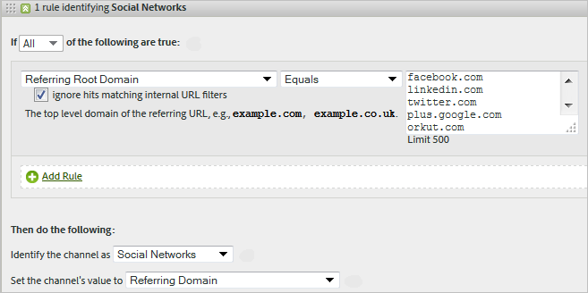
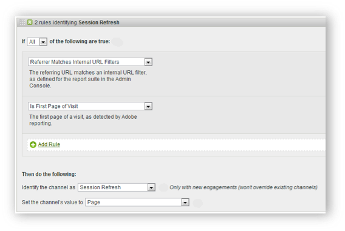

# Verarbeitungsregeln für Marketing-Kanäle

Die Verarbeitungsregeln für Marketing-Kanäle bestimmen, ob der Besucherzugriff die einem Kanal zugewiesenen Kriterien erfüllt, indem jeder Treffer eines Besuchers auf Ihrer Site verarbeitet wird. Die Regeln werden in der angegebenen Reihenfolge verarbeitet. Sobald eine Regel erfüllt ist, stoppt das System die Verarbeitung der verbleibenden Regeln.

**[!UICONTROL Analytics]** > **[!UICONTROL Admin]** > **[!UICONTROL Report Suites]** > **[!UICONTROL Einstellungen bearbeiten]** > **[!UICONTROL Marketing-Kanäle]** > **[!UICONTROL Marketing-Kanal-Verarbeitungsregeln]**.

Weitere Hinweise zur Verarbeitung:

* Mit diesen Regeln erfasste Daten sind dauerhaft. Nach der Datenerfassung geänderte Regeln sind nicht rückwirkend. Adobe empfiehlt dringend, alle Umstände zu prüfen und zu bedenken, bevor [!UICONTROL Verarbeitungsregeln für Marketing-Kanäle] gespeichert werden, um zu verhindern, dass Daten in falschen Kanälen erfasst werden.
* Sie können bis zu 25 separate Marketing-Kanäle konfigurieren.
* Regeln haben Zugriff auf Variablen, die von VISTA gesetzt wurden, können jedoch nicht auf Daten zugreifen, die von VISTA gelöscht wurden.
* Dasselbe Ereignis kann niemals zwei Marketingkanälen gutgeschrieben werden (wie Käufe oder Klicks). In dieser Hinsicht unterscheiden sich Marketingkanäle von eVars (dasselbe Ereignis kann zwei eVars gutgeschrieben werden).
* Wenn die Abdeckung Ihrer Regeln lückenhaft ist, sehen Sie möglicherweise [Kein Kanal erkannt](/help/components/c-marketing-channels/c-faq.md).

## Voraussetzungen

* Sehen Sie sich die Konzeptinformationen unter [Erste Schritte mit Marketing-Kanälen](/help/components/c-marketing-channels/c-getting-started-mchannel.md) an.
* Erstellen Sie einen oder mehr Kanäle, um Regeln zuweisen zu können. Weitere Informationen finden Sie unter [Hinzufügen von Marketing-Kanälen](/help/admin/admin/c-manage-report-suites/c-edit-report-suites/marketing-channels/c-channels.md).
* Lesen Sie die Best Practices für die Verwendung von [!UICONTROL Marketing-Kanälen] mit [!UICONTROL Attribution].

## Einrichten von Marketingkanal-Verarbeitungsregeln

Richten Sie Marketingkanal-Verarbeitungsregeln ein, die bestimmen, ob der Besucherzugriff die dem Kanal zugewiesenen Kriterien erfüllt.

1. Klicken Sie auf **[!UICONTROL Analytics]** > **[!UICONTROL Admin]** > **[!UICONTROL Report Suites]**.
2. Wählen Sie eine Report Suite aus.

   Wenn in Ihrer Report Suite keine Kanäle definiert wurden, wird die Seite [!UICONTROL Marketing-Kanäle: Automatisches Setup] angezeigt.

   Siehe [Ausführen des automatischen Setups](/help/components/c-marketing-channels/c-getting-started-mchannel.md).

3. Klicken Sie auf **[!UICONTROL Einstellungen bearbeiten]** > **[!UICONTROL Marketing-Kanäle]** > **[!UICONTROL Marketingkanal-Verarbeitungsregeln]**. Wenn Sie das automatische Setup ausgeführt haben, wurde automatisch ein Kanal- und Regelsatz definiert.

   

4. Wenn Sie eine Regel hinzufügen möchten, wählen Sie im Menü **[!UICONTROL Neuen Regelsatz hinzufügen]**. Wenn Sie einen Kanal auswählen, erhalten Sie eine Regelvorlage. Wenn Sie „Benutzerdefiniert“ auswählen, fangen Sie mit einer komplett leeren Vorlage an. Bei beiden Optionen können Sie den Regelsatz nach Bedarf ändern.

   

5. Klicken Sie auf **[!UICONTROL Neuen Regelsatz hinzufügen]**, um die Regelerstellung fortzusetzen.
6. Ziehen Sie die Regeln zur Priorisierung an die gewünschte Position.
7. Klicken Sie auf **[!UICONTROL Speichern]**.

### Festlegen des Marketing-Kanalwerts

**[!UICONTROL Kanalwert festsetzen]** legt die Dimension „Detail des Marketing-Kanals“ fest, die für diesen Kanal verfügbar ist.

### Regelkriterien

Diese Referenztabelle definiert die Trefferattribute, die Sie zum Festlegen von Verarbeitungsregeln für Marketing-Kanäle verwenden können.

>[!NOTE]
>
>Bei den Werten in jedem von Ihnen definierten Textfeld, beispielsweise Abfragezeichenfolgeparameter oder Wertlisten, die abgeglichen werden sollen, wird **nicht zwischen Groß- und Kleinschreibung unterschieden**. Wenn Sie z. B. eine Regel haben, bei der der Abfragezeichenfolgeparameter `cmp = abc123` ist, stimmen alle groß- und kleingeschriebenen Varianten von sowohl `cmp` als auch `abc123` überein.

| Begriff | Definition |
|--- |--- |
| Alle | Aktiviert diesen Kanal nur, wenn alle Kriterien in der Regel „true“ sind. |
| Eines | Aktiviert diesen Kanal, wenn irgendeines der Kriterien in der Regel „true“ ist. Diese Option ist nur verfügbar, wenn die Regel mehr als ein Kriterium enthält. |
| AMO-ID | Der primäre Trackingcode, der von den Adobe Advertising- und Advertising Analytics-Integrationen verwendet wird. Wenn eine dieser Integrationen aktiviert ist, kann das Trackingcode-Präfix verwendet werden, um Advertising-spezifische Kanäle zu identifizieren. Verwenden Sie eine &quot;AMO-ID&quot;, die mit &quot;AL&quot;für Suche und Social oder &quot;AC&quot;für Anzeige beginnt. Wenn die AMO-ID in Marketing-Kanälen verwendet wird, können die Klick-/Kosten-/Impressionsmetriken dem richtigen Kanal zugeordnet werden. Wenn die AMO-ID nicht konfiguriert ist, gehen diese Metriken zu &quot;Direkt&quot;oder &quot;Keine&quot;. |
| AMO EF ID | Der von Adobe Advertising verwendete sekundäre Trackingcode. Der Hauptzweck dieses Trackingcodes besteht darin, als Schlüssel für das Zurücksenden von Daten an Advertising zu dienen. Sie kann jedoch auch verwendet werden, um Display ClickThroughs und Display ViewThroughs als zwei separate Marketing-Kanäle zu identifizieren. Legen Sie dazu die Marketing-Kanal-Logik fest, bei der &quot;AMO EF ID&quot;für Display-Clickthroughs auf `:d` endet oder &quot;AMO EF ID&quot;für Display ViewThroughs auf `:i` endet. Wenn Sie die Anzeige nicht in zwei Kanäle aufteilen möchten, verwenden Sie stattdessen die „AMO-ID“-Dimension. |
| Konversionsvariablen | Setzt sich aus eVars zusammen, die für diese Report Suite aktiviert wurden, und gilt nur, wenn diese Variablen über den Adobe-Code auf der Seite gesetzt wurden. |
| Vorhanden | Mehrere Auswahlmöglichkeiten sind verfügbar, einschließlich:<ul><li>**Nicht vorhanden**: Gibt an, dass das Trefferattribut nicht in der Anfrage vorhanden ist. Beispiel: Wenn der Benutzer in einer Referrer-Domäne eine URL eingibt oder auf ein Lesezeichen klickt, ist das Attribut für die Referrer-Domäne nicht vorhanden.</li><li>**Ist leer**: Gibt an, dass ein Trefferattribut vorhanden ist. In der Regel handelt es sich dabei um eine eVar oder einen Abfragezeichenfolgenparameter, doch dem Trefferattribut ist kein Wert zugeordnet.</li><li>**Enthält nicht**: Hiermit können Sie beispielsweise angeben, dass eine Referrer Domain einen bestimmten Wert nicht enthält (anders als bei der von Auswahl „Enthält“).</li></ul> |
| Den Kanal identifizieren als | Verbindet die Regel mit dem Marketing-Kanal, den Sie der Seite „Marketing-Kanal-Manager“ hinzugefügt haben. |
| Stimmt mit Erkennungsregeln gebührenpflichtiger Suchvorgänge überein | Eine von Adobe erkannte, gebührenpflichtige Suche. Gebührenpflichtige Suchvorgänge treten ein, wenn Firmen Gebühren an die Suchmaschine zahlen, damit diese deren Site auflistet. Gebührenpflichtige Suchergebnisse tauchen gewöhnlich oben oder rechts von den Suchergebnissen auf. |
| Stimmt mit Erkennungsregeln kostenloser Suchvorgänge überein | Eine von Adobe erkannte, kostenlose Suche. |
| Verweisende Stelle stimmt mit internen URL-Filtern überein | Ein Besuch, dessen Seiten-URL laut der Definition für die Report Suite in „Admin Tools“ mit dem internen URL-Filter übereinstimmt. |
| Verweisende Stelle stimmt nicht mit internen URL-Filtern überein | Die verweisende URL stimmt laut Definition für die Report Suite in „Admin Tools“ nicht mit dem internen URL-Filter überein. Sie können diese Einstellung mit Seiten-URL und „Existiert“ verwenden, um eine Sammelregel zu erstellen, sodass keine Besuche im Berichtabschnitt „Kein Kanal identifiziert“ landen. |
| Treffer ignorieren, die mit internen URL-Filtern übereinstimmen | (Für verweisende Stellen) Verfolgt nur Treffer, die von extern verweisenden Stellen stammen. Normalerweise wird diese Option nicht aktiviert, es sei denn, Sie möchten internen Traffic einbeziehen. |
| Ist erste Seite des Besuchs | Die erste Seite eines Besuchs, die in der Adobe Berichterstellung erkannt wurde. |
| Seite | Die Dimension [Seite](/help/components/dimensions/page.md). |
| Seitendomäne | Die Domain der Seite, auf der der Besucher landet, z. B. `products.example.com`. |
| Seitendomäne und Pfad | Die Domain und der Pfad, z. B. `products.example.com/mens/pants/overview.html`. |
| Stammdomäne der Seite (TLD+1) | Die Stammdomäne der Seite, auf der der Besucher landet, z. B. example.co.uk. |
| Seiten-URL | Die URL einer Webseite auf Ihrer Site. |
| Referrer-Domain | Die Dimension [Referrer Domain](/help/components/dimensions/referring-domain.md) |
| Abfragezeichenfolgenparameter | Verwenden Sie einen einzelnen Abfragezeichenfolgenparameter. Sie können pro Kriterium nur einen Abfragezeichenfolgenparameter angeben. Verwenden Sie zum Hinzufügen zusätzlicher Abfragezeichenfolgenparameter `ANY` als Ihren Operator und fügen Sie der Regel dann Abfragezeichenfolgenparameter hinzu. |
| Referrer | Die Webseite (volle URL), auf der sich Besucher befanden, bevor sie zu Ihrer Site kamen. Die verweisende Stelle befindet sich außerhalb Ihrer definierten Domain. |
| Verweisende Domain und Pfad | Eine Verkettung aus verweisender Domain und URL-Pfad. Beispiele sind: `www.example.com/products/id/12345` oder `ad.example.com/foo` |
| Verweisender Parameter | Abfragezeichenfolgenparameter der verweisenden URL. Wenn Ihre Besucher z. B. von `example.com/?page=12345&cat=1` kommen, sind „page“ und „cat“ die verweisenden Parameter. |
| Verweisende Stammdomäne | Die Stammdomäne der verweisenden Stelle. Die verweisende Stelle befindet sich außerhalb Ihrer definierten Domain. |
| Suchmaschine | Eine Suchmaschine wie Google oder Yahoo!, über die Besucher zu Ihrer Site gelangten. |
| Suchkeywords | Ein Wort, mit dem in einer Suchmaschine gesucht wird. |
| Suchmaschine + Keywords | Eine Verkettung aus Keyword und Suchmaschine, um die Suchmaschine eindeutig zu kennzeichnen. Wenn Sie z. B. nach dem Begriff „Computer“ suchen, werden die Suchmaschine und das Keyword wie folgt identifiziert: `Search Tracking Code = "<search_type>:<search engine>:<search keyword>" where    search_type = "n" or "p", search_engine = "Google", and search_keyword = "computer"`**Hinweis:** n = natural (natürlich); p = paid (bezahlt) |
| Den Kanalwert setzen auf | Legt die Dimension [Marketing-Kanaldetails](/help/components/dimensions/marketing-detail.md) fest. Sie bestimmen, welcher Wert im Kontext der Regel am besten ist. Beispiele sind Banneranzeigen-ID, Suchbegriff oder E-Mail-Kampagne. |

## Reihenfolge der Regeln und Definitionen für Marketing-Kanäle {#channel-rules}

Kanalregeln werden in der angegebenen Reihenfolge verarbeitet. Adobe empfiehlt, dass Sie bezahlte oder verwaltete Kanäle zuerst platzieren (z. B. Paid Search, natürliche Suche, Anzeige oder E-Mail), damit sie Credits über organische Kanäle (z. B. direkte, interne oder Referrer Domains) erhalten.

Nachfolgend finden Sie die empfohlene Reihenfolge für Kanalregeln und Beispieldefinitionen:

### Paid Search {#paid-search}

Paid Search ist ein Begriff oder eine Wortgruppe, die auf Bezahlung von der Suchmaschine in die Suchergebnisse gesetzt wird. Dieser Kanal wird in der Regel auf der Grundlage von Abfragezeichenfolgenparametern (siehe das Beispiel für einen Anzeige-Kanal) oder Paid Search-Erkennungsregeln definiert.

#### Paid-Search-Erkennung

Zum Erfüllen der Erkennungsregeln von Paid Search verwendet der Marketing-Kanal die auf der Seite [!UICONTROL Gebührenpflichtige Sucherkennung] konfigurierten Einstellungen. (**[!UICONTROL Admin]** > **[!UICONTROL Report Suites]** > **[!UICONTROL Einstellungen bearbeiten]** > **[!UICONTROL Allgemein]** > **[!UICONTROL Gebührenpflichtige Sucherkennung]**). Die Ziel-URL stimmt mit der vorhandenen gebührenpflichtigen Sucherkennungsregel für die betreffende Suchmaschine überein.

Die [!UICONTROL gebührenpflichtigen Sucheinstellungen] für die Marketingkanalregel lauten wie folgt:

Weitere Informationen finden Sie unter [Paid Search-Erkennung](../general/paid-search-detection/paid-search-detection.md).

### Natürliche Suche  {#natural-search}

Bei einer natürlichen Suche finden Besucherinnen und Besucher Ihre Website durch eine Web-Suche, bei der die Suchmaschine Ihre Website auflistet, ohne dass Sie dafür bezahlen.

Adobe ermittelt den Such-Traffic basierend auf einer internen Suche nach Suchmaschinen. Wenn ein Referrer mit den Kriterien einer Suchmaschine übereinstimmt, wird anhand der von Ihnen konfigurierten Regeln zur [Paid Search-Erkennung](../general/paid-search-detection/paid-search-detection.md) festgestellt, ob es sich um eine bezahlte oder natürliche Suche handelt. Ein Treffer gilt als natürliche Suche, wenn er mit keiner der Paid Search-Erkennungsregeln übereinstimmt.

Die kostenlosen Sucheinstellungen für die Marketing-Kanalregel lauten wie folgt:

### Anzeigen {#display}

Diese Regel identifiziert Besucherinnen und Besucher, die über Banner-Werbung zu Ihnen gelangt sind. Sie wird durch einen Abfragezeichenfolgenparameter in der Ziel-URL bestimmt, in diesem Fall *`Ad_01`*. Der Parameter der Abfragezeichenfolge und die gesuchten Werte werden ohne Unterscheidung der Groß-/Kleinschreibung ausgewertet.

### E-Mail {#email}

Diese Regel identifiziert Besucher, die von E-Mail-Kampagnen zu Ihnen gelangten. Sie wird durch einen Abfragezeichenfolgenparameter in der Ziel-URL bestimmt, in diesem Fall *`eml`*:

### Affiliates {#afilliates}

Diese Regel identifiziert Besucher, die aus einem bestimmten Satz von Referrer-Domänen stammen. Führen Sie in der Regel die Affiliate-Domänen, die verfolgt werden sollen, so auf:

### Andere Kampagnen {#other-campaigns}

Eine Best Practice besteht darin, einen Kanal „Andere Kampagnen“ einzubeziehen, der allen Regeln für gebührenpflichtige Kanäle entspricht. Dieser Kanal dient als Sammelstelle für nicht kategorisierten gebührenpflichtigen Traffic.

### Soziale Netzwerke  {#social-networks}

Diese Regel identifiziert Besucherinnen und Besucher, die aus sozialen Netzwerken wie Facebook stammen. Der Kanal wird oft in „Organic Social“ umbenannt. Die Einstellungen können wie folgt lauten:

### Kanal „Intern“ (Sitzungsaktualisierung) {#internal}

Diese Regel gilt für Besucher, bei denen die Referrer-URL mit den in der Admin Console eingerichteten internen URL-Filtern übereinstimmt, d. h. der Besucher kam von innerhalb der Site, um seinen Besuch zu beginnen. Der Kanal wird oft in „Sitzungsaktualisierung“ umbenannt.

Weitere Informationen zum Auftreten dieses Kanals finden Sie unter [Gründe für „Intern“ (Sitzungsaktualisierung)](https://experienceleague.adobe.com/docs/analytics/components/marketing-channels/c-faq.html?lang=de#internal).

### Direkt {#direct}

Diese Regel identifiziert Besucher, die über keine Referrer-Domäne verfügen. Dazu zählen Besucher, die direkt zu Ihrer Site gelangten, z. B. über einen Favoriten-Link oder durch Kopieren des Links in den Browser. Dieser Kanal wird oft in „Direkte Eingabe/Lesezeichen“ umbenannt.

### Kanal „Referrer Domains“  {#referring-domains}

Der Kanal „Referrer-Domänen“ identifiziert Besucher mit einer Referrer-Domäne. Gemeinsam fungieren die Kanäle „Intern“, „Direkt“ und „Referrer-Domänen“ als Sammelstelle für alle verbleibenden Treffer, die noch nicht in einen Kanal kategorisiert wurden.

