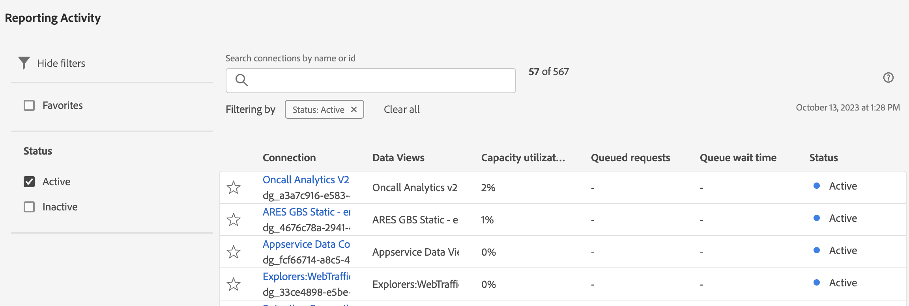

# Anzeigen von Berichtsaktivitäten in Reporting Activity Manager

Mit [!UICONTROL Reporting Activity Manager] können Administratoren Probleme mit der Berichtskapazität während Spitzenzeiten beim Reporting schnell diagnostizieren und beheben.

Weitere Informationen zu Reporting Activity Manager, einschließlich der wichtigsten Vorteile und Berechtigungsanforderungen, finden Sie unter [Reporting Activity Manager - Übersicht](/help/admin/admin/reporting-activity-manager/reporting-activity-overview.md).

## Anzeigen der Berichtsaktivität für alle Report Suites {#view-all-report-suites}

1. Navigieren Sie in Adobe Analytics **[!UICONTROL Admin]** > **[!UICONTROL Reporting Activity Manager]**.

   Eine Liste Ihrer aktivierten zugrunde liegenden Report Suites wird angezeigt.

   

1. (Optional) Sie können die Liste der Report Suites durchsuchen oder filtern:

   * Verwenden Sie das Suchfeld, um nach einer bestimmten Report Suite zu suchen. Beginnen Sie mit der Eingabe des Namens oder der ID der Report Suite, und die Liste der Report Suites wird bei der Eingabe aktualisiert.

   * Wählen Sie das [!UICONTROL **Filter**]-Symbol  aus, um die Liste der Filteroptionen zu erweitern. Sie können nach &quot;[!UICONTROL **&quot;**] &quot;[!UICONTROL **&quot;**].

     Um eine Report Suite als Favorit zu markieren, wählen Sie das Sternsymbol links neben dem Namen der Report Suite aus.

     <!-- (does this option still exist?) 1. (Optional) Select **[!UICONTROL Refresh]** at the top-right to refresh the data. -->

1. Anzeigen von Nutzungsinformationen zu jeder Report Suite. Die in der Tabelle angezeigten Daten stellen die Berichtsaktivität für die Report Suite zum Zeitpunkt des letzten Seitenladevorgangs dar.

   Die folgenden Spalten sind verfügbar:

   | UI-Element | Beschreibung |
   | --- | --- |
   | **[!UICONTROL Report Suite]** | Die zugrunde liegende Report Suite, deren Berichtsaktivität von Ihnen überwacht wird. |
   | **[!UICONTROL Virtual Report Suites]** | Zeigt alle Virtual Report Suites an, die in diese zugrunde liegende Report Suite einfließen. Virtual Report Suites ermöglichen eine höhere Komplexität von Berichtsanfragen aufgrund zusätzlich anwendbarer Filter- und Segmentierungsebenen. Alle Anfragen, die von Virtual Report Suites kommen, werden in der zugrunde liegenden Report Suite zusammengefasst. |
   | **[!UICONTROL Kapazitätsauslastung]** | Der Prozentsatz der verwendeten Berichtskapazität der Report Suite in Echtzeit. 
**Hinweis** Bei einer Nutzungskapazität von 100 % sollten Sie nicht unbedingt sofort mit dem Abbrechen von Berichtsanfragen beginnen. Eine 100%ige Nutzungskapazität kann in Ordnung sein, wenn die durchschnittliche Wartezeit angemessen ist. Andererseits könnte eine 100%ige Nutzungskapazität ein Problem darstellen, wenn auch die Anzahl der Anfragen in der Warteschlange zunimmt.
 |
   | **[!UICONTROL Anforderungen in der Warteschlange]** | Die Anzahl der Anforderungen, die auf die Verarbeitung warten. <!-- ??? --> |
   | **[!UICONTROL Warteschlangenwartezeit]** | Die durchschnittliche Wartezeit, bevor Anforderungen verarbeitet werden. <!-- ???? --> |
   | **[!UICONTROL Status]** | Mögliche Status sind: <ul><li>[!UICONTROL **Aktiv**] (blau): In den letzten 2 Stunden wurden Berichte für die Report Suite ausgeführt. Die in der Tabelle angezeigten Daten stellen die Berichtskapazität für die Report Suite zum Zeitpunkt des letzten Ladens der Seite dar.</li><li>[!UICONTROL **Inaktiv**] (grau): In den letzten 2 Stunden wurden keine Berichte zur Report Suite ausgeführt, sodass keine Daten für die Report Suite angezeigt werden.</li></ul> |

   {style="table-layout:auto"}

## Anzeigen der Berichtsaktivität für eine einzelne Report Suite

1. Wählen Sie in Adobe Analytics [!UICONTROL **Admin**] > [!UICONTROL **Reporting Activity Manager**].

1. Wählen Sie den verknüpften Titel der Report Suite aus, für die Sie Details anzeigen möchten.

   Berichtsaktivitätsdaten werden für die von Ihnen ausgewählte Report Suite angezeigt.

   <!-- Need to update this screenshot:  -->

1. (Optional) Beim ersten Laden einer Verbindung im Reporting Activity Manager stellen die angezeigten Daten die aktuellen Nutzungsmetriken dar. Um aktualisierte Metriken nach dem ersten Laden anzuzeigen, klicken Sie auf die Schaltfläche [!UICONTROL **Aktualisieren**], um die Seite manuell zu aktualisieren.

1. Verwenden Sie die verfügbaren Diagramme und Tabellen, um die Berichtsaktivität in der Report Suite zu verstehen.

   * [Diagramme anzeigen](#view-graphs)

   * [Tabelle anzeigen](#view-table)

### Diagramme anzeigen

Die folgenden Diagramme helfen Ihnen, die in der Report Suite stattfindenden Aktivitäten besser zu verstehen.

Wenn keine Diagramme sichtbar sind, wählen Sie die Schaltfläche [!UICONTROL **Diagramme anzeigen**] aus.

#### Auslastungsdiagramm {#utilization}

Das Diagramm Auslastung zeigt die Berichtsnutzung für die ausgewählte Report Suite in den letzten 2 Stunden an.

Bewegen Sie den Mauszeiger über das Diagramm, um die Zeitpunkte anzuzeigen, an denen der Prozentsatz der Nutzungskapazität für diese Minute am höchsten war.

* **X-axis**: Die Berichtsnutzungskapazität in den letzten 2 Stunden.
* **Y-Achse**: Der Prozentsatz der Reporting-Nutzungskapazität in Minuten.

  

#### Diagramm mit unterschiedlichen Benutzern

Das Diagramm Unterschiedliche Benutzer zeigt die Berichtsaktivität für die ausgewählte Report Suite in den letzten zwei Stunden an.

Bewegen Sie den Mauszeiger über das Diagramm, um die Zeitpunkte anzuzeigen, an denen die maximale Anzahl von Benutzern für diese Minute am höchsten war.

* **X-axis**: Die Berichtsaktivität über den letzten Zeitrahmen von 2 Stunden.
* **Y-Achse**: Die Anzahl der Benutzer, die Berichtsanfragen gestellt haben, pro Minute.

  

#### Anforderungsdiagramm

Das Diagramm Anfragen zeigt die Anzahl der in den letzten zwei Stunden verarbeiteten Anfragen und der in die Warteschlange gestellten Anfragen für die ausgewählte Report Suite an.

Bewegen Sie den Mauszeiger über das Diagramm, um die Zeitpunkte anzuzeigen, an denen die maximale Anzahl von Anfragen für diese Minute am höchsten war.

* **X-axis**: Die Anzahl der verarbeiteten und abgeschlossenen Anfragen innerhalb der letzten zwei Stunden.
* **Y-Achse**: Die Anzahl der verarbeiteten Anfragen (grün) und der in die Warteschlange gestellten Anfragen (violett) pro Minute.

  

#### Warteschlangengraph

Das Diagramm Warteschlange zeigt die durchschnittliche Warteschlangenwartezeit (in Sekunden) für Berichtsanfragen für die ausgewählte Report Suite in den letzten 2 Stunden an.

Bewegen Sie den Mauszeiger über das Diagramm, um die Zeitpunkte anzuzeigen, an denen die maximale durchschnittliche Wartezeit für diese Minute am höchsten war.

* **X-axis**: Die durchschnittliche Wartezeit in der Warteschlange für Berichtsanfragen während der letzten 2 Stunden.
* **Y-Achse**: Die durchschnittliche Wartezeit (in Sekunden).

  

### Tabelle anzeigen {#view-table}

Beachten Sie beim Anzeigen der Tabelle Folgendes:

* Sie können Daten anzeigen, indem Sie eine der folgenden Registerkarten oben in der Datentabelle auswählen: [!UICONTROL **Anfrage**], [!UICONTROL **Benutzer**], [!UICONTROL **Projekt**] oder [!UICONTROL **Anwendung**].

* Sie können die Liste der Verbindungen durchsuchen oder filtern:

   * Verwenden Sie das Suchfeld, um nach einer bestimmten Verbindung zu suchen. Beginnen Sie mit der Eingabe des Verbindungsnamens oder der ID, und die Liste der Verbindungen wird während der Eingabe aktualisiert.

   * Wählen Sie das [!UICONTROL **Filter**]-Symbol  aus, um die Liste der Filteroptionen zu erweitern. Sie können nach [!UICONTROL **Status**], [!UICONTROL **Komplexität**], [!UICONTROL **Anwendung**], [!UICONTROL **Benutzer**] oder [!UICONTROL **Projekt**] filtern.

   * Sie können auf [!UICONTROL **Diagramme ausblenden**] klicken, um nur die Tabelle anzuzeigen.

#### Daten nach Anfrage anzeigen

Wenn Sie die Registerkarte [!UICONTROL **Anfrage**] auswählen, sind in der Tabelle die folgenden Spalten verfügbar:

| Spalte | Beschreibung |
| --- | --- |
| [!UICONTROL **Anfrage-ID**] | Eine eindeutige ID, die zu Fehlerbehebungszwecken verwendet werden kann. Um die ID zu kopieren, wählen Sie die Anfrage aus und wählen Sie dann die Option [!UICONTROL **Anfrage-IDs kopieren**] aus. |
| [!UICONTROL **Laufzeitumgebung**] | Die Dauer der Anfrage. |
| [!UICONTROL **Startzeit**] | Wann die Verarbeitung der Anfrage begann (basierend auf der Ortszeit des Administrators). |
| [!UICONTROL **Wartezeit**] | Die Wartezeit für die Anfrage vor der Verarbeitung. Dieser Wert liegt im Allgemeinen bei „0“, wenn genügend Kapazität vorhanden ist. |
| [!UICONTROL **Programm**] | Die von [!UICONTROL Reporting Activity Manager] unterstützten Programme sind: <ul><li>Analysis Workspace-Benutzeroberfläche</li><li>Geplante Projekte im Workspace</li><li>Report Builder</li><li>Builder-Benutzeroberflächen: Segment, berechnete Metriken, Anmerkungen, Audiences usw.</li><li>API-Aufrufe aus der API 1.4 oder 2.0</li><li>Warnhinweise</li><li>Für alle freigeben - Links</li><li>Jede andere Anwendung, die die Analytics-Reporting-Engine abfragt</li></ul> |
| [!UICONTROL **Benutzende**] | Der Benutzer, der die Anfrage initiiert hat. 
**Hinweis:** Wenn der Wert dieser Spalte [!UICONTROL **Nicht erkannt**] lautet, bedeutet dies, dass sich der Benutzer in einem Anmeldeunternehmen befindet, für das Sie keine Administratorrechte haben.
 |
| [!UICONTROL **Projekt**] | Gespeicherte Workspace-Projektnamen, API-Berichts-IDs usw. (Metadaten können von Programm zu Programm variieren.) |
| [!UICONTROL **Status**] | Statusindikatoren: <ul><li>**Läuft**: Die Anfrage wird derzeit verarbeitet.</li><li>**Ausstehend**: Die Anfrage wartet auf die Verarbeitung.</li></ul> |
| [!UICONTROL **Komplexität**] | Nicht alle Anfragen benötigen die gleiche Verarbeitungszeit. Die Anfragekomplexität kann dabei helfen, einen allgemeinen Eindruck von der für die Verarbeitung der Anfrage benötigten Zeit zu gewinnen. 
Mögliche Werte:
 <ul><li>[!UICONTROL **Niedrig**]</li><li>[!UICONTROL **Medium**]</li><li>[!UICONTROL **Hoch**]</li></ul>Dieser Wert wird durch die Werte in den folgenden Spalten beeinflusst:<ul><li>[!UICONTROL **Monatsgrenzen**]</li><li>[!UICONTROL **Spalten**]</li><li>[!UICONTROL **Segmente**]</li></ul> |
| [!UICONTROL **Monatsgrenzen**] | Die Anzahl der Monate, die in einer Anfrage enthalten sind. Mehr Monatsgrenzen erhöhen die Komplexität der Anfrage. |
| [!UICONTROL **Spalten**] | Die Anzahl der Metriken und Aufschlüsselungen in der Anfrage. Weitere Spalten erhöhen die Komplexität der Anfrage. |
| [!UICONTROL **Segmente**] | Die Anzahl der Segmente, die auf die Anfrage angewendet werden. Weitere Segmente erhöhen die Komplexität der Anfrage. |

{style="table-layout:auto"}

#### Daten nach Benutzer anzeigen

Wenn Sie die Registerkarte [!UICONTROL **Benutzer**] auswählen, sind die folgenden Spalten in der Tabelle verfügbar:

| Spalte | Beschreibung |
| --- | --- |
| [!UICONTROL **Benutzende**] | Der Benutzer, der die Anfrage initiiert hat. Wenn der Wert dieser Spalte &quot;[!UICONTROL **&quot; lautet**] bedeutet dies, dass sich der Benutzer in einer Unternehmensanmeldung befindet, für die Sie keine Administratorrechte haben. |
| [!UICONTROL **Anzahl der Anfragen**] | Die Anzahl der vom Benutzer initiierten Anfragen. |
| [!UICONTROL **Anzahl der Projekte**] | Die Anzahl der dem Benutzer zugeordneten Projekte. <!-- ??? --> |
| [!UICONTROL **Programm**] | Die von [!UICONTROL Reporting Activity Manager] unterstützten Programme sind: <ul><li>Analysis Workspace-Benutzeroberfläche</li><li>Geplante Projekte im Workspace</li><li>Report Builder</li><li>Builder-Benutzeroberflächen: Segment, berechnete Metriken, Anmerkungen, Audiences usw.</li><li>API-Aufrufe aus der API 1.4 oder 2.0</li><li>Warnhinweise</li><li>Für alle freigeben - Links</li><li>Jede andere Anwendung, die die Analytics-Reporting-Engine abfragt</li></ul> |
| [!UICONTROL **Durchschn. Komplexität**] | Die durchschnittliche Komplexität der vom Benutzer initiierten Anfragen. 
Nicht alle Anfragen benötigen die gleiche Verarbeitungszeit. Die Anfragekomplexität kann dabei helfen, einen allgemeinen Eindruck von der für die Verarbeitung der Anfrage benötigten Zeit zu gewinnen.

Der Wert in dieser Spalte basiert auf einem Score, der durch die Werte in den folgenden Spalten bestimmt wird:
<ul><li>[!UICONTROL **Durchschn. Monatsgrenzen**]</li><li>[!UICONTROL **Durchschn. Spalten**]</li><li>[!UICONTROL **Durchschn. Segmente**]</li></ul> |
| [!UICONTROL **Durchschn. Monatsgrenzen**] | Die durchschnittliche Anzahl der Monate, die in den Anfragen enthalten sind. Mehr Monatsgrenzen erhöhen die Komplexität der Anfrage. |
| [!UICONTROL **Durchschn. Spalten**] | Die durchschnittliche Anzahl der Metriken und Aufschlüsselungen in den enthaltenen Anfragen. Weitere Spalten erhöhen die Komplexität der Anfrage. |
| [!UICONTROL **Durchschn. Segmente**] | Die durchschnittliche Anzahl der Segmente, die auf die enthaltenen Anfragen angewendet werden. Weitere Segmente erhöhen die Komplexität der Anfrage. |

{style="table-layout:auto"}

#### Daten nach Projekt anzeigen

Wenn Sie die Registerkarte [!UICONTROL **Projekt**] auswählen, sind die folgenden Spalten in der Tabelle verfügbar:

| Spalte | Beschreibung |
| --- | --- |
| [!UICONTROL **Projekt**] | Das Projekt, in dem die Anfragen initiiert wurden. |
| [!UICONTROL **Anzahl der Anfragen**] | Die Anzahl der mit dem Projekt verknüpften Anfragen. |
| [!UICONTROL **Anzahl der Benutzer**] | Die Anzahl der mit dem Projekt verknüpften Benutzer. <!-- ??? --> |
| [!UICONTROL **Programm**] | Die von [!UICONTROL Reporting Activity Manager] unterstützten Programme sind: <ul><li>Analysis Workspace-Benutzeroberfläche</li><li>Geplante Projekte im Workspace</li><li>Report Builder</li><li>Builder-Benutzeroberflächen: Segment, berechnete Metriken, Anmerkungen, Audiences usw.</li><li>API-Aufrufe aus der API 1.4 oder 2.0</li><li>Warnhinweise</li><li>Für alle freigeben - Links</li><li>Jede andere Anwendung, die die Analytics-Reporting-Engine abfragt</li></ul> |
| [!UICONTROL **Durchschn. Komplexität**] | Die durchschnittliche Komplexität der im Projekt enthaltenen Anfragen. 
Nicht alle Anfragen benötigen die gleiche Verarbeitungszeit. Die Anfragekomplexität kann dabei helfen, einen allgemeinen Eindruck von der für die Verarbeitung der Anfrage benötigten Zeit zu gewinnen.

Der Wert in dieser Spalte basiert auf einem Score, der durch die Werte in den folgenden Spalten bestimmt wird:
<ul><li>[!UICONTROL **Durchschn. Monatsgrenzen**]</li><li>[!UICONTROL **Durchschn. Spalten**]</li><li>[!UICONTROL **Durchschn. Segmente**]</li></ul> |
| [!UICONTROL **Durchschn. Monatsgrenzen**] | Die durchschnittliche Anzahl der Monate, die in den Anfragen enthalten sind. Mehr Monatsgrenzen erhöhen die Komplexität der Anfrage. |
| [!UICONTROL **Durchschn. Spalten**] | Die durchschnittliche Anzahl der Metriken und Aufschlüsselungen in den enthaltenen Anfragen. Weitere Spalten erhöhen die Komplexität der Anfrage. |
| [!UICONTROL **Durchschn. Segmente**] | Die durchschnittliche Anzahl der Segmente, die auf die enthaltenen Anfragen angewendet werden. Weitere Segmente erhöhen die Komplexität der Anfrage. |

{style="table-layout:auto"}

#### Daten nach Anwendung anzeigen

Wenn Sie die Registerkarte [!UICONTROL **Anwendung**] auswählen, sind die folgenden Spalten in der Tabelle verfügbar:

| Spalte | Beschreibung |
| --- | --- |
| [!UICONTROL **Programm**] | Die Anwendung, in der die Anfragen initiiert wurden. |
| [!UICONTROL **Anzahl der Anfragen**] | Die Anzahl der mit der Anwendung verknüpften Anfragen. |
| [!UICONTROL **Anzahl der Benutzer**] | Die Anzahl der mit der Anwendung verknüpften Benutzer. <!--???--> |
| [!UICONTROL **Anzahl der Projekte**] | Die Anzahl der mit der Anwendung verknüpften Projekte. <!--???--> |
| [!UICONTROL **Durchschn. Komplexität**] | Die durchschnittliche Komplexität der mit der Anwendung verbundenen Anfragen. 
Nicht alle Anfragen benötigen die gleiche Verarbeitungszeit. Die Anfragekomplexität kann dabei helfen, einen allgemeinen Eindruck von der für die Verarbeitung der Anfrage benötigten Zeit zu gewinnen.

Der Wert in dieser Spalte basiert auf einem Score, der durch die Werte in den folgenden Spalten bestimmt wird:
Der Wert in dieser Spalte basiert auf einem Score, der durch die Werte in den folgenden Spalten bestimmt wird:<ul><li>[!UICONTROL **Durchschn. Monatsgrenzen**]</li><li>[!UICONTROL **Durchschn. Spalten**]</li><li>[!UICONTROL **Durchschn. Segmente**]</li></ul> |
| [!UICONTROL **Durchschn. Monatsgrenzen**] | Die durchschnittliche Anzahl der Monate, die in den Anfragen enthalten sind. Mehr Monatsgrenzen erhöhen die Komplexität der Anfrage. |
| [!UICONTROL **Durchschn. Spalten**] | Die durchschnittliche Anzahl der Metriken und Aufschlüsselungen in den enthaltenen Anfragen. Weitere Spalten erhöhen die Komplexität der Anfrage. |
| [!UICONTROL **Durchschn. Segmente**] | Die durchschnittliche Anzahl der Segmente, die auf die enthaltenen Anfragen angewendet werden. Weitere Segmente erhöhen die Komplexität der Anfrage. |

{style="table-layout:auto"}

<!--

## Frequently asked questions {#faq}

| Question | Answer |
| --- | --- |
|  |  |

{style="table-layout:auto"}

-->