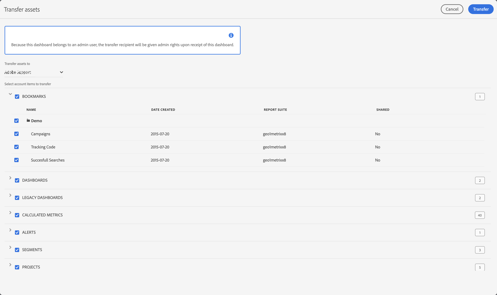

# Verwalten von Legacy-Benutzerkonten, Assets und Gültigkeitsdauern

Sie können Legacy-Benutzerkonten, ihren Migrationsstatus, die Ablaufdaten, die Übertragung von Assets an andere Benutzer und mehr unter Verwendung von **[!UICONTROL Admin] > [!UICONTROL Alle Administratoren] > [!UICONTROL Analytics-Benutzer und -]** verwalten.

Der Bildschirm Benutzer zeigt eine Liste der aktuellen Adobe Analytics-Benutzer mit den folgenden Spalten:

| Spalte | Beschreibung |
|---|---|
| [!UICONTROL Benutzer-ID] | Die Benutzer-ID, mit der sich der Benutzer bei Adobe Analytics anmeldet. |
| [!UICONTROL Name] | Der Name des Benutzers. |
| [!UICONTROL Migrationsstatus] | Der Migrationsstatus von einem alten Benutzerkonto zu einer Enterprise ID oder Adobe ID.  Der Status kann „Nicht initiiert“, „In Warteschlange“ oder „Migriert“ sein. |
| [!UICONTROL E-Mail] | Die E-Mail des Benutzers. |
| [!UICONTROL Legacy-Anmeldung] | Der Status der bisherigen Anmeldung, die aktiviert oder deaktiviert werden kann. |
| [!UICONTROL Erstellt am] | Zeitstempel, wann das Benutzerkonto in der Adobe Analytics erstellt wurde. |
| [!UICONTROL Letzter Analytics-Zugriff] | Zeitstempel des letzten Zugriffs des Benutzerkontos auf Adobe Analytics, |
| [!UICONTROL Ablauf] | Ablaufdatum für das Benutzerkonto oder Ohne, wenn das Benutzerkonto nicht abläuft. |

- Um nach einem bestimmten Benutzer zu suchen, verwenden Sie das Feld  *Suche nach Titel*.
- Um die Liste nach Migrationsstatus zu filtern, wählen Sie  **[!UICONTROL Migrationsstatus]** aus.
- Um die Liste nach dem alten Anmeldestatus zu filtern, wählen Sie  **[!UICONTROL Legacy login]**.
- Um die Anzeige der Spalten zu ändern, wählen Sie  und die Spalten aus dem Popup aus.

Sie können verschiedene Aktionen anwenden, wenn Sie einen oder mehrere Benutzer aus der Liste auswählen:

| Aktion | Beschreibung |
|---|---|
|  **[!UICONTROL Migrieren]** | Sie können einen oder mehrere Benutzer zu Enterprise IDs oder Adobe IDs migrieren. |
|  **[!UICONTROL Ablaufdatum festlegen]** | Sie können ein Ablaufdatum für die Verwendung der Legacy-Adobe Analytics-Anmeldung für die ausgewählten Benutzer festlegen.  Wählen Sie das Datum aus, um ein Kalenderpopup zur Angabe des Datums zu verwenden. Wählen Sie **[!UICONTROL Fertig]** aus, um den Ablauf zu bestätigen. |
|  **[!UICONTROL Assets übertragen]** | Diese Aktion ist nur verfügbar, wenn ein Benutzer ausgewählt wird. Wenn der Benutzer über Assets verfügt, die übertragen werden können, können Sie die Kontoelemente (wie Lesezeichen, Dashboards usw.) auswählen. Wählen Sie **[!UICONTROL Übertragen]** aus, um die Übertragung abzuschließen.  |
|  **[!UICONTROL Konten löschen]** | Ein Dialogfeld wird angezeigt, um das Löschen der ausgewählten Konten zu bestätigen. Klicken Sie **[!UICONTROL OK]**, um die Konten zu löschen. Wählen Sie **[!UICONTROL Abbrechen]** zum Abbrechen aus. |
|  **[!UICONTROL In CSV exportieren]** | Diese Aktion lädt sofort eine Datei herunter, die eine kommagetrennte Werteliste der ausgewählten Benutzer mit ihren Details (Name, Migrationsstatus, E-Mail usw.) enthält. |

