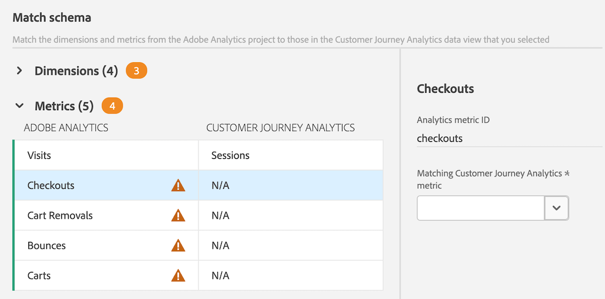

# Migrieren von Komponenten und Projekten aus Adobe Analytics nach Customer Journey Analytics

Adobe Analytics-Admins können Adobe Analytics-Projekte und die zugehörigen Komponenten zu Customer Journey Analytics migrieren.

Der Migrationsvorgang umfasst:

* Neuerstellung von Adobe Analytics-Projekten in Customer Journey Analytics.

* Zuordnung von Dimensionen und Metriken aus Adobe Analytics-Report Suites zu Dimensionen und Metriken in Customer Journey Analytics-Datenansichten.

  Einige Dimensionen und Metriken werden automatisch zugeordnet; andere müssen im Rahmen des Migrationsprozesses manuell zugeordnet werden. Segmente werden ebenfalls migriert, müssen jedoch nicht im Rahmen des Migrationsprozesses zugeordnet werden.

  Alle migrierten Komponenten werden nach Abschluss der Migration in der Migrationszusammenfassung angezeigt.

>[!NOTE]
>
>Die Informationen auf dieser Seite beschreiben, wie Sie Projekte und die zugehörigen Komponenten mit der Benutzeroberfläche migrieren.
>
>Alternativ können Sie die Migration mithilfe der APIs durchführen. Weitere Informationen finden Sie in den [Adobe Analytics-APIs](https://adobedocs.github.io/analytics-2.0-apis/?urls.primaryName=Analytics%202.0%20APIs). Alle API-Definitionen sind im Dropdown-Menü **[!UICONTROL Definition auswählen]** verfügbar.

## Vorbereiten der Migration

Bevor Sie Projekte nach Customer Journey Analytics migrieren, erfahren Sie mehr über das Migrieren von Projekten in der [Vorbereiten der Migration von Komponenten und Projekten von Adobe Analytics nach Customer Journey Analytics](/help/admin/tools/component-migration/prepare-component-migration.md).

Führen Sie außerdem eine [Adobe Analytics-Inventarisierung durch](/help/admin/tools/analytics-inventory.md) indem Sie das Tool verwenden, das Analytics-Admins zur Verfügung steht.

## Migrieren von Adobe Analytics-Projekten nach Customer Journey Analytics

>[!NOTE]
>
>Bevor Sie Projekte wie in diesem Abschnitt beschrieben nach Customer Journey Analytics migrieren, erfahren Sie mehr über das Migrieren von Projekten in der [Vorbereiten der Migration von Komponenten und Projekten von Adobe Analytics nach Customer Journey Analytics](/help/admin/tools/component-migration/prepare-component-migration.md).
>
>**Alle Dimensionen oder Metriken, die Sie zuordnen, gelten für dieses Projekt und alle zukünftigen Projekte in Ihrer gesamten IMS-Organisation, unabhängig davon, welcher Benutzer die Migration durchführt. Diese Zuordnungen können beim Migrieren künftiger Projekte aktualisiert werden.**

1. Wählen Sie in Adobe Analytics die Registerkarte [!UICONTROL **Admin**] und dann [!UICONTROL **Alle Admins**] aus.

1. Wählen [!UICONTROL **unter „Datenkonfiguration und -erfassung**] die Option [!UICONTROL **Komponentenmigration**] aus.

1. Suchen Sie jedes Projekt, das Sie migrieren möchten. Sie können die Projektliste filtern, sortieren oder durchsuchen.

   Standardmäßig werden nur Projekte angezeigt, die für Sie freigegeben sind. Um alle Projekte in Ihrer Organisation anzuzeigen, klicken Sie auf das Symbol **Filter**, erweitern Sie dann [!UICONTROL **Andere Filter**] und klicken Sie auf [!UICONTROL **Alle anzeigen**]. (Weitere Informationen zum Filtern, Sortieren und Suchen der Projektliste finden Sie unter [Filtern, Sortieren und Suchen der Projektliste](#filter-sort-and-search-the-list-of-projects).)

1. (Bedingt) Um mehrere Projekte gleichzeitig zu migrieren, aktivieren Sie das Kontrollkästchen links neben jedem Projekt, das Sie migrieren möchten, und wählen Sie dann [!UICONTROL **Migrieren zu Customer Journey Analytics**] aus.

   Beachten Sie beim Migrieren mehrerer Projekte Folgendes:

   * Sie können bis zu 20 Projekte gleichzeitig auswählen, die migriert werden sollen.

   * Der Migrationsstatus muss für alle Projekte, die migriert werden, gleich sein.

     Wenn Sie beispielsweise ein zu migrierendes Projekt mit dem Migrationsstatus **[!UICONTROL Nicht gestartet]** auswählen, können Sie kein anderes Projekt mit dem Migrationsstatus &quot;**[!UICONTROL &quot;]**.

   * Sie müssen für alle Projekte, die Sie migrieren, denselben Projektbesitzer bestimmen.

   * Dimensionen und Metriken müssen für alle Projekte, die Sie migrieren, derselben Datenansicht zugeordnet werden.

   Das [!UICONTROL **Projekt_name zu Customer Journey Analytics migrieren**] wird angezeigt.

   <!-- add screenshot -->

1. (Bedingt) Um ein einzelnes Projekt zu migrieren, bewegen Sie den Mauszeiger über das Projekt, das Sie migrieren möchten, und wählen Sie dann das Symbol **Migrieren** .

   Das [!UICONTROL **Projekt_name zu Customer Journey Analytics migrieren**] wird angezeigt.

   <!-- add screenshot -->

1. Geben Sie [!UICONTROL **Feld Projektinhaber**] den Namen der Person ein, die Sie als Eigentümer der in Customer Journey Analytics migrierten Projekte festlegen möchten, und wählen Sie dann im Dropdown-Menü deren Namen aus.

   Der angegebene Eigentümer hat vollständige Verwaltungsrechte für die migrierten Projekte. Der Besitzer muss ein Administrator in Customer Journey Analytics sein. Sie können den Besitz der Projekte in einem späteren Schritt ändern.

1. Wählen [!UICONTROL **im Abschnitt Zuordnungsschema für Report**] eine Report Suite aus.

1. Wählen Sie [!UICONTROL **Dropdown**] Menü Datenansicht die Customer Journey Analytics-Datenansicht aus, in die die Projekte und Komponenten migriert werden sollen.

   Wenn Sie mehrere Projekte migrieren, werden alle Projekte, die Sie migrieren, in der Zuordnung einer einzigen Datenansicht zusammengefasst.

1. Wählen Sie [!UICONTROL **Schema zuordnen**] aus.

1. Erweitern Sie im Abschnitt [!UICONTROL **Zuordnungsschema**] die Abschnitte [!UICONTROL **Dimensionen**] und [!UICONTROL **Metriken**].

   Einige Dimensionen und Metriken in Adobe Analytics werden automatisch einer Dimension oder Metrik in Customer Journey Analytics zugeordnet. Andere müssen manuell zugeordnet werden.

   **Dimensionen und Metriken automatisch zuordnen**

   >[!NOTE]
   >
   >   Wenn Sie das Web SDK verwendet haben, um Daten in Adobe Experience Platform aufzunehmen, können Dimensionen und Metriken nicht automatisch zugeordnet werden. Weitere Informationen finden Sie unter [Voraussetzungen](/help/admin/tools/component-migration/prepare-component-migration.md#prerequisites) in [Vorbereiten der Migration von Komponenten und Projekten von Adobe Analytics nach Customer Journey Analytics](/help/admin/tools/component-migration/prepare-component-migration.md).

   Einige Dimensionen und Metriken in Adobe Analytics werden automatisch einer Dimension oder Metrik in Customer Journey Analytics zugeordnet. Für diese Dimensionen und Metriken können keine Zuordnungsentscheidungen getroffen werden.

   Beispielsweise wird die Metrik **Besuche** in Adobe Analytics automatisch der Metrik **Sitzungen** in Customer Journey Analytics zugeordnet.

   Sie können eine beliebige Dimension oder Metrik auswählen, um ihre zugehörigen IDs anzuzeigen.

   <!-- update screenshot after I can see the Status column -->

   

   **Dimensionen und Metriken manuell zuordnen**

   Einige Dimensionen und Metriken in Adobe Analytics können nicht automatisch einer Dimension oder Metrik in Customer Journey Analytics zugeordnet werden.

   Wenn eine Dimension oder Metrik nicht automatisch zugeordnet werden kann, wird neben der Abschnittsüberschrift [!UICONTROL **Dimensionen**] oder [!UICONTROL **Metriken**] ein orangefarbener Zähler angezeigt, der die Anzahl der Dimensionen oder Metriken angibt, die manuell zugeordnet werden müssen. In der Tabelle wird neben jeder Dimension  manuell zugeordnet werden muss, ein Warnsymbol (Warnsymbol) angezeigt.

   Darüber hinaus lautet die Spalte [!UICONTROL **Status**] &quot;[!UICONTROL **zugeordnet**].

   <!-- update screenshot after I can see the Status column -->

   

1. Um Dimensionen und Metriken manuell zuzuordnen, wählen Sie eine Dimension oder Metrik aus, die ein Warnsymbol  enthält, und wählen Sie dann im Feld [!UICONTROL **Zugeordnete Customer Journey Analytics-Metrik**] (oder im Feld [!UICONTROL **Zugeordnete Customer Journey Analytics-Dimension**] , wenn Sie eine Dimension zuordnen) die Dimension oder Metrik in Customer Journey Analytics aus, die Sie der ausgewählten Dimension oder Metrik zuordnen möchten.

   

   Nachdem eine Dimension oder Metrik zugeordnet wurde, verschwindet das Warnsymbol und die Spalte [!UICONTROL **Status**] ändert sich in [!UICONTROL **Zugeordnet**] mit einem grünen Punkt. (Der Status [!UICONTROL **Zugeordnet**] mit einem grauen Punkt zeigt an, dass die Dimension oder Metrik während einer vorherigen Migration zugeordnet wurde. Vorherige Zuordnungen können nicht aktualisiert werden.)

   Wiederholen Sie diesen Vorgang für jede Dimension oder Metrik, die das Warnsymbol enthält.

   Nachdem alle Dimensionen und Metriken in der Adobe Analytics Report Suite einer Dimension oder Metrik in der Customer Journey Analytics Report Suite zugeordnet wurden, wird neben dem Namen der Report Suite ) im Abschnitt [!UICONTROL **Zuordnungsschema für Report Suites**] angezeigt.

1. (Bedingt) Wenn die Projekte, die Sie migrieren, mehr als eine Report Suite enthalten, wählen Sie im Abschnitt [!UICONTROL **Zuordnungsschema für Report Suites**] eine andere Report Suite aus und wiederholen Sie dann Schritt 6 bis Schritt 10. <!-- double-check that the step numbers are still correct -->

1. Wählen Sie [!UICONTROL **Migrieren**] aus.

   >[!WARNING]
   >
   >Nach der Auswahl von „Migrieren“ wird [!UICONTROL **Warnmeldung auf dem Bildschirm**]. Bevor Sie fortfahren, sollten Sie sich darüber im Klaren sein, dass alle Dimensionen oder Metriken, die Sie zuordnen, für dieses Projekt und für alle zukünftigen Projekte in Ihrer gesamten IMS-Organisation gelten, unabhängig davon, welcher Benutzer die Migration durchführt. Diese Zuordnungen können beim Migrieren künftiger Projekte aktualisiert werden.

   Nach Abschluss der Migration [!UICONTROL **auf der Seite**] Migrationsstatus“ eine Zusammenfassung der migrierten Elemente.

   Wenn die Migration fehlschlägt, finden Sie [ Abschnitt „Wiederholen einer fehlgeschlagenen Migration](#retry-a-failed-migration) weiter unten weitere Informationen.

1. (Optional) Nach der Migration von Projekten können Sie den Besitz der Projekte an einen beliebigen Benutzer in Customer Journey Analytics übertragen. Weitere Informationen finden Sie unter [Assets übertragen](https://experienceleague.adobe.com/de/docs/analytics-platform/using/tools/asset-transfer/transfer-assets) im Customer Journey Analytics-Handbuch.

## Fehlgeschlagene Migration wiederholen

Wenn eine Migration fehlschlägt, können Sie die Migration erneut versuchen.

Bevor Sie eine fehlgeschlagene Migration erneut versuchen, entfernen Sie alle [nicht unterstützten Elemente](/help/admin/tools/component-migration/prepare-component-migration.md#understand-unsupported-elements-that-cause-errors) aus dem Projekt.

>[!NOTE]
>
>Wenn die Migration nach einem erneuten Versuch weiterhin fehlschlägt, wenden Sie sich mit der Projekt-ID an die Kundenunterstützung. Die Projekt-ID finden Sie auf der Seite Migrationsstatus . <!-- when does this page display? How can they get there -->

So versuchen Sie eine fehlgeschlagene Migration erneut:

1. Wählen Sie in Adobe Analytics die Registerkarte [!UICONTROL **Admin**] und dann [!UICONTROL **Alle Admins**] aus.

1. Wählen [!UICONTROL **unter „Datenkonfiguration und -erfassung**] die Option [!UICONTROL **Komponentenmigration**] aus.

1. Wählen Sie [!UICONTROL **Fehlgeschlagen**] in der Spalte [!UICONTROL **Migrationsstatus**] neben dem Projekt aus, das Sie erneut versuchen möchten.

   

   Die [!UICONTROL **„Migrationsstatus**] wird angezeigt.

   Diese Seite wird auch sofort nach Abschluss der Migrationsschritte angezeigt, die im Abschnitt [Migrieren von Adobe Analytics-Projekten zu Customer Journey Analytics](#migrate-adobe-analytics-projects-to-customer-journey-analytics) weiter oben beschrieben sind.

1. Wählen Sie [!UICONTROL **Migration wiederholen**] aus.

## Filtern, Sortieren und Durchsuchen der Projektliste

Sie können die Liste der Projekte auf der Seite „Komponentenmigration“ filtern, sortieren und durchsuchen.

### Filtern der Projektliste

Sie können nach den folgenden Kriterien filtern:

| Filter | Beschreibung |
|---------|----------|
| [!UICONTROL **Status**] | Der Status der Migration: <ul><li>[!UICONTROL **Nicht gestartet**]</li><li>[!UICONTROL **Gestartet**]</li><li>[!UICONTROL **Abgeschlossen**]</li><li>[!UICONTROL **Fehlgeschlagen**]</li></ul>. |
| [!UICONTROL **Tags**] | Wählen Sie beliebige Tags in der Liste der Tags aus. Es werden nur Projekte angezeigt, auf die die ausgewählten Tags angewendet wurden. |
| [!UICONTROL **Report Suite**] | Wählen Sie eine beliebige Report Suite in der Liste der Report Suites aus. Es werden nur Projekte angezeigt, die die ausgewählten Report Suites verwenden. |
| [!UICONTROL **Inhaberinnen oder Inhaber**] | Wählen Sie einen beliebigen Eigentümer in der Liste der Eigentümer aus. Es werden nur Projekte angezeigt, die den von Ihnen ausgewählten Benutzern gehören. |
| [!UICONTROL **Sonstige Filter**] | Die folgenden zusätzlichen Filter sind verfügbar: <ul><li>[!UICONTROL **Meine**]: Zeigt nur Projekte an, bei denen Sie als Besitzer festgelegt sind.</li><li>[!UICONTROL **Für mich freigegeben**]: Zeigt nur Projekte an, die für Sie freigegeben wurden.</li><li>[!UICONTROL **Favoriten**]: Zeigt nur Projekte an, die als Favoriten markiert sind. (Sie können ein Projekt auf der [Projekt-Landingpage“ als Favorit ](/help/analyze/landing.md).)</li><li>[!UICONTROL **Monatlich**]</li><li>[!UICONTROL **Jährlich**]</li></ul> |

{style="table-layout:auto"}

### Sortieren der Projektliste

Sie können die Liste der Projekte nach einer beliebigen Spalte sortieren.

So sortieren Sie die Liste der Projekte:

1. Wählen Sie die Spaltenüberschrift der Spalte aus, nach der Sie sortieren möchten.

1. (Optional) Wählen Sie dieselbe Spaltenüberschrift erneut aus, um die Sortierreihenfolge umzukehren.

### Nach einem Projekt suchen

Sie können die Liste der Projekte auf der Seite „Komponentenmigration“ durchsuchen, um das Projekt zu finden, das Sie migrieren möchten.

1. Geben Sie im Suchfeld oben auf der Seite für die Komponentenmigration den Namen des Projekts ein, das Sie migrieren möchten.

1. Wählen Sie das Projekt aus, wenn es im Dropdown-Menü angezeigt wird.

<!-- is there going to be a way to customize the columns that are displayed? -->
