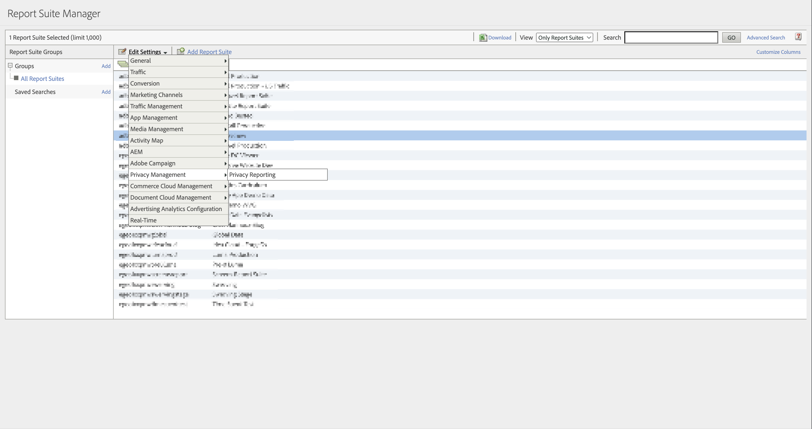

# Datenschutzberichte

Mit Datenschutzberichten können Sie die Dimensionen [Einverständnisverwaltungs-Opt-in](/help/components/dimensions/cm-opt-in.md), [Einverständnisverwaltungs-Opt-out](/help/components/dimensions/cm-opt-out.md) und [Einverständnisplattform](/help/components//dimensions/ad-consent.md) für die Verwendung in Berichten aktivieren.

>[!NOTE]
>
>Wir haben eine neue Markierung für Werbeplattform-Einverständnis hinzugefügt. Sie müssen Datenschutzberichte erneut aktivieren, wenn diese neue Variable wirksam werden soll.

So greifen Sie auf diese Seite zu:

1. Melden Sie sich bei Adobe Analytics an und gehen Sie zu **[!UICONTROL Admin]** > **[!UICONTROL Report Suites]**.
1. Wählen Sie eine oder mehrere gewünschte Report Suites aus und klicken Sie auf **[!UICONTROL Einstellungen bearbeiten]** > **[!UICONTROL Datenschutzverwaltung]** > **[!UICONTROL Datenschutzberichte]**.

   

1. Klicken Sie **[!UICONTROL Datenschutzberichte aktivieren]**.

   >[!NOTE]
   >
   >Nach der Aktivierung können diese Variablen nicht mehr deaktiviert werden.

   

1. Nach der Aktivierung wird eine Bestätigungsmeldung angezeigt. Die Dimensionen sind in Berichten verfügbar.

   
