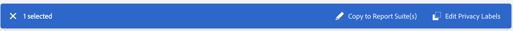

# Übersicht über Datenschutzkennzeichnungen

Die Beschriftung von Report Suite-Daten bedeutet, dass Sie jeder Variablen in Ihren Report Suites Beschriftungen zu Identität, Vertraulichkeit und Data Governance zuweisen. Machen Sie sich hierzu zunächst mit den [Kennzeichnungen und ihren Definitionen vertraut](/help/admin/tools/privacy-labeling/labels.md).

>[!NOTE]
>
>Beachten Sie, dass die Beschriftung jedes Mal überprüft werden muss, wenn eine neue Report Suite erstellt wird oder in einer vorhandenen Report Suite eine neue Variable aktiviert wird. Sie müssen die Beschriftung möglicherweise auch dann überprüfen, wenn neue Lösungsintegrationen aktiviert werden, da sie neue Variablen zur Verfügung stellen können, für die eine Beschriftung erforderlich ist. Eine erneute Implementierung Ihrer Mobile Apps oder Websites kann die Art und Weise der Verwendung vorhandener Variablen ändern, was möglicherweise auch Aktualisierungen der Kennzeichnungen erforderlich macht.

## Zuweisen oder Bearbeiten von Report-Suite-Datenschutzkennzeichnungen {#assign-edit}

**Beispiel**: Als für die Datenverarbeitung verantwortliche Person planen Sie, E-Mail-Adressen und Cookie-IDs von betroffenen Personen zu sammeln, um deren Datenschutzanfragen zu bearbeiten. Diese Cookie-IDs werden in einer Adobe Analytics Report Suite gespeichert.

1. Navigieren Sie in Adobe Analytics zu **[!UICONTROL Admin]** > **[!UICONTROL Alle Administratoren]** > **[!UICONTROL Datenkonfiguration und -erfassung]** > **[!UICONTROL Data Governance]**.

   

1. Wählen Sie eine Report Suite aus der obigen **[!UICONTROL Report Suite]**-Auswahl.

1. Wählen Sie links im Filterabschnitt aus, welche Variablengruppen Sie kennzeichnen möchten. Sie können jeweils nur eine Gruppe von Variablen beschriften.

   * **Standardkomponenten** – Standardkomponenten sind native Analytics-Dimensionen und -Metriken, die standardmäßig bei einer Analytics-Implementierung erfasst werden.
   * **Konversionsvariablen** – die Custom-Insight-Konversionsvariable (oder eVar) wird auf ausgewählten Web-Seiten Ihrer Site in den Adobe-Code platziert. Ihr Hauptzweck besteht darin, Konversionserfolgsmetriken in benutzerspezifischen Marketing-Berichten zu segmentieren. Eine eVar kann auf Besuchen basieren und ähnlich wie Cookies funktionieren. In eVar-Variablen übergebene Werte folgen den Benutzenden für einen bestimmten Zeitraum.
   * **Listenvariablen** – Listenvariablen sind benutzerdefinierte Variablen, die Sie beliebig verwenden können. Sie funktionieren ähnlich wie eVars, allerdings können sie mehrere Werte im selben Treffer enthalten. Listenvariablen haben keine Zeichenbeschränkung.
   * **Traffic-Variablen** – Custom-Insight-Traffic-Variablen (oder Props) ermöglichen die Korrelation von benutzerdefinierten Daten mit spezifischen Traffic-bezogenen Ereignissen. Die Eigenschaftsvariablen sind in den Implementierungs-Code auf jeder Seite der Website eingebunden.
   * **Erfolgsereignisse** – Erfolgsereignisse (auch Konversionsereignisse oder benutzerdefinierte Ereignisse genannt) sind Aktionen, die verfolgt werden können. Sie legen fest, was ein Erfolgsereignis ist. Wenn eine Besucherin oder ein Besucher beispielsweise einen Artikel kauft, kann das Kaufereignis als Erfolgsereignis betrachtet werden.
   * **Klassifizierungen** – Klassifizierungsaufschlüsselungen werden zur Zuordnung von Analytics-Berichtsdaten zu bestimmten Eigenschaften eingesetzt. Klassifizierungen können für zahlreiche Zwecke eingesetzt werden, werden jedoch meistens dazu verwendet, um Kampagnen-Trackingcodes (sowohl interne als auch externe) und Produkt-IDs zu klassifizieren.

1. Wählen Sie eine Variable aus, indem Sie das entsprechende Kontrollkästchen aktivieren, und klicken Sie dann auf **[!UICONTROL Datenschutzkennzeichnungen bearbeiten]** auf der blauen Leiste unten auf dem Bildschirm.

   

   In diesem Bildschirm werden die aktuell angewendeten Kennzeichnungen angezeigt und Sie können zusätzliche Kennzeichnungen anwenden. Je nach Komponente können Sie möglicherweise nicht alle Kennzeichnungen anwenden oder ändern.

   

1. Wenn sämtliche Kennzeichnungen bereit sind, klicken Sie auf **[!UICONTROL Übernehmen]**.

