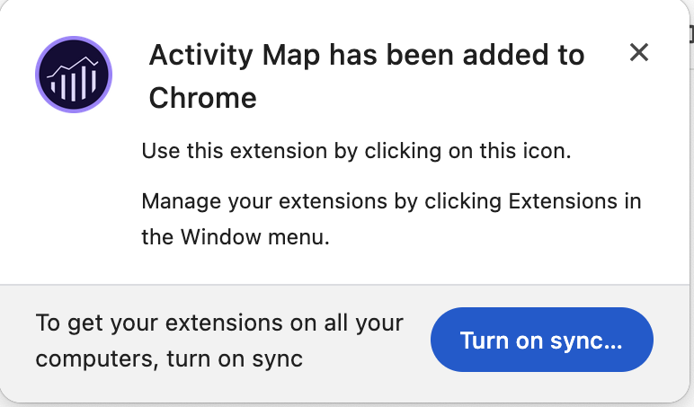

# Installieren von Activity Map Browser-Erweiterungen

Der Installationsprozess variiert in Abhängigkeit von dem verwendeten Browser.

Activity Map-Browsererweiterungen:

* werden manuell als Analytics-Seiten-Tag eingefügt,
* werden durch eine Schaltfläche oder ein Menüelement in der Browsersymbolleiste gestartet,
* sind nur mit den neuesten Versionen dieser Desktop-Browser kompatibel: Firefox und Chrome.
* unterstützen die Funktion **[!UICONTROL Anmeldung speichern]**,
* können die Activity Map-Symbolleiste auf Webseiten ohne Analytics-Seiten-Code **einfügen**, zeigen eine Fehlermeldung an, wenn die Seite den Analytics-Seiten-Code nicht enthält,
* Führen Sie einen Installationsprozess für die Browsererweiterung durch.

## Installieren der Activity Map-Erweiterung für Chrome {#chrome}

1. Gehen Sie zu **[!UICONTROL Adobe Analytics]** > **[!UICONTROL Werkzeuge]** > **[!UICONTROL Activity Map]**.  
1. Klicken Sie auf **[!UICONTROL Activity Map herunterladen]**.
1. Klicks **[!UICONTROL Installieren von Activity Map]**.
1. Klicks **[!UICONTROL Hinzufügen zu Chrome]**.
1. Klicks **[!UICONTROL Erweiterung hinzufügen]**.
   
1. Klicken Sie oben rechts auf das Symbol Chrome-Erweiterungen .
   
1. Klicken Sie auf Activity Map.
   

## Activity Map-Plugin für Firefox installieren {#firefox}

1. Gehen Sie zu **[!UICONTROL Analytics]** > **[!UICONTROL Activity Map]**.
1. Klicken Sie auf **[!UICONTROL Activity Map herunterladen]**.
1. Klicks **[!UICONTROL Installieren von Activity Map]**.
1. Klicken Sie auf **[!UICONTROL Zulassen]**, wenn diese Meldung angezeigt wird: 
1. Klicken Sie auf **[!UICONTROL Jetzt installieren]**.
1. Klicken Sie auf das Symbol **[!UICONTROL Menü öffnen]** oben rechts und wählen Sie **[!UICONTROL Add-ons]** aus.{width="250px"}
1. Activity Map sollte als eines der Firefox-Add-ons aufgeführt werden.
1. Wenn das Adobe Analytics-Symbol in Ihrer Symbolleiste angezeigt wird, war der Download erfolgreich.   Jetzt können Sie auf Ihrer Seite [Activity Map starten](/help/analyze/activity-map/activitymap-getting-started/activitymap-launch.md).

