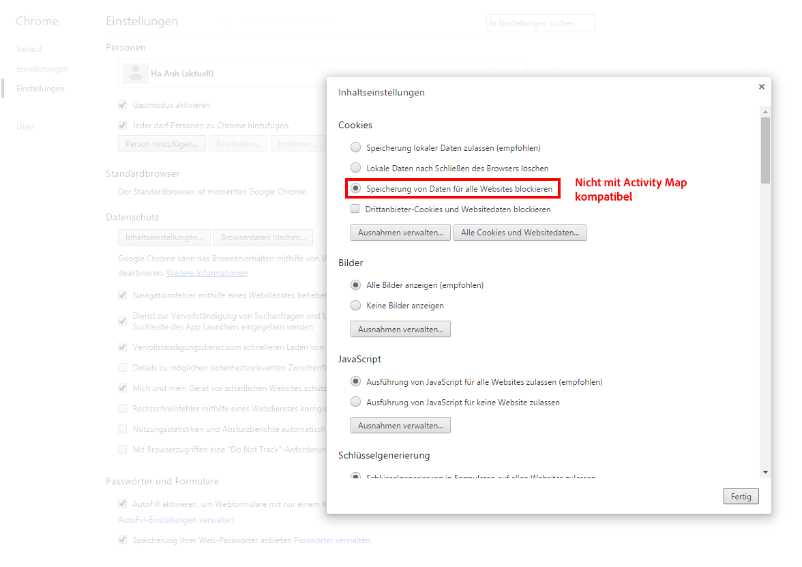
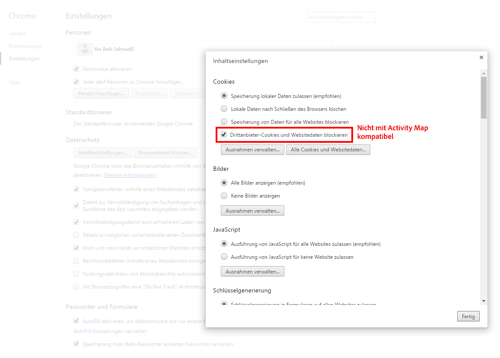
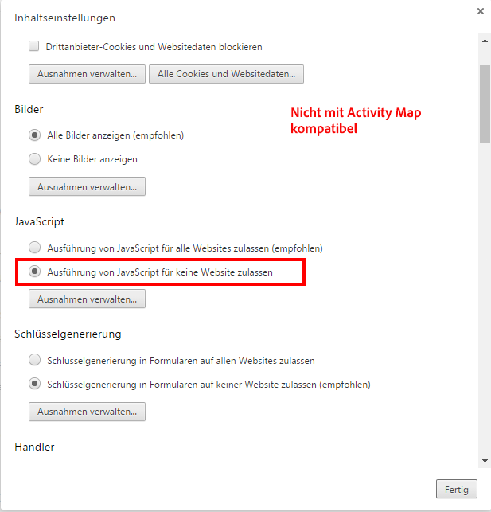
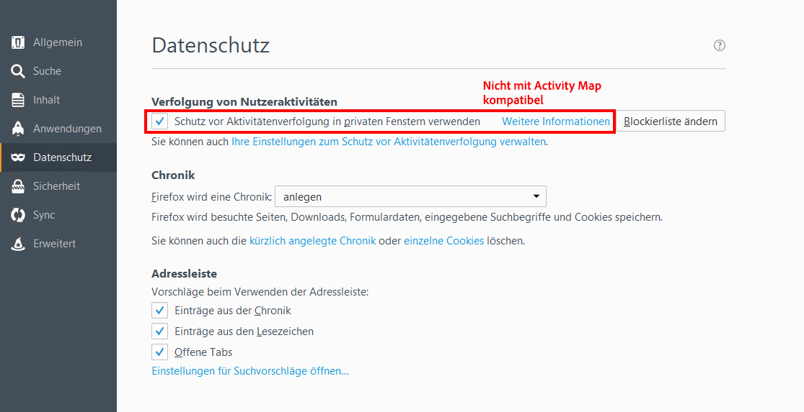
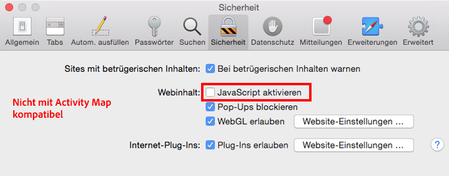
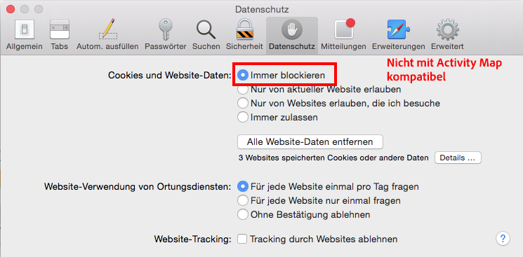
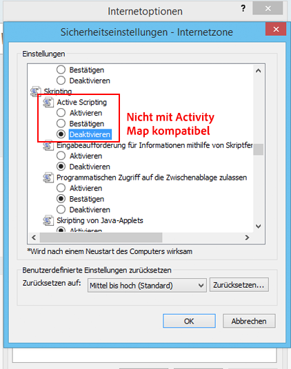

# Fehlerbehebung bei der Activity Map-Datenerfassung

Wenn keine Daten für Activity Map-Dimensionen angezeigt werden, können Sie auf dieser Seite anhand der Gründe ermitteln.

## Bestätigen der Datenerfassung mit dem Debugger

Stellen Sie zunächst sicher, dass AppMeasurement Activity Map-Daten korrekt erfasst.

1. Laden Sie die Erweiterung [Adobe Experience Cloud Debugger Chrome Extension](https://experienceleague.adobe.com/en/docs/experience-platform/debugger/home) herunter und installieren Sie sie.
2. Navigieren Sie zu Ihrer Webseite und klicken Sie auf einen Link.
3. Wenn die nachfolgende Seite geladen wird, öffnen Sie den Debugger. Überprüfen Sie, ob Sie Activity Map-Kontextdatenvariablen sehen, die zwischen `activitymap.` und `.activitymap` unterteilt sind:

## Mögliche Gründe, warum keine Activity Map-Daten vorhanden sind

Überprüfen Sie alle folgenden Punkte, um sicherzustellen, dass Activity Map-Komponenten vorhanden sind:

* **AppMeasurement version**: Activity Map wird auf Version 1.6 und höher unterstützt. Bei einem Upgrade auf die neueste stabile Version von AppMeasurement werden viele Probleme mit Edge-Case behoben.
* **Activity Map-Modul**: Überprüfen Sie, ob das `AppMeasurement_Module_Activity_Map`-Modul in Ihrer `AppMeasurement.js`-Datei vorhanden ist. Wenn Ihre Implementierung Daten mit Adobe Experience Platform erfasst, stellen Sie sicher, dass bei der Konfiguration der Analytics-Erweiterung unter **[!UICONTROL Linktracking]** die Option **[!UICONTROL ClickMap]** aktivieren aktiviert ist.
* **Das `s_sq` -Cookie**: Die Activity Map ist für die Datenerfassung vom `s_sq` -Cookie abhängig.
   * Stellen Sie sicher, dass die Variable `cookieDomainPeriods` richtig eingestellt ist, insbesondere für regionale Domänen wie `*.co.uk` oder `*.co.jp`.
   * Stellen Sie sicher, dass die Variable `linkInternalFilters` auf die gewünschten Werte eingestellt ist. Wenn ein angeklickter Link nicht mit internen Filtern übereinstimmt, betrachtet Activity Map ihn als Exitlink und erfasst keine Daten.
* **laufende Activity Map-Überlagerung**: AppMeasurement verfolgt keine Klickdaten für Ihre Webseite, wenn die Activity Map-Überlagerung aktiviert ist.

Führt die Browserparameter auf, die nicht mit der Verwendung von Activity Map kompatibel sind. Adobe empfiehlt, diese Einstellungen zu deaktivieren.

## Chrome

## Firefox

## Safari

## Internet Explorer

**Validierung**

Interaktionsaufrufe über die Registerkarte „Netzwerk“ von Developer Console:

1. Laden Sie das Skript „Development Launch“ auf der Site.
1. Suchen Sie für Klicks auf Elemente auf der Registerkarte „Netzwerk“ nach „/ee“.

Adobe Experience Platform Debugger:

1. Laden Sie [Adobe Experience Platform Debugger](https://chromewebstore.google.com/detail/adobe-experience-platform/bfnnokhpnncpkdmbokanobigaccjkpob) herunter und installieren Sie diese Erweiterung.
1. Navigieren Sie zu [!UICONTROL Protokolle] > [!UICONTROL Edge] > [!UICONTROL Mit Edge verbinden].

* **Der Interaktionsaufruf wird nicht auf der Registerkarte &quot;Netzwerk&quot;ausgelöst**: Die Klickdatenerfassung in einem Erfassungsaufruf, der entweder mit `"/ee"` oder mit `"collect?"` gefiltert wird.
* **Es gibt keine Payload-Anzeige für den Erfassungsaufruf**: Der Erfassungsaufruf ist so konzipiert, dass das Tracking die Navigation zu anderen Sites nicht beeinflusst. Daher ist die Funktion zum Entladen des Dokuments für die Abruf-Aufrufe verfügbar. Diese Funktion wirkt sich nicht auf Ihre Datenerfassung aus. Wenn Sie jedoch auf der Seite validieren müssen, fügen Sie dem entsprechenden Element `target="_blank"` hinzu. Der Link wird in einer neuen Registerkarte geöffnet.
