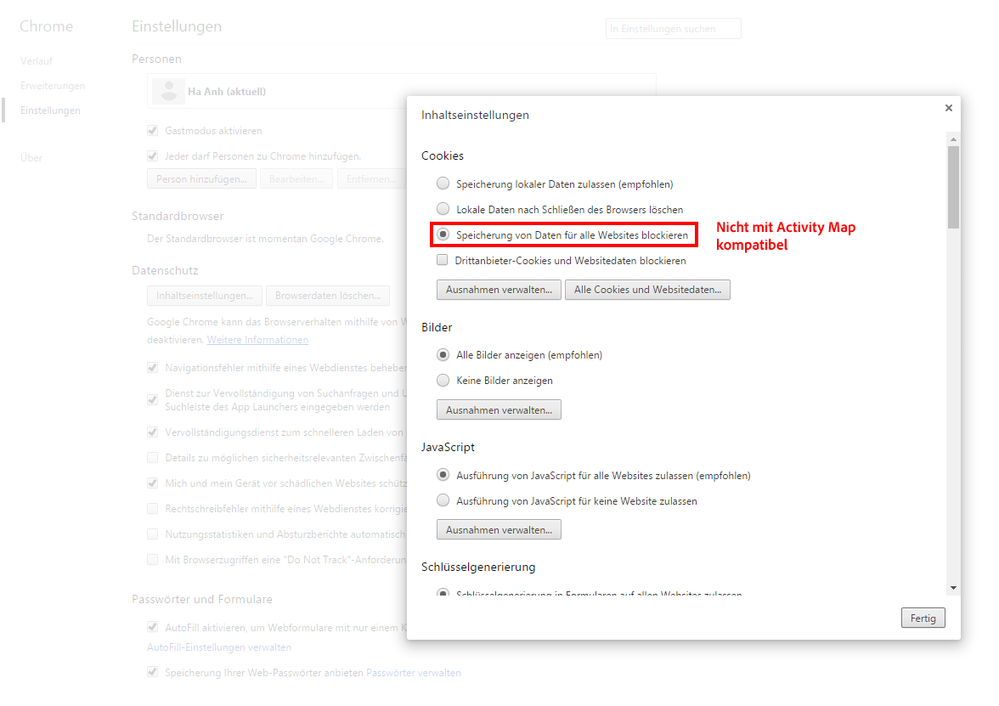
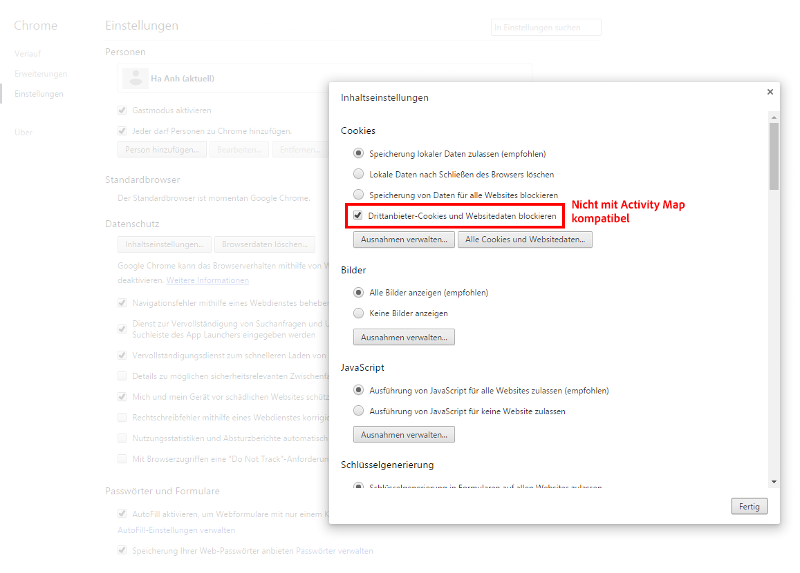
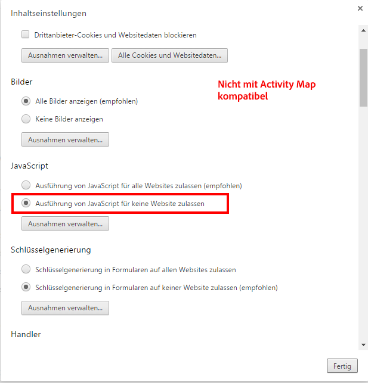
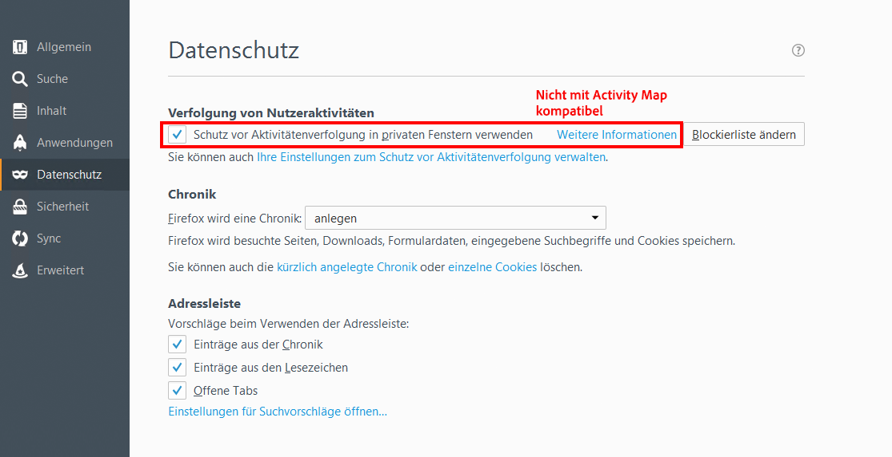
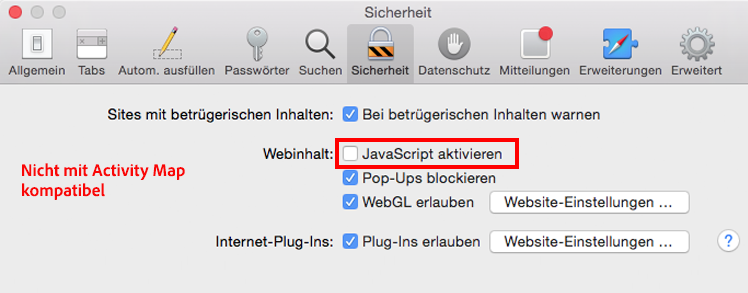
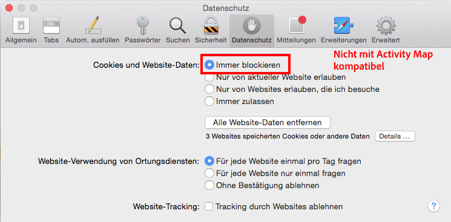
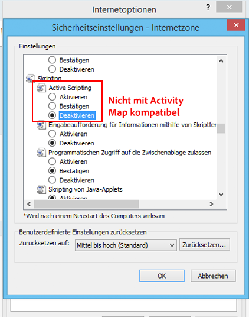

# Fehlerbehebung bei der Activity Map-Datenerfassung

Wenn keine Daten für Activity Map-Dimensionen angezeigt werden, ermitteln Sie auf dieser Seite die Gründe dafür.

## Bestätigen der Datenerfassung mit dem Debugger

Stellen Sie zunächst sicher, dass AppMeasurement Activity Map-Daten korrekt erfasst.

1. Herunterladen und Installieren der [Adobe CX Enterprise Debugger Chrome-Erweiterung](https://experienceleague.adobe.com/en/docs/experience-platform/debugger/home).
2. Navigieren Sie zu Ihrer Web-Seite und klicken Sie auf einen Link.
3. Öffnen Sie den Debugger, wenn die nachfolgende Seite geladen wird. Überprüfen Sie, ob Activity Map-Kontextdatenvariablen zwischen `activitymap.` und `.activitymap` eingefügt werden:

## Mögliche Gründe, warum Activity Map-Daten nicht vorhanden sind

Überprüfen Sie jeden der folgenden Punkte, um sicherzustellen, dass Activity Map-Komponenten vorhanden sind:

* **AppMeasurement-**: Activity Map wird ab Version 1.6 unterstützt. Viele Probleme mit Edge-Fällen werden behoben, wenn Sie auf die neueste stabile Version von AppMeasurement aktualisieren.
* **Activity Map-**: Überprüfen Sie, ob das `AppMeasurement_Module_Activity_Map` in Ihrer `AppMeasurement.js` vorhanden ist. Wenn Ihre Implementierung Adobe Experience Platform zur Datenerfassung verwendet, stellen Sie sicher, dass **[!UICONTROL ClickMap aktivieren]** beim Konfigurieren der Analytics-Erweiterung unter **[!UICONTROL Linktracking“]** ist.
* **Das `s_sq`-**: Activity Map hängt für die Datenerfassung vom `s_sq`-Cookie ab.
   * Stellen Sie sicher, dass die `cookieDomainPeriods`-Variable korrekt festgelegt ist, insbesondere für regionale Domains wie `*.co.uk` oder `*.co.jp`.
   * Stellen Sie sicher, dass die `linkInternalFilters` auf die gewünschten Werte eingestellt ist. Wenn ein geklickter Link nicht mit internen Filtern übereinstimmt, betrachtet Activity Map ihn als Exitlink und erfasst keine Daten.
* **Activity Map-Überlagerung läuft**: AppMeasurement verfolgt keine Klickdaten für Ihre Web-Seite, wenn die Activity Map-Überlagerung aktiviert ist.

Führt die Browserparameter auf, die nicht mit der Verwendung von Activity Map kompatibel sind. Adobe empfiehlt, diese Einstellungen zu deaktivieren.

## Chrome

## Firefox

## Safari

## Internet Explorer

**Validierung**

Interaktionsaufrufe über die Registerkarte „Netzwerk“ von Developer Console:

1. Laden Sie das Skript „Development Launch“ auf der Site.
1. Suchen Sie für Klicks auf Elemente auf der Registerkarte „Netzwerk“ nach „/ee“.

Adobe Experience Platform Debugger:

1. Laden Sie [Adobe Experience Platform Debugger](https://chromewebstore.google.com/detail/adobe-experience-platform/bfnnokhpnncpkdmbokanobigaccjkpob) herunter und installieren Sie diese Erweiterung.
1. Navigieren Sie zu [!UICONTROL Protokolle] > [!UICONTROL Edge] > [!UICONTROL Mit Edge verbinden].

* **Der Interaktionsaufruf wird nicht auf der Registerkarte „Netzwerk“ ausgelöst**: Klicken Sie in einem Sammlungsaufruf auf die Datenerfassung und filtern Sie entweder mit `"/ee"` oder `"collect?"`.
* **Es gibt keine Payload-Anzeige für den Sammlungsaufruf**: Der Sammlungsaufruf ist so konzipiert, dass das Tracking die Navigation zu anderen Sites nicht beeinflusst, sodass die Funktion zum Entladen von Dokumenten für die Sammlungsaufrufe anwendbar ist. Diese Funktion wirkt sich nicht auf Ihre Datenerfassung aus, aber wenn Sie eine Validierung auf der Seite durchführen müssen, fügen Sie dem entsprechenden Element `target="_blank"` hinzu. Der Link wird in einer neuen Registerkarte geöffnet.
