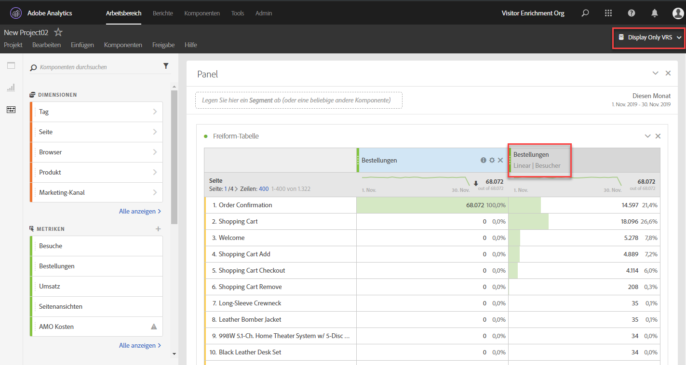

# Häufig gestellte Fragen

Im Folgenden finden Sie Antworten auf häufig gestellte Fragen zur Attribution.

+++## Was ist der Zeileneintrag **[!UICONTROL Keine]** bei Verwendung von Attribution?

Das Zeilenelement „Keine“ ist ein Sammelobjekt, der alle Konversionen darstellt, die ohne Touchpoints im Lookback-Fenster stattgefunden haben. Um die Anzahl der Konversionen zu reduzieren, die dem Zeileneintrag „Keine“ zugeordnet sind, versuchen Sie, ein benutzerdefiniertes Lookback-Fenster mit einem längeren Lookback-Zeitraum zu verwenden.

+++

+++## Warum sehe ich manchmal Daten außerhalb meines Berichtsfensters, wenn ich Attributionsmodelle verwende?

Einige besuchsbasierte Metriken, wie [Einträge](/help/components/metrics/entries.md) oder [Absprungrate](/help/components/metrics/bounce-rate.md), können Daten einem Zeitraum vor dem Startdatumsbereich des Berichtsfensters zuordnen. Diese Situation ist auf Attributionsmodelle zurückzuführen, die ein Lookback-Fenster verwenden, in dem festgelegt wird, wie weit die Attribution zurückblicken soll, um Metriken anzurechnen. Das häufigste Szenario ist, wenn Besuche über Mitternacht hinausgehen. Beispiel:

1. Ein Benutzer besucht Ihre Homepage am 7. September um 23:55 Uhr.
1. Er besucht mehrere Seiten, die letzte davon um 0:05 Uhr am 8. September.
1. Eine Woche später führen Sie einen täglichen Trend-Bericht mit dem Datumsbereich vom 8. September bis 14. September aus.

Trefferbasierte Metriken wie [Seitenansichten](/help/components/metrics/page-views.md) würden eine erwartete Ausgabe erzeugen; es gab täglich vom 8. September bis 14. September Daten im Trend. Besuchsbasierte Metriken zeigen jedoch auch den oben genannten Besuch am 7. September an. Der zugewiesene Eintrag des Besuchs fand am 7. September statt, und das Lookback-Fenster erstreckt sich standardmäßig vom 1. September bis 31. September.

Die Absprungrate zeigt in diesem Beispiel für den 7. September immer 0 % an. Diese Metrik ist definiert als `Bounces divided by Entries`, eine trefferbasierte Metrik geteilt durch eine besuchsbasierte Metrik. Absprünge bestehen aus einer einzigen Bildanforderung, sodass sie nicht mehrere Tage umfassen können. Absprünge am 7. September erfolgten außerhalb des Berichtsfensters, was zu einer garantierten Absprungrate von 0 % für diesen Tag führt. Andere trefferbasierte Metriken würden in diesem Bericht für den 7. September ebenfalls den Wert 0 anzeigen, da sich diese Treffer auch nicht im Berichtsfenster befinden.

Betrachten wir ein anderes ähnliches Beispiel. Der einzige Unterschied zwischen dem folgenden Beispiel und dem obigen Beispiel sind die Datumsangaben:

1. Ein Benutzer besucht Ihre Homepage am 31. August um 23:55 Uhr.
1. Er besucht mehrere Seiten, die letzte davon um 0:05 Uhr am 1. September.
1. Eine Woche später führen Sie einen täglichen Trend-Bericht mit dem Datumsbereich vom 1. September bis 7. September aus.

In diesem Beispiel würden „Einstiege“ und „Absprungrate“ keine Daten vom 31. August anzeigen. Sowohl das Lookback-Fenster als auch das Berichtsfenster beginnen am 1. September, sodass keine Daten vom 31. August zugeordnet werden können.

+++

<!-- not relevant anymore due to introduction of separation of container and lookback window 
+++## When should I use a visit, visitor, or custom attribution lookback?

The choice of attribution lookback depends on your use case. If conversions typically take longer than a single visit, a visitor or custom lookback is recommended. For longer conversion cycles, custom lookback windows are best as they are the only type that can pull in data from prior to the reporting window.

+++
-->

+++## Worin unterscheiden sich Props und eVars bei der Verwendung von Attribution?

Die Attribution wird zur Laufzeit des Berichts neu berechnet. Es gibt also keinen Unterschied zwischen einer Prop oder einer eVar (oder einer anderen Dimension) hinsichtlich des Attributionsmodells. Eigenschaften können mit jedem Lookback-Fenster oder Attributionsmodell bestehen bleiben und die eVar-Zuordnungs-/Ablaufeinstellungen werden ignoriert.

+++

+++## Sind Attributionsmodelle in anderen Analytics-Funktionen wie Daten-Feeds oder Data Warehouse verfügbar?

Nein. Attributionsmodelle verwenden die Verarbeitung der Berichtszeit, die nur in Analysis Workspace verfügbar ist. Weitere Informationen finden Sie unter [Berichtszeitverarbeitung](/help/components/vrs/vrs-report-time-processing.md).

+++

+++## Stehen Attributionsmodelle nur dann zur Verfügung, wenn ich eine Virtual Report Suite mit aktivierter Berichtszeitverarbeitung verwende?

Attributionsmodelle stehen außerhalb der Virtual Report Suites zur Verfügung. Attributionsmodelle verwenden die Berichtszeitverarbeitung im Backend und stehen sowohl für Standard-Report Suites als auch für Virtual Report Suites zur Verfügung.

+++

+++## Welche Dimensionen und Metriken werden nicht unterstützt?

Das Attributionsbedienfeld unterstützt alle Dimensionen. Nicht unterstützte Metriken:

* Alle berechneten Metriken
* Unique Visitors
* Besuche
* Vorfälle
* Seitenansichten
* A4T-Metriken
* Besuchszeitmetriken
* Absprünge
* Absprungrate
* Einstiege
* Ausstiege
* Nicht gefundene Seiten
* Suchvorgänge
* Einzelseitenbesuche
* Einzelzugriff

+++

+++## Funktioniert die Attribution mit Klassifizierungen?

Ja, Klassifizierungen werden vollständig unterstützt.

+++

+++## Funktioniert die Attribution mit Datenquellen?

Ja, die meisten Datenquellen werden unterstützt. Bei Datenquellen auf Zusammenfassungsebene ist eine Attribution nicht möglich, da diese Datenquellen nicht mit einer Analytics-Besucherkennung verknüpft sind. 

Transaktions-ID-Datenquellen werden wie andere Treffer behandelt. Transaktions-ID-Datenquellen erfahren nicht die spezielle Verarbeitung, die normalerweise beim herkömmlichen Reporting verwendet wird. Anders ausgedrückt: Bei Verwendung der Berichtszeitverarbeitung werden bei Transaktions-ID-Treffern eVar-Werte aus Treffern übertragen, die nahe dem Zeitstempel des Transaktions-ID-Treffers auftreten. Die Werte werden nicht aus Treffern weitergegeben, die in der Nähe des Zeitpunkts der ursprünglichen Transaktion aufgetreten sind.

Wenn möglich, basiert die Attribution auf dem MID-Spaltenwert, der innerhalb eines Ereignisses in der Datenquelle gesendet wird, und nicht auf einem persistenten Wert. Das Attributionsmodell wird ad hoc auf die MID-Spaltenwerte in der Datenquelle angewendet. Wenn Sie beispielsweise die Attribution [Letztkontakt“ verwenden](models.md) beginnt das Modell mit jeder Instanz einer Metrik. und in den Treffern sequenziell rückwärts geht, bis das Modell den letzten in der Spalte MID beobachteten Wert erreicht.

Wenn nicht möglich, wird bei der Attribution der MID-Wert im *vorherigen Datensatz* in der Datenquelle zur Auswertung verwendet. Dieser vorherige Datensatz wird möglicherweise nicht sequenziell nach Zeitstempel geordnet, da AA keine korrupten Daten unterstützt.

Da die Datensätze nicht sequenziell angeordnet werden, können sich die erwarteten Werte aus der Anwendung der Persistenz auf die Zeit auswirken, die zwischen dem Zeitstempel der bereitgestellten Transaktions-ID und der ursprünglichen Transaktion vorhanden ist.

+++

+++##Funktioniert Attribution mit der Advertising Analytics-Integration?

Metadatendimensionen wie Übereinstimmungstyp und Keyword funktionieren mit Attribution. Metriken (wie Impressions, Kosten, Klicks, durchschnittliche Position und durchschnittliche Qualitätsbewertung) verwenden jedoch Datenquellen auf Zusammenfassungsebene und sind daher inkompatibel.

+++

+++## Wie funktioniert die Attribution bei Marketing-Kanälen?

Als Marketing-Kanäle eingeführt wurden, hatten sie nur die Dimensionen „Erstkontakt“ und „Letztkontakt“. Explizite Dimensionen „Erstkontakt“ und „Letztkontakt“ sind mit der aktuellen Attributionsversion nicht mehr erforderlich. Adobe stellt die generischen Dimensionen [!UICONTROL Marketing-Kanal] und [!UICONTROL Marketing-Kanal-Detail] bereit, die Sie mit Ihrem gewünschten Attributionsmodell verwenden können. Diese allgemeinen Dimensionen verhalten sich identisch mit den Dimensionen des [!UICONTROL Letztkontakt-Kanals], sind jedoch anders gekennzeichnet, um Verwirrung bei der Verwendung von Marketing-Kanälen mit einem anderen Attributionsmodell zu vermeiden.

Da die Marketing-Kanal-Dimensionen von einer traditionellen Besuchsdefinition abhängen (wie in den Verarbeitungsregeln definiert), kann ihre Besuchsdefinition nicht mit Virtual Report Suites geändert werden.

+++

+++## Wie funktioniert die Attribution mit Variablen mit mehreren Werten, wie z. B. Listenvariablen?

Einige Dimensionen in Analytics können bei einem einzelnen Hit mehrere Werte enthalten. Häufige Beispiele sind Listenvariablen und die Produktvariable.

Wenn die Attribution auf Hits mit mehreren Werten angewendet wird, erhalten alle Werte im selben Hit dieselbe Gewichtung. Da viele Werte diese Gewichtung erhalten können, kann sich die Berichtssumme von der Summe der einzelnen Zeileneinträge unterscheiden. Die Berichtssumme wird dedupliziert, während jedes einzelne Dimensionselement korrekt gewichtet wird.

+++

+++## Wie funktioniert die Attribution mit Segmentierung?

Die Attribution wird immer vor der Segmentierung ausgeführt und die Segmentierung wird ausgeführt, bevor Berichtsfilter angewendet werden. Dieses Konzept gilt auch für Virtual Report Suites, die Segmente verwenden.

Wenn Sie z. B. eine Virtual Report Suite mit angewendetem Segment „Hits anzeigen“ erstellen, können Sie mithilfe einiger Attributionsmodelle andere Kanäle in einer Tabelle sehen.

>[!NOTE]
>
>Wenn ein Segment Treffer unterdrückt, die Ihre Metrik enthalten, werden diese Metrikinstanzen keiner Dimension zugeordnet. Bei einem ähnlichen Berichtsfilter könnten jedoch lediglich einige Dimensionselemente ausgeblendet werden, ohne dass dies Auswirkungen auf die im jeweiligen Attributionsmodell verarbeiteten Metriken hat. Daher kann ein Segment niedrigere Werte zurückgeben als ein Filter mit einer vergleichbaren Definition.

+++
