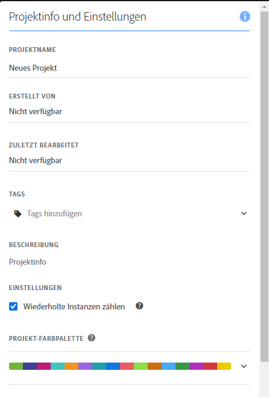
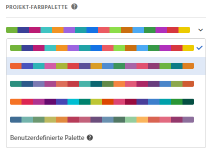

# Visualisierungsfarbpaletten {#visualization-color-palette}

<!-- markdownlint-disable MD034 -->

>[!CONTEXTUALHELP]
>id="workspace_project_colorpalette"
>title="Projektfarbpalette"
>abstract="Ändern Sie die in diesem Projekt verwendete Farbpalette."

<!-- markdownlint-enable MD034 -->

Sie können die in Workspace verwendete Farbpalette für die Visualisierung ändern. Sie können eine vordefinierte Farbpalette auswählen oder eine eigene Palette festlegen, die den Markenfarben Ihres Unternehmens entspricht. Diese Funktion wirkt sich auf die meisten Visualisierungen in Workspace aus. Die Zusammenfassungsänderung, die bedingte Formatierung in Freiformtabellen und die Zuordnungsvisualisierung sind davon jedoch **nicht** betroffen.

>[!NOTE]
>
>Die Farbpalettenunterstützung ist für Internet Explorer 11 nicht aktiviert.

Beachten Sie:

* Es stehen sechs voreingestellte Farbpaletten zur Auswahl. Die Standardpalette und die zweite aufgeführte Palette wurden für Kontrast optimiert und sind bei Farbenblindheit besser geeignet.
* Die anderen Paletten wurden für die Farbharmonie optimiert.

## So ändern Sie Ihre Farbpalette:

1. Navigieren Sie zu **[!UICONTROL Arbeitsbereich]** > **[!UICONTROL Projekt]** > **[!UICONTROL Projektinformationen und -einstellungen]**.
1. Aus dem Dropdown **[!UICONTROL Menü]** Projektfarbpalette“ können Sie eines der vordefinierten Farbschemata auswählen.
1. Um Ihre eigene Palette festzulegen, wählen Sie **[!UICONTROL Benutzerdefinierte Palette]** unter den voreingestellten Optionen aus.
1. Geben Sie bis zu 16 kommagetrennte Hexadezimalwerte ein (z. B. `#00a4e4`), um Ihre eigene Farbpalette zu erstellen. Wenn Sie beispielsweise nur vier Werte angeben, werden Farben in Visualisierungen mit mehr Farben automatisch wiederholt.

<!--
# Visualization Color Palettes {#visualization-color-palettes}

>[!CONTEXTUALHELP]
>id="workspace_project_colorpalette"
>title="Project color palette"
>abstract="Change the color palette used in this project."

You can change the visualization color palette used in Workspace by choosing a different color palette or by specifying your own palette that could match your company's branding colors. This feature affects most visualizations in Workspace, but it does **not** affect [!UICONTROL Summary Change], conditional formatting in [!UICONTROL Freeform] tables, and the [!UICONTROL Map] visualization.

>[!NOTE]
>
>Color palette support is not enabled for Internet Explorer 11.

Keep in mind:

* There are five pre-set color palettes to choose from. The default palette and the one below have been optimized for optimal contrast and are both more accessible for those who are color blind.
* The third to the fifth color palettes below the top two have been optimized for color harmony.

## Change your [!UICONTROL color palette]:

>[!BEGINSHADEBOX]

See  [Using a custom color palette](https://video.tv.adobe.com/v/23876?quality=12&learn=on){target="_blank"} for a demo video.

>[!ENDSHADEBOX]

1. Navigate to **[!UICONTROL Workspace]** > **[!UICONTROL Project]** > **[!UICONTROL Project Info & Settings]**.
1. From the **[!UICONTROL Project Color Palette]** drop-down list, you can pick one of five pre-set color schemes.

   

1. To specify your own palette, select **[!UICONTROL Custom Palette]** below the pre-set options.
1. Specify up to 16 comma-separated hexadecimal values (for example, #00a4e4) for the colors you intend to use. If, for example, you want to use only four values, these colors will automatically be repeated in visualizations that contain more colors.
-->