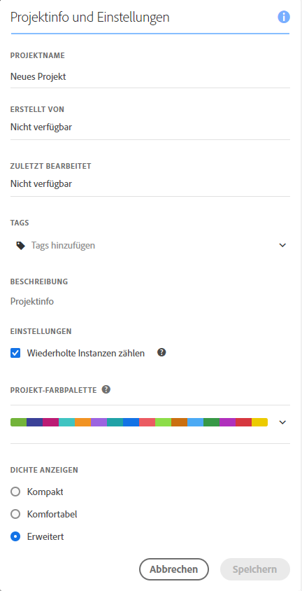

# Erstellen von Projekten {#create-projects}

Mit [Projekten](/help/analyze/analysis-workspace/build-workspace-project/freeform-overview.md) in Analysis Workspace können Sie geschäftskritische Analysen erstellen und anzeigen.  Diese Analysen können für Stakeholderinnen und Stakeholder innerhalb oder außerhalb Ihrer Organisation freigegeben werden.

1. Wählen Sie in Adobe Analytics **[!UICONTROL Arbeitsbereich]** aus.

1. Wählen Sie im linken Bedienfeld die Option **[!UICONTROL Projekte]** und dann **[!UICONTROL Projekt erstellen]** aus.

1. Wählen Sie **Leeres Workspace-Projekt** aus, um Ihr Workspace-Projekt mit einem Browser zu erstellen.

   Weitere Informationen [ Erstellen eines mobilen Scorecard](/help/analyze/mobile-app/curator.md)Projekts, das Sie mit einer mobilen App für andere Stakeholder freigeben können, finden Sie unter „Leere mobile Scorecard“.

1. Wählen Sie [!UICONTROL **Erstellen**] aus.

Nachdem Sie nun ein leeres Workspace-Projekt erstellt haben, sollten Sie mit der Benutzeroberfläche von [Analysis Workspace](/help/analyze/analysis-workspace/home.md) vertraut sein. Wenn dem so ist, können Sie Ihr Projekt erstellen. Gehen Sie dazu wie folgt vor:

* Fügen Sie dem Projekt [Bedienfelder](/help/analyze/analysis-workspace/c-panels/panels.md) hinzu, Zum Beispiel das **[!DNL Example Panel]** ➊.

* Fügen Sie Ihren Bedienfeldern [Visualisierungen](/help/analyze/analysis-workspace/visualizations/freeform-analysis-visualizations.md) hinzu, z. B.:
   * Visualisierung [Linie](/help/analyze/analysis-workspace/visualizations/line.md) **[!DNL Line]** ➋
   * Visualisierung [Freiformtabelle](/help/analyze/analysis-workspace/visualizations/freeform-table/freeform-table.md) **[!DNL US States]** ➌
* Fügen Sie Ihren Visualisierungen [Komponenten](/help/analyze/analysis-workspace/components/analysis-workspace-components.md) hinzu, z. B.:
   * [Dimension](/help/components/dimensions/overview.md) **[!DNL US States]** ➍
   * [Metrik](/help/analyze/analysis-workspace/components/apply-create-metrics.md) **[!DNL Unique Visitors]** ➎
   * [Berechnete Metrik](/help/components/calculated-metrics/cm-overview.md) **[!DNL Average Revenue Per Order]** ➏
   * [Segment](/help/components/segmentation/seg-overview.md) **[!DNL Visits from Mobile Devices]** ➐
   * [Datumsbereich](/help/analyze/analysis-workspace/components/calendar-date-ranges/calendar.md) **[!DNL Last Month]** ➑
   * [Anmerkung](/help/analyze/analysis-workspace/components/annotations/overview.md) **[!DNL Example]** ➒

## Projektinfo und Einstellungen {#project-info-settings}

>[!CONTEXTUALHELP]
>id="workspace_project_countrepeatinstances"
>title="Wiederholungsinstanzen zählen"
>abstract="Diese Einstellung legt fest, ob wiederholte Instanzen in Berichten gezählt werden sollen.  Hinweis: Diese Einstellung gilt nicht für Fluss- oder Fallout-Visualisierungen."

>[!CONTEXTUALHELP]
>id="workspace_project_repeatinstances"
>title="Wiederholungsinstanzen zählen"
>abstract="Diese Einstellung legt fest, ob wiederholte Instanzen in Berichten gezählt werden sollen. Hinweis: Diese Einstellung gilt nicht für Fluss- oder Fallout-Visualisierungen."

>[!CONTEXTUALHELP]
>id="workspace_project_commenting"
>title="Kommentieren zulassen"
>abstract="Wenn diese Option aktiviert ist, wird in der rechten Leiste des Projekts in Analysis Workspace ein Kommentarbereich verfügbar."

Die Projekteinstellungen enthalten auf der Projektebene befindliche Informationen über das derzeit aktive Projekt.

Zu den Einstellungen gehören:

| Einstellung | Beschreibung |
|---|---|
| Projektname | Der Name des Projekts. Sie können auf den Namen doppelklicken, um ihn zu bearbeiten. |
| Besitzer | Name des Projektbesitzer. |
| Zuletzt geändert | Das Datum, an dem die letzte Änderung an dem Projekt vorgenommen wurde. |
| Tags | Zeigt eine Liste aller Tags an, die auf ein Projekt angewendet wurden, um die Kategorisierung zu vereinfachen. |
| Beschreibung | Eine Beschreibung hilft, den Zweck eines Projekts anzugeben. Sie können auf die Beschreibung doppelklicken, um sie zu bearbeiten. |
| Wiederholungsinstanzen zählen | Diese Einstellung legt fest, ob Wiederholungsinstanzen in Berichten gezählt werden sollen. Hinweis: Diese Einstellung gilt nicht für Fluss- oder Fallout-Visualisierungen. |
| Anmerkungen anzeigen | Legen Sie fest, ob Anmerkungen für dieses Projekt angezeigt werden sollen. |
| [Projekt-Farbpalette](/help/analyze/analysis-workspace/build-workspace-project/color-palettes.md) | Sie können die in Workspace verwendete Farbpalette für Kategorien ändern, indem Sie aus den vordefinierten Paletten wählen, die für die Farbenblindheit optimiert wurden, oder indem Sie eine benutzerdefinierte Palette angeben. Diese Funktion betrifft vieles in Workspace, einschließlich der meisten Visualisierungen. |
| [Dichte anzeigen](/help/analyze/analysis-workspace/build-workspace-project/view-density.md) | Mit dieser Option können Sie mehr Daten auf dem Bildschirm anzeigen, indem Sie den vertikalen Abstand des linken Bedienfelds, der Freiformtabellen und der Kohortentabellen reduzieren. |

<!--
# Create projects in Analysis Workspace

[Projects](/help/analyze/analysis-workspace/build-workspace-project/freeform-overview.md) in Analysis Workspace allow you to view business-critical analyses that can be shared with stakeholders inside or outside your organization. 

For general information about how to get started using Analysis Workspace, see [Analysis Workspace overview](/help/analyze/analysis-workspace/home.md).

The following sections describe how to create a project and start adding the key building blocks for any Analysis Workspace project: panels, visualizations, and components.

## Create a project from a blank project or a report

1. In Adobe Analytics, select [!UICONTROL **Workspace**].

1. Choose whether to create a blank project or to create a project from a report:

   +++Create a blank project

   1. On the [!UICONTROL **Workspace**] tab, select the [!UICONTROL **Projects**] tab on the left side of the page, then select [!UICONTROL **Create project**].

   1. Choose whether to create a blank project or a blank mobile scorecard

      * **Blank project** if you plan to share your analysis from the browser 
      * [**Blank mobile scorecard**](/help/analyze/mobile-app/curator.md) if you plan to share your analysis from the Adobe Analytics dashboards mobile app.

   1. Select [!UICONTROL **Create**].

   +++

   +++Create a project from a report
   
      1. On the [!UICONTROL **Workspace**] tab, select the [!UICONTROL **Reports**] tab on the left side of the page.

      1. Search for or navigate to the report you want to use, then select it when it appears.

          A set of standard reports is available by default. In addition, your organization might have created custom reports for you to choose from.
          
      1. Select [!UICONTROL **Project**] > [!UICONTROL **Save**] to save the report as a new project.

          For more information about reports, see "Navigate the Reports tab" in [Adobe Analytics landing page](/help/analyze/landing.md).

   +++

1. Next, you need to add panels, visualizations, and components to your project. First, add panels to your project in Analysis Workspace, as described in [Add panels to the project](#add-panels-to-the-project). You can then add visualizations to any panels. Finally, you can add components to any panels or visualizations.

## Add panels to the project {#panels}

[Panels](/help/analyze/analysis-workspace/c-panels/panels.md) are the foundation to any project in Analysis Workspace. Panels are used to organize the content (visualizations and components) of a project. 

Many of the panels provided in Analysis Workspace generate a full set of analyses based on a few user inputs. 

To add a panel:

1. Select the [!UICONTROL **Panels**] icon in the left rail.

   

1. Search for the panel you want to add. When it appears in the left rail, drag it into your project.

1. Add visualizations to your panel, as described in [Add visualizations to the project](#add-visualizations-to-the-project). 

   Alternatively, you can add components directly to a panel, as described in [Add components to the project](#add-components-to-the-project).

## Add visualizations to the project

[Visualizations](/help/analyze/analysis-workspace/visualizations/freeform-analysis-visualizations.md) (such as a freeform table, a bar chart, or a line chart) can be used to visually bring data to life. 

>[!TIP]
>
>Freeform tables are the most common type of visualization, and are the foundation for interactive data analysis. For more details about how to work with Freeform tables in Analysis Workspace, see [Freeform table](/help/analyze/analysis-workspace/visualizations/freeform-table/freeform-table.md).

To add a visualization:

1. Select the **[!UICONTROL Visualizations]** icon in the left rail.

   

1. Search for the visualization you want to add. When it appears in the left rail, drag it to a panel within your project. 

1. Add components to the visualization, as described in [Add components to the project](#add-components-to-the-project).

## Add components to the project

[Components](/help/analyze/analysis-workspace/components/analysis-workspace-components.md) make up the actual data of any project. You can add components to visualizations or to panels.

>[!TIP]
>
>For information about each component, select the Info icon next to a component's name in the left rail, or see the [Analytics Components Guide](/help/components/home.md).

Following is basic information about how to add a component to a project in Analysis Workspace. For more detailed information about adding the various types of components (dimensions, metrics, segments, and date ranges), see [Use components in Analysis Workspace](/help/analyze/analysis-workspace/components/use-components-in-workspace.md).

To add a component to a project in Analysis Workspace:

1. Select the **[!UICONTROL Components]** icon in the left rail.

   

1. Scroll to or search for the component you want to add, then drag it to a panel or visualization within your project. 

   For example, you can drag a segment to the segment drop zone in a panel header.

   

   For more information about adding components to projects, see [Use components in Analysis Workspace](/help/analyze/analysis-workspace/components/use-components-in-workspace.md).

1. (Optional) Share the project as described in [Save and share the project](#save-and-share-the-project).

## Save and share the project

As you create an analysis in Analysis Workspace, your work is [automatically saved](/help/analyze/analysis-workspace/build-workspace-project/save-projects.md). 

When you finish building out the project and it's gathering actionable insights, the project is ready to be consumed by others. You can share the project with users and groups in your organization, or even with people outside your organization. For information about sharing a project, see [Share projects](/help/analyze/analysis-workspace/curate-share/share-projects.md).
-->