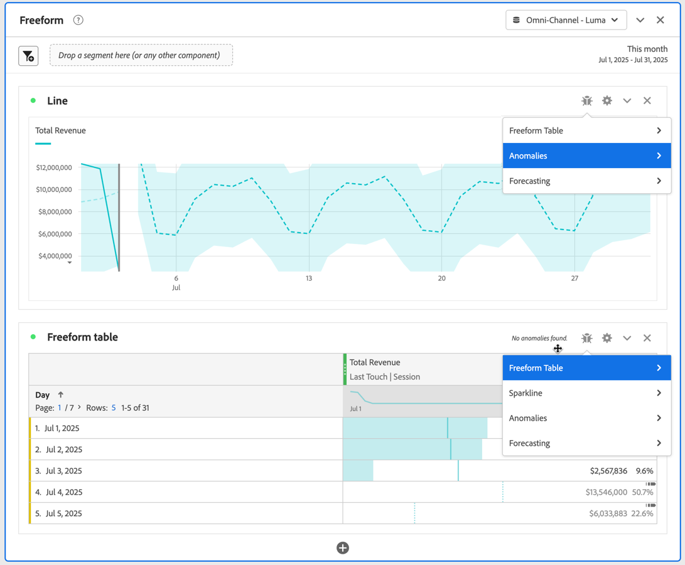

# Projekt-Debugger

Der Projekt-Debugger unterstützt Sie und den Adobe-Support bei der Fehlerbehebung bei Projekten in Analysis Workspace. Der Adobe-Support bittet Sie möglicherweise, den Debugger zu aktivieren, um Tickets zu beheben, die Sie beim Adobe-Support ausgelöst haben. Beispiele für Probleme sind die Ladezeit von Visualisierungen oder fehlerhafte Komponenten in Ihren Visualisierungen.

>[!NOTE]
>
>Um den Debugger verwenden zu können, benötigen Sie **Bearbeiten** oder **Kopieren** Zugriff auf das Projekt.
>

## Debugger aktivieren

>[!IMPORTANT]
>
>Speichern Sie das Projekt, bevor Sie den Debugger aktivieren.
>

So aktivieren Sie den Debugger:

1. Wählen **[!UICONTROL Hilfe]** > **[!UICONTROL Debugger aktivieren]** aus dem Analysis Workspace-Projektmenü.
1. Wählen **&#x200B;**&#x200B;im Dialogfeld **[!UICONTROL Debugger aktivieren]** die Option OK aus.
1. Bestätigen Sie, wenn der Browser Sie auffordert, die Seite oder Site neu zu laden.

## Verwenden des Debuggers

Wenn Sie den Debugger aktiviert haben, verfügen alle Visualisierungen in Ihrem Projekt über ein zusätzliches .

So verwenden Sie den Debugger für eine bestimmte Visualisierung:

1. Wählen  der Visualisierung „Bug“ aus.

   

1. Wählen Sie die entsprechende Aktion aus dem Kontextmenü aus. Die verfügbaren Aktionen hängen von der Visualisierung ab und geben den Typ des Debuggens an, den Sie durchführen möchten. Wenn Sie beispielsweise &quot;**[!UICONTROL &quot; auswählen]** können Sie die Anomaliefunktion in der Visualisierung debuggen.
1. Wählen Sie im Untermenü einen Zeitstempel aus.
1. Ein **[!UICONTROL Oberon XML]**-Debugfenster wird mit Details zu den spezifischen Funktionen geöffnet, die von der Visualisierung ausgeführt werden. Unten finden Sie ein Beispiel für die Ausgabe einer Anomalieanforderung.

   

   Die Details sind:

   * **[!UICONTROL Zeitstempel der Anfrage]**
   * **[!UICONTROL Zeitstempel der Antwort]**
   * **[!UICONTROL Anfragezeit]**
   * **[!UICONTROL Warteschlangenzeit]**
   * **[!UICONTROL Server-Verarbeitungszeit]**
   * **[!UICONTROL Lookup Time]**
   * **[!UICONTROL Komplexität]**
   * **[!UICONTROL Monatsgrenzen]**
   * **[!UICONTROL Spalten]**
   * **[!UICONTROL Segmente]**
   * **[!UICONTROL XML]** **[!UICONTROL Request]** und **[!UICONTROL Response]**
   * **[!UICONTROL cURL-Anfrage]**
   * **[!UICONTROL JSON]** **[!UICONTROL Request]** und **[!UICONTROL Response]**

1. Verwenden Sie  **[!UICONTROL Alle Felder in die Zwischenablage kopieren]**, um alle Debugging-Informationen in die Zwischenablage zu kopieren. Fügen Sie die Informationen in Ihren bevorzugten Editor oder Ihr bevorzugtes Tool ein. Die Informationen umfassen:

   * XML (Anfrage)
   * XML (Antwort)
   * JSON (Anfrage)
   * JSON (Antwort)
   * cURL-Anfrage

1. Verwenden Sie  **[!UICONTROL In Zwischenablage kopieren]** unter **[!UICONTROL cURL Request]**, um die Anfrage in die Zwischenablage zu kopieren.
1. Bewegen Sie den Mauszeiger über einen der **[!UICONTROL Anfrage]** oder **[!UICONTROL Antwort]** Textbereiche, um  **[!UICONTROL In Zwischenablage kopieren]** einzublenden und auszuwählen, um den Inhalt dieses Textbereichs (XML oder JSON) in die Zwischenablage zu kopieren.

1. Tauschen Sie alle kopierten Informationen und den von Adobe angeforderten Support aus, um die Visualisierungen in Ihrem Analysis Workspace-Projekt zu beheben.

1. Wählen Sie **[!UICONTROL Abbrechen]** aus, um das **[!UICONTROL Oberon XML]**-Debugfenster zu schließen und zum Projekt zurückzukehren.

Wiederholen Sie die obigen Schritte für jede andere Visualisierung, die Sie beheben möchten.

## Debugger deaktivieren

>[!IMPORTANT]
>
>Bevor Sie den Debugger deaktivieren, speichern Sie alle Änderungen, die Sie am Projekt vorgenommen haben, und möchten sie im Rahmen der Debugging-Übung beibehalten.
>

Deaktivieren des Debuggers:

1. Wählen **[!UICONTROL Hilfe]** > **[!UICONTROL Debugger deaktivieren]** aus dem Analysis Workspace-Projektmenü aus.
1. Wählen **&#x200B;**&#x200B;im Dialogfeld **[!UICONTROL Debugger deaktivieren]** die Option OK aus.
1. Bestätigen Sie, wenn der Browser Sie auffordert, die Seite oder Site neu zu laden.
