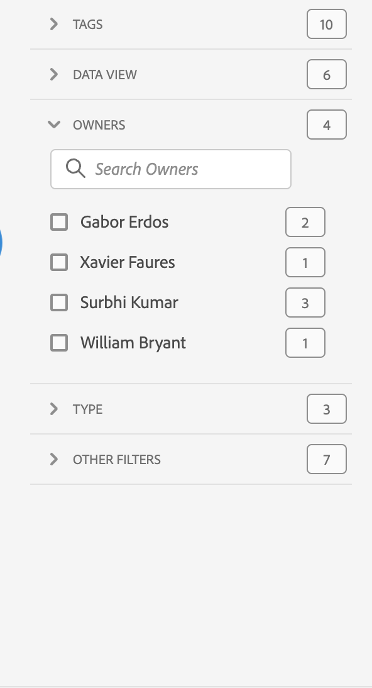

# Überblick über Projekte

Mit Workspace-Projekten können Sie Panels, Visualisierungen und Komponenten kombinieren, um Ihre Analyse zu erstellen und sie für andere Mitarbeitende Ihrer Organisation freizugeben. Bevor Sie mit Ihrem ersten Projekt beginnen, sollten Sie sich damit vertraut machen, wie Sie auf Projekte zugreifen, durch sie navigieren und diese verwalten.

Um auf Projekte in Adobe Analytics zuzugreifen, wählen Sie **[!UICONTROL Workspace]** aus.  Der Manager **[!UICONTROL Projekte]** listet alle Projekte auf, die Ihnen gehören bzw. die für Sie freigegeben wurden. Der Projekt-Manager mit der Projektliste ist auch die standardmäßige Landingpage für Adobe Analytics, sofern Sie in den Voreinstellungen nichts anderes konfiguriert haben.

## Titelbereich

Im Titelbereich ➊ können Sie ein Projekt erstellen, einen Ordner anlegen, Voreinstellungen bearbeiten und ein Panel mit zusätzlichen Kacheln ein- oder ausblenden.

* Um links ein Panel ein- oder auszublenden, in dem Sie zwischen **[!UICONTROL Projekte]** und **[!UICONTROL Lernen]** wählen können, wählen Sie  aus.
* Als Titel wird „Projekte“ angezeigt, optional ergänzt mit dem Pfad zum ausgewählten Ordner, z. B. [!UICONTROL Projekte] > **[!UICONTROL Unternehmensordner]**. Sie können einzelne Unterordnerteile auswählen, um direkt zum jeweiligen Ordner zu gelangen.
* Um Kacheln für ein [**[!UICONTROL Leeres Projekt]**](create-projects.md), [**[!UICONTROL Leere mobile Scorecard]**](/help/analyze/mobile-app/create-scorecard.md), **[!UICONTROL Dokumentation öffnen]** und **[!UICONTROL Versionshinweise öffnen]**, wählen Sie  **[!UICONTROL Mehr anzeigen]**. Um den Bereich mit den Kacheln auszublenden, wählen Sie  **[!UICONTROL Weniger zeigen]** aus.
* Je nachdem, was angezeigt werden soll, können Sie mit der Auswahl [Anzeigen](#show-selector) Voreinstellungen bearbeiten und Aktionen für den aktuellen unter **[!UICONTROL Projekte]** angezeigten Ordner durchführen:

  | Aktion | Beschreibung |
  |---|---|
  | **[!UICONTROL Erstellen eines Projekts]** | Wählen Sie diese Aktion aus, um [ein neues Projekt zu erstellen](create-projects.md). |
  | **[!UICONTROL Ordner erstellen]** | Wählen Sie diese Aktion aus, um [einen neuen Ordner zu erstellen](workspace-folders/create-folders.md). |
  |  **[!UICONTROL Voreinstellungen bearbeiten]** | Wählen Sie diese Aktion aus, um [Voreinstellungen für alle Ihre Projekte zu bearbeiten](/help/analyze/analysis-workspace/user-preferences.md). Wenn der Breadcrumb zu Platzproblemen führt, ist diese Aktion Teil des Untermenüs . |
  | **[!UICONTROL Projekte hinzufügen]** | Wählen Sie diese Aktion aus, um dem aktuellen Ordner [Projekte hinzuzufügen](workspace-folders/add-projects.md). Wenn der Breadcrumb zu Platzproblemen führt, ist diese Aktion Teil des Untermenüs . |
  | **[!UICONTROL Ordner umbenennen]** | Wählen Sie diese Aktion aus, um den aktuellen Ordner [umzubenennen](workspace-folders/manage-folders.md#rename-folders). |
  | **[!UICONTROL Ordner verschieben]** | Wählen Sie diese Aktion aus, um den aktuellen Ordner zu [verschieben](workspace-folders/manage-folders.md#move-folders). |
  | **[!UICONTROL Ordner löschen]** | Wählen Sie diese Aktion aus, um den aktuellen Ordner zu [löschen](workspace-folders/manage-folders.md#delete-folders). |

## Projektliste

Die Projektliste ➋ zeigt alle Projekte, die Ihnen gehören bzw. die für Sie freigegeben wurden. Die Liste umfasst die folgenden Spalten:

| Spalte | Beschreibung |
| --- | --- | 
|  | Wenn ein oder mehrere Projekte ausgewählt sind, wird unten in der Benutzeroberfläche „Projekt“ eine blaue Aktionsleiste angezeigt. Weitere Informationen finden Sie unter [Aktionen](#actions). |
|  | Wählen Sie diese Option aus, um einen Filter als Favoriten zu markieren  oder aus den Favoriten zu entfernen . |
| **[!UICONTROL Titel und Beschreibung]** | Wählen Sie zum Bearbeiten des Projekts den Titel-Link aus. Dadurch wird das [Workspace-Projekt](/help/analyze/analysis-workspace/home.md) geöffnet. Für Sie freigegebene Projekte sind mit  gekennzeichnet. Wählen Sie  aus, um ein Popup-Menü mit weiteren Details zum Projekt anzuzeigen. Wählen Sie , um ein Kontextmenü mit Aktionen zu öffnen. Weitere Informationen finden Sie unter [Aktionen](#actions). |
| **[!UICONTROL Typ]** | Ein Workspace-Projekt, ein Ordner  oder eine [Mobile Scorecard](/help/analyze/mobile-app/home.md). |
| **[!UICONTROL Tags]** | Die auf das Projekt angewendeten Tags. |
| **[!UICONTROL Geplant]** | Ob ein Projekt für den E-Mail-Versand an Empfangende geplant ist. Die Optionen lauten  **[!UICONTROL Ein]** oder  **[!UICONTROL Aus]**. Siehe [Senden von Projektdaten an andere](/help/analyze/analysis-workspace/curate-share/t-schedule-report.md). |
| **[!UICONTROL Freigegebener Link (alle)]** | Ob ein Projekt für alle freigegeben wird, auch für Personen ohne Zugriff auf Analysis Workspace. Die Optionen lauten  **[!UICONTROL Aktiv]** oder  **[!UICONTROL Inaktiv]**. Weitere Informationen finden Sie unter [Freigeben eines Projekts für alle (keine Anmeldung erforderlich)](/help/analyze/analysis-workspace/curate-share/share-projects.md#share-a-project-with-anyone-no-login-required) in [Freigeben von Projekten](/help/analyze/analysis-workspace/curate-share/share-projects.md). |
| **[!UICONTROL Projektrolle]** | Ihre Rolle für das Projekt. Die Optionen lauten: Bearbeiten, Duplizieren, Anzeigen. Weitere Informationen finden Sie unter [Projektrollen](/help/analyze/analysis-workspace/curate-share/curate.md). |
| **[!UICONTROL Report Suite]** | Die Report Suite, mit der das Projekt verknüpft ist. |
| **[!UICONTROL Inhabende]** | Die Person, die dieses Projekt erstellt hat (entweder Sie oder eine Person, die das Projekt für Sie freigegeben hat). |
| **[!UICONTROL Freigegeben für]** | Benutzende, für die das Projekt freigegeben wurde. |
| **[!UICONTROL Zuletzt geändert]** | Datum und Zeitpunkt der letzten Änderung des Projekts. |
| **[!UICONTROL Zuletzt geöffnet]** | Datum und Zeitpunkt der letzten Öffnung des Projekts. |
| **[!UICONTROL Komponenten-ID]** | Die ID der Komponente. |
| **[!UICONTROL Längster Datumsbereich]** | Der längste Datumsbereich von allen Panels oder Visualisierungen im Projekt. |
| **[!UICONTROL Anzahl der Abfragen]** | Die Gesamtzahl der im Projekt enthaltenen Abfragen.  |
| **[!UICONTROL Ort]** | Der Ordner, in dem sich das Projekt befindet. |

Bewegen Sie den Mauszeiger über eine beliebige Spaltenüberschrift, um  anzuzeigen, und wählen Sie Folgendes aus dem Kontextmenü aus:

* **[!UICONTROL Aufsteigend sortieren]**
* **[!UICONTROL Absteigend sortieren]**
* **[!UICONTROL Spaltengröße ändern]**. Es wird eine blaue Linie angezeigt, mit der Sie die Größe der Spalte ändern können.

### Aktionen

Sie können Aktionen für ein oder mehrere Projekte mithilfe des Kontextmenüs  der blauen Aktionsleiste durchführen.

| Symbol | Aktion | Beschreibung |
|:---:| ---|---|
|  | **[!UICONTROL *x *ausgewählt]** | Heben Sie die Auswahl der ausgewählten Projekte und Ordner auf und entfernen Sie die blaue Aktionsleiste. |
|  | **[!UICONTROL Löschen]** | Löschen Sie ein oder mehrere Projekte oder Ordner. Sie werden zur Bestätigung aufgefordert. |
|  | **[!UICONTROL Freigeben]** | Geben Sie ein Projekt frei. Weitere Informationen finden Sie unter [Freigeben eines Projekts](/help/analyze/analysis-workspace/curate-share/share-projects.md). |
|  | **[!UICONTROL Umbenennen]** | Benennen Sie ein Projekt um. Öffnet ein **[!UICONTROL Dialogfeld „Umbenennen *Projektname *]**“. Geben Sie einen neuen Namen ein und wählen Sie&#x200B;**[!UICONTROL Speichern &#x200B;]**&#x200B;aus. |
|  | **[!UICONTROL Kopieren]** | Kopieren Sie ein oder mehrere Projekte. Das Projekt erhält denselben Namen und dasselbe Suffix `(Copy)`. |
|  | **[!UICONTROL Anheften]** oder **[!UICONTROL Loslösen]** | Heften Sie ein oder mehrere Projekte oder einen oder mehrere Ordner an oder lösen Sie sie los. Angeheftete Projekte und Ordner werden oben in der Liste angezeigt und ignorieren die von Ihnen angegebene Sortierreihenfolge. |
|  | **[!UICONTROL Nach oben]** | Verschieben Sie ein angeheftetes Projekt oder einen angehefteten Ordner in der Projektliste nach oben. |
|  | **[!UICONTROL Nach unten]** | Verschieben Sie ein angeheftetes Projekt oder einen angehefteten Ordner in der Projektliste nach unten. |
|  | **[!UICONTROL Tag]** | Versehen Sie ein oder mehrere Projekte oder einen oder mehrere Ordner mit einem Tag. Das Dialogfeld **[!UICONTROL Komponenten Taggen]** wird angezeigt, in dem Sein ein oder mehrere Tags auswählen können. Wählen Sie **[!UICONTROL Speichern]** aus, um die Tags für die ausgewählten Projekte oder Ordner zu speichern. |
|  | **[!UICONTROL Genehmigen]** oder **[!UICONTROL Genehmigung aufheben]** | Genehmigen Sie ein Projekt oder heben Sie die Genehmigung für ein Projekt auf. Nur Admins können Projekte genehmigen. |
|  | **[!UICONTROL CSV exportieren]** | Exportieren Sie die ausgewählten Projekte in eine CSV-Datei mit dem Namen `Project List.csv`. |
|  | **[!UICONTROL Projekte hinzufügen]** | Fügen Sie ein oder mehrere Projekte zu einem ausgewählten Ordner hinzu. In **[!UICONTROL Projekte hinzufügen]** können Sie ein oder mehrere Projekte auswählen. Wählen Sie **[!UICONTROL Hinzufügen]** aus, um die Projekte zu dem Ordner hinzuzufügen. Weitere Informationen finden Sie unter [Hinzufügen von Projekten zu Ordnern](workspace-folders/add-projects.md#from-inside-a-folder). |
|  | **[!UICONTROL Verschieben nach]** | Verschieben Sie ein oder mehrere ausgewählte Projekte in einen Ordner. Wählen Sie in **[!UICONTROL Ordner auswählen]** den Ordner aus, in den das ausgewählte Projekt verschoben werden soll, und wählen Sie dann **[!UICONTROL Verschieben]** aus. Weitere Informationen finden Sie unter [Hinzufügen von Projekten zu Ordnern](workspace-folders/add-projects.md#from-the-project-list). |

## Auswahl „Anzeigen“

Sie können das Look-and-Feel der Benutzeroberfläche „Projekte“ mithilfe der Auswahl **[!UICONTROL Anzeigen]** ➌ ändern. Die Auswahl **[!UICONTROL Anzeigen]** definiert, welche Optionen im [Titelbereich](#title-area) verfügbar sind und welche Spalten in der [Projektliste](#project-list) angezeigt werden.

* Um die für den [Titelbereich](#title-area) verfügbaren Optionen zu ändern, wählen Sie unter **[!UICONTROL Anzeigen]** die Option **[!UICONTROL Alle Projekte]** bzw. unter **[!UICONTROL Anzeigen]** die Option **[!UICONTROL Ordner und Projekte]** aus.

* Um zu definieren, welche Spalten in der [Projektliste](#project-list) angezeigt werden sollen, wählen Sie  aus. Dadurch wird das Dialogfeld **[!UICONTROL Tabelle anpassen]** angezeigt, in dem Sie die gewünschten Spalten aus- oder abwählen können. Wählen Sie **[!UICONTROL Übernehmen]** aus, um die Anpassung anzuwenden. Weitere Informationen finden Sie unter [Projektliste](#project-list).

## Panel „Filter“

Sie können die Projekte und Ordner in der [Projektliste](#project-list) mithilfe des Panels „Filter“ ➍ filtern. Verwenden Sie , um das Panel „Filter“ ein- oder auszublenden.

Das Panel „Filter“ besteht aus den folgenden Abschnitten.

### Tags

| Tags | Beschreibung |
|---|---|
| {width="300"} | Im Abschnitt **[!UICONTROL Tags]** können Sie nach Tags filtern. <ul><li>Mit  *Tags suchen* können Sie nach Tags suchen, die Sie zum Filtern verwenden möchten.</li><li>Sie können auch mehr als ein Tag auswählen. Die verfügbaren Tags hängen von der Auswahl ab, die in anderen Abschnitten im Panel „Filter“ vorgenommen wurde.</li><li>Die Zahlen geben Folgendes an:<ul><li>**2︎⃣**: Die Anzahl der Tags, die für die aus dem aktuellen Filter resultierenden Projekte verfügbar sind.</li><li>7︎⃣: Die Anzahl der Projekte, die mit dem jeweiligen Tag verknüpft sind.</li></ul></li></ul> |

### Report Suites

| Report Suites | Beschreibung |
|---|---|
| {width="300"} | Im **[!UICONTROL Report]**&quot; können Sie nach Report Suites filtern. <ul><li>Sie verwenden  *Report Suites durchsuchen* um nach Report Suites zu suchen, die Sie zum Filtern verwenden möchten.</li><li>Sie können mehrere Report Suites auswählen. Die verfügbaren Report Suites hängen von der Auswahl ab, die in anderen Abschnitten im Filterbedienfeld vorgenommen wurde.</li><li>Die Zahlen geben Folgendes an:<ul><li>**3︎⃣**: Die Anzahl der Report Suites, die für die aus dem aktuellen Filter resultierenden Projekte verfügbar sind.</li><li>4︎⃣: Die Anzahl der Projekte, die der jeweiligen Report Suite zugeordnet sind.</li></ul></li></ul> |

### Inhaberinnen oder Inhaber

| Inhaberin oder Inhaber | Beschreibung |
|---|---|
| {width="300"} | Im Abschnitt **[!UICONTROL Inhaberin oder Inhaber]** können Sie nach Inhaberinnen und Inhabern filtern. <ul><li>Sie verwenden  *Verantwortliche(n) suchen*, um nach Inhaberinnen und Inhabern zu suchen, die Sie zum Filtern verwenden möchten.</li><li>Sie können mehr als eine Inhaberin bzw. einen Inhaber auswählen. Die verfügbaren Inhaberinnen und Inhaber hängen von der Auswahl ab, die in anderen Abschnitten im Panel „Filter“ vorgenommen wurde.</li><li>Die Zahlen geben Folgendes an:<ul><li>**3︎⃣**: Die Anzahl der Inhaberinnen und Inhaber, die für die aus dem aktuellen Filter resultierenden Projekte verfügbar sind.</li><li>4︎⃣: Die Anzahl der Projekte, die mit der jeweiligen Inhaberin bzw. dem jeweiligen Inhaber verknüpft sind.</li></ul></li></ul> |

### Typ

| Typ | Beschreibung |
|---|---|
| {width="300"} | Im Abschnitt **[!UICONTROL Typ]** können Sie nach Projekt- oder Ordnertyp filtern.<ul><li>Sie können eine oder mehrere der folgenden Optionen auswählen:<ul><li> **[!UICONTROL Ordner]**</li><li>**[!UICONTROL Analysis Workspace-Projekt]**</li><li>**[!UICONTROL Mobile Scorecard]**</li></ul> <li>Sie können mehr als einen Filter auswählen. Die anderen verfügbaren Filter hängen von der Auswahl ab, die in anderen Abschnitten im Panel „Filter“ vorgenommen wurde.</li><li>Die Zahlen geben Folgendes an:<ul><li>**5︎⃣**: Die Anzahl weiterer Filter, die für die aus dem aktuellen Filter resultierenden Projekte verfügbar sind.</li><li>4︎⃣: Die Anzahl der Projekte, die mit dem jeweiligen anderen Filter verknüpft sind.</li></ul></li></ul> |

### Andere Filter

| Andere Filter | Beschreibung |
|---|---|
| {width="300"} | Im Abschnitt **[!UICONTROL Andere Filter]** können Sie nach anderen vordefinierten Filtern filtern.<ul><li>Sie können eine oder mehrere der folgenden Optionen auswählen:<ul><li> **[!UICONTROL Alle anzeigen]**</li><li>**[!UICONTROL Mit mir geteilt]**</li><li>**[!UICONTROL Meine]**</li><li>**[!UICONTROL Genehmigt]**</li><li>**[!UICONTROL Favoriten]**</li></ul> Was Sie auswählen können, hängt von Ihrer Rolle und Ihren Berechtigungen ab.</li><li>Sie können mehr als einen Filter auswählen. Die anderen verfügbaren Filter hängen von der Auswahl ab, die in anderen Abschnitten im Panel „Filter“ vorgenommen wurde.</li><li>Die Zahlen geben Folgendes an:<ul><li>**5︎⃣**: Die Anzahl weiterer Filter, die für die aus dem aktuellen Filter resultierenden Projekte verfügbar sind.</li><li>4︎⃣: Die Anzahl der Projekte, die mit dem jeweiligen anderen Filter verknüpft sind.</li></ul></li></ul> |

## Suche

Sie verwenden den Suchbereich ➎, um mithilfe des Felds  nach Projekten und Ordnern zu suchen. Sobald Sie mit der Eingabe beginnen, filtert die [Projektliste](#project-list) automatisch auf Ihre Sucheingabe.

Im Suchbereich werden auch die im Panel „Filter“ angewendeten Filter angezeigt.

* Wählen Sie zum Verschieben eines Filters die Option  im Filter aus.
* Wählen Sie zum Entfernen aller Filter die Option „Alle löschen“ aus.

Wenn der Platz für die Anzeige der einzelnen Filter begrenzt ist, sehen Sie **[!UICONTROL Segmentieren nach *x* Filter]**.

* So entfernen Sie einen Filter:

   1. Verwenden Sie **[!UICONTROL *x *Filter]**, um ein Kontextmenü mit einer Liste der Filtertypen und der einzelnen Filter zu öffnen.
   1. Wählen Sie  aus, um einen Filter zu entfernen.

<!--

# Projects overview

Workspace projects allow you to combine data components, tables and visualizations to craft your analysis and share with anyone in your organization. Before starting your first project, learn about how to access, navigate and manage your projects. 

Here is a video on how to build a Workspace project:

>[!BEGINSHADEBOX]

See  [Build a Workspace project](https://video.tv.adobe.com/v/334076?quality=12&learn=on){target="_blank"} for a demo video.

>[!ENDSHADEBOX]

## Project list {#project-list}

When you first go to **[!UICONTROL Analytics]** > **[!UICONTROL Workspace]**, the page lists all the projects you own or have been shared to you. This page is also the landing page for Adobe Analytics, unless you have previously set a custom landing page. 

The Projects page contains the following information: 

|  Element  | Description  |
|---|---|
| [Edit preferences](/help/analyze/analysis-workspace/user-preferences.md) | Manage settings for Analysis Workspace and its related components for all new projects or panels that you create.  |
| [Create folder](/help/analyze/analysis-workspace/build-workspace-project/workspace-folders/create-folders.md)  | Add a new folder or subfolder to the list of projects and folders. |
| [Create project](/help/analyze/analysis-workspace/build-workspace-project/create-projects.md)  | Start a new project from scratch or from a report.  |
|  Show more  | This selection reveals options for creating a blank project or mobile scorecard, [viewing training tutorials](https://experienceleague.adobe.com/de/docs/analytics-learn/tutorials/analysis-workspace/analysis-workspace-basics/analysis-workspace-introduction), or [viewing release notes](/help/release-notes/latest.md).  |
|  | To show or hide filters. You can filter on tags, report suite, owners, type (project, folder, mobile scorecard), and other filters. | 
|  | Use the search field to search for folders, Workspace projects or mobile scorecards. |
| Show Folders & Projects| Choose whether to show the folder structure of projects. For more information, see [About Folders in Analytics](/help/analyze/analysis-workspace/build-workspace-project/workspace-folders/about-folders.md). |
|   | This icon allows you to customize the columns you see for each project in the projects list.  |

The list of projects can display the following columns:

|  Column  | Description  |
|---|---|
| [!UICONTROL Name]  | Name of the Workspace project. Select  to show a popup with more details on a project or folder. Select  to show actions available. See [Manage projects](#manage-projects) for more details.  | 
| [!UICONTROL Type] | Indicates whether this entry is a Workspace project, a folder, or a [Mobile scorecard](https://experienceleague.adobe.com/de/docs/analytics/analyze/mobapp/home). |
| [!UICONTROL Tags]  |Tags that were applied to the project.  |
| [!UICONTROL Scheduled] | Indicates whether projects are scheduled to be emailed to recipients. See [Schedule projects](/help/analyze/analysis-workspace/curate-share/t-schedule-report.md). |
| Shared link (anyone) | Projects can be shared with anyone, even with people who don't have access to Analysis Workspace. This column shows whether projects have been shared in this way. See [Share a project with anyone (no login required)](/help/analyze/analysis-workspace/curate-share/share-projects.md#share-public-link) in [Share projects](/help/analyze/analysis-workspace/curate-share/share-projects.md) for more information. |
| [Project Role](https://experienceleague.adobe.com/de/docs/analytics/analyze/analysis-workspace/curate-share/share-projects) | Indicates your role for the project - owners, edit, duplicate, view. |
| [!UICONTROL Report suite] | The report suite that the project is associated with. |
| [!UICONTROL Owner]  | The person who created this project (either you or someone who shared the project with you.)  |
| [!UICONTROL Shared with]  | Users that the project has been shared with.  |
| [!UICONTROL Last Modified]  | Date and time when the project was last modified.  |
| [!UICONTROL Last Opened]  | Date and time when the project was last opened.  |
| [!UICONTROL Last Used] | Date and time when the project was last used. | 
| [!UICONTROL Project ID]  | The ID of the project.  |
| [!UICONTROL Longest Date Range]  | The longest date range of the project.  |
| [!UICONTROL Number of Queries]  | The total number of queries contained in the project.  |
| [!UICONTROL Location]  | The folder where the project resides.  |

### Manage projects

To manage projects, select one or more projects from the project list. 

From the blue action bar, you can select the following actions:

| Action | Description | 
|---|---|
|  Delete | When selected, a confirmation dialog prompts you to confirm the deletion of a Workspace project or Mobile scorecard. Select **[!UICONTROL OK]** to confirm. |
|  Share | This action allows you to share your project. See [Share projects](../curate-share/share-projects.md).|
|  Rename | Opens up a **[!UICONTROL Rename: *name*]** dialog to rename your project. Select **[!UICONTROL Save]** to save the new name for the project. |
|  Copy | Immediately copies the selected project to a new project with name *original name* (Copy).  |
|  Pin | Immediately pins the project to the top of the list. Adds the  indicator. |
|  Tag | Opens up the **[!UICONTROL Tag Project]** dialog. You can select an existing tag or add new tags. Select **[!UICONTROL Save]** to save the tags for the project. |
|  Approve or Unapprove |  Approves or unapproves the project.  |
|  Export CSV | Immediately downloads a file containing a comma-separated value list of the projects. |
|  Move to | This action allows you to move the project to a folder. In the **[!UICONTROL Select Folder]** dialog, select a folder from the **[!UICONTROL Folder]** list, and select **[!UICONTROL Move]**. | 

## Menu bar {#menu-bar}

Within a project, the menu provides options for managing your project, adding components, finding help, and more. You can also access each menu option by keyboard [shortcuts](https://experienceleague.adobe.com/de/docs/analytics/analyze/analysis-workspace/build-workspace-project/fa-shortcut-keys).

|  Menu item  | Description  |
|---|---|
|  Project  | This menu includes common actions for project management, including New, Open, Save, Save as, and [Save as company report](/help/analyze/analysis-workspace/build-workspace-project/starter-projects.md). You can also refresh the entire project to retrieve the most recent data and definitions by clicking Refresh Project. [Download CSV and PDF](https://experienceleague.adobe.com/de/docs/analytics/analyze/analysis-workspace/curate-share/download-send) options enable you to export data from Workspace. [Project Info & Settings](https://experienceleague.adobe.com/de/docs/analytics/analyze/analysis-workspace/build-workspace-project/freeform-overview) offers many options for managing your project.  |
|  Edit  | Undo or redo your last action. Clear All resets your project to a blank starting point. |
|  Insert  | Insert new panels or visualizations from this menu. You can also insert new panels and visualizations from the left rail.  |
|  [Components](https://experienceleague.adobe.com/de/docs/analytics/analyze/analysis-workspace/components/analysis-workspace-components)  | Create new segment, calculated metric, date range, or alert components from your project. You can also create new components from the left rail. If your component definitions have recently changed, Refresh Components retrieves the latest definitions. |
|  [Share](https://experienceleague.adobe.com/de/docs/analytics/analyze/analysis-workspace/curate-share/send-schedule-files)  | Curate, share and schedule PDF/CSV projects to recipients in your organization.  |
|  Help  | Access help documentation, videos, and the Analytics [Experience League community](https://experienceleaguecommunities.adobe.com/t5/adobe-analytics/ct-p/adobe-analytics-community?profile.language=de). Manage the visibility of Workspace tips as well as the [debugger](https://developer.adobe.com/analytics-apis/docs/2.0/). Find details about Workspace and factors that impact project [performance](https://experienceleague.adobe.com/de/docs/analytics/analyze/analysis-workspace/workspace-faq/optimizing-performance).  |
|  Share button or Owner  | If you are in an Own or Edit for the project, the Share button in the top-right gives you one-click access to manage your project recipients. If you are in a Duplicate or View role for the project, you see the project owner's name. |

### Project Info & Settings {#info-settings}

>[!CONTEXTUALHELP]
>id="workspace_project_countrepeatinstances"
>title="Count repeat instances"
>abstract="Specifies whether repeat instances are counted in reports.  Note: this setting does not apply to Flow or Fallout visualizations."

>[!CONTEXTUALHELP]
>id="workspace_project_repeatinstances"
>title="Count repeat instances"
>abstract="Specifies whether repeat instances are counted in reports. Note: this setting does not apply to Flow or Fallout visualizations."

>[!CONTEXTUALHELP]
>id="workspace_project_commenting"
>title="Allow commenting"
>abstract="When enabled, a comments area is available in the right rail of the project in Analysis Workspace."

**[!UICONTROL Workspace]** > **[!UICONTROL Project]** > **[!UICONTROL Project Info & settings]** provides project-level information on the currently active project.

Settings include:

|  Setting  | Description  |
|---|---|
|  Project Name  | The name given to the project. You can double-click the name to edit it.  |
|  Owner  | Project owner name  |
|  Last Modified  | Date of last modification to the project.  |
|  Tags  |Lists any tags applied to a project for easier categorization.  |
|  Description  | A description is useful for clarifying the purpose of a project. You can double-click the description to edit it.  |
|  Count repeat instances  | Specifies whether repeat instances are counted in reports. For example, this setting (when activated) treats multiple consecutive pages views to the same page as multiple page views. With it off, they count as a single page view (this setting only affects certain metrics, such as Single Page Visits). **Note**: This setting does not apply to Flow or Fallout visualizations.  |
| [Show annotations](/help/analyze/analysis-workspace/components/annotations/overview.md) | Specify whether to show annotations in the project or not. |
|  [Project color palette](https://experienceleague.adobe.com/de/docs/analytics/analyze/analysis-workspace/build-workspace-project/color-palettes)  | You can change the categorical color palette used in Workspace, by choosing from out-of-the-box palettes that have been optimized for color blindness, or by specifying your custom palette. This feature affects many things in Workspace, including most visualizations.  |
| [View Density](https://experienceleague.adobe.com/de/docs/analytics/analyze/analysis-workspace/build-workspace-project/view-density) | Lets you see more data on the screen by reducing the vertical padding of the left rail, freeform tables and cohort tables. |

## Left rail {#left-rail}

Within a project, various icons are available in the left rail, and each represents important tools to build your project:

| Icon | Functionality |
|---|---|
|  | [Panels](/help/analyze/analysis-workspace/c-panels/panels.md) |
|  |[Visualizations](/help/analyze/analysis-workspace/visualizations/freeform-analysis-visualizations.md) |
|  | [Components](/help/analyze/analysis-workspace/components/analysis-workspace-components.md) |
|  | [Data dictionary](/help/analyze/analysis-workspace/components/data-dictionary/data-dictionary-overview.md) |
|  | [Table of contents](/help/analyze/analysis-workspace/build-workspace-project/project-table-of-contents.md) |

Components (dimensions, metrics, segments, date ranges) in the left rail relate to the active panel data view. A blue border identifies the active panel, and the active report suite is listed at the top of the component rail.

## Right-click menu

Here is a video on using the right-click menu in Analysis Workspace:

>[!BEGINSHADEBOX]

See  [Using the context menu](https://video.tv.adobe.com/v/23981?quality=12&learn=on){target="_blank"} for a demo video.

>[!ENDSHADEBOX]

## Project canvas {#canvas}

The project canvas is where you bring together panels, tables, visualizations, and components to build your analysis. A project can contain many panels, and each panel can contain many tables and visualizations.

Panels are helpful when you want to organize your projects according to time periods, report suites, or analysis use case. The active panel has a colored border around it, and determines what components are available in the left rail.

Depending on the starting point you chose for your projects, you either have a [freeform table](https://experienceleague.adobe.com/de/docs/analytics/analyze/analysis-workspace/visualizations/freeform-table/freeform-table) or a [blank panel](https://experienceleague.adobe.com/de/docs/analytics/analyze/analysis-workspace/panels/blank-panel) in the canvas to begin with. The quickest way to start analyzing is to select one or many components and simply drag & drop them into the project canvas. A table of data is rendered automatically for you. [Learn more](https://experienceleague.adobe.com/de/docs/analytics/analyze/analysis-workspace/visualizations/freeform-table/freeform-table) about the different options for building a table, or leverage the available [training tutorial](https://experienceleague.adobe.com/de/docs/analytics/analyze/analysis-workspace/home) for more guidance on building your first project.

-->