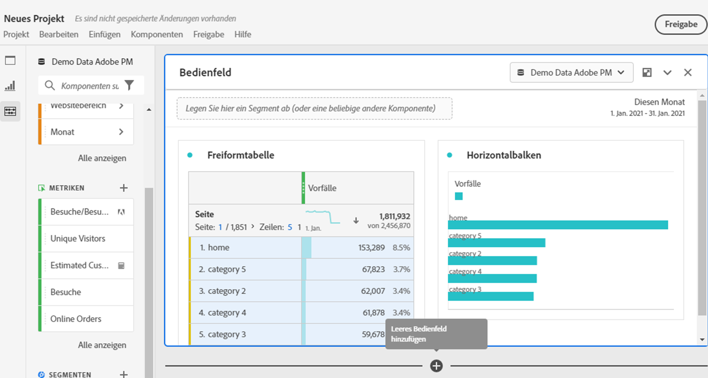

# Übersicht über Projekte

Mit Workspace-Projekten können Sie Datenkomponenten, Tabellen und Visualisierungen kombinieren, um Ihre Analyse zu erstellen und sie anderen Mitarbeitern Ihres Unternehmens freizugeben. Bevor Sie Ihr erstes Projekt starten, erfahren Sie, wie Sie auf Ihre Projekte zugreifen, durch sie navigieren und sie verwalten können.

Im Folgenden finden Sie ein Video zum Erstellen eines Workspace-Projekts:

>[!VIDEO](https://video.tv.adobe.com/v/334076/?quality=12)

## Projektliste {#project-list}

Wenn Sie **[!UICONTROL Analytics]** > **[!UICONTROL Workspace]** erstmalig aufrufen, werden auf der Seite alle Projekte aufgeführt, deren Inhaber Sie sind oder zu denen Ihnen Zugriff gewährt wurde. Diese Seite ist auch die Landingpage für Adobe Analytics, es sei denn, Sie haben zuvor eine benutzerdefinierte Landingpage festgelegt.

Die Seite &quot;Projekte&quot;enthält die folgenden Informationen:

| Element | Beschreibung |
|---|---|
| [Voreinstellungen bearbeiten](/help/analyze/analysis-workspace/user-preferences.md) | Verwalten Sie Einstellungen für Analysis Workspace und die zugehörigen Komponenten für alle neuen Projekte oder Bereiche, die Sie erstellen. |
| [Ordner erstellen](/help/analyze/analysis-workspace/build-workspace-project/workspace-folders/create-folders.md) | Fügen Sie der Liste der Projekte und Ordner einen neuen Ordner oder Unterordner hinzu. |
| [Projekt erstellen](/help/analyze/analysis-workspace/build-workspace-project/create-projects.md) | Starten Sie ein neues Projekt von Grund auf neu oder erstellen Sie einen Bericht. |
| Mehr zeigen | Diese Auswahl zeigt Optionen zum Erstellen eines leeren Projekts oder einer mobilen Scorecard, [Anzeigen von Tutorials](https://experienceleague.adobe.com/en/docs/analytics-learn/tutorials/analysis-workspace/analysis-workspace-basics/analysis-workspace-introduction)oder [Versionshinweise anzeigen](/help/release-notes/latest.md). |
|  | Ein- oder Ausblenden von Filtern Sie können nach Tags, Report Suite, Inhabern, Typ (Projekt, Ordner, mobile Scorecard) und anderen Filtern filtern. |
|  | Verwenden Sie das Suchfeld, um nach Ordnern, Workspace-Projekten oder mobilen Scorecards zu suchen. |
| Anzeigen von Ordnern und Projekten | Wählen Sie aus, ob die Ordnerstruktur der Projekte angezeigt werden soll. Weitere Informationen finden Sie unter [Über Ordner in Analytics](/help/analyze/analysis-workspace/build-workspace-project/workspace-folders/about-folders.md). |
|  | Mit diesem Symbol können Sie die Spalten anpassen, die für jedes Projekt in der Projektliste angezeigt werden. |

In der Projektliste können die folgenden Spalten angezeigt werden:

| Spalte | Beschreibung |
|---|---|
| [!UICONTROL Name] | Name des Workspace-Projekts. Auswählen  um ein Popup mit weiteren Details zu einem Projekt oder Ordner anzuzeigen. Auswählen  , um verfügbare Aktionen anzuzeigen. Siehe [Projekte verwalten](#manage-projects) für weitere Details. |
| [!UICONTROL Typ] | Gibt an, ob es sich bei diesem Eintrag um ein Workspace-Projekt, einen Ordner oder ein [Mobile Scorecard](https://experienceleague.adobe.com/en/docs/analytics/analyze/mobapp/home). |
| [!UICONTROL Tags] | Tags, die auf das Projekt angewendet wurden. |
| [!UICONTROL Geplant] | Gibt an, ob die E-Mail-Versendung von Projekten an Empfänger geplant ist. Siehe [Planen von Projekten](/help/analyze/analysis-workspace/curate-share/t-schedule-report.md). |
| Freigegebener Link (alle) | Projekte können für jeden freigegeben werden, auch für Personen, die keinen Zugriff auf Analysis Workspace haben. Diese Spalte zeigt, ob Projekte auf diese Weise freigegeben wurden. Siehe [Projekt für andere freigeben (keine Anmeldung erforderlich)](/help/analyze/analysis-workspace/curate-share/share-projects.md#share-public-link) in [Freigeben von Projekten](/help/analyze/analysis-workspace/curate-share/share-projects.md) für weitere Informationen. |
| [Projektrolle](https://experienceleague.adobe.com/en/docs/analytics/analyze/analysis-workspace/curate-share/share-projects) | Zeigt Ihre Rolle für das Projekt an – Inhaber, bearbeiten, duplizieren, anzeigen. |
| [!UICONTROL Report Suite] | Die Report Suite, mit der das Projekt verknüpft ist. |
| [!UICONTROL Inhabende] | Die Person, die dieses Projekt erstellt hat (entweder Sie oder eine Person, die das Projekt für Sie freigegeben hat). |
| [!UICONTROL Freigegeben für] | Benutzer, für die das Projekt freigegeben wurde. |
| [!UICONTROL Zuletzt geändert] | Datum und Zeitpunkt der letzten Änderung des Projekts. |
| [!UICONTROL Zuletzt geöffnet] | Datum und Uhrzeit des letzten Öffnens des Projekts. |
| [!UICONTROL Zuletzt verwendet] | Datum und Uhrzeit der letzten Verwendung des Projekts. |
| [!UICONTROL Projekt-ID] | Die ID des Projekts. |
| [!UICONTROL Längster Datumsbereich] | Der längste Datumsbereich des Projekts. |
| [!UICONTROL Anzahl der Abfragen] | Die Gesamtzahl der im Projekt enthaltenen Abfragen. |
| [!UICONTROL Ort] | Der Ordner, in dem sich das Projekt befindet. |

### Projekte verwalten

Um Projekte zu verwalten, wählen Sie ein oder mehrere Projekte aus der Projektliste aus.

In der blauen Aktionsleiste können Sie die folgenden Aktionen auswählen:

| Aktion | Beschreibung |
|---|---|
|  Löschen | Wenn diese Option aktiviert ist, werden Sie in einem Bestätigungsdialogfeld aufgefordert, das Löschen eines Workspace-Projekts oder einer mobilen Scorecard zu bestätigen. Auswählen **[!UICONTROL OK]** zur Bestätigung. |
|  Freigeben | Mit dieser Aktion können Sie Ihr Projekt freigeben. Siehe [Freigeben von Projekten](../curate-share/share-projects.md). |
|  Umbenennen | Öffnet eine **[!UICONTROL Umbenennen: *name *]**Dialogfeld zum Umbenennen Ihres Projekts. Auswählen**[!UICONTROL Speichern ]**, um den neuen Namen für das Projekt zu speichern. |
|  Kopieren | Kopiert das ausgewählte Projekt sofort in ein neues Projekt mit dem Namen *Originalname* (Kopie). |
|  Pin | Pendet das Projekt sofort an den Anfang der Liste an. Fügt die  Indikator. |
|  Tag | Öffnet die **[!UICONTROL Tag-Projekt]** angezeigt. Sie können ein vorhandenes Tag auswählen oder neue Tags hinzufügen. Auswählen **[!UICONTROL Speichern]** , um die Tags für das Projekt zu speichern. |
|  Genehmigen oder Nicht genehmigen | Genehmigt das Projekt oder lehnt es ab. |
|  CSV exportieren | Lädt sofort eine Datei mit einer kommagetrennten Werteliste der Projekte herunter. |
|  Verschieben nach | Mit dieser Aktion können Sie das Projekt in einen Ordner verschieben. Im **[!UICONTROL Ordner auswählen]** wählen Sie einen Ordner aus dem **[!UICONTROL Ordner]** und wählen Sie **[!UICONTROL Verschieben]**. |

## Menüleiste {#menu-bar}

Innerhalb eines Projekts bietet das Menü Optionen zum Verwalten Ihres Projekts, zum Hinzufügen von Komponenten, zur Suche von Hilfe und mehr. Sie können auch auf jede Menüoption über die Tastatur zugreifen [Kurzbefehle](https://experienceleague.adobe.com/en/docs/analytics/analyze/analysis-workspace/build-workspace-project/fa-shortcut-keys).

| Menüelement | Beschreibung |
|---|---|
| Projekt   | Dieses Menü enthält allgemeine Aktionen für das Projektmanagement, einschließlich Neu, Öffnen, Speichern, Speichern unter und [Als Unternehmensbericht speichern](/help/analyze/analysis-workspace/build-workspace-project/starter-projects.md). Sie können auch das gesamte Projekt aktualisieren, um die neuesten Daten und Definitionen abzurufen, indem Sie auf „Projekt aktualisieren“ klicken. Mithilfe der Optionen [CSV und PDF herunterladen](https://experienceleague.adobe.com/en/docs/analytics/analyze/analysis-workspace/curate-share/download-send) können Sie Daten aus Workspace exportieren. [Projektinformation und Einstellungen](https://experienceleague.adobe.com/en/docs/analytics/analyze/analysis-workspace/build-workspace-project/freeform-overview) bieten viele Optionen zum Verwalten Ihres Projekts. |
| Vorlage | Rückgängigmachen oder Wiederholen der letzten Aktion. Clear All setzt das Projekt auf einen leeren Ausgangspunkt zurück. |
| Einfügen | Fügen Sie neue Bedienfelder oder Visualisierungen aus diesem Menü ein. Sie können auch neue Bedienfelder und Visualisierungen aus der linken Leiste einfügen. |
| [Komponenten](https://experienceleague.adobe.com/en/docs/analytics/analyze/analysis-workspace/components/analysis-workspace-components) | Erstellen Sie neue Segmente, berechnete Metriken, Datumsbereiche oder Warnhinweiskomponenten aus Ihrem Projekt. Sie können auch über die linke Leiste neue Komponenten erstellen. Wenn sich Ihre Komponentendefinitionen kürzlich geändert haben, ruft &quot;Komponenten aktualisieren&quot;die neuesten Definitionen ab. |
| [Freigeben](https://experienceleague.adobe.com/en/docs/analytics/analyze/analysis-workspace/curate-share/send-schedule-files) | Sie können PDF-/CSV-Projekte für Empfänger in Ihrem Unternehmen kuratieren, freigeben und planen. |
| Hilfe | Rufen Sie die Hilfedokumentation, Videos und die Analytics [Experience League Community](https://experienceleaguecommunities.adobe.com/t5/adobe-analytics/ct-p/adobe-analytics-community?lang=de) auf. Verwalten Sie die Sichtbarkeit der Workspace-Tipps sowie von [Debugger](https://developer.adobe.com/analytics-apis/docs/2.0/). Finden Sie Details über Workspace und Faktoren, die sich auf die [Projektleistung](https://experienceleague.adobe.com/en/docs/analytics/analyze/analysis-workspace/workspace-faq/optimizing-performance) auswirken. |
| Schaltfläche „Freigeben“ oder Inhaber | Wenn Sie im Projekt die Rolle „Inhaber“ oder „Bearbeiten“ innehaben, erhalten Sie über der Button „Freigeben“ oben rechts Zugriff auf die Verwaltung Ihrer Projektempfänger. Wenn Sie die Rolle &quot;Duplizieren&quot;oder &quot;Anzeigen&quot;für das Projekt haben, wird der Name des Projektinhabers angezeigt. |

### Projektinfo und Einstellungen {#info-settings}

**[!UICONTROL Workspace]** > **[!UICONTROL Projekt]** > **[!UICONTROL Projektinfo und Einstellungen]** liefert Informationen auf Projektebene zum derzeit aktiven Projekt.

Zu den Einstellungen gehören:

| Einstellung | Beschreibung |
|---|---|
| Projektname | Der Name des Projekts. Sie können auf den Namen doppelklicken, um ihn zu bearbeiten. |
| Verantwortlicher | Name des Projektinhabers. |
| Zuletzt geändert | Das Datum, an dem die letzte Änderung an dem Projekt vorgenommen wurde. |
| Tags | Zeigt eine Liste aller Tags an, die auf ein Projekt angewendet wurden, um die Kategorisierung zu vereinfachen. |
| Beschreibung | Eine Beschreibung hilft, den Zweck eines Projekts anzugeben. Sie können auf die Beschreibung doppelklicken, um sie zu bearbeiten. |
| Wiederholte Instanzen zählen | Diese Einstellung legt fest, ob wiederholte Instanzen in Berichten gezählt werden sollen. Beispielsweise behandelt diese Einstellung (wenn aktiviert) mehrere aufeinanderfolgende Seitenaufrufe zu derselben Seite wie mehrere Seitenaufrufe Wenn diese Einstellung deaktiviert ist, zählen sie als Einzelseitenansicht (diese Einstellung betrifft nur bestimmte Metriken, wie Einzelseitenbesuche). **Hinweis**: Diese Einstellung gilt nicht für Flow- oder Fallout-Visualisierungen. |
| [Anmerkungen anzeigen](/help/analyze/analysis-workspace/components/annotations/overview.md) | Geben Sie an, ob Anmerkungen im Projekt angezeigt werden sollen. |
| [Projekt-Farbpalette](https://experienceleague.adobe.com/en/docs/analytics/analyze/analysis-workspace/build-workspace-project/color-palettes) | Sie können die in Workspace verwendete Farbpalette für Kategorien ändern, indem Sie aus den vordefinierten Paletten wählen, die für die Farbenblindheit optimiert wurden, oder indem Sie eine benutzerdefinierte Palette angeben. Diese Funktion betrifft vieles in Workspace, einschließlich der meisten Visualisierungen. |
| [Dichte anzeigen](https://experienceleague.adobe.com/en/docs/analytics/analyze/analysis-workspace/build-workspace-project/view-density) | So können Sie mehr Daten auf dem Bildschirm anzeigen, indem Sie den vertikalen Abstand der linken Schiene, Freiformtabellen und Kohortentabellen reduzieren. |

## Linke Leiste {#left-rail}

Innerhalb eines Projekts sind in der linken Leiste verschiedene Symbole verfügbar, die jeweils wichtige Tools zum Erstellen Ihres Projekts darstellen:

| Symbol | Funktionalität |
|---|---|
|  | [Bedienfelder](/help/analyze/analysis-workspace/c-panels/panels.md) |
|  | [Visualisierungen](/help/analyze/analysis-workspace/visualizations/freeform-analysis-visualizations.md) |
|  | [Komponenten](/help/analyze/analysis-workspace/components/analysis-workspace-components.md) |
|  | [Datenwörterbuch](/help/analyze/analysis-workspace/components/data-dictionary/data-dictionary-overview.md) |
|  | [Inhaltsverzeichnis](/help/analyze/analysis-workspace/build-workspace-project/project-table-of-contents.md) |

Komponenten (Dimensionen, Metriken, Segmente, Datumsbereiche) in der linken Leiste beziehen sich auf die Ansicht der aktiven Bedienfelddaten. Ein blauer Rand identifiziert das aktive Bedienfeld und die aktive Report Suite wird oben in der Komponentenleiste aufgeführt.

## Rechtsklickmenü

In diesem Video wird die Verwendung des Rechtsklickmenüs in Analysis Workspace erklärt:

>[!VIDEO](https://video.tv.adobe.com/v/23981/?quality=12)

## Arbeitsfläche des Projekts {#canvas}

Auf der Arbeitsfläche des Projekts können Sie Bedienfelder, Tabellen, Visualisierungen und Komponenten zusammenführen, um Ihre Analyse zu erstellen. Ein Projekt kann viele Bedienfelder enthalten, und jedes Bedienfeld kann aus vielen Tabellen und Visualisierungen bestehen.

Panels sind hilfreich, wenn Sie Ihre Projekte nach Zeiträumen, Report Suites oder Analysen ordnen möchten. Das aktive Bedienfeld hat einen farbigen Rahmen und bestimmt, welche Komponenten in der linken Leiste verfügbar sind.

Je nach dem Ausgangspunkt, den Sie für Ihre Projekte ausgewählt haben, verfügen Sie entweder über eine [Freiformtabelle](https://experienceleague.adobe.com/en/docs/analytics/analyze/analysis-workspace/visualizations/freeform-table/freeform-table) oder [leeres Bedienfeld](https://experienceleague.adobe.com/en/docs/analytics/analyze/analysis-workspace/panels/blank-panel) in der Arbeitsfläche beginnen. Die schnellste Möglichkeit, eine Analyse zu starten, besteht darin, eine oder mehrere Komponenten auszuwählen und sie einfach in die Projektarbeitsfläche zu ziehen. Eine Datentabelle wird automatisch für Sie gerendert. [Weitere Infos](https://experienceleague.adobe.com/en/docs/analytics/analyze/analysis-workspace/visualizations/freeform-table/freeform-table) über die verschiedenen Optionen zum Erstellen einer Tabelle oder zur Nutzung der verfügbaren [Trainings-Tutorial](https://experienceleague.adobe.com/en/docs/analytics/analyze/analysis-workspace/home) für weitere Anleitungen zum Erstellen Ihres ersten Projekts.

