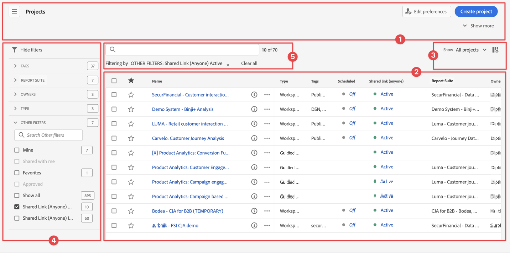

# Überblick über Projekte

Mit Workspace-Projekten können Sie Panels, Visualisierungen und Komponenten kombinieren, um Ihre Analyse zu erstellen und sie für andere Mitarbeitende Ihrer Organisation freizugeben. Bevor Sie mit Ihrem ersten Projekt beginnen, sollten Sie sich damit vertraut machen, wie Sie auf Projekte zugreifen, durch sie navigieren und diese verwalten.

Um auf Projekte in Adobe Analytics zuzugreifen, wählen Sie **[!UICONTROL Workspace]** aus.  Der Manager **[!UICONTROL Projekte]** listet alle Projekte auf, die Ihnen gehören bzw. die für Sie freigegeben wurden. Der Projekt-Manager mit der Projektliste ist auch die standardmäßige Landingpage für Adobe Analytics, sofern Sie in den Voreinstellungen nichts anderes konfiguriert haben.

## Titelbereich

Im Titelbereich ➊ können Sie ein Projekt erstellen, einen Ordner anlegen, Voreinstellungen bearbeiten und ein Panel mit zusätzlichen Kacheln ein- oder ausblenden.

* Um links ein Panel ein- oder auszublenden, in dem Sie zwischen **[!UICONTROL Projekte]** und **[!UICONTROL Lernen]** wählen können, wählen Sie  aus.
* Als Titel wird „Projekte“ angezeigt, optional ergänzt mit dem Pfad zum ausgewählten Ordner, z. B. [!UICONTROL Projekte] > **[!UICONTROL Unternehmensordner]**. Sie können einzelne Unterordnerteile auswählen, um direkt zum jeweiligen Ordner zu gelangen.
* Um Kacheln für ein [**[!UICONTROL Leeres Projekt]**](create-projects.md), [**[!UICONTROL Leere mobile Scorecard]**](/help/analyze/mobile-app/create-scorecard.md), **[!UICONTROL Dokumentation öffnen]** und **[!UICONTROL Versionshinweise öffnen]**, wählen Sie  **[!UICONTROL Mehr anzeigen]**. Um den Bereich mit den Kacheln auszublenden, wählen Sie  **[!UICONTROL Weniger zeigen]** aus.
* Je nachdem, was angezeigt werden soll, können Sie mit der Auswahl [Anzeigen](#show-selector) Voreinstellungen bearbeiten und Aktionen für den aktuellen unter **[!UICONTROL Projekte]** angezeigten Ordner durchführen:

  | Aktion | Beschreibung |
  |---|---|
  | **[!UICONTROL Erstellen eines Projekts]** | Wählen Sie diese Aktion aus, um [ein neues Projekt zu erstellen](create-projects.md). |
  | **[!UICONTROL Ordner erstellen]** | Wählen Sie diese Aktion aus, um [einen neuen Ordner zu erstellen](workspace-folders/create-folders.md). |
  |  **[!UICONTROL Voreinstellungen bearbeiten]** | Wählen Sie diese Aktion aus, um [Voreinstellungen für alle Ihre Projekte zu bearbeiten](/help/analyze/analysis-workspace/user-preferences.md). Wenn der Breadcrumb zu Platzproblemen führt, ist diese Aktion Teil des Untermenüs . |
  | **[!UICONTROL Projekte hinzufügen]** | Wählen Sie diese Aktion aus, um dem aktuellen Ordner [Projekte hinzuzufügen](workspace-folders/add-projects.md). Wenn der Breadcrumb zu Platzproblemen führt, ist diese Aktion Teil des Untermenüs . |
  | **[!UICONTROL Ordner umbenennen]** | Wählen Sie diese Aktion aus, um den aktuellen Ordner [umzubenennen](workspace-folders/manage-folders.md#rename-folders). |
  | **[!UICONTROL Ordner verschieben]** | Wählen Sie diese Aktion aus, um den aktuellen Ordner zu [verschieben](workspace-folders/manage-folders.md#move-folders). |
  | **[!UICONTROL Ordner löschen]** | Wählen Sie diese Aktion aus, um den aktuellen Ordner zu [löschen](workspace-folders/manage-folders.md#delete-folders). |

## Projektliste

Die Projektliste ➋ zeigt alle Projekte, die Ihnen gehören bzw. die für Sie freigegeben wurden. Die Liste umfasst die folgenden Spalten:

| Spalte | Beschreibung |
| --- | --- |
|  | Wenn ein oder mehrere Projekte ausgewählt sind, wird unten in der Benutzeroberfläche „Projekt“ eine blaue Aktionsleiste angezeigt. Weitere Informationen finden Sie unter [Aktionen](#actions). |
|  | Wählen Sie diese Option aus, um einen Filter als Favoriten zu markieren  oder aus den Favoriten zu entfernen . |
| **[!UICONTROL Titel und Beschreibung]** | Wählen Sie zum Bearbeiten des Projekts den Titel-Link aus. Dadurch wird das [Workspace-Projekt](/help/analyze/analysis-workspace/home.md) geöffnet. Für Sie freigegebene Projekte sind mit  gekennzeichnet. Wählen Sie  aus, um ein Popup-Menü mit weiteren Details zum Projekt anzuzeigen. Wählen Sie , um ein Kontextmenü mit Aktionen zu öffnen. Weitere Informationen finden Sie unter [Aktionen](#actions). |
| **[!UICONTROL Typ]** | Ein Workspace-Projekt, ein Ordner  oder eine [Mobile Scorecard](/help/analyze/mobile-app/home.md). |
| **[!UICONTROL Tags]** | Die auf das Projekt angewendeten Tags. |
| **[!UICONTROL Geplant]** | Ob ein Projekt für den E-Mail-Versand an Empfangende geplant ist. Die Optionen lauten  **[!UICONTROL Ein]** oder  **[!UICONTROL Aus]**. Siehe [Senden von Projektdaten an andere](/help/analyze/analysis-workspace/curate-share/t-schedule-report.md). |
| **[!UICONTROL Freigegebener Link (alle)]** | Ob ein Projekt für alle freigegeben wird, auch für Personen ohne Zugriff auf Analysis Workspace. Die Optionen lauten  **[!UICONTROL Aktiv]** oder  **[!UICONTROL Inaktiv]**. Weitere Informationen finden Sie unter [Freigeben eines Projekts für alle (keine Anmeldung erforderlich)](/help/analyze/analysis-workspace/curate-share/share-projects.md#share-a-project-with-anyone-no-login-required) in [Freigeben von Projekten](/help/analyze/analysis-workspace/curate-share/share-projects.md). |
| **[!UICONTROL Projektrolle]** | Ihre Rolle für das Projekt. Die Optionen lauten: Bearbeiten, Duplizieren, Anzeigen. Weitere Informationen finden Sie unter [Projektrollen](/help/analyze/analysis-workspace/curate-share/curate.md). |
| **[!UICONTROL Report Suite]** | Die Report Suite, mit der das Projekt verknüpft ist. |
| **[!UICONTROL Inhabende]** | Die Person, die dieses Projekt erstellt hat (entweder Sie oder eine Person, die das Projekt für Sie freigegeben hat). |
| **[!UICONTROL Freigegeben für]** | Benutzende, für die das Projekt freigegeben wurde. |
| **[!UICONTROL Zuletzt geändert]** | Datum und Zeitpunkt der letzten Änderung des Projekts. |
| **[!UICONTROL Zuletzt geöffnet]** | Datum und Zeitpunkt der letzten Öffnung des Projekts. |
| **[!UICONTROL Komponenten-ID]** | Die ID der Komponente. |
| **[!UICONTROL Längster Datumsbereich]** | Der längste Datumsbereich von allen Panels oder Visualisierungen im Projekt. |
| **[!UICONTROL Anzahl der Abfragen]** | Die Gesamtzahl der im Projekt enthaltenen Abfragen.  |
| **[!UICONTROL Ort]** | Der Ordner, in dem sich das Projekt befindet. |

Bewegen Sie den Mauszeiger über eine beliebige Spaltenüberschrift, um  anzuzeigen, und wählen Sie Folgendes aus dem Kontextmenü aus:

* **[!UICONTROL Aufsteigend sortieren]**
* **[!UICONTROL Absteigend sortieren]**
* **[!UICONTROL Spaltengröße ändern]**. Es wird eine blaue Linie angezeigt, mit der Sie die Größe der Spalte ändern können.

### Aktionen

Sie können Aktionen für ein oder mehrere Projekte mithilfe des Kontextmenüs  der blauen Aktionsleiste durchführen.

| Symbol | Aktion | Beschreibung |
|:---:| ---|---|
|  | **[!UICONTROL *x *ausgewählt]** | Heben Sie die Auswahl der ausgewählten Projekte und Ordner auf und entfernen Sie die blaue Aktionsleiste. |
|  | **[!UICONTROL Löschen]** | Löschen Sie ein oder mehrere Projekte oder Ordner. Sie werden zur Bestätigung aufgefordert. 
Für gelöschte Projekte gilt Folgendes:
<ul><li>Keine Wiederherstellung möglich</li><li>Entfernung aus der Projektliste</li><li>Kein weiterer Zugriff über ihre URL</li><li>Entfernung aus geplanten Bereitstellungen (sofern sie zuvor für geplante Bereitstellungen konfiguriert wurden) Informationen zu geplanten Bereitstellungen finden Sie unter [Geplante Projekte](/help/components/scheduled-projects-manager.md).  
 |
|  | **[!UICONTROL Freigeben]** | Geben Sie ein Projekt frei. Weitere Informationen finden Sie unter [Freigeben eines Projekts](/help/analyze/analysis-workspace/curate-share/share-projects.md). |
|  | **[!UICONTROL Umbenennen]** | Benennen Sie ein Projekt um. Öffnet ein **[!UICONTROL Dialogfeld „Umbenennen *Projektname *]**“. Geben Sie einen neuen Namen ein und wählen Sie&#x200B;**[!UICONTROL Speichern &#x200B;]**&#x200B;aus. |
|  | **[!UICONTROL Kopieren]** | Kopieren Sie ein oder mehrere Projekte. Das Projekt erhält denselben Namen und dasselbe Suffix `(Copy)`. |
|  | **[!UICONTROL Anheften]** oder **[!UICONTROL Loslösen]** | Heften Sie ein oder mehrere Projekte oder einen oder mehrere Ordner an oder lösen Sie sie los. Angeheftete Projekte und Ordner werden oben in der Liste angezeigt und ignorieren die von Ihnen angegebene Sortierreihenfolge. |
|  | **[!UICONTROL Nach oben]** | Verschieben Sie ein angeheftetes Projekt oder einen angehefteten Ordner in der Projektliste nach oben. |
|  | **[!UICONTROL Nach unten]** | Verschieben Sie ein angeheftetes Projekt oder einen angehefteten Ordner in der Projektliste nach unten. |
|  | **[!UICONTROL Tag]** | Versehen Sie ein oder mehrere Projekte oder einen oder mehrere Ordner mit einem Tag. Das Dialogfeld **[!UICONTROL Komponenten Taggen]** wird angezeigt, in dem Sein ein oder mehrere Tags auswählen können. Wählen Sie **[!UICONTROL Speichern]** aus, um die Tags für die ausgewählten Projekte oder Ordner zu speichern. |
|  | **[!UICONTROL Genehmigen]** oder **[!UICONTROL Genehmigung aufheben]** | Genehmigen Sie ein Projekt oder heben Sie die Genehmigung für ein Projekt auf. Nur Admins können Projekte genehmigen. |
|  | **[!UICONTROL CSV exportieren]** | Exportieren Sie die ausgewählten Projekte in eine CSV-Datei mit dem Namen `Project List.csv`. |
|  | **[!UICONTROL Projekte hinzufügen]** | Fügen Sie ein oder mehrere Projekte zu einem ausgewählten Ordner hinzu. In **[!UICONTROL Projekte hinzufügen]** können Sie ein oder mehrere Projekte auswählen. Wählen Sie **[!UICONTROL Hinzufügen]** aus, um die Projekte zu dem Ordner hinzuzufügen. Weitere Informationen finden Sie unter [Hinzufügen von Projekten zu Ordnern](workspace-folders/add-projects.md#from-inside-a-folder). |
|  | **[!UICONTROL Verschieben nach]** | Verschieben Sie ein oder mehrere ausgewählte Projekte in einen Ordner. Wählen Sie in **[!UICONTROL Ordner auswählen]** den Ordner aus, in den das ausgewählte Projekt verschoben werden soll, und wählen Sie dann **[!UICONTROL Verschieben]** aus. Weitere Informationen finden Sie unter [Hinzufügen von Projekten zu Ordnern](workspace-folders/add-projects.md#from-the-project-list). |

## Auswahl „Anzeigen“

Sie können das Look-and-Feel der Benutzeroberfläche „Projekte“ mithilfe der Auswahl **[!UICONTROL Anzeigen]** ➌ ändern. Die Auswahl **[!UICONTROL Anzeigen]** definiert, welche Optionen im [Titelbereich](#title-area) verfügbar sind und welche Spalten in der [Projektliste](#project-list) angezeigt werden.

* Um die für den [Titelbereich](#title-area) verfügbaren Optionen zu ändern, wählen Sie unter **[!UICONTROL Anzeigen]** die Option **[!UICONTROL Alle Projekte]** bzw. unter **[!UICONTROL Anzeigen]** die Option **[!UICONTROL Ordner und Projekte]** aus.

* Um zu definieren, welche Spalten in der [Projektliste](#project-list) angezeigt werden sollen, wählen Sie  aus. Dadurch wird das Dialogfeld **[!UICONTROL Tabelle anpassen]** angezeigt, in dem Sie die gewünschten Spalten aus- oder abwählen können. Wählen Sie **[!UICONTROL Übernehmen]** aus, um die Anpassung anzuwenden. Weitere Informationen finden Sie unter [Projektliste](#project-list).

## Panel „Filter“

Sie können die Projekte und Ordner in der [Projektliste](#project-list) mithilfe des Panels „Filter“ ➍ filtern. Verwenden Sie , um das Panel „Filter“ ein- oder auszublenden.

Das Panel „Filter“ besteht aus den folgenden Abschnitten.

### Tags

| Tags | Beschreibung |
|---|---|
| {width="300"} | Im Abschnitt **[!UICONTROL Tags]** können Sie nach Tags filtern. <ul><li>Mit  *Tags suchen* können Sie nach Tags suchen, die Sie zum Filtern verwenden möchten.</li><li>Sie können auch mehr als ein Tag auswählen. Die verfügbaren Tags hängen von der Auswahl ab, die in anderen Abschnitten im Panel „Filter“ vorgenommen wurde.</li><li>Die Zahlen geben Folgendes an:<ul><li>**2︎⃣**: Die Anzahl der Tags, die für die aus dem aktuellen Filter resultierenden Projekte verfügbar sind.</li><li>7︎⃣: Die Anzahl der Projekte, die mit dem jeweiligen Tag verknüpft sind.</li></ul></li></ul> |

### Report Suites

| Report Suites | Beschreibung |
|---|---|
| {width="300"} | Im **[!UICONTROL Report]**&quot; können Sie nach Report Suites filtern. <ul><li>Sie verwenden  *Report Suites durchsuchen* um nach Report Suites zu suchen, die Sie zum Filtern verwenden möchten.</li><li>Sie können mehrere Report Suites auswählen. Die verfügbaren Report Suites hängen von der Auswahl ab, die in anderen Abschnitten im Filterbedienfeld vorgenommen wurde.</li><li>Die Zahlen geben Folgendes an:<ul><li>**3︎⃣**: Die Anzahl der Report Suites, die für die aus dem aktuellen Filter resultierenden Projekte verfügbar sind.</li><li>4︎⃣: Die Anzahl der Projekte, die der jeweiligen Report Suite zugeordnet sind.</li></ul></li></ul> |

### Inhaberinnen oder Inhaber

| Inhaberin oder Inhaber | Beschreibung |
|---|---|
| {width="300"} | Im Abschnitt **[!UICONTROL Inhaberin oder Inhaber]** können Sie nach Inhaberinnen und Inhabern filtern. <ul><li>Sie verwenden  *Verantwortliche(n) suchen*, um nach Inhaberinnen und Inhabern zu suchen, die Sie zum Filtern verwenden möchten.</li><li>Sie können mehr als eine Inhaberin bzw. einen Inhaber auswählen. Die verfügbaren Inhaberinnen und Inhaber hängen von der Auswahl ab, die in anderen Abschnitten im Panel „Filter“ vorgenommen wurde.</li><li>Die Zahlen geben Folgendes an:<ul><li>**3︎⃣**: Die Anzahl der Inhaberinnen und Inhaber, die für die aus dem aktuellen Filter resultierenden Projekte verfügbar sind.</li><li>4︎⃣: Die Anzahl der Projekte, die mit der jeweiligen Inhaberin bzw. dem jeweiligen Inhaber verknüpft sind.</li></ul></li></ul> |

### Typ

| Typ | Beschreibung |
|---|---|
| {width="300"} | Im Abschnitt **[!UICONTROL Typ]** können Sie nach Projekt- oder Ordnertyp filtern.<ul><li>Sie können eine oder mehrere der folgenden Optionen auswählen:<ul><li> **[!UICONTROL Ordner]**</li><li>**[!UICONTROL Analysis Workspace-Projekt]**</li><li>**[!UICONTROL Mobile Scorecard]**</li></ul> <li>Sie können mehr als einen Filter auswählen. Die anderen verfügbaren Filter hängen von der Auswahl ab, die in anderen Abschnitten im Panel „Filter“ vorgenommen wurde.</li><li>Die Zahlen geben Folgendes an:<ul><li>**5︎⃣**: Die Anzahl weiterer Filter, die für die aus dem aktuellen Filter resultierenden Projekte verfügbar sind.</li><li>4︎⃣: Die Anzahl der Projekte, die mit dem jeweiligen anderen Filter verknüpft sind.</li></ul></li></ul> |

### Andere Filter

| Andere Filter | Beschreibung |
|---|---|
| {width="300"} | Im Abschnitt **[!UICONTROL Andere Filter]** können Sie nach anderen vordefinierten Filtern filtern.<ul><li>Sie können eine oder mehrere der folgenden Optionen auswählen:<ul><li> **[!UICONTROL Alle anzeigen]**</li><li>**[!UICONTROL Mit mir geteilt]**</li><li>**[!UICONTROL Meine]**</li><li>**[!UICONTROL Genehmigt]**</li><li>**[!UICONTROL Favoriten]**</li></ul> Was Sie auswählen können, hängt von Ihrer Rolle und Ihren Berechtigungen ab.</li><li>Sie können mehr als einen Filter auswählen. Die anderen verfügbaren Filter hängen von der Auswahl ab, die in anderen Abschnitten im Panel „Filter“ vorgenommen wurde.</li><li>Die Zahlen geben Folgendes an:<ul><li>**5︎⃣**: Die Anzahl weiterer Filter, die für die aus dem aktuellen Filter resultierenden Projekte verfügbar sind.</li><li>4︎⃣: Die Anzahl der Projekte, die mit dem jeweiligen anderen Filter verknüpft sind.</li></ul></li></ul> |

## Suche

Sie verwenden den Suchbereich ➎, um mithilfe des Felds  nach Projekten und Ordnern zu suchen. Sobald Sie mit der Eingabe beginnen, filtert die [Projektliste](#project-list) automatisch auf Ihre Sucheingabe.

Im Suchbereich werden auch die im Panel „Filter“ angewendeten Filter angezeigt.

* Wählen Sie zum Verschieben eines Filters die Option  im Filter aus.
* Wählen Sie zum Entfernen aller Filter die Option „Alle löschen“ aus.

Wenn der Platz für die Anzeige der einzelnen Filter begrenzt ist, sehen Sie **[!UICONTROL Segmentieren nach *x* Filter]**.

* So entfernen Sie einen Filter:

   1. Verwenden Sie **[!UICONTROL *x *Filter]**, um ein Kontextmenü mit einer Liste der Filtertypen und der einzelnen Filter zu öffnen.
   1. Wählen Sie  aus, um einen Filter zu entfernen.

