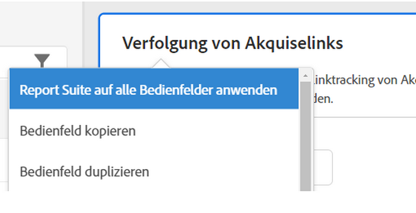
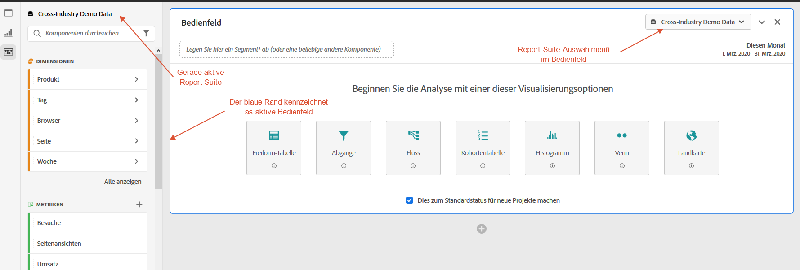
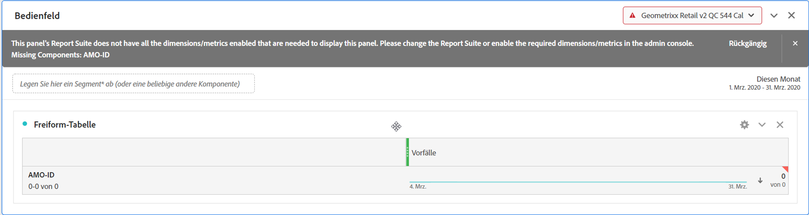

# Mehrere Report Suites

Sie können in Analysis Workspace Projekte mit Daten aus mehr als einer Report Suite erstellen. Report Suites werden auf Bedienfeldebene ausgewählt, sodass Sie für jedes Bedienfeld innerhalb desselben Workspace-Projekts eine andere Report Suite auswählen können.

Diese Funktion ist nützlich, wenn Sie Folgendes tun möchten:

* Daten aus zwei verschiedenen Regionen vergleichen und sich die Daten in zwei verschiedenen Report Suites befinden. Sie können Tabellen und Visualisierungen erstellen, um die Daten nebeneinander zu vergleichen.

* ein Dashboard mit Metriken und Visualisierungen erstellen, um Berichte an andere Organisationen zu senden. Sie können Daten aus verschiedenen Report Suites in im selben Projekt abrufen.

>[!BEGINSHADEBOX]

Siehe  [Mehrere Report Suites](https://video.tv.adobe.com/v/36754?quality=12&learn=on&captions=ger){target="_blank"} für ein Demovideo.

>[!ENDSHADEBOX]

## Anwenden einer Report Suite auf alle Panels

Sie können eine Report Suite auf alle Bedienfelder gleichzeitig anwenden, indem Sie mit der rechten Maustaste auf eine beliebige Bedienfeldüberschrift klicken und **[!UICONTROL Report Suite auf alle Bedienfelder anwenden]** auswählen.

## Aktives Bedienfeld

Sie erkennen das aktive Bedienfeld am hellblauen Rand. Wählen Sie einfach in einem Bedienfeld aus, um dieses Bedienfeld in das aktive Bedienfeld zu verwandeln.

>[!TIP]
>
>Sie können Objekte per Drag-and-Drop in ein beliebiges Bedienfeld ziehen, das sich in derselben Report Suite wie das aktive Bedienfeld befindet. Durch Ziehen eines Objekts in ein inaktives Bedienfled derselben Report Suite wird das Bedienfeld aktiv.
>

## Arbeiten mit mehreren Report Suites

1. Erstellen Sie ein neues Projekt mit zwei oder mehr Bedienfeldern im Workspace.

1. Verschieben Sie Komponenten (Metriken, Dimensionen, Segmente, Datumsbereiche) per Drag &amp; Drop in den Bereich. Stellen Sie sicher, dass Bedienfelder über Daten und Visualisierungen verfügen, die für ihre Report Suite spezifisch sind.

   >[!NOTE]
   >
   >Manchmal wird beim Laden eines Projekts (oder beim Umschalten auf eine Report Suite) ein Banner angezeigt, wenn nicht alle Komponenten des Projekts in der Report Suite enthalten sind. Die fehlenden Komponenten werden aufgelistet. Befolgen Sie [diese Anweisungen](/help/admin/admin-console/permissions/product-profile.md), um Berechtigungen für die erforderlichen Metriken/Dimensionen festzulegen.
   >

   

   Sie haben 3 Optionen, um mit dieser Inkompatibilität umzugehen:
   * Erforderliche Dimensionen/Metriken aktivieren.
   * Ändern Sie die Report Suite.
   * Fahren Sie mit einigen fehlenden Komponenten fort. Dies führt dazu, dass für diese Komponenten keine Daten verfügbar sind und/oder zu leeren Visualisierungen.

1. Wechseln Sie die Report Suite für das Bedienfeld und beobachten Sie, wie die Bezeichnung der Komponente (derzeit aktive Report Suite) und die aufgelisteten Komponenten basierend auf der neuen Report Suite aktualisiert werden.

1. Verwenden Sie eine Tastenkombination (`shift` während Sie ziehen), um einen inaktives Bedienfeld in ein aktives Bedienfeld umzuwandeln.

1. (Optional) Sie können auch andere Komponenten-Builder in Analytics aufrufen und sicherstellen, dass ihnen nun eine Report Suite-Bezeichnung angezeigt wird, die angibt

   * Wo ein Segment erstellt wird: [Segment Builder](https://experienceleague.adobe.com/docs/analytics/components/segmentation/segmentation-workflow/seg-build.html?lang=de).
   * Wo eine berechnete Metrik erstellt wird: [Generator für berechnete ](https://experienceleague.adobe.com/docs/analytics/components/calculated-metrics/calcmetric-workflow/cm-build-metrics.html?lang=de)).
   * Wo ein Warnhinweis erstellt wird: [Warnhinweiserstellung](https://experienceleague.adobe.com/docs/analytics/components/alerts/alert-builder.html?lang=de).
