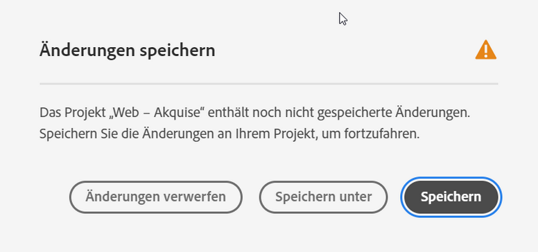
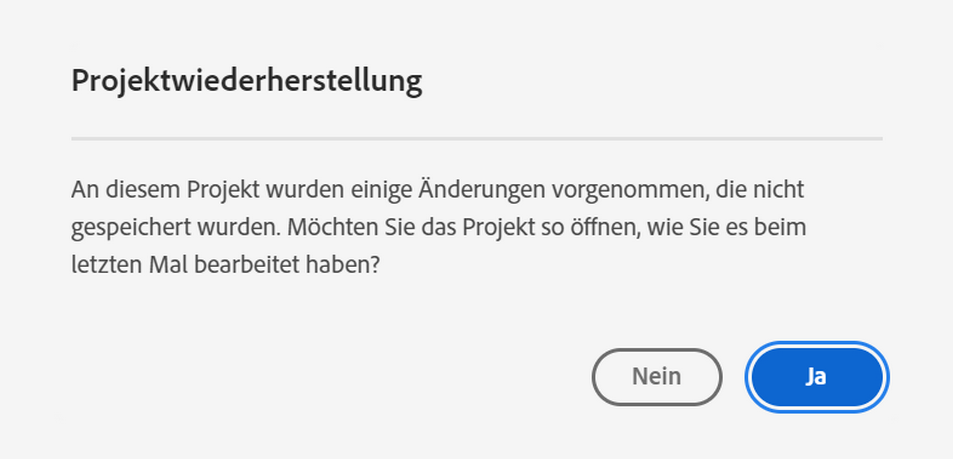
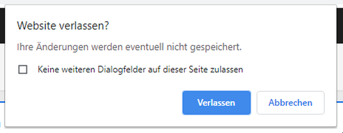
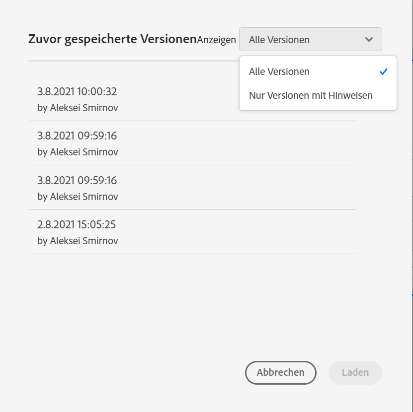

# Speichern von Projekten {#save-projects}

<!-- markdownlint-disable MD034 -->

>[!CONTEXTUALHELP]
>id="workspace_project_addnotes"
>title="Hinzufügen von Hinweisen"
>abstract="Fügen Sie Hinweise zur Projektversion hinzu, die gespeichert wird. Diese Hinweise werden mit der Version gespeichert und sind über das Menü **[!UICONTROL Projekt]** > **[!UICONTROL Vorherige Version öffnen]** zugänglich."

<!-- markdownlint-enable MD034 -->

Projekte in Analysis Workspace werden automatisch alle zwei Minuten gespeichert. Sie können Projekte auch selbst speichern, ein Projekt als Duplikat speichern oder ein Projekt mit Versionshinweisen speichern.

## Speichern

Um ein Projekt manuell zu speichern, wählen Sie, während das Projekt geöffnet ist, **[!UICONTROL Projekt]** und dann eine der folgenden Optionen aus:

* **[!UICONTROL Speichern]**

  Speichern Sie die Änderungen an Ihrem Projekt. Wenn das Projekt freigegeben ist, sehen auch die Empfangenden des Projekts die Änderungen.

  Beim erstmaligen Speichern des Projekts wird das Dialogfeld **[!UICONTROL Speichern]** angezeigt.

  

   1. Geben Sie Folgendes an:

      * **[!UICONTROL Name]** (erforderlich): Name Ihres Projekts.
      * **[!UICONTROL Beschreibung]**: Eine Beschreibung Ihres Projekts.
      * **[!UICONTROL Tags]**: Suchen Sie im Feld [!UICONTROL *Tags suchen*] nach Tags oder fügen Sie neue Tags mit **[!UICONTROL ENTER]** hinzu.
      * **[!UICONTROL Ordner]**: Wählen Sie einen Ordner aus [!UICONTROL *Dropdown-Menü*] Ordner auswählen“ aus. Wenn Sie keinen Ordner angeben, wird das Projekt im aktuellen Ordner gespeichert, aus dem Sie ein neues Projekt erstellt haben.
      * **[!UICONTROL Versionshinweise]**. Fügen Sie Versionshinweise im Textbereich *Hinweise hinzufügen* hinzu.

   1. Wählen Sie **[!UICONTROL Speichern]** aus, um Ihr Projekt zu speichern.

  Beim Speichern des Projekts wird eine Version des Projekts für 90 Tage gespeichert.

  Wenn Sie ein Projekt speichern, das Sie freigegeben haben, werden Sie über das Warnungsdialogfeld **[!UICONTROL Änderungen an freigegebenem Projekt speichern]** zur Bestätigung aufgefordert.

  

   * Wählen Sie **[!UICONTROL Speichern]** aus, um das Projekt zu speichern.
   * Wählen Sie **[!UICONTROL Speichern unter]**, um das Projekt als doppeltes Projektduplikat mit einem neuen Namen zu speichern.

* **[!UICONTROL Mit Hinweisen speichern]**

  

  Wenn Sie Ihr Projekt speichern, fügen Sie Notizen zu den Änderungen im Projekt hinzu. Im Dialogfeld „Versionshinweise speichern“:

   1. Geben Sie Ihre **[!UICONTROL Versionshinweise]** im Textbereich **[!UICONTROL Hinweise hinzufügen]** ein.
   1. Wählen Sie **[!UICONTROL Speichern]** aus.

  Notizen werden mit der Projektversion gespeichert und sind beim [Öffnen einer früheren Version](open-projects.md#open-previous-version) des Projekts verfügbar. Eine mit Hinweisen gespeicherte Version wird automatisch für ein Jahr gespeichert.

* **[!UICONTROL Speichern unter]**

  

  Erstellen Sie ein Duplikat Ihres Projekts mit einem neuen Namen. Das Dialogfeld „Speichern unter“ wird angezeigt.

   1. Geben Sie Folgendes an:

      * **[!UICONTROL Name]** (erforderlich): Name Ihres Projekts.
      * **[!UICONTROL Beschreibung]**: Eine Beschreibung Ihres Projekts.
      * **[!UICONTROL Tags]**: Suchen Sie im Feld [!UICONTROL *Tags suchen*] nach Tags oder fügen Sie neue Tags mit **[!UICONTROL ENTER]** hinzu.
      * **[!UICONTROL Ordner]**: Wählen Sie einen Ordner aus [!UICONTROL *Dropdown-Menü*] Ordner auswählen“ aus. Wenn Sie keinen Ordner angeben, wird das Projekt im aktuellen Ordner gespeichert, aus dem Sie ein neues Projekt erstellt haben.
      * **[!UICONTROL Versionshinweise]**. Fügen Sie Versionshinweise im Textbereich *Hinweise hinzufügen* hinzu.

   1. Wählen Sie **[!UICONTROL Speichern]** aus, um Ihr Projekt zu speichern.

  Sie können das Projekt in einem anderen Ordner speichern. Das ursprüngliche Projekt bleibt davon unberührt.

<!-- Cannot find this option in CJA 
| **[!UICONTROL Save as template]** | Save your project as a [custom template](/help/analyze/analysis-workspace/build-workspace-project/starter-projects.md) that becomes available to your organization under **[!UICONTROL Project > New]** |
-->

## Automatisches Speichern

>[!IMPORTANT]
>
>Obwohl neue Projekte automatisch gespeichert werden, müssen Sie jedes neue Projekt beim **ersten** Mal manuell speichern.
>

Alle Projekte in Analysis Workspace werden automatisch alle 2 Minuten auf Ihrem lokalen Computer gespeichert. Dazu gehören auch neu erstellte Projekte, die noch nicht manuell gespeichert wurden.

### Neue Projekte

Analysis Workspace fordert Sie auf, neue Projekte manuell zu speichern, wenn Sie zu einem anderen Projekt wechseln, die Browser-Registerkarte schließen usw.

Wenn Sie aus irgendeinem Grund unerwartet den Zugriff auf ein neu erstelltes Projekt verlieren, bevor Sie es manuell gespeichert haben, wird eine Wiederherstellungsversion Ihres Projekts auf der Analysis Workspace-Landingpage in einem Ordner namens **[!UICONTROL Wiederhergestellte Projekte (letzte 7 Tage)]** gespeichert. Stellen Sie das betroffene Projekt wieder her und speichern Sie es manuell am gewünschten Ort.

Gehen Sie folgendermaßen vor, um ein Projekt wiederherzustellen:

1. Gehen Sie zum Ordner **[!UICONTROL Wiederhergestellte Projekte (letzte 7 Tage)]** auf der Analysis Workspace-Landingpage.

<!-- 
     
  -->

1. Öffnen Sie das Projekt und speichern Sie es an einem gewünschten Ort.

### Bestehende Projekte

Wenn Sie aus irgendeinem Grund ein Projekt verlassen, das noch nicht automatisch gespeicherte Änderungen enthält, fordert Sie Analysis Workspace entweder auf, Ihre Änderungen zu speichern, oder gibt eine Warnmeldung aus.

Verschiedene gängige Szenarien:

#### Öffnen eines weiteres Projekts

Wenn Sie ein anderes Projekt öffnen, während Sie an einem Projekt arbeiten, das noch nicht automatisch gespeicherte Änderungen enthält, werden Sie von Analysis Workspace aufgefordert, das aktuelle Projekt zu speichern.

Die folgenden Optionen sind verfügbar:

* **[!UICONTROL Speichern]**: Ersetzt die neueste automatisch gespeicherte lokale Kopie Ihres Projekts durch Ihre letzten Änderungen.
* **[!UICONTROL Änderungen verwerfen]**: Verwirft Ihre letzten Änderungen. Das Projekt behält die letzte automatisch gespeicherte lokale Kopie bei.
* **[!UICONTROL Abbrechen]**: Bricht die Aktion ab, um ein anderes Projekt zu öffnen und das vorhandene Projekt geöffnet zu lassen.

<!--  -->

#### Verlassen oder Schließen einer Registerkarte

Wenn Sie eine Seite verlassen oder die Browser-Registerkarte schließen, während Sie ein Projekt mit noch nicht automatisch gespeicherten Änderungen betrachten, warnt Sie der Browser, dass Ihre nicht gespeicherten Änderungen verloren gehen. Sie können entscheiden, ob Sie die Registerkarte verlassen oder abbrechen möchten. Wie der Browser warnt, hängt vom verwendeten Browser ab.

### Browser-Abstürze oder Zeitüberschreitung der Sitzung

Wenn Ihr Browser abstürzt oder Ihre Sitzung durch eine Zeitüberschreitung beendet wird, werden Sie beim nächsten Zugriff auf Analysis Workspace aufgefordert, alle Änderungen am Projekt wiederherzustellen, die noch nicht automatisch gespeichert wurden.

* Wählen Sie **[!UICONTROL Ja]**, um das Projekt auf der Basis der letzten automatisch gespeicherten Kopie wiederherzustellen.

* Wählen Sie **[!UICONTROL Nein]**, um die automatisch gespeicherte Kopie zu löschen und die letzte vom Benutzer bzw. der Benutzerin gespeicherte Version des Projekts zu öffnen.

<!---->

Bei **neuen** Projekten, die noch nie gespeichert wurden, können nicht gespeicherte Änderungen nicht wiederhergestellt werden.

<!-- Shouldn't this belong to another page?  Moved it to a new open projects page

## Open previously saved version

To open a previously saved version of a project:

1. Select **[!UICONTROL Open previous version]** from the **[!UICONTROL Project]** menu.

   

1. Review the list of previous versions available. You can switch between **[!UICONTROL All versions]** and **[!UICONTROL Only versions with notes]**.

   For each version, the list shows a timestamp
   [!UICONTROL Timestamp] and [!UICONTROL Editor] are shown, in addition to [!UICONTROL Notes] if they were added when the [!UICONTROL Editor] saved. Versions without notes are stored for 90 days; versions with notes are stored for 1 year.
1. Select a previous version and click **[!UICONTROL Load]**.
   The previous version then loads with a notification. The previous version does not become the current saved version of your project until you click **[!UICONTROL Save]**. If you navigate away from the loaded version, when you return, you will see the last saved version of the project.

-->

<!--
# Save projects {#save-projects}

>[!CONTEXTUALHELP]
>id="workspace_project_addnotes"
>title="Add notes"
>abstract="Add notes about the project version being saved. These notes will be stored with the version and accessible under the **[!UICONTROL Project]** > **[!UICONTROL Open previous version]** menu."

Projects in Analysis Workspace are automatically saved every 2 minutes. 

You can also manually save projects. Additional options such as adding tags or notes are available when you manually save a project.

## Save projects manually {#Save} 

Various options are available when manually saving a project in Analysis Workspace.

To manually save a project:

1. With your project open in Analysis Workspace, select **[!UICONTROL Project]**, then choose from the following options: 

   | Action | Description |
   |---|---|
   | **[!UICONTROL Save]** | Save changes to your project. If the project is shared, recipients of the project will also see the changes. When you first save your project, you are prompted to give the project a name, (optional) description and add (optional) tags. |
   | **[!UICONTROL Save with notes]** | Before your project saves, add notes about what changed in the project. Notes are stored with the project version and are available to all editors under [!UICONTROL Project] > [!UICONTROL Open previous version]. |
   | **[!UICONTROL Save as]** | Create a duplicate of your project. The original project will not be affected. |
   | **[!UICONTROL Save as template]** | Save your project as a [template](/help/analyze/analysis-workspace/templates/create-templates.md) that becomes available to your organization under **[!UICONTROL Project > New]** |

## Auto-save {#Autosave} 

All projects in Analysis Workspace are automatically saved every 2 minutes to your local machine. This includes newly created projects that are not yet saved manually. 

* **New projects:** Even though new projects are auto-saved, you must save each new project manually the first time. Analysis Workspace prompts you to save new projects manually when switching to another project, closing the browser tab, and so forth. 

  If for any reason you unexpectedly lose access to a newly created project before manually saving it, a recovery version of your project is saved on the Analysis Workspace landing page in a folder called `Recovered Projects (Last 7 Days)`. You must restore the recovered project and manually save it to a desired location. 

  To restore a recovered project:
  
  1. Go to the [!UICONTROL **Recovered Projects**] folder on the Analysis Workspace landing page.

     

  1. Open your project and save it to a desired location. 

* **Existing projects:** If for any reason you leave a project with changes that are not yet auto-saved, Analysis Workspace either prompts you to save your changes or provides a warning message. 

  Following are some common scenarios:

### Open another project 

If you open an additional project while working on a project that contains changes that are not yet auto-saved, Analysis Workspace prompts you to save the current project before leaving.

The following options are available:

* **Save:** Replaces the most recent auto-saved local copy of your project with your latest changes.
* **Save As:** Saves your latest changes as a new project. The original project is saved only with the most recent auto-saved changes.
* **Discard Changes:** Discards your latest changes. The project retains the most recent auto-saved changes.

### Navigate away or close a tab 

If you navigate away from the page or close the browser tab while viewing a project with changes that are not yet auto-saved, the browser warns that your unsaved changes will be lost. You can choose to leave or cancel. 

### Browser crashes or session times out 

If your browser crashes or if your session times out, then the next time you access Analysis Workspace you're prompted to recover any changes to your project that are not yet auto-saved.

Following is the Project Recovery dialog box that displays the first time you access Analysis Workspace after a crash or a timeout.

Select **Yes** to restore the project from the most recent auto-saved copy.

Select **No** to delete the auto-saved copy and open the last user-saved version of the project.

For **new** projects that have never been saved, unsaved changes are not recoverable.

## Open a previous version {#previous-version}

To open a previous version of a project:

1. Go to **[!UICONTROL Project]** > **[!UICONTROL Open previous version]**

   
   
1. Review the list of prior versions available. 
   [!UICONTROL Timestamp] and [!UICONTROL Editor] are shown, in addition to [!UICONTROL Notes] if they were added when the [!UICONTROL Editor] saved. Versions without notes are stored for 90 days; versions with notes are stored for 1 year.
1. Select a previous version and click **[!UICONTROL Load]**.
   The previous version then loads with a notification. The previous version does not become the current saved version of your project until you click **[!UICONTROL Save]**. If you navigate away from the loaded version, when you return, you will see the last saved version of the project. 

-->