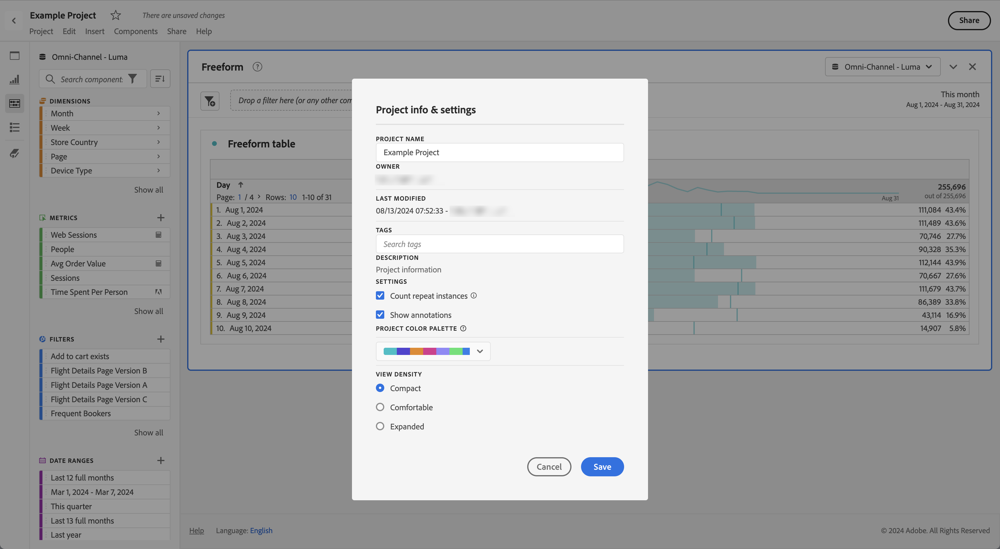

# Dichte anzeigen

Durch die Anpassung der Anzeigedichte können Sie mehr Daten auf dem Bildschirm anzeigen, indem Sie den vertikalen Abstand des linken Panels, der Freiformtabellen und der Kohortentabellen reduzieren. Drei Optionen stehen zur Wahl:

>[!BEGINTABS]

>[!TAB Kompakt]

Die Version mit der am stärksten komprimierten Anzeige.

>[!TAB Komfortabel]

Die aus Workspace bekannte Ansicht.

>[!TAB Erweitert]

Dies ist die Version mit der am meisten erweiterten Ansicht.

>[!ENDTABS]

So stellen Sie die Anzeigedichte ein:

1. Navigieren Sie in Workspace zu **[!UICONTROL Projekte]** > **[!UICONTROL Projektinformationen und -einstellungen]**.

1. Wählen Sie die Option **[!UICONTROL Dichte anzeigen]** und anschließend **[!UICONTROL Speichern]** aus.

<!--
# [!UICONTROL View Density]

Adjusting the [!UICONTROL view density] lets you see more data on the screen by reducing the vertical padding of the left rail, freeform tables and cohort tables. You have 3 options when toggling the view density via radio buttons:

- **[!UICONTROL Compact]**: This is the version with the most condensed view.
- **[!UICONTROL Comfortable]**: This leaves a little more padding than the Compact version.
- **[!UICONTROL Expanded]** (default): This is the view you are used to in Workspace.

To set the view density:

1. In Workspace, navigate to **[!UICONTROL Projects]** > **[!UICONTROL Project Info and Settings]**.

1. Select among the 3 options outlined above and click **[!UICONTROL Save]**.

>[!BEGINSHADEBOX]

See  [View density](https://video.tv.adobe.com/v/25963?quality=12&learn=on){target="_blank"} for a demo video.

>[!ENDSHADEBOX]

-->
