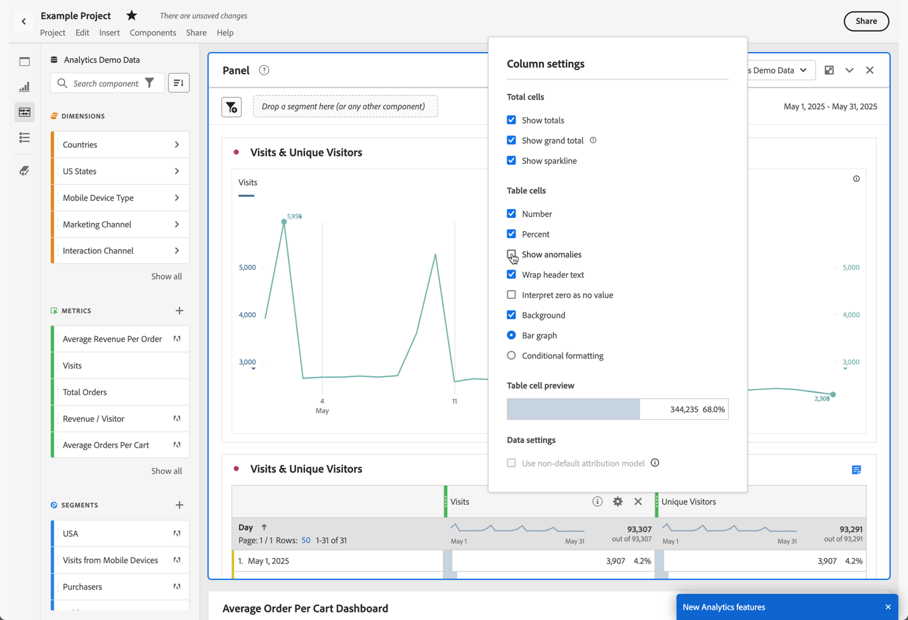

# Anomalieerkennung deaktivieren

Sie können die Anomalieerkennung auf Spaltenebene deaktivieren.

1. Wählen  Spalte „Einstellung“ aus.
   

1. Deaktivieren Sie **[!UICONTROL Anomalien anzeigen]**.

