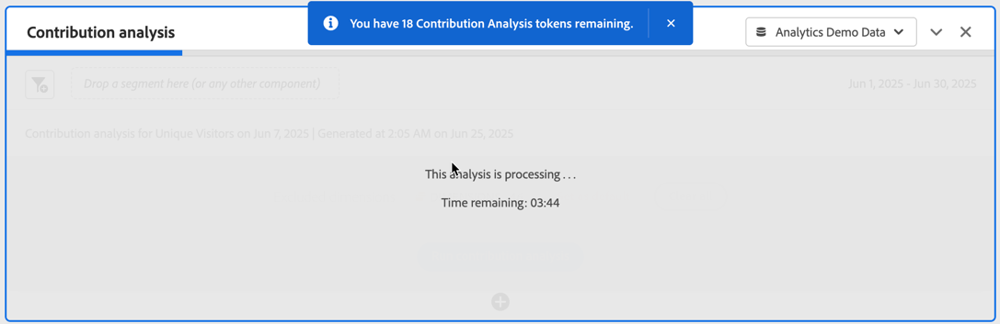

# Ausführen einer Beitragsanalyse

[Die Beitragsanalyse ist ein intensiver maschineller Lernprozess, der helfen soll, Aspekte zu erkennen, die zu einer in Adobe Analytics festgestellten Anomalie mit beigetragen haben. &#x200B;](/help/analyze/analysis-workspace/c-anomaly-detection/anomaly-detection.md#contribution-analysis) Damit soll Benutzenden geholfen werden, lohnenswerte Bereiche oder Gelegenheiten für weitere Analysen viel schneller zu identifizieren.

>[!NOTE]
>
>Die Beitragsanalyse wird nur für Daten mit täglicher Granularität unterstützt.

Die Schritte zum Ausführen der Beitragsanalyse sind:

1. Aufrufen der Beitragsanalyse in einem Projekt

   

   1. Wählen Sie in einer Linienvisualisierung, die auf einer Freiformtabelle mit täglicher Granularität basiert, einen Anomalie-Datenpunkt aus. Wählen Sie im Popup die Option **[!UICONTROL Analysieren]** aus.
   1. Wählen Sie in einer Freiformtabelle mit täglicher Granularität im Kontextmenü in einer beliebigen Zeile die Option **[!UICONTROL Beitragsanalyse ausführen]** aus. Sie können die Analyse auch für Zeilen ausführen, die keine Anomalie anzeigen.
   1. In einer Freiformtabelle mit täglicher Granularität in einer Zeile, die eine Anomalie anzeigt:
      1. Wählen Sie die ◥ aus.
      1. Wählen Sie im Dialogfeld  **[!UICONTROL Anomalie]**) die Option **[!UICONTROL Beitragsanalyse öffnen]**.

1. (Optional) Sie können den Umfang der Analyse einschränken (und somit die Analyse beschleunigen), indem Sie [Dimensionen ausschließen](#exclude-dimensions).

   

1. Wählen **[!UICONTROL Beitragsanalyse ausführen]** aus.

1. Warten Sie, während die Beitragsanalyse verarbeitet wird. Die Verarbeitung kann je nach Größe der Report Suite und der Anzahl der Dimensionen erheblich dauern. Die Beitragsanalyse führt eine Analyse der wichtigsten 50.000 Elemente pro Dimension durch. Sie werden auch über die Anzahl der verbleibenden [Beitragsanalyse-Token](anomaly-detection.md#contribution-analysis-tokens) benachrichtigt.

   

1. Analysis Workspace lädt ein neues **[!UICONTROL Beitragsanalyse]**-Bedienfeld direkt in diesem Projekt.

   

   * Visualisierung [Zusammenfassungszahl](/help/analyze/analysis-workspace/visualizations/summary-number-change.md).
   * Eine monatliche Trend[Linien](/help/analyze/analysis-workspace/visualizations/line.md)Visualisierung.
   * Eine **[!UICONTROL Top-Elemente]**&#x200B;[Freiformtabelle), &#x200B;](/help/analyze/analysis-workspace/visualizations/freeform-table/freeform-table.md) anzeigt, welche Top-Elemente zu dieser Anomalie beitragen, sortiert nach [Beitragsbewertung](/help/analyze/analysis-workspace/c-anomaly-detection/anomaly-detection.md#contribution-analysis). Die zusätzlichen Spalten zeigen die betreffende Metrik und eine **[!UICONTROL Unique Visitors]**-Metrik zur Bereitstellung des Kontexts.

   * Die **[!UICONTROL Generierte Segmente (Cluster der obersten Elemente]** [Freiformtabelle) &#x200B;](/help/analyze/analysis-workspace/visualizations/freeform-table/freeform-table.md) Zuordnungen der obersten Elemente basierend auf dem Beitragswert, Anomalievorfällen und dem Gesamtprozentsatz, der zur anormalen Metrik beiträgt. Diese Zuordnung wird dann als Zielgruppensegment (Beitragssegment 1, Beitragssegment 2 usw.) erfasst. Wählen Sie  aus, um die Segmentdefinition anzuzeigen, einschließlich der Elemente, aus denen die Segmente am häufigsten bestehen:

1. Da die Beitragsanalyse jetzt Teil von Analysis Workspace ist, können Sie eine Reihe seiner Funktionen aus einem Freiformtabellen-Kontextmenü nutzen, um Ihre Analyse noch aussagekräftiger zu gestalten, z. B.:

   * [Schlüsseln Sie jedes Dimensionselement nach einer anderen Dimension auf](/help/analyze/analysis-workspace/components/dimensions/t-breakdown-fa.md)
   * [Trending einer oder mehrerer Zeilen](/help/analyze/analysis-workspace/home.md#section_34930C967C104C2B9092BA8DCF2BF81A)
   * [Neue Visualisierungen hinzufügen](/help/analyze/analysis-workspace/visualizations/freeform-analysis-visualizations.md)
   * [Warnhinweise erstellen](/help/components/alerts/alerts-overview.md)
   * [Erstellen oder Vergleichen von Segmenten.](/help/analyze/analysis-workspace/c-panels/c-segment-comparison/segment-comparison.md)

>[!NOTE]
>
>Die analysierte Anomalie wird in der Beitragsanalyse und den zugehörigen Projekten für intelligente Warnhinweise mit einem blauen Punkt hervorgehoben. Diese Hervorhebung bietet einen deutlicheren Hinweis auf die zu analysierende Anomalie.

## Dimensionen ausschließen

Möglicherweise möchten Sie einige Dimensionen aus der Beitragsanalyse ausschließen. Hier ein Beispiel: Sie sind nicht an Dimensionen interessiert, die mit Browsern oder Hardware in Zusammenhang stehen, und möchten die Analyse beschleunigen, indem Sie die entsprechenden Dimensionen entfernen.

So verwalten Sie die ausgeschlossene Dimension:

* Ziehen Sie unerwünschte Dimensionen in das Bedienfeld **[!UICONTROL Ausgeschlossene Dimensionen]** und speichern Sie dann die Liste, indem Sie auf **[!UICONTROL Als Standard festlegen]** klicken.

* Wählen Sie **[!UICONTROL Alle löschen]**, um von vorne zu beginnen.

* Wählen Sie  aus, um ein Kontextmenü anzuzeigen, und verwenden Sie , um ausgewählte ausgeschlossene Dimensionen aus der Liste zu entfernen.

  

Nachdem Sie auszuschließende Dimensionen geändert haben, wählen Sie erneut **[!UICONTROL Beitragsanalyse]**.

