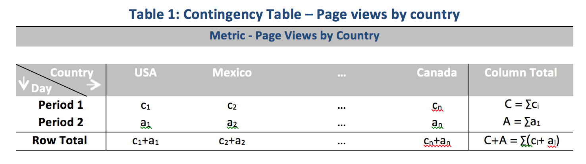

# Statistische Verfahren

Die Anomalieerkennung in Analysis Workspace setzt eine Reihe statistischer Verfahren ein, um festzustellen, ob eine Beobachtung als anormal anzusehen ist oder nicht.

Je nach der im Bericht verwendeten Datumsgranularität werden 3 verschiedene statistische Verfahren eingesetzt – für stündliche, tägliche, wöchentliche/monatliche Anomalieerkennung. Die statistischen Verfahren werden nachfolgend beschrieben.

## Anomalieerkennung für Granularität „Täglich“ 

Für Berichte mit täglicher Granularität berücksichtigt der Algorithmus verschiedene wichtige Faktoren, um Ergebnisse mit höchstmöglicher Genauigkeit bereitzustellen. Zunächst bestimmt der Algorithmus anhand der verfügbaren Daten, welche Modellart angewendet werden soll, und wählt dabei eine von zwei Klassen aus: ein zeitreihenbasiertes Modell oder ein Modell zur Ausreißererkennung (funktionale Filterung genannt).

Die Entscheidung für das zeitreihenbasierte Modell beruht auf den folgenden Kombinationen für den Typ ETS (Error, Trend and Seasonality = Fehler, Trend und Saisonabhängigkeit), wie von [Hyndman und Kollegen (2008)](https://link.springer.com/book/10.1007/978-3-540-71918-2) beschrieben. Dabei versucht der Algorithmus insbesondere die folgenden Kombinationen:

1. ANA (Additive error, No trend, Additive seasonality = Additiver Fehler, Kein Trend, Additive Saisonabhängigkeit)
1. AAA (Additive error, Additive trend, Additive seasonality = Additiver Fehler, Additiver Trend, Additive Saisonabhängigkeit)
1. MNM (Multiplicative error, No trend, Multiplicative seasonality = Multiplikativer Fehler, Kein Trend, Multiplikative Saisonabhängigkeit)
1. MNA (Multiplicative error, No trend, Additive seasonality = Multiplikativer Fehler, Kein Trend, Additive Saisonabhängigkeit)
1. AAN (Additive error, Additive trend, No seasonality = Additiver Fehler, Additiver Trend, Keine Saisonabhängigkeit)

Der Algorithmus testet die Eignung jeder der Kombinationen, indem er die Kombination mit dem besten mittleren absoluten Prozentfehler (MAPE) auswählt. Liegt jedoch der MAPE-Wert des besten Zeitreihenmodells über 15 %, wird funktionale Filterung angewendet. In der Regel passen Daten mit einem hohen Wiederholungsgrad (z. B. Woche über Woche oder Monat über Monat) am besten zu einem Zeitreihenmodell.

Nach Auswahl des Modells passt der Algorithmus die Ergebnisse basierend auf Feiertagen und jährlicher Saisonalität an. Für Feiertage überprüft der Algorithmus, ob einer der folgenden Feiertage im Datumsbereich des Berichts vorhanden ist:

* Memorial Day (nur USA)
* &#x200B;4. Juli
* Thanksgiving (nur USA)
* Black Friday (nur USA)
* Cyber Monday (nur USA)
* 24.–26. Dezember
* &#x200B;1. Januar
* &#x200B;31. Dezember

Diese Feiertage wurden anhand umfangreicher statistischer Analysen einer großen Anzahl von Datenpunkten ausgewählt, um die Feiertage zu ermitteln, die den größten Einfluss in den meisten Kunden-Trends gezeigt haben. Obwohl die Liste sicherlich nicht für alle Kunden oder Geschäftszyklen vollständig ist, verbessert die Anwendung dieser Feiertage die Leistung des Algorithmus insgesamt für fast alle Datensätze der Kunden erheblich.

Nach Auswahl des Modells und der Identifizierung der im Berichtszeitraum befindlichen Feiertage fährt der Algorithmus wie folgt fort:

1. Konstruiert den Referenzzeitraum der Anomalie. Dieser Zeitraum umfasst bis zu 35 Tage vor dem Berichtsdatumsbereich und einen übereinstimmenden Datumsbereich 1 Jahr davor. und berücksichtigt Schalttage, sofern erforderlich, und alle anwendbaren Feiertage, die an einem anderen Kalendertag im Vorjahr stattgefunden haben könnten.
1. Er testet, ob im aktuellen Zeitraum (außer dem Vorjahr) Feiertage vorhanden sind, die laut den aktuellsten Daten eine Anomalität darstellen.
1. Wenn der Feiertag im aktuellen Datumsbereich als anormal betrachtet wird, passt der Algorithmus den erwarteten Wert und das Konfidenzintervall des aktuellen Feiertags an die Werte des Feiertags aus dem vergangenen Jahr an (unter Betrachtung von zwei Tagen vorher und nachher). Die Korrektur für den aktuellen Feiertag erfolgt auf Grundlage des niedrigsten MAPE-Wertes von:

   1. Additive Effekte
   1. Multiplikative Effekte
   1. Differenz zum Vorjahr

Beachten Sie im folgenden Beispiel die deutliche Verbesserung der Performance an Weihnachten und Neujahr:

## Anomalieerkennung für Granularität „Stündlich“ 

Stündliche Daten basieren auf der gleichen Vorgehensweise des zeitreihenbasierten Algorithmus wie beim Algorithmus für tägliche Granularität: Allerdings setzt der Algorithmus hier primär auf zwei Trendmuster: den 24-Stunden-Zyklus sowie den Wochenende-Wochentag-Zyklus. Um diese beiden saisonalen Effekte zu erfassen, erstellt der stündliche Algorithmus zwei separate Modelle (für ein Wochenende und einen Wochentag), wobei er auf die gleiche Weise wie oben beschrieben vorgeht.

Das Trainingfenster für stündliche Trends basiert auf einem 336-Stunden rückwärts gerichteten Fenster.

## Anomalieerkennung für die Granularitäten „Wöchentlich“ und „Monatlich“ 

Da wöchentliche und monatliche Trends nicht die gleichen wöchentlichen oder täglichen Trends wie bei täglicher oder stündlicher Granularität aufweisen, wird ein separater Algorithmus verwendet. Bei wöchentlichen und monatlichen Tests wird ein zweistufiger Ansatz zur Erkennung von Ausreißern als Generalized Extreme Studentized Deviate (GESD) Test bezeichnet. Dieser Test betrachtet die maximale Anzahl der zu erwartenden Anomalien kombiniert mit dem angepassten Box-Plot-Ansatz (ein nichtparametrisches Verfahren zur Erkennung von Ausreißern), um die maximale Anzahl von Ausreißern zu ermitteln. Die beiden Schritte sehen wie folgt aus:

1. Angepasste Box-Plot-Funktion: Diese Funktion ermittelt die maximale Anzahl von Anomalien aus den eingegebenen Daten.
1. GESD-Funktion: Wird mit der Ausgabe aus Schritt 1 auf die eingegebenen Daten angewendet.

Der Schritt zur Anomalieerkennung für Feiertag und Jahreszeit zieht dann die Daten des letzten Jahres von den diesjährigen Daten ab. Anschließend werden die Daten erneut mithilfe des oben beschriebenen zweistufigen Prozesses iteriert, um zu überprüfen, ob Anomalien saisonal relevant sind. Jede dieser Datumsgranularitäten verwendet ein 15 Zeiträume zurückliegendes Zeitfenster, in dem der für den Bericht ausgewählte Datumsbereich liegt (entweder 15 Monate oder 15 Wochen), sowie einen entsprechenden Datumsbereich, der 1 Jahr vor dem Trainingszeitraum liegt.

## In der Beitragsanalyse verwendete statistische Verfahren

Die Beitragsanalyse ist ein intensiver maschineller Lernprozess, der helfen soll, Aspekte zu erkennen, die zu einer in Adobe Analytics festgestellten Anomalie mit beigetragen haben. Damit soll Benutzenden geholfen werden, lohnenswerte Bereiche oder Gelegenheiten für weitere Analysen viel schneller zu identifizieren.

Die Beitragsanalyse führt einen zweiteiligen Algorithmus für jedes einzelne Dimensionselement durch, das für den Bericht zur Beitragsanalyse des Benutzers verfügbar ist. Dabei geht der Algorithmus in der folgenden Reihenfolge vor:

1. Er berechnet für jede Dimension die V-Test-Statistik nach Cramer. Im folgenden Beispiel sehen Sie eine Kontingenztabelle mit Seitenansichten nach Ländern über zwei Zeitperioden:

   

   In Tabelle 1 kann Cramers V verwendet werden, um die Verknüpfung zwischen den Seitenansichten nach Ländern für den Zeitraum 1 (z. B. historisch) und den Zeitraum 2 (z. B. den Tag, an dem die Anomalie auftritt) zu messen. Ein niedriger Wert für Cramers V bedeutet einen niedrigen Grad an Zusammenhang. Werte für Cramers V liegen zwischen 0 (kein Zusammenhang) und 1 (vollständiger Zusammenhang). Die Cramer-V-Statistik kann wie folgt berechnet werden:

   

1. Für jedes Dimensionselement wird der PR-Wert (Pearson-Residuum) verwendet, um den Zusammenhang zwischen der anormalen Metrik und jedem Dimensionselement zu messen. Da der PR-Wert einer gewöhnlichen Normalverteilung folgt, kann der Algorithmus die PRs von zwei zufälligen Variablen miteinander vergleichen, selbst wenn die Abweichungen nicht vergleichbar sind. In der Praxis ist der Fehler nicht bekannt und wird mittels finiter Stichprobenkorrektur abgeschätzt.

   Im vorherigen Beispiel in Tabelle 1 wird der PR mit endlicher Stichprobenkorrektur für Land i und Zeitraum 2 wie folgt angegeben:

   

   wo

   

   (Für den Zeitraum 1 kann eine ähnliche Formel erhalten werden.)

   Für die Endergebnisse wird die Bewertung von jedem Dimensionselement dann mit dem Cramer-V-Messwert gewichtet und in einen Wert zwischen 0 und 1 skaliert, um den Verteilungswert zu erhalten.
