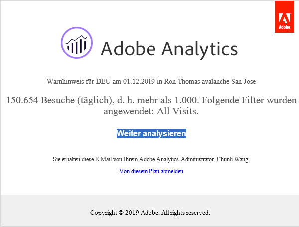
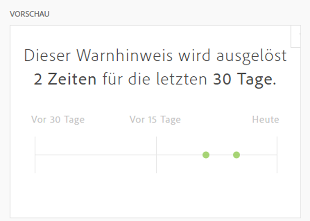

# Warnhinweise erstellen

>[!NOTE]
>
>Intelligente Warnhinweise sind nur für Kunden von Adobe Analytics Prime und Adobe Analytics Ultimate verfügbar.

Intelligente Warnhinweise (oder nur &quot;Warnhinweise&quot;) in Adobe Analytics ermöglichen es Ihnen, sofort benachrichtigt zu werden, wenn in Ihren Daten abnorme Ereignisse auftreten. (Warnhinweise zur Nutzung von Server-Aufrufen sind eine andere Art von Warnhinweisen, die nur für Analytics-Administratoren verfügbar sind. Diese Warnhinweise informieren Sie über das Risiko oder das Auftreten einer Überschreitung der Verbrauchs- und Zusagedaten für Server-Aufrufe. Weitere Informationen finden Sie unter [Warnhinweise zur Nutzung von Server-Aufrufen](/help/admin/admin/c-server-call-usage/scu-alerts.md).

Detaillierte Übersichtsinformationen zu intelligenten Warnhinweisen finden Sie unter [Übersicht über intelligente Warnhinweise](/help/analyze/analysis-workspace/c-intelligent-alerts/intellligent-alerts.md).

So erstellen Sie einen intelligenten Warnhinweis:

1. Beginnen Sie mit der Erstellung eines Warnhinweises, indem Sie auf die Warnhinweiserstellung zugreifen. Sie haben folgende Möglichkeiten, auf den Warnhinweiserstellung zuzugreifen:

   * Öffnen Sie ein Projekt in Analysis Workspace und wählen Sie **[!UICONTROL Komponenten]** > **[!UICONTROL Warnhinweis erstellen]**.
   * Öffnen Sie ein Projekt in Analysis Workspace und verwenden Sie dann die folgende Verknüpfung:

     `ctrl (or cmd) + shift + a`
   * Öffnen Sie ein Projekt in Analysis Workspace, wählen Sie ein oder mehrere Zeilenelemente in einer Freiformtabelle aus, klicken Sie mit der rechten Maustaste darauf und wählen Sie **[!UICONTROL Warnhinweis aus Auswahl erstellen]**.

     Dadurch wird der Warnhinweiserstellung sofort vorausgefüllt, um einen Warnhinweis mit den richtigen Metriken und Filtern zu erstellen.
   * Warnhinweis erstellen [über den Warnhinweis-Manager](/help/analyze/analysis-workspace/c-intelligent-alerts/alert-manager.md#create-alerts).

   Die Warnhinweiserstellung wird angezeigt. Diese Benutzeroberfläche ist mit jenen vertraut, die Segmente oder berechnete Metriken in Analytics erstellt haben:

   

1. Geben Sie die folgenden Optionen zum Konfigurieren des Warnhinweises an:

   | Option | Beschreibung |
   |---------|----------|
   | [!UICONTROL **Titel**] | Geben Sie einen Namen für den Warnhinweis an. Der Warnhinweisname könnte den Namen des Berichts oder den Schwellenwert einer Metrik enthalten. |
   | [!UICONTROL **Beschreibung (optional)**] | Geben Sie eine Beschreibung für den Warnhinweis an. |
   | [!UICONTROL **Zeitgranularität**] | Wählen Sie aus, wie oft die Metrik überprüft werden soll: täglich, wöchentlich oder monatlich.
<b>Hinweis:</b>Bei Datenansichten mit einem benutzerdefinierten Kalender wird die monatliche Granularität in der Warnhinweiserstellung nicht unterstützt.<!--true?-->
 |
   | [!UICONTROL **Empfänger**] | Geben Sie an, wo der Warnhinweis hingeschickt werden soll. Ein Warnhinweis kann an einen Analyse-Benutzer, eine Analyse-Gruppe, eine E-Mail-Adresse oder eine Telefonnummer gesendet werden.
<b>Wichtig:</b>Der Telefonnummer muss ein &quot;+&quot;vorangestellt werden und ein [Ländercode](https://countrycode.org/).

Die E-Mail, die ein Benutzer erhalten würde, sobald ein Warnhinweis ausgelöst wurde, sieht in etwa so aus:

 |
   | [!UICONTROL **Ablaufdatum**] | Legen Sie Datum und Uhrzeit für den Ablauf des Warnhinweises fest. |
   | [!UICONTROL **Warnhinweis senden, wenn**] | [!UICONTROL **Jeder dieser Metriken-Trigger**]: Ziehen Sie Metriken (einschließlich berechneter Metriken) hierher, um Trigger für den Warnhinweis zu erstellen.
Ein **&quot;inkompatible Komponenten&quot;** wird angezeigt, wenn nicht alle Metriken, Dimensionen oder Segmente im Warnhinweis mit der aktuell ausgewählten Datenansicht kompatibel sind.

Legen Sie den Schwellenwert fest, den die Metrik überschreiten muss, damit ein Warnhinweis ausgegeben wird. Sie können diesen Wert auf einen Schwellenwert und anschließend auf eine der folgenden Bedingungen setzen:
<ul><li>Anomalie vorhanden</li><li>Anomalie liegt über erwartetem Wert</li><li>Anomalie liegt unter erwartetem Wert</li><li>ist größer oder gleich</li><li>ist kleiner oder gleich</li><li>ändert sich um</li><li>Sie können einen Schwellenwert von 90 %, 95 %, 99 %, 99,75 % und 99,9 % festlegen.</li></ul>
[!UICONTROL **Mit all diesen Filtern**]: Ziehen Sie Segmente oder Dimensionen per Drag-and-Drop, um Filter hinzuzufügen. Wenn Sie beispielsweise das Segment &quot;Nur Mobilgeräte&quot;hinzufügen, würde die Regel nur für Mobilgeräte Trigger. Mithilfe einer AND-Anweisung können Sie weitere Filter hinzufügen. Per Klick auf das Zahnrad-Symbol können Sie AND- oder OR-Regeln hinzufügen.

Siehe [Intelligente Warnhinweise - Anwendungsfälle](/help/analyze/analysis-workspace/c-intelligent-alerts/alerts-use-cases.md) verwendet beispielsweise Fälle.
 |
   | [!UICONTROL **Vorschau**] | Die interaktive Warnhinweisvorschau zeigt Ihnen basierend auf Daten aus der Vergangenheit, wie oft damit zu rechnen ist, dass ein Warnhinweis ausgelöst wird.
Beispiel: Wenn Sie die Zeitgranularität auf „Stündlich“ festlegen, kann Ihnen die Vorschau verraten, dass der Warnhinweis zu einer bestimmten Metrik während der letzten 30 oder 31 Tage x-mal ausgelöst worden wäre.

Wenn Sie feststellen, dass Warnhinweise zu oft ausgelöst werden würden, können Sie den Schwellenwert im [Warnhinweis-Manager](/help/analyze/analysis-workspace/c-intelligent-alerts/alert-manager.md) anpassen.

 |

1. Wählen Sie [!UICONTROL **Speichern**] aus.
