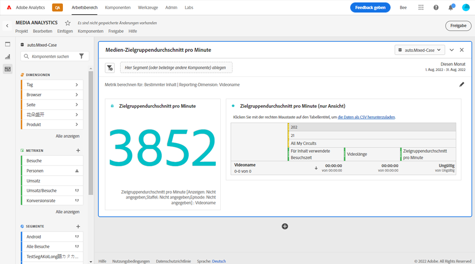
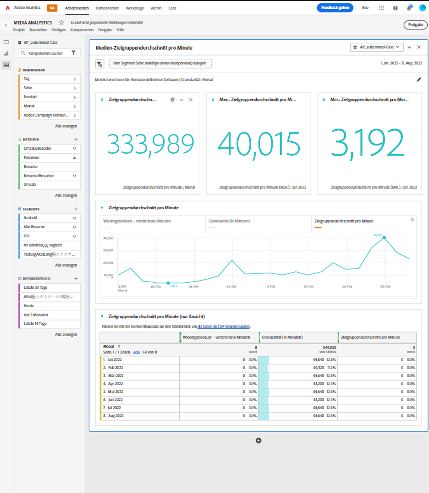

# Bedienfeld „Zielgruppendurchschnitt pro Minute“ {#media-average-minute-audience-panel}

<!-- markdownlint-disable MD034 -->

>[!CONTEXTUALHELP]
>id="workspace_mediaminuteaverageaudience_button"
>title="Medien-Zielgruppendurchschnitt pro Minute"
>abstract="Erstellen Sie ein Panel, um den Zielgruppendurchschnitt pro Minute für bestimmte Inhalte oder über einen bestimmten Zeitraum zu analysieren."

<!-- markdownlint-enable MD034 -->

<!-- markdownlint-disable MD034 -->

>[!CONTEXTUALHELP]
>id="workspace_mediaaverageminuteaudience_panel"
>title="Medien-Zielgruppendurchschnitt pro Minute"
>abstract="Zeigt die Leistung bestimmter Medieninhalte oder über einen benutzerdefinierten Zeitraum an.  **Allgemeine Parameter ** **Metrik berechnen für**: Wählen Sie die für das Bedienfeld zu verwendende Metrik aus. Wählen Sie **Bestimmter Inhalt** aus, um den Zielgruppendurchschnitt pro Minute für bestimmte Inhalte oder Ereignisse basierend auf der Inhaltslänge zu analysieren. **Wählen Sie „Benutzerdefinierter Zeitraum“ aus**, um zu analysieren, wie sich der Zielgruppendurchschnitt pro Minute über einen benutzerdefinierten Zeitraum verändert. **Reporting-Dimension**: Wählen Sie diese Option aus, um einen Bericht nach der Dimension **Videoname** oder **Inhalts-ID** zu erstellen. Nur verfügbar, wenn Sie „Bestimmter Inhalt“ als Metrik ausgewählt haben. **Granularität**: Wählen Sie die Granularität für die Berichte aus. Nur verfügbar, wenn Sie „Benutzerdefinierter Zeitraum“ als Metrik ausgewählt haben. **Inhalt filtern nach (optional)**: Wählen Sie eine bestimmte Sendung, Staffel, Folge oder eine benutzerdefinierte Dimension aus, um den Inhalt zu filtern.  **Erweiterte Einstellungen ** **Tabelleneinstellungen**: Legen Sie fest, ob Berechnungswerte in der Tabelle angezeigt werden sollen. **Besuchszeitmetrik**: Legen Sie fest, welche Besuchszeitmetrik für die Berechnung eines bestimmten Inhalts verwendet werden soll. Nur verfügbar, wenn Sie „Bestimmter Inhalt“ als Metrik ausgewählt haben."

<!-- markdownlint-enable MD034 -->

>[!BEGINSHADEBOX]

*In diesem Artikel wird das Bedienfeld „Medien-Zielgruppendurchschnitt pro Minute“ in **Customer Journey Analytics)**. Siehe [Bedienfeld „Medien-Zielgruppendurchschnitt pro Minute](https://experienceleague.adobe.com/en/docs/analytics/analyze/analysis-workspace/panels/average-minute-audience-panel) für die **Adobe Analytics**-Version dieses Artikels.*

>[!ENDSHADEBOX]

>[!NOTE]
>
>Das Bedienfeld **[!UICONTROL Medien-Zielgruppendurchschnitt pro Minute]** steht nur Kunden zur Verfügung, die die Streaming-Mediensammlung für Adobe Analytics erworben haben.
>
>Wenden Sie sich an Ihren Adobe-Kundenbetreuer oder Ihr Adobe-Kundenbetreuerteam, um weitere Informationen zu erhalten.
>

In Analysis Workspace kann der Zielgruppendurchschnitt pro Minute Informationen zu folgenden Themen liefern

* die Zeit, die mit der Anzeige eines bestimmten Medien-Streams verbracht wurde, dividiert durch die Dauer des Inhalts, oder
* Die Zeit, die mit der Anzeige während eines benutzerdefinierten Zeitraums mit ausgewählter Granularität verbracht wurde.

Das Bedienfeld „Medien-Zielgruppendurchschnitt pro Minute“ ermöglicht es Ihnen, die durchschnittliche Nutzung Ihrer Inhalte zu verstehen, indem Sie Programme beliebiger Länge oder Genres vergleichen. Sie können beispielsweise den durchschnittlichen Verbrauch verstehen, wenn Sie eine 30-minütige Sitcom mit einem 3-stündigen Sportereignis vergleichen.

Darüber hinaus können Sie das Bedienfeld „Medien-Zielgruppendurchschnitt pro Minute“ verwenden, um diesen digitalen Zielgruppendurchschnitt pro Minute mit linearen Metriken zum TV-Durchschnitt pro Minute zu vergleichen oder anzuhängen.

Das Bedienfeld „Medien-Zielgruppendurchschnitt pro Minute“ bietet gegenüber der Metrik „Zielgruppendurchschnitt pro Minute“ die folgenden Vorteile:

* Unterstützt benutzerdefinierte Zeiträume

* Ermöglicht die Aktualisierung der Klassifizierungsdauer, nachdem Ansichten verarbeitet wurden (wenn die Klassifizierung der Dauer nicht vorhanden war oder korrigiert werden muss)

  Wenn Sie diese Aktualisierung bei Verwendung der Metrik durchführen, ist die Klassifizierung der Dauer nicht vorhanden (wenn die Klassifizierung nicht vorhanden war). Oder die Klassifizierung der Dauer ist veraltet (wenn die Klassifizierung vorhanden, aber falsch ist).

## Verwenden

So verwenden Sie ein Bedienfeld **[!UICONTROL Medien-Zielgruppendurchschnitt pro Minute]**:

1. Erstellen Sie ein Bedienfeld **[!UICONTROL Medien-Zielgruppendurchschnitt pro Minute]**. Informationen zum Erstellen eines Bedienfelds finden Sie unter [Erstellen eines Bedienfelds](panels.md#create-a-panel).

1. Stellen Sie sicher, dass Sie eine Datenansicht für das Bedienfeld auswählen, in dem Komponenten aus der Streaming-Mediensammlung konfiguriert sind.

1. Legen Sie die [Eingabe](#panel-input) für das Bedienfeld fest.

1. Sehen Sie sich die [Ausgabe](#panel-output) für das Bedienfeld an.

### Bedienfeldeingabe

Verwenden Sie die in diesem Abschnitt beschriebenen Eingabeeinstellungen, um das Bedienfeld „Medien-Zielgruppendurchschnitt pro Minute“ zu konfigurieren.

1. Konfigurieren Sie die folgenden Eingabeeinstellungen:

   | Einstellung | Beschreibung |
   |---------|------------|
   | **Datumsbereich des Bedienfelds** | Der Datumsbereich des Bedienfelds ist standardmäßig [!UICONTROL **Diesen Monat**]. Sie können ihn so verändern, dass Sie einen einzelnen Tag oder viele Monate auf einmal betrachten können.    Diese Visualisierung ist auf 1.440 Datenzeilen beschränkt (z. B. 24 Stunden bei einer Granularität auf Minutenebene). Wenn eine Kombination aus Datumsbereich und Granularität mehr als 1.440 Zeilen zur Folge hat, wird die Granularität automatisch aktualisiert, um den vollständigen Datumsbereich anzuzeigen. |
   | [!UICONTROL **Legen Sie hier ein Segment (oder eine beliebige andere Komponente) ab**] | Wie andere Bedienfelder filtert diese Einstellung Ihre Auswahl anhand von Segmenten, die Sie erstellt haben. Diese Einstellung ist eine hervorragende Möglichkeit, bestimmte Plattformen, Live-Streams oder andere gängige Mediensegmente anzusehen. |
   | [!UICONTROL **Metrik berechnen für**] | Wählen Sie aus, ob der Zielgruppendurchschnitt pro Minute für ([**[!UICONTROL  Inhalte) angezeigt ]**](#specific-content) soll. Oder Sie möchten den Zielgruppendurchschnitt pro Minute für einen [**[!UICONTROL  Zeitraum ]**](#custom-time-period).  Wählen Sie [!UICONTROL **Benutzerdefinierter Zeitraum**]: <ul><li>Wenn die Dauer nicht verfügbar ist oder </li><li>wenn Sie den Zielgruppendurchschnitt pro Minute für eine Zeitreihe mit mehreren Inhalten anzeigen möchten, oder</li><li>Für Inhalte ohne bestimmte Dauer (z. B. während eines Live-Streams oder -Ereignisses)</li></ul></li></li></ul> 
Diese Einstellung ändert den Workflow und die Berichtsausgabe.
 |

1. Fahren Sie mit [Bestimmter Inhalt](#specific-content) oder [Benutzerdefinierter Zeitraum](#custom-time-period) fort, je nach der Option, die Sie in der Dropdown-Liste [!UICONTROL **Metrik berechnen für**] ausgewählt haben.

#### Bestimmter Inhalt

1. Wenn Sie [!UICONTROL **Spezifischer Inhalt**] im Dropdown-Menü [!UICONTROL **Metrik berechnen für**] beim [Konfigurieren von Bedienfeldeingaben](#panel-inputs) ausgewählt haben, geben Sie die folgenden Konfigurationsoptionen an:

   | Einstellung | Beschreibung |
   |---------|------------|
   | [!UICONTROL **Reporting-Dimension**] | Wenn Sie bestimmte Inhalte auswählen, können Sie für die Berichtsausgabe entweder das Feld für den Videonamen oder die Inhalts-ID verwenden, um den Inhalt und den zugehörigen Zielgruppendurchschnitt pro Minute anzuzeigen. |
   | [!UICONTROL **Inhalt filtern nach (optional)**] | Wählen Sie aus, wie der spezifische Inhalt gefiltert werden soll, je nach der gewünschten Ansicht oder der Art und Weise, wie Ihre Daten strukturiert sind. <ul>[!UICONTROL **Sendung, Staffel, Folge**]: Zeigt Ihre verfügbaren Sendungen in der Dropdown-Liste an, die Sie mithilfe einer Suche filtern können (oder indem Sie den Sendungsnamen aus der linken Spalte ziehen und ablegen). Sie können Ihre Auswahl hier beenden, um alle Staffeln Ihrer Sendung zu sehen, oder Sie können nach einzelnen Staffeln und dann nach einzelnen Folgen filtern. Diese Einstellung zeigt die Daten für diese Sendungen, Staffeln oder Folgen für den ausgewählten Zeitraum an.</li><li>[!UICONTROL **Benutzerdefinierte Dimension**]: Wenn sich der Name der Sendung unter einer benutzerdefinierten Dimension befindet, können Sie ihn entweder über die Suche im Dropdown-Menü der Dimension (optional) oder über die Suche in der linken Spalte finden. Das Dimensionselement wird basierend auf dieser Auswahl automatisch ausgefüllt und als Folge behandelt.</li><li>[!UICONTROL **None**] Zeigt alle Videonamen an, für die Daten über den Zielgruppendurchschnitt pro Minute für die von Ihnen ausgewählte Auswahl vorliegen. (Diese Option ist standardmäßig ausgewählt.)</li></ul> |

1. Fahren Sie mit [Erweiterte Einstellungen für spezifischen Inhalt](#specific-content-advanced-settings) fort, um erweiterte Einstellungen zu konfigurieren.

#### Erweiterte Einstellungen für spezifischen Inhalt

1. Wenn [!UICONTROL **Spezifischer Inhalt**] im Dropdown-Menü [!UICONTROL **Metrik berechnen für**] ausgewählt ist, wählen Sie [!UICONTROL **Erweiterte Einstellungen anzeigen**] und geben Sie dann die folgenden Konfigurationsoptionen an:

   | Optionen | Beschreibung |
   |---------|------------|
   | **[!UICONTROL Tabelleneinstellungen]** | Die Standardoption **[!UICONTROL Berechnungswerte in Tabelle anzeigen]** zeigt den Zähler und Nenner des Zielgruppendurchschnitts pro Minute als die vorangehenden Spalten in der Tabelle an. Wenn Sie diese Option deaktivieren, werden diese beiden Spalten entfernt. Die Spalte für den Zielgruppendurchschnitt pro Minute verbleibt in der Tabelle neben dem Videonamen oder der Inhalts-ID. |
   | **[!UICONTROL Besuchszeitmetrik]** | Sie können die Standardoption **[!UICONTROL Besuchszeit für Inhalt]** auswählen, die nur die Inhaltszeit enthält. Sie können auch die **[!UICONTROL Besuchszeit für Medien]** verwenden, die Inhalte und Anzeigenzeit zusammen als Zählerberechnung für den Zielgruppendurchschnitt pro Minute enthält. |

1. Wählen Sie [!UICONTROL **Erstellen**], um das Erstellen des Bedienfelds „Medien-Zielgruppendurchschnitt pro Minute“ abzuschließen.

1. Fahren Sie mit [Bedienfeldausgabe](#panel-output) fort, um Informationen zur Verwendung des Bedienfelds „Medien-Zielgruppendurchschnitt pro Minute“ zu erhalten.

#### Benutzerdefinierter Zeitraum

1. Wenn Sie [!UICONTROL **Benutzerdefinierter Zeitraum**] im Dropdown-Menü [!UICONTROL **Metrik berechnen für**] beim [Konfigurieren von Bedienfeldeingaben](#panel-inputs) ausgewählt haben, geben Sie die folgenden Konfigurationsoptionen an:

   | Optionen | Beschreibung |
   |---------|------------|
   | **[!UICONTROL Granularität]** | Die Standardgranularität beträgt [!UICONTROL **5 Minuten**] Sie können jedoch eine beliebige Granularität auswählen, die als Nenner für die Zeitreihe innerhalb Ihres ausgewählten Zeitraums verwendet wird. Wenn Sie beispielsweise 12:00 Uhr bis 12:30 Uhr mit einer Granularität von 5 Minuten auswählen, werden der Zielgruppendurchschnitt pro Minute über die gesamte halbe Stunde sowie sechs Zeilen mit dem Zielgruppendurchschnitt pro Minute für jeden 5-minütigen Zeitraum zurückgegeben. Diese Zeilen werden als Datenpunkte für das Zeitreihendiagramm verwendet. |
   | [!UICONTROL **Inhalt filtern nach (optional)**] | Wählen Sie aus, wie der spezifische Inhalt gefiltert werden soll, je nach der gewünschten Ansicht oder der Art und Weise, wie Ihre Daten strukturiert sind. <ul>[!UICONTROL **Sendung, Staffel, Folge**]: Zeigt Ihre verfügbaren Sendungen in der Dropdown-Liste an, die Sie mithilfe einer Suche filtern können (oder indem Sie den Sendungsnamen aus der linken Spalte ziehen und ablegen). Sie können Ihre Auswahl hier beenden, um alle Staffeln Ihrer Sendung zu sehen, oder Sie können nach einzelnen Staffeln und dann nach einzelnen Folgen filtern. Diese Einstellung zeigt die Daten für diese Sendungen, Staffeln oder Folgen für den ausgewählten Zeitraum an.</li><li>[!UICONTROL **Benutzerdefinierte Dimension**]: Wenn sich der Name der Sendung unter einer benutzerdefinierten Dimension befindet, können Sie ihn entweder über die Suche im Dropdown-Menü der Dimension (optional) oder über die Suche in der linken Spalte finden. Das Dimensionselement wird basierend auf dieser Auswahl automatisch ausgefüllt und als Folge behandelt.</li><li>[!UICONTROL **None**] Zeigt alle Videonamen an, für die Daten über den Zielgruppendurchschnitt pro Minute für die von Ihnen ausgewählte Auswahl vorliegen. (Diese Option ist standardmäßig ausgewählt.)</li></ul> |

1. Fahren Sie mit [Erweiterte Einstellungen für benutzerdefinierte Zeiträume](#custom-time-period-advanced-settings) fort, um die erweiterten Einstellungen zu konfigurieren.

#### Erweiterte Einstellungen für benutzerdefinierte Zeiträume

1. Wenn [!UICONTROL **Benutzerdefinierter Zeitraum**] im Dropdown-Menü [!UICONTROL **Metrik berechnen für**] ausgewählt ist, wählen Sie [!UICONTROL **Erweiterte Einstellungen anzeigen**] und geben Sie dann die folgende Konfigurationsoption an:

   | Option | Beschreibung |
   |---------|------------|
   | **[!UICONTROL Tabelleneinstellungen]** | Die Standardeinstellung zeigt die Berechnungswerte in der Tabelle an, die den Zähler und Nenner des Zielgruppendurchschnitts pro Minute als die vorangehenden Spalten in der Tabelle anzeigt. Wenn Sie diese Option deaktivieren, werden die beiden Spalten entfernt, sodass neben dem Zeitraum nur der Zielgruppendurchschnitt pro Minute verbleibt. |

1. Wählen Sie [!UICONTROL **Erstellen**], um das Erstellen des Bedienfelds „Medien-Zielgruppendurchschnitt pro Minute“ abzuschließen.

1. Fahren Sie mit [Bedienfeldausgabe](#panel-output) fort, um Informationen zur Verwendung des Bedienfelds „Medien-Zielgruppendurchschnitt pro Minute“ zu erhalten.

### Bedienfeldausgabe

Die Bedienfeldausgabe unterscheidet sich je nachdem, ob Sie [!UICONTROL **Bestimmter Inhalt**] oder [!UICONTROL **Benutzerdefinierter**] im [!UICONTROL **Metrik berechnen für**] Dropdown-Menü beim [Konfigurieren von Bedienfeldeingaben](#panel-inputs) haben.

#### Bestimmter Inhalt

Das Bedienfeld „Medien-Zielgruppendurchschnitt pro Minute“ gibt Folgendes zurück:

* Gesamtwert des Zielgruppendurchschnitts pro Minute für Ihre gesamte Auswahl
* Filter und Zielgruppendurchschnitt pro Minute für die einzelnen Videos, angezeigt in einer Tabelle
* Mit dem Inhalt verbrachte Zeit und Videolänge (Dauer), wenn diese erweiterte Einstellung ausgewählt wurde

Um das Bedienfeld jederzeit zu bearbeiten und neu zu erstellen, wählen Sie  oben rechts aus.

#### Spezifische Inhaltsdatenquelle

Das Bedienfeld „Medien-Zielgruppendurchschnitt pro Minute“ verwendet nur die Metrik „Zielgruppendurchschnitt pro Minute“ zum Erfassen von Daten. Aufschlüsselungen oder andere Metriken können im Bedienfeld nicht verwendet werden.

| Metrik | Beschreibung |
|--------|-------------|
| **[!UICONTROL Zielgruppendurchschnitt pro Minute]** | Die Zeit, die mit der Ansicht Ihres Medien-Streams verbracht wurde, dividiert durch die Videolänge (Dauer), die über Classifications bereitgestellt wird. |

#### Benutzerdefinierter Zeitraum {#custom-time-period-output}

Das Bedienfeld „Medien-Zielgruppendurchschnitt pro Minute“ gibt Folgendes zurück:

* Der Zielgruppendurchschnitt pro Minute für die gesamte Auswahl

* Der maximale und minimale Zielgruppendurchschnitt pro Minute

* Das Liniendiagramm, das den Zielgruppendurchschnitt pro Minute für die gesamte Auswahl anzeigt.

* Eine Tabelle, die die Filter und den Zielgruppendurchschnitt pro Minute für die Granularitäten sowie die mit dem Inhalt verbrachte Zeit und die Granularität für jeden Zeitraum anzeigt

  Diese Tabelle wird nur angezeigt, wenn die Option unter Erweiterte Einstellungen [!UICONTROL **Berechnungswerte in Tabelle anzeigen**] ausgewählt ist.

Um das Bedienfeld jederzeit zu bearbeiten und neu zu erstellen, wählen Sie oben Medien-Zielgruppendurchschnitt pro Minute bearbeiten“ aus.

#### Datenquelle für benutzerdefinierten Zeitraum

Das Bedienfeld „Medien-Zielgruppendurchschnitt pro Minute“ verwendet nur die Metrik „Zielgruppendurchschnitt pro Minute“ zum Erfassen von Daten. Aufschlüsselungen oder andere Metriken können im Bedienfeld nicht verwendet werden.

| Metrik | Beschreibung |
|---|---|
| **[!UICONTROL Zielgruppendurchschnitt pro Minute]** | Die mit der Ansicht Ihres Medien-Streams verbrachte Zeit dividiert durch die Gesamtauswahl oder die ausgewählte Granularität in Minuten. |

>[!MORELIKETHIS]
>
> [Erstellen eines Bedienfelds](/help/analyze/analysis-workspace/c-panels/panels.md#create-a-panel)
> [Bedienfeld „Gleichzeitige Medienbetrachter“](media-concurrent-viewers.md)
> [Panel „Verbrachte Zeit bei der Medienwiedergabe“](media-playback-time-spent.md)
>

<!--

# Media average minute audience panel

>[!NOTE]
>
>The Media average minute audience panel is available only to customers who have purchased the Streaming Media Collection Add-on. 
>
>Contact your Adobe Sales Representative or Adobe Account Team to purchase the Streaming Media Collection Add-on. 

In Analysis Workspace, average minute audience is the time spent viewing your media stream divided by the duration of the content or the total selection of the period and selected granularity.

The Media average minute audience panel enables you to better understand average consumption of your content by comparing programs of any length or genre. For example, you can understand average consumption when comparing a 30-minute sitcom with a 3-hour sporting event.

In addition, you can use the Media average minute audience panel to compare or append this digital average minute audience to linear TV average minute metrics. 

The Media average minute audience panel provides the following benefits over the Average Minute Audience metric:

* Supports custom time periods

* Allows for updating the duration classification after views are processed (if it was not present or if it needs to be corrected)

  If you did this when using the metric, it either won't exist (if the classification wasn't present) or it will be out of date (if the classification was present but incorrect).

## Access the Media average minute audience panel

1. In Analysis Workspace, go to a report suite that has streaming media components enabled. 

1. In the left nav, select the **Panels** icon.

   

1. Drag the [!UICONTROL **Media average minute audience**] panel onto the canvas in Analysis Workspace.

1. To configure the panel, continue with [Panel inputs](#panel-inputs).

## Panel inputs {#Input}

Use the input settings described in this section to configure the Media average minute audience panel.

1. Begin creating a Media average minute audience panel, as described in [Access the Media average minute audience panel](#access-the-media-average-minute-audience-panel).

1. Configure the following input settings:

   | Setting | Description |
   |---------|------------|
   | **Panel date range** | The panel date range default is [!UICONTROL **This month**]. You can edit it to view a single day or many months at a time.    This visualization is limited to 1440 rows of data (for example, 24-hours at minute-level granularity). If a date range and granularity combination results in more than 1440 rows, the granularity is automatically updated to accommodate the full date range. |
   | [!UICONTROL **Drop a segment here (or any other component)**] | Like other panels, this setting filters your selections based on segments you've created. This is a great way to look at specific platforms, live streams, or other common media segments. |
   | [!UICONTROL **Calculate metric for**] | Choose whether you want to see the average minute audience for a specific piece of content, or if you want to see the average minute audience for a custom period of time:<ul><li>**Specific content:** This is available only if the duration has been updated using Classifications. If the duration is unavailable, or if you want to view the average minute audience for a time series with multiple pieces of content or content without a specific assigned duration (like during a live stream or event), then you should select [!UICONTROL **Custom time period**]. (Durations can be set using Classifications either before or after processing time.)</li><li>**Custom time period:** This is available regardless of whether the durations is made available using Classifications.</li></ul> 
This setting changes the workflow and report output.
  |

1. Continue with [Specific content](#specific-content) or [Custom time period](#custom-time-period), depending on the option you chose in the [!UICONTROL **Calculate metric for**] drop-down menu.

### Specific content

1. If you selected [!UICONTROL **Specific content**] in the [!UICONTROL **Calculate metric for**] drop-down menu when [configuring panel inputs](#panel-inputs), specify the following configuration options:

   | Setting | Description |
   |---------|------------|
   | [!UICONTROL **Reporting dimension**] | When you choose specific content, you can select the report output to use either the video name or content ID fields to show the content and its associated average minute audience for the time period selected. |
   | [!UICONTROL **Filter content by (optional)**] | Choose how to filter the specific content, depending on the view you want or the way your data is structured. <ul>[!UICONTROL **Show, season, episode**]: Displays your available shows in the drop-down, which you can filter using a search (or by dragging and dropping the show name from the left column). You can end your selection there to see all the seasons of your show, or you can filter by individual seasons and then by individual episodes. This setting shows the data for those shows, seasons, or episodes for the selected time period.</li><li>[!UICONTROL **Custom dimension**]: If your show name is under a custom dimension, you can find it either by searching in the dimension (optional) drop down or by using the left column search. The dimension item automatically populates based on that selection and is treated as an episode.</li><li>[!UICONTROL **None**]: Shows all the video names that have average minute audience data for the selection you've chosen. (This options is selected by default.)</li></ul>  |

1. Continue with [Specific content advanced settings](#specific-content-advanced-settings) to configure advanced settings. 

### Specific content advanced settings

1. With [!UICONTROL **Specific content**] selected in the [!UICONTROL **Calculate metric for**] drop-down menu, select [!UICONTROL **Show advanced settings**], then specify the following configuration options:

   | Setting | Description |
   |---------|------------|
   | Table settings | The default setting shows the calculation values in the table, which shows the numerator and denominator of the average minute audience as the preceding columns in the table. Deselecting this option removes those two columns, leaving only the average minute audience next to the video name or content ID. |
   | Time spent metric | You can choose the default content time spent, which includes only content time, or you can choose to use the media time spent, which includes content and ad time together as the numerator calculation for the average minute audience. |

1. Select [!UICONTROL **Build**] to finish creating the Media average minute audience panel.

1. Continue with [Panel output](#panel-output) for information about how to use the Media average minute audience panel.

### Custom time period

1. If you selected [!UICONTROL **Custom time period**] in the [!UICONTROL **Calculate metric for**] drop-down menu when [configuring panel inputs](#panel-inputs), specify the following configuration options:

   | Setting | Description |
   |---------|------------|
   | Granularity | The default granularity is [!UICONTROL **5-Minute**], but you can choose any of the granularities that are used as the denominator for the time series within your overall time period selection made in the calendar selection. For example, selecting 12:00 pm to 12:30 pm with a 5-minute granularity returns the average minute audience over the full half hour as well as six rows with the average minute audience for each 5-minute period. These rows are used as the datapoints for the time series chart. |
   | [!UICONTROL **Filter content by (optional)**] | Choose how to filter the specific content, depending on the view you want or the way your data is structured. <ul>[!UICONTROL **Show, season, episode**]: Displays your available shows in the drop-down, which you can filter using a search (or by dragging and dropping the show name from the left column). You can end your selection there to see all the seasons of your show, or you can filter by individual seasons and then by individual episodes. This setting shows the data for those shows, seasons, or episodes for the selected time period.</li><li>[!UICONTROL **Custom dimension**]: If your show name is under a custom dimension, you can find it either by searching in the dimension (optional) drop down or by using the left column search. The dimension item automatically populates based on that selection and is treated as an episode.</li><li>[!UICONTROL **None**]: Shows all the video names that have average minute audience data for the selection you've chosen. (This options is selected by default.)</li></ul>  |

1. Continue with [Custom time period advanced settings](#custom-time-period-advanced-settings) to configure advanced settings. 

### Custom time period advanced settings

1. With [!UICONTROL **Custom time period**] selected in the [!UICONTROL **Calculate metric for**] drop-down menu, select [!UICONTROL **Show advanced settings**], then specify the following configuration option:

   | Setting | Description |
   |---------|------------|
   | Table settings | The default setting displays the calculation values in the table, which displays the numerator and denominator of the average minute audience as the preceding columns in the table. Deselecting this option removes those two columns leaving only the average minute audience next to the time period. |

1. Select [!UICONTROL **Build**] to finish creating the Media average minute audience panel.

1. Continue with [Panel output](#panel-output) for information about how to use the Media average minute audience panel.

## Panel output

The panel output differs depending on whether you chose [!UICONTROL **Specific content**] or [!UICONTROL **Custom time period**] in the [!UICONTROL **Calculate metric for**] drop-down menu when [configuring panel inputs](#panel-inputs).

### Specific content

The Media average minute audience panel returns the following:

* Total average minute audience for your entire selection
* Filters and average minute audience for the individual videos displayed in a table 
* Content time spent and video length (duration) if that advanced setting was selected

To edit and rebuild the panel at any time, select the Edit (pencil) icon in the top right.

### Specific content data source

The Media average minute audience panel uses only the Average Minute Audience metric to gather data. Breakdowns or other metrics cannot be used in the panel.

| Metric | Description |
|--------|-------------|
| Average Minute Audience | The time spent viewing your media stream divided by the video length (duration) supplied via Classifications. |

### Custom time period {#custom-time-period-output}

The Media average minute audience panel returns the following:

* The total average minute audience for your entire selection

* The maximum and minimum average minute audience

* The line series graph showing the average minute audience over the entire selection.

* A table that shows the filters and average minute audience for the granularities, as well as the content time spent and granularity for each time period 

  This table displays only if the option under advanced settings called [!UICONTROL **Show calculation values in table**] is selected.

To edit and rebuild the panel at any time, select the Edit (pencil) icon in the top right.

### Custom time period data source

The Media average minute audience panel uses only the Average Minute Audience metric to gather data. Breakdowns or other metrics cannot be used in the panel.

|Metric|Description|
|---|---|
|Average Minute Audience| The time spent viewing your media stream divided by the total selection or selected granularity in minutes.|

-->