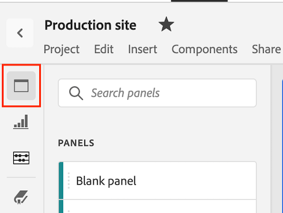

# Zielgruppenbereich mit mittlerer Medienmindebene

>[!NOTE]
>
>Das Zielgruppen-Bedienfeld &quot;Durchschnittliche Medienminuten&quot;steht nur Kunden zur Verfügung, die das Add-on für Streaming-Mediensammlung erworben haben.
>
>Wenden Sie sich an Ihren Adobe Sales-Support-Mitarbeiter oder Adobe-Account-Team, um das Streaming Media Collection Add-on zu erwerben.

In Analysis Workspace bezeichnet der Zielgruppendurchschnitt pro Minute die Zeit, die mit der Ansicht Ihres Medien-Streams verbracht wurde, geteilt durch die Inhaltsdauer oder die Gesamtauswahl des Zeitraums mit der ausgewählten Granularität.

Mit dem Zielgruppenbereich Durchschnittliche Medienminuten können Sie die durchschnittliche Nutzung Ihrer Inhalte besser verstehen, indem Sie Programme beliebiger Länge oder Genres vergleichen. Beispielsweise können Sie den durchschnittlichen Verbrauch beim Vergleich einer 30-minütigen Website mit einer 3-stündigen Sportveranstaltung nachvollziehen.

Darüber hinaus können Sie das Mediendurchschnitts-Minute-Zielgruppenfeld verwenden, um diese digitale durchschnittliche Minute-Zielgruppe mit linearen TV-Durchschnittsminuten-Metriken zu vergleichen oder anzuhängen.

Der Bereich Zielgruppe für durchschnittliche Medienminuten bietet im Vergleich zur Metrik Zielgruppendurchschnitt pro Minute die folgenden Vorteile:

* Unterstützt benutzerdefinierte Zeiträume

* Ermöglicht die Aktualisierung der Dauer-Classification nach Verarbeitung der Ansichten (falls diese nicht vorhanden waren oder korrigiert werden müssen)

  Wenn Sie dies bei Verwendung der Metrik getan haben, ist die Metrik entweder nicht vorhanden (wenn die Classification nicht vorhanden war) oder sie ist veraltet (wenn die Classification vorhanden, aber falsch war).

## Auf das Zielgruppenfeld &quot;Durchschnittliche Medienminuten&quot;zugreifen

1. Wechseln Sie in Analysis Workspace zu einer Report Suite, für die Streaming-Medienkomponenten aktiviert sind.

1. Wählen Sie im linken Navigationsbereich das Symbol **Bedienfelder** aus.

   

1. Ziehen Sie das Bedienfeld [!UICONTROL **Durchschnittliche Medienminuten-Audience**] auf die Arbeitsfläche in Analysis Workspace.

1. Um das Bedienfeld zu konfigurieren, fahren Sie mit [Bedienfeldeingaben](#panel-inputs) fort.

## Bedienfeldeingaben {#Input}

Verwenden Sie die in diesem Abschnitt beschriebenen Eingabeeinstellungen, um das Audience-Bedienfeld für die durchschnittliche Minute der Medien zu konfigurieren.

1. Beginnen Sie mit der Erstellung eines Audience-Bedienfelds mit der durchschnittlichen Medienminuten, wie unter [Zugriff auf das Audience-Bedienfeld mit der durchschnittlichen Medienminute](#access-the-media-average-minute-audience-panel) beschrieben.

1. Konfigurieren Sie die folgenden Eingabeeinstellungen:

   | Einstellung | Beschreibung |
   |---------|------------|
   | **Datumsbereich des Bedienfelds** | Der Datumsbereich des Bedienfelds ist standardmäßig [!UICONTROL **Dieser Monat**]. Sie können sie bearbeiten, um einen oder mehrere Monate gleichzeitig anzuzeigen.    Diese Visualisierung ist auf 1.440 Datenzeilen beschränkt (z. B. 24 Stunden bei einer Granularität auf Minutenebene). Wenn eine Kombination aus Datumsbereich und Granularität mehr als 1.440 Zeilen zur Folge hat, wird die Granularität automatisch aktualisiert, um den vollständigen Datumsbereich anzuzeigen. |
   | [!UICONTROL **Segment hier (oder einer anderen Komponente) ablegen**] | Wie andere Bedienfelder filtert diese Einstellung Ihre Auswahl anhand von Segmenten, die Sie erstellt haben. Dies ist eine hervorragende Möglichkeit, bestimmte Plattformen, Live-Streams oder andere gängige Mediensegmente anzusehen. |
   | [!UICONTROL **Berechnete Metrik für**] | Wählen Sie aus, ob Sie die durchschnittliche Minutenzielgruppe für einen bestimmten Inhalt anzeigen möchten oder ob Sie die durchschnittliche Minutenzielgruppe für einen benutzerdefinierten Zeitraum anzeigen möchten:<ul><li>**Spezifischer Inhalt:** Dies ist nur verfügbar, wenn die Dauer mithilfe von Classifications aktualisiert wurde. Wenn die Dauer nicht verfügbar ist oder Sie die durchschnittliche Minutenzielgruppe für eine Zeitreihe mit mehreren Inhalten oder Inhalten ohne bestimmte Dauer anzeigen möchten (z. B. während eines Live-Streams oder -Ereignisses), sollten Sie [!UICONTROL **Benutzerdefinierter Zeitraum auswählen**]. (Die Dauer kann mithilfe von Classifications entweder vor oder nach der Verarbeitungszeit festgelegt werden.)</li><li>**Benutzerdefinierter Zeitraum:** Dieser Zeitraum ist verfügbar, unabhängig davon, ob die Dauer mithilfe von Classifications verfügbar gemacht wird.</li></ul> 
Diese Einstellung ändert den Workflow und die Berichtsausgabe.
 |

1. Fahren Sie mit [spezifischem Inhalt](#specific-content) oder [benutzerdefinierter Zeitraum](#custom-time-period) fort, je nachdem, welche Option Sie im Dropdownmenü [!UICONTROL **Metrik berechnen für**] ausgewählt haben.

### Bestimmter Inhalt

1. Wenn Sie [!UICONTROL **Spezifischer Inhalt**] im Dropdown-Menü [!UICONTROL **Metrik für**] berechnen ausgewählt haben, wenn [Bedienfeldeingaben konfigurieren](#panel-inputs), geben Sie die folgenden Konfigurationsoptionen an:

   | Einstellung | Beschreibung |
   |---------|------------|
   | [!UICONTROL **Berichtsdimension**] | Wenn Sie einen bestimmten Inhalt auswählen, können Sie für die Berichtsausgabe entweder das Feld für den Videonamen oder die Inhalts-ID verwenden, um den Inhalt und den zugehörigen Zielgruppendurchschnitt pro Minute für den ausgewählten Zeitraum anzuzeigen. |
   | [!UICONTROL **Inhalt filtern nach (optional)**] | Wählen Sie aus, wie der spezifische Inhalt gefiltert werden soll, je nach gewünschter Ansicht oder Struktur der Daten. <ul>[!UICONTROL **Anzeigen, Staffel, Folge**]: Zeigt Ihre verfügbaren Sendungen in der Dropdown-Liste an, die Sie mithilfe einer Suche filtern können (oder durch Ziehen und Ablegen des Anzeigennamens aus der linken Spalte). Sie können Ihre Auswahl hier beenden, um alle Staffeln Ihrer Sendung zu sehen, oder Sie können nach einzelnen Staffeln und dann nach einzelnen Folgen filtern. Diese Einstellung zeigt die Daten für diese Sendungen, Staffeln oder Folgen für den ausgewählten Zeitraum an.</li><li>[!UICONTROL **Benutzerdefinierte Dimension**]: Wenn Ihr Anzeigename unter einer benutzerdefinierten Dimension liegt, können Sie ihn entweder durch Suchen in der Dropdown-Liste &quot;Dimension&quot;(optional) oder durch Verwenden der linken Spaltensuche finden. Das Dimensionselement wird basierend auf dieser Auswahl automatisch ausgefüllt und als Folge behandelt.</li><li>[!UICONTROL **Keine**]: Zeigt alle Videonamen an, die durchschnittliche Minutenzielgruppendaten für die ausgewählte Auswahl enthalten. (Diese Optionen sind standardmäßig ausgewählt.)</li></ul> |

1. Fahren Sie mit den erweiterten Einstellungen für [Spezifischer Inhalt](#specific-content-advanced-settings) fort, um erweiterte Einstellungen zu konfigurieren.

### Erweiterte Einstellungen für spezifischen Inhalt

1. Wenn [!UICONTROL **Spezifischer Inhalt**] im Dropdown-Menü [!UICONTROL **Metrik für**] berechnen ausgewählt ist, wählen Sie [!UICONTROL **Erweiterte Einstellungen anzeigen**] und geben Sie dann die folgenden Konfigurationsoptionen an:

   | Einstellung | Beschreibung |
   |---------|------------|
   | Tabelleneinstellungen | Die Standardeinstellung zeigt die Berechnungswerte in der Tabelle an, wobei Zähler und Nenner des Zielgruppendurchschnitts pro Minute als die vorangehenden Spalten in der Tabelle angezeigt werden. Wenn Sie diese Option deaktivieren, werden diese beiden Spalten entfernt, sodass nur der Zielgruppendurchschnitt pro Minute neben dem Videonamen oder der Inhalts-ID verbleibt. |
   | Besuchszeit-Kennzahl | Sie können die standardmäßige mit dem Inhalt verbrachte Zeit auswählen, die nur die Inhaltsdauer enthält, oder die mit der Medienwiedergabe verbrachte Zeit verwenden, die die mit dem Inhalt und den Werbeanzeigen verbrachte Zeit als Zählerberechnung für den Zielgruppendurchschnitt pro Minute enthält. |

1. Wählen Sie [!UICONTROL **Erstellen**] aus, um die Erstellung des Audience-Bereichs für die durchschnittliche Minute der Medien abzuschließen.

1. Fahren Sie mit der [Bedienfeldausgabe](#panel-output) fort, um Informationen zur Verwendung des Zielgruppenbereichs &quot;Durchschnittliche Medienminuten&quot;zu erhalten.

### Benutzerdefinierter Zeitraum

1. Wenn Sie im Dropdownmenü [!UICONTROL **Metrik berechnen für**] bei der Konfiguration von Bereichseingaben [ den benutzerdefinierten Zeitraum **]ausgewählt haben, geben Sie die folgenden Konfigurationsoptionen an:[!UICONTROL **](#panel-inputs)

   | Einstellung | Beschreibung |
   |---------|------------|
   | Granularität | Die Standardgranularität lautet [!UICONTROL **5-Minute**], Sie können jedoch eine der Granularitäten auswählen, die als Nenner für die Zeitreihe innerhalb der Gesamtzeitraumauswahl, die in der Kalenderauswahl vorgenommen wird, verwendet werden. Wenn Sie beispielsweise 12:00 Uhr bis 23:30 Uhr mit einer Granularität von 5 Minuten auswählen, werden die durchschnittliche Minutenzielgruppe über die gesamte halbe Stunde sowie sechs Zeilen mit der durchschnittlichen Minutenzielgruppe für jeden 5-minütigen Zeitraum zurückgegeben. Diese Zeilen werden als Datenpunkte für das Zeitreihendiagramm verwendet. |
   | [!UICONTROL **Inhalt filtern nach (optional)**] | Wählen Sie aus, wie der spezifische Inhalt gefiltert werden soll, je nach gewünschter Ansicht oder Struktur der Daten. <ul>[!UICONTROL **Anzeigen, Staffel, Folge**]: Zeigt Ihre verfügbaren Sendungen in der Dropdown-Liste an, die Sie mithilfe einer Suche filtern können (oder durch Ziehen und Ablegen des Anzeigennamens aus der linken Spalte). Sie können Ihre Auswahl hier beenden, um alle Staffeln Ihrer Sendung zu sehen, oder Sie können nach einzelnen Staffeln und dann nach einzelnen Folgen filtern. Diese Einstellung zeigt die Daten für diese Sendungen, Staffeln oder Folgen für den ausgewählten Zeitraum an.</li><li>[!UICONTROL **Benutzerdefinierte Dimension**]: Wenn Ihr Anzeigename unter einer benutzerdefinierten Dimension liegt, können Sie ihn entweder durch Suchen in der Dropdown-Liste &quot;Dimension&quot;(optional) oder durch Verwenden der linken Spaltensuche finden. Das Dimensionselement wird basierend auf dieser Auswahl automatisch ausgefüllt und als Folge behandelt.</li><li>[!UICONTROL **Keine**]: Zeigt alle Videonamen an, die durchschnittliche Minutenzielgruppendaten für die ausgewählte Auswahl enthalten. (Diese Optionen sind standardmäßig ausgewählt.)</li></ul> |

1. Fahren Sie mit den erweiterten Einstellungen für [Benutzerdefinierte Zeiträume](#custom-time-period-advanced-settings) fort, um erweiterte Einstellungen zu konfigurieren.

### Erweiterte Einstellungen für benutzerdefinierte Zeiträume

1. Wählen Sie bei ausgewähltem [!UICONTROL **benutzerdefinierten Zeitraum**] im Dropdown-Menü [!UICONTROL **Metrik für**] berechnen die Option [!UICONTROL **Erweiterte Einstellungen anzeigen**] und geben Sie dann die folgende Konfigurationsoption an:

   | Einstellung | Beschreibung |
   |---------|------------|
   | Tabelleneinstellungen | Die Standardeinstellung zeigt die Berechnungswerte in der Tabelle an, die den Zähler und Nenner des Zielgruppendurchschnitts pro Minute als die vorangehenden Spalten in der Tabelle anzeigt. Wenn Sie diese Option deaktivieren, werden die beiden Spalten entfernt, sodass neben dem Zeitraum nur der Zielgruppendurchschnitt pro Minute verbleibt. |

1. Wählen Sie [!UICONTROL **Erstellen**] aus, um die Erstellung des Audience-Bereichs für die durchschnittliche Minute der Medien abzuschließen.

1. Fahren Sie mit der [Bedienfeldausgabe](#panel-output) fort, um Informationen zur Verwendung des Zielgruppenbereichs &quot;Durchschnittliche Medienminuten&quot;zu erhalten.

## Bedienfeldausgabe

Die Bedienfeldausgabe hängt davon ab, ob Sie im Dropdown-Menü [!UICONTROL **Metrik berechnen für**] [!UICONTROL **Spezifischer Inhalt**] oder [!UICONTROL **Benutzerdefinierter Zeitraum**] ausgewählt haben, wenn [Bedienfeldeingaben konfigurieren](#panel-inputs).

### Bestimmter Inhalt

Das Zielgruppen-Bedienfeld für die durchschnittliche Medienminütigkeit gibt Folgendes zurück:

* Gesamtwert des Zielgruppendurchschnitts pro Minute für Ihre gesamte Auswahl
* Filter und Zielgruppendurchschnitt pro Minute für die einzelnen Videos, die in einer Tabelle angezeigt werden
* Mit dem Inhalt verbrachte Zeit und Videolänge (Dauer), wenn diese erweiterte Einstellung ausgewählt wurde

Um das Bedienfeld jederzeit zu bearbeiten und neu zu erstellen, wählen Sie oben rechts das Symbol Bearbeiten (Bleistift) aus.

### Spezifische Inhaltsdatenquellen

Im Bereich Zielgruppe für Medien mit durchschnittlicher Minute werden zur Datenerfassung nur die Metrik Zielgruppendurchschnitt pro Minute verwendet. Aufschlüsselungen oder andere Metriken können nicht im Bereich verwendet werden.

| Metrik | Beschreibung |
|--------|-------------|
| Zielgruppendurchschnitt pro Minute | Die Zeit, die mit der Ansicht Ihres Medien-Streams verbracht wurde, dividiert durch die Videolänge (Dauer), die über Classifications bereitgestellt wird. |

### Benutzerdefinierter Zeitraum {#custom-time-period-output}

Das Zielgruppen-Bedienfeld für die durchschnittliche Medienminütigkeit gibt Folgendes zurück:

* Gesamtdurchschnittl. Minutenzielgruppe für die gesamte Auswahl

* Maximale und minimale durchschnittliche Minutenzielgruppe

* Das Liniendiagramm zeigt die durchschnittliche Minutenzielgruppe über die gesamte Auswahl.

* Eine Tabelle mit den Filtern und der durchschnittlichen Minutenzielgruppe für die Granularitäten sowie der Besuchszeit für den Inhalt und der Granularität für jeden Zeitraum

  Diese Tabelle wird nur angezeigt, wenn die Option unter den erweiterten Einstellungen [!UICONTROL **Berechnungswerte in Tabelle anzeigen**] ausgewählt ist.

Um das Bedienfeld jederzeit zu bearbeiten und neu zu erstellen, wählen Sie oben rechts das Symbol Bearbeiten (Bleistift) aus.

### Datenquelle für benutzerdefinierte Zeiträume

Im Bereich Zielgruppe für Medien mit durchschnittlicher Minute werden zur Datenerfassung nur die Metrik Zielgruppendurchschnitt pro Minute verwendet. Aufschlüsselungen oder andere Metriken können nicht im Bereich verwendet werden.

| Metrik | Beschreibung |
|---|---|
| Zielgruppendurchschnitt pro Minute | Die mit der Ansicht Ihres Medien-Streams verbrachte Zeit dividiert durch die Gesamtauswahl oder die ausgewählte Granularität in Minuten. |
