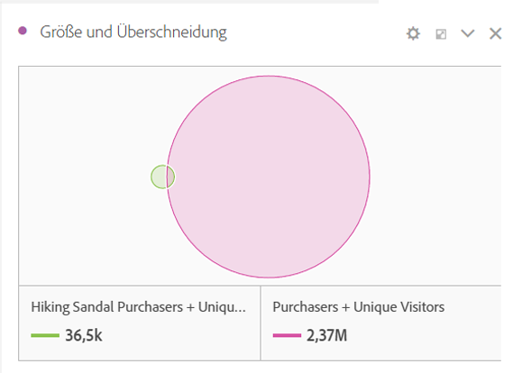
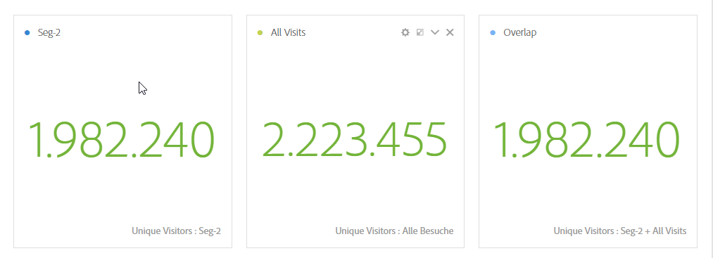
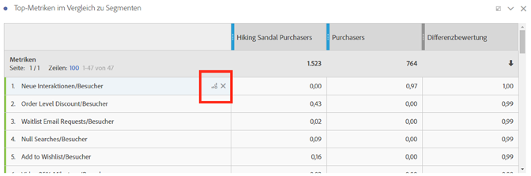
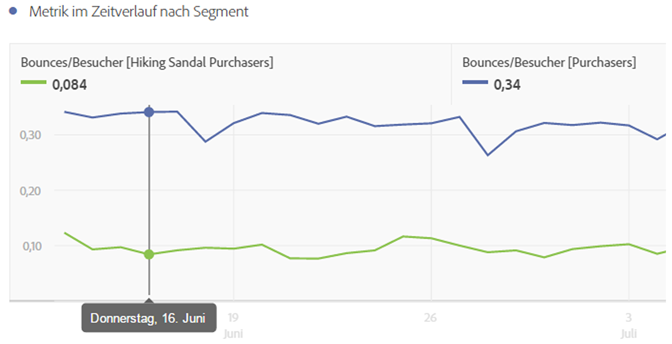
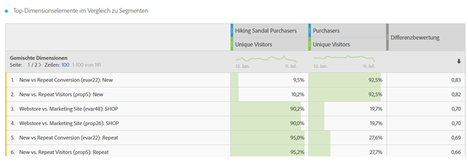
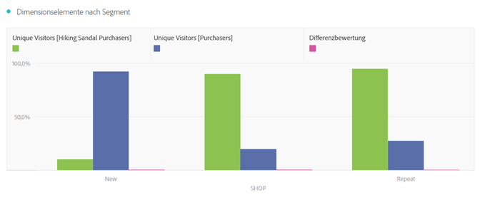
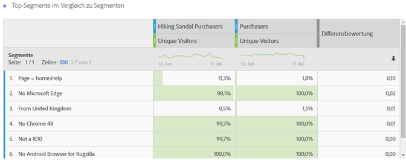
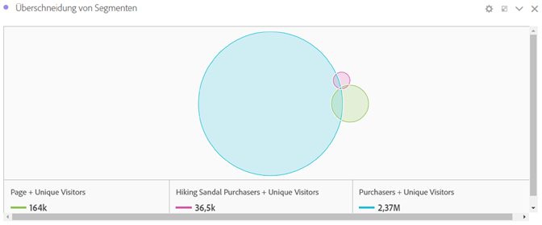

# Überblick über das Bedienfeld „Segmentvergleich“ {#segment-comparison-overview}

<!-- markdownlint-disable MD034 -->

>[!CONTEXTUALHELP]
>id="workspace_segmentcomparison_button"
>title="Segmentvergleich"
>abstract="Vergleichen Sie schnell zwei Segmente über alle Datenpunkte hinweg, um automatisch relevante Unterschiede zu ermitteln."

<!-- markdownlint-enable MD034 -->

<!-- markdownlint-disable MD034 -->

>[!CONTEXTUALHELP]
>id="workspace_segmentcomparison_panel"
>title="Bedienfeld „Segmentvergleich“"
>abstract="Vergleichen Sie schnell zwei Segmente über alle Datenpunkte hinweg, um automatisch relevante Unterschiede zu ermitteln.  **Parameter ** **Segment hinzufügen**: Das erste Segment, das analysiert werden soll. **Vergleichen mit**: Das zweite Segment, mit dem ein Vergleich durchgeführt werden soll, das automatisch mit *Alle anderen* ausgefüllt wird (die Umkehrung des ersten Segments). Sie können *Alle anderen* bei Bedarf durch ein anderes Segment ersetzen. **Erweiterte Einstellungen**: Die Möglichkeit, Komponenten von der Analyse im Rahmen des Segmentvergleichs auszuschließen."
<!-- markdownlint-enable MD034 -->

>[!BEGINSHADEBOX]

_In diesem Artikel wird das Bedienfeld „Segmentvergleich“ in_  _**Adobe Analytics** beschrieben._ _Es gibt kein vergleichbares Bedienfeld in_  _**Customer Journey Analytics**._

>[!ENDSHADEBOX]

Das Bedienfeld Segmentvergleich erkennt die meisten statistisch signifikanten Unterschiede zwischen einer unbegrenzten Anzahl von Segmenten. Die Funktion iteriert durch eine automatisierte Analyse aller Dimensionen und Metriken, auf die Sie Zugriff haben. Der Vergleich deckt automatisch die wichtigsten Merkmale der Zielgruppensegmente auf, die für die KPIs Ihres Unternehmens verantwortlich sind, und zeigt Ihnen, wie viele Segmente sich überschneiden.

>[!BEGINSHADEBOX]

Unter  [Segmentvergleich](https://video.tv.adobe.com/v/23976?quality=12&learn=on){target="_blank"} finden Sie ein Demovideo.

>[!ENDSHADEBOX]

## Verwenden

So verwenden Sie das Panel **[!UICONTROL Attribution]**:

1. Erstellen Sie das Panel **[!UICONTROL Attribution]**. Informationen zum Erstellen eines Bedienfelds finden Sie unter [Erstellen eines Bedienfelds](../panels.md#create-a-panel).

1. Legen Sie die [Eingabe](#panel-input) für das Bedienfeld fest.

1. Sehen Sie sich die [Ausgabe](#panel-output) für das Bedienfeld an.

### Panel-Eingabe

Sie können das Bedienfeld [!UICONTROL Segmentvergleich] mithilfe der folgenden Eingabeeinstellungen konfigurieren:

| Eingabe | Beschreibung |
| --- | --- |
| **[!UICONTROL Segment hinzufügen]** | Wählen Sie die Dimension aus, mit der Sie vergleichen möchten. |
| **[!UICONTROL Vergleichen mit]** | Wählen Sie die Dimension aus, die Sie zum Vergleichen des ursprünglich ausgewählten Segments verwenden möchten. Wenn Sie kein bestimmtes Segment auswählen, wird das Standardsegment **[!UICONTROL Alle anderen]** verwendet. |
| **[!UICONTROL Erweiterte Einstellungen einblenden/ausblenden]** | Wählen Sie **[!UICONTROL Erweiterte Einstellungen einblenden]**, um **[!UICONTROL ausgeschlossene Komponenten]** zu konfigurieren, wählen Sie **[!UICONTROL Erweiterte Einstellungen ausblenden]**, um **[!UICONTROL ausgeschlossene Komponenten]** auszublenden. |
| **[!UICONTROL Ausgeschlossene Komponenten]** | Komponenten, die Sie für den Ausschluss angeben können, z. B. **[!UICONTROL Dimensionen]**, **[!UICONTROL Metriken]** oder **[!UICONTROL Segmente]**. <ul><li>Ziehen Sie eine oder mehrere Dimensionen, Metriken oder Segmente per Drag-and-Drop aus den Containern in den Container **[!UICONTROL Ausgeschlossene Komponenten]**.</li><li>Wählen Sie zum Entfernen einer Komponente den Typ (**[!UICONTROL Dimension]**, **[!UICONTROL Metriken]** oder **[!UICONTROL Segmente]**) aus und wählen Sie , um eine Komponente zu entfernen. Um alle Komponenten zu entfernen, wählen Sie **[!UICONTROL Alle löschen]**.</li><li>Um die aktuelle Auswahl von Dimensionen, Metriken und Segmenten als Standard festzulegen, wählen Sie **[!UICONTROL Als Standard festlegen]**.</li></ul> |

Wählen Sie **[!UICONTROL Erstellen]** aus, um das Bedienfeld zu erstellen.

### Panel-Ausgabe

Nachdem Adobe Analytics die Analyse der beiden gewünschten Segmente abgeschlossen hat, zeigen die Bedienfelder „Ausgabe“ die Ergebnisse in mehreren Visualisierungen an:

| Visualisierung | Beschreibung |
|---|---|
| **[!UICONTROL Größe und Überschneidung]** | Zeigt mit einer [Venn-Visualisierung](/help/analyze/analysis-workspace/visualizations/venn.md) die komparativen Größen aller ausgewählten Segmente und wie stark sich diese überschneiden.  |
| **[!UICONTROL Unique Visitors für das erste Segment]** | Eine Visualisierung [Zusammenfassungszahl](/help/analyze/analysis-workspace/visualizations/summary-number-change.md), die die Unique Visitors für das erste Segment zeigt (im Beispiel Einzelseitenbesuche) |
| **[!UICONTROL Unique Visitors für das zweite Segment]** | Eine Visualisierung [Zusammenfassungszahl](/help/analyze/analysis-workspace/visualizations/summary-number-change.md), die die Unique Visitors für das zweite Segment zeigt (im Beispiel Erstbesuche) |
| **[!UICONTROL Top-Metriken für Segmente]** | Eine [Freiformtabelle](/help/analyze/analysis-workspace/visualizations/freeform-table/freeform-table.md) mit den Top-Metriken für die ausgewählten Segmente. |
| **[!UICONTROL Metrik im Zeitverlauf nach Segment]** | Eine [Linienvisualisierung](/help/analyze/analysis-workspace/visualizations/line.md) mit den Metriken für die ausgewählten Segmente im Zeitverlauf. |
| **[!UICONTROL Top-Dimensionselemente im Vergleich zu Segmenten]** | Eine [Freiformtabelle](/help/analyze/analysis-workspace/visualizations/freeform-table/freeform-table.md) mit den gemischten Dimensionselementen für die ausgewählten Segmente. |
| **[!UICONTROL Dimensionselemente nach Segmenten]** | Eine [Horizontalbalkenvisualisierung](/help/analyze/analysis-workspace/visualizations/horizontal-bar.md) mit Dimensionselementen nach Segment. |
| **[!UICONTROL Top-Segmente im Vergleich zu Segmenten]** | Eine [Freiformtabelle](/help/analyze/analysis-workspace/visualizations/freeform-table/freeform-table.md) mit Top-Segmenten im Vergleich zu Segmenten. |
| **[!UICONTROL Segmentüberschneidung]** | Eine [Venn-Visualisierung](/help/analyze/analysis-workspace/visualizations/venn.md) mit der Segmentüberschneidung. |

Verwenden Sie , um das Bedienfeld neu zu konfigurieren und neu zu erstellen.

<!--
#### Size and overlap

Illustrates the comparative sizes of each selected segment and how much they overlap with each other using a venn diagram. You can hover over the visual to see how many visitors were in each overlapping or non-overlapping section. You can also right click on the overlap to create a brand new segment for further analysis. If the two segments are mutually exclusive, no overlap is shown between the two circles (typically seen with segments using a hit container).

#### Population summaries

To the right of the Size and Overlap visualization, the total unique visitor count in each segment and overlap is shown.

#### Top metrics

Displays the most statistically significant metrics between the two segments. Each row in this table represents a differentiating metric, ranked by how different it is between each segment. A difference score of 1 means it is statistically significant, while a difference score of 0 means there is no statistical significance.

This visualization is similar to freeform tables in Analysis Workspace. If deeper analysis on a specific metric is desired, hover over a line item and click 'Create visual'. A new table is created to analyze that specific metric. If a metric is irrelevant to your analysis, hover over the line item and click the 'X' to remove it.

>[!NOTE]
>
>Metrics added to this table after the segment comparison has finished do not receive a Difference Score.

#### Metric over time by segment

To the right of the metrics table is a linked visualization. You can click a line item in the table on the left, and this visualization updates to show that metric trended over time.

#### Top dimensions

Shows the most statistically significant dimension items across all of your dimensions. Each row shows the percentage of each segment exhibiting this dimension item. For example, this table might reveal that 100% of visitors in 'Segment A' had the dimension item 'Browser Type: Google', whereas only 19.6% of 'Segment B' had this dimension item. A difference score of 1 means it is statistically significant, while a difference score of 0 means there is no statistical significance.

This visualization is similar to freeform tables in Analysis Workspace. If deeper analysis on a specific dimension item is desired, hover over a line item and click 'Create visual'. A new table is created to analyze that specific dimension item. If a dimension item is irrelevant to your analysis, hover over the line item and click the 'X' to remove it.

>[!NOTE]
>
>Dimension items added to this table after the segment comparison has finished do not receive a Difference Score.

#### Dimension items by segment

To the right of the dimensions table is a linked bar chart visualization. It shows all displayed dimension items in a bar chart. Clicking a line item in the table on the left updates the visualization on the right.

#### Top segments

Shows which other segments (other than the two segments selected for comparison) have statistically significant overlap. For example, this table can show that a third segment, 'Repeat Visitors', overlaps highly with 'Segment A' but does not overlap with 'Segment B'. A difference score of 1 means it is statistically significant, while a difference score of 0 means there is no statistical significance.

This visualization is similar to freeform tables in Analysis Workspace. If deeper analysis on a specific segment is desired, hover over a line item and click 'Create visual'. A new table is created to analyze that specific segment. If a segment is irrelevant to your analysis, hover over the line item and click the 'X' to remove it.

>[!NOTE]
>
>Segments added to this table after the segment comparison has finished do not receive a Difference Score.

#### Segment overlap

To the right of the segments table is a linked venn diagram visualization. It shows the most statistically significant segment applied to your compared segments. For example, 'Segment A' + 'Statistically significant segment' vs. 'Segment B' + 'Statistically significant segment'. Clicking a segment line item in the table on the left updates the venn diagram on the right.

-->
