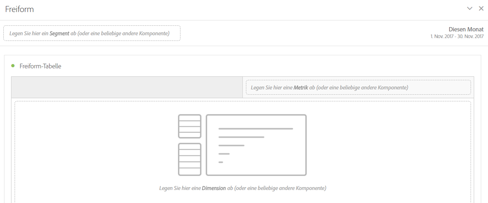

# Freiform-Bedienfeld

>[!BEGINSHADEBOX]

_In diesem Artikel wird das Freiform-Bedienfeld in_ _&#x200B;**Adobe Analytics**._ _Siehe [Freiform-Bedienfeld](/help/analyze/analysis-workspace/c-panels/freeform-panel.md) für die_ _&#x200B;**Customer Journey Analytics** Version dieses Artikels._

>[!ENDSHADEBOX]

Das Panel **[!UICONTROL Freiform]** ist ein leeres Panel mit einer Visualisierung vom Typ [Freiformtabelle](/help/analyze/analysis-workspace/visualizations/freeform-table/freeform-table.md) im Standardzustand.

## Verwenden

So verwenden Sie das Panel **[!UICONTROL Freiform]**:

1. Erstellen Sie ein Panel **[!UICONTROL Freiform]**. Informationen zum Erstellen eines Bedienfelds finden Sie unter [Erstellen eines Bedienfelds](panels.md#create-a-panel).

   

1. Wie Sie dem Bedienfeld „Freiform“ und der [Freiformtabellen](/help/analyze/analysis-workspace/visualizations/freeform-table/freeform-table.md)-Visualisierung Komponenten hinzufügen können, erfahren Sie im [Analytics-Komponentenhandbuch](/help/components/home.md).

>[!MORELIKETHIS]
>
>[Erstellen eines Bedienfelds](/help/analyze/analysis-workspace/c-panels/panels.md#create-a-panel)
>[Analytics-Komponentenhandbuch](/help/components/home.md)
>[Visualisierung „Freiformtabelle“](/help/analyze/analysis-workspace/visualizations/freeform-table/freeform-table.md)
>
