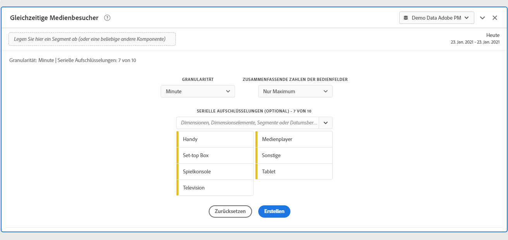
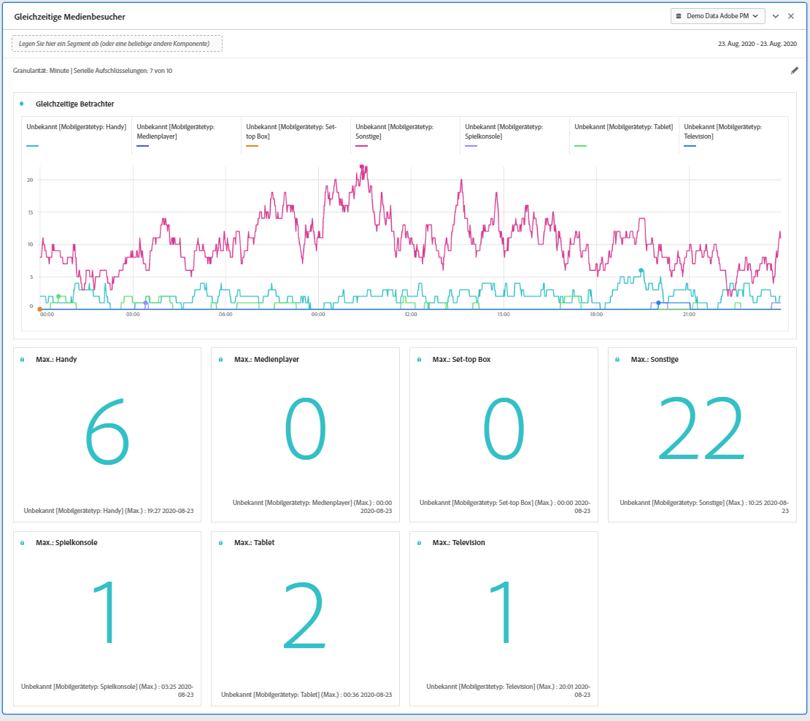
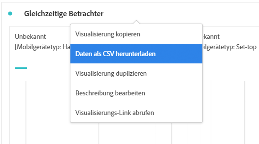
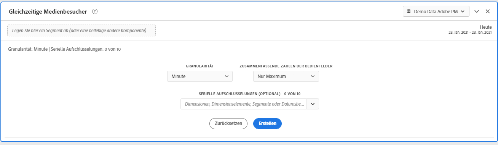

# Bedienfeld „Gleichzeitige Medienbetrachter“ {#media-concurrent-viewers-panel}

<!-- markdownlint-disable MD034 -->

>[!CONTEXTUALHELP]
>id="workspace_mediaconcurrentviewers_button"
>title="Gleichzeitige Medienbetrachtende"
>abstract="Erstellen Sie ein Panel, um den Zielgruppendurchschnitt pro Minute für bestimmte Inhalte oder über einen bestimmten Zeitraum zu analysieren."

<!-- markdownlint-enable MD034 -->

<!-- markdownlint-disable MD034 -->

>[!CONTEXTUALHELP]
>id="workspace_mediaconcurrentviewers_panel"
>title="Gleichzeitige Medienbetrachtende"
>abstract="Analysieren Sie gleichzeitige Betrachtende im Zeitverlauf, zeigen Sie Informationen zum maximalen gleichzeitigen Zugriff an oder schlüsseln Sie Daten auf und vergleichen Sie sie.  **Granularität**: Wählen Sie aus, nach welchem Zeitraum gleichzeitige Betrachtende angezeigt werden sollen. **Zusammenfassende Zahlen der Bedienfelder**: Wählen Sie diese Option aus, um für jede Zeile zusammenfassende Zahlen mit Datums- oder Uhrzeitangaben anzuzeigen. „Maximum“ zeigt Details zum maximalen gleichzeitigen Zugriff an. „Minimum“ zeigt Details für die minimale Wiedergabedauer an. **Serienaufschlüsselung (optional)**: Schlüsseln Sie Visualisierungen nach Segmenten, Dimensionen, Dimensionselementen oder Datumsbereichen auf. Sie können jeweils bis zu 10 Zeilen anzeigen. Aufschlüsselungen sind auf eine einzelne Ebene beschränkt."

<!-- markdownlint-enable MD034 -->

>[!BEGINSHADEBOX]

_In diesem Artikel wird das Bedienfeld „Gleichzeitige Medienbetrachter“ in_  _**Adobe Analytics** beschrieben._ _Unter [Bedienfeld „Gleichzeitige Medienbetrachter“](/help/analyze/analysis-workspace/c-panels/media-concurrent-viewers.md) finden Sie die Version dieses Artikels für_  _**Customer Journey Analytics**._

>[!ENDSHADEBOX]

>[!NOTE]
>
>Das Bedienfeld „Medien-Zielgruppendurchschnitt pro Minute“ ist nur für Kunden verfügbar, die das Add-on „Adobe Analytics for Streaming Media“ erworben haben.
>
>Wenden Sie sich an Ihren Adobe-Vertriebskontakt oder Ihr Adobe-Acountteam, um weitere Informationen zu erhalten.
>

Das Panel **[!UICONTROL Gleichzeitige Medienbetrachter]** ermöglicht die Analyse von gleichzeitigen Betrachtenden im Zeitverlauf, mit Details zum maximalen gleichzeitigen Zugriff sowie der Möglichkeit von Aufschlüsselungen und Vergleichen.

Sie können gleichzeitige Betrachtende analysieren, um zu verstehen, wo maximaler gleichzeitiger Zugriff auftrat oder wo es zu Abbrüchen kam. So erhalten Sie wertvolle Erkenntnisse zur Qualität von Inhalten und Interaktion mit Betrachtenden. Sie können das Panel außerdem als Hilfe bei der Fehlerbehebung oder Planung von Volumen oder Skalierung verwenden.

In Analysis Workspace umfasst die Metrik „Gleichzeitige Betrachter“ die Anzahl der Unique Persons, die sich Ihre Medien-Streams unabhängig von der Anzahl der Sitzungen zu einem bestimmten Zeitpunkt ansehen.

>[!BEGINSHADEBOX]

Unter  [Panel Gleichzeitige Medienbetrachter](https://video.tv.adobe.com/v/330177?quality=12&learn=on){target="_blank"} finden Sie ein Demovideo.

>[!ENDSHADEBOX]

## Verwenden

So verwenden Sie das Panel **[!UICONTROL Gleichzeitige Medienbetrachter]**:

1. Erstellen Sie ein Panel **[!UICONTROL Gleichzeitige Medienbetrachter]**. Informationen zum Erstellen eines Bedienfelds finden Sie unter [Erstellen eines Bedienfelds](panels.md#create-a-panel).

1. Stellen Sie sicher, dass Sie eine Datenansicht für das Bedienfeld auswählen, in dem Komponenten über das Add-on Adobe Analytics für Streaming-Medien konfiguriert sind.

1. Legen Sie die [Eingabe](#panel-input) für das Bedienfeld fest.

1. Sehen Sie sich die [Ausgabe](#panel-output) für das Bedienfeld an.

### Panel-Eingabe

Sie können das Panel „Gleichzeitige Medienbetrachter“ mithilfe der folgenden Eingabeeinstellungen konfigurieren:

| Einstellung | Beschreibung |
|---|---|
| **[!UICONTROL Datumsbereich der Panels]** | Der Datumsbereich des Panels ist standardmäßig „Heute“.  Sie können ihn so verändern, dass Sie einen einzelnen Tag oder viele Monate auf einmal betrachten können.    Diese Visualisierung ist auf 1440 Datenzeilen beschränkt (z. B. 24 Stunden bei einer Granularität auf Minutenebene).  Wenn eine Kombination aus Datumsbereich und Granularität mehr als 1.440 Zeilen zur Folge hat, wird die Granularität automatisch aktualisiert, um den vollständigen Datumsbereich anzuzeigen. |
| **[!UICONTROL Granularität]** | Die Standardeinstellung für die Granularität ist „Minute“. Diese Visualisierung ist auf 1440 Datenzeilen beschränkt (z. B. 24 Stunden bei einer Granularität auf Minutenebene).  Wenn eine Kombination aus Datumsbereich und Granularität mehr als 1.440 Zeilen zur Folge hat, wird die Granularität automatisch aktualisiert, um den vollständigen Datumsbereich anzuzeigen. |
| **[!UICONTROL Zusammenfassende Zahlen der Panels]** | Um Details zu Datum und Uhrzeit für gleichzeitige Betrachter anzuzeigen, steht eine Zusammenfassungsnummer zur Verfügung. Das Maximum zeigt Details zu Spitzenzeiten von gleichzeitigen Aufrufen an. **[!UICONTROL Minimum]** zeigt Details für die Talsohle an.  Die Standardeinstellung im Bedienfeld zeigt nur das Maximum an, Sie können diese Einstellung jedoch ändern, um nur das Minimum oder sowohl Maximum als auch Minimum anzuzeigen.  Wenn Sie Aufschlüsselungen verwenden, wird jeweils eine Zusammenfassungsnummer angezeigt. |
| **[!UICONTROL Serienaufschlüsselung]** | Optional können Sie Ihre Visualisierung nach Filtern, Dimensionen, Dimensionselementen oder Datumsbereichen aufschlüsseln. Sie können bis zu 10 Zeilen auf einmal ansehen. Aufschlüsselungen sind auf eine einzelne Ebene beschränkt. Beim Ziehen einer Dimension werden die oberen Dimensionselemente automatisch anhand des im Panel ausgewählten Datumsbereichs ausgewählt. Ziehen Sie zum Vergleichen von Datumsbereichen zwei oder mehr Datumsbereiche in den Filter für die Aufschlüsselung der Serie. |

Im Folgenden finden Sie ein Beispiel für das für die Granularität **[!UICONTROL Minute]** konfigurierte Panel mit den Zusammenfassungszahlen für **[!UICONTROL Nur Maximum]**. Und aufgeschlüsselt nach **[!UICONTROL Sonstige]**, **[!UICONTROL Tabelle]**, **[!UICONTROL Handy]**, **[!UICONTROL Spielkonsole]**, **[!UICONTROL Medienplayer]**, **[!UICONTROL Set-top-Box]**, **[!UICONTROL Fernseher]**.

### Panel-Ausgabe

Das Bedienfeld „Gleichzeitige Medienbetrachter“ gibt ein Liniendiagramm und Zusammenfassungsnummern zurück, die Details zu maximalen und/oder minimalen gleichzeitigen Betrachtern enthalten.  Oben im Panel wird eine Zusammenfassungszeile angezeigt, die Sie an die ausgewählten Panel-Einstellungen erinnert.

Sie können jederzeit  auswählen, um das Panel zu bearbeiten und neu zu erstellen.

Wenn Sie eine Serienaufschlüsselung ausgewählt haben, wird für jeden der folgenden Punkte eine Zeile im Liniendiagramm und eine Zusammenfassungszahl angezeigt:

### Datenquelle

Die einzige Metrik, die in diesem Panel verwendet werden kann, ist **[!UICONTROL Gleichzeitige Betrachter]**:

| Metrik | Beschreibung |
|---|---|
| **[!UICONTROL Gleichzeitige Betrachter]** | Die Anzahl der Unique Persons, die Ihre Medien-Streams zu einem bestimmten Zeitpunkt angesehen haben, unabhängig von der Anzahl der Sitzungen. |

Eine Freiformtabelle ist in dieser Ansicht nicht verfügbar.  Um die Datenquelle anzuzeigen, können Sie die Datenquelle über das Kontextmenü für die Liniendiagrammvisualisierung herunterladen und **[!UICONTROL Daten als CSV herunterladen]** auswählen.  Serienaufschlüsselungen sind enthalten.

## Häufig gestellte Fragen (FAQ)

| Frage | Antwort |
|---|---|
| Wo ist die Freiformtabelle? Wie kann ich die Datenquelle anzeigen? | Die Freiformtabelle ist in dieser Ansicht nicht verfügbar.  Sie können die Datenquelle über das Kontextmenü des Liniendiagramms herunterladen und die Option **[!UICONTROL Daten als CSV herunterladen]** auswählen. |
| Warum hat sich meine Granularität verändert? | Diese Visualisierung ist auf 1440 Datenzeilen beschränkt (z. B. 24 Stunden bei einer Granularität auf Minutenebene).  Wenn eine Kombination aus Datumsbereich und Granularität mehr als 1.440 Zeilen zur Folge hat, wird die Granularität automatisch aktualisiert, um den vollständigen Datumsbereich anzuzeigen.  Wenn Sie von einem größeren zu einem kleineren Datumsbereich wechseln, wird die Granularität auf das niedrigste zulässige Detail aktualisiert, sobald der Datumsbereich geändert wird. Um eine höhere Granularität zu sehen, bearbeiten Sie das Panel und erstellen Sie es erneut. |
| Wie vergleiche ich Videonamen, Filter, Inhaltstypen und andere Elemente? | Um diese Elemente in einer einzigen Visualisierung zu vergleichen, ziehen Sie Filter, Dimensionen oder bestimmte Dimensionselemente in den Filter für die Serienaufschlüsselung.  Die Ansicht ist auf 10 Aufschlüsselungen beschränkt.  Um mehr als 10 ansehen zu können, müssen Sie mehrere Bedienfelder verwenden. |
| Wie vergleiche ich Datumsbereiche? | Um Datumsbereiche in einer einzigen Visualisierung zu vergleichen, verwenden Sie die Serienaufschlüsselungen, indem Sie zwei oder mehr Datumsbereiche in das Panel ziehen.  Diese Datumsbereiche setzen den Datumsbereich des Panels außer Kraft. |
| Wie ändere ich den Visualisierungstyp? | Dieses Bedienfeld ermöglicht nur die Linienvisualisierung für die Zeitreihen. |
| Kann ich die Anomalieerkennung ausführen? | Nein.  Die Anomalieerkennung ist für dieses Panel nicht verfügbar. |
| Warum sollte ich Unique Persons anstelle von aktiven Sitzungen verwenden? | Die Verwendung von Unique Persons ermöglicht das Entfernen unerwünschter Spitzen in den Anzeige-Grenzbereichen (wo Sitzungen gleichzeitig enden und beginnen). |
| Was bedeutet es, parallele Betrachter mit einer Granularität von mehr als einer Minute zu haben? | Bei einer Granularität von mehr als einer Minute stellen gleichzeitige Betrachter die Summe der gleichzeitigen Unique Viewers für alle Minuten innerhalb dieses Zeitraums dar.  Beispielsweise ist die Granularität gleichzeitiger Betrachtender auf Stundenebene die Summe der gleichzeitigen Unique Persons für alle Minuten innerhalb der Stunde. |
| Zeigt das Arbeitsbereich-Bedienfeld dieselben Informationen wie der Bericht zu gleichzeitigen Betrachtern? | Nein.  In Analysis Workspace ist die Metrik „Gleichzeitige Betrachter“ definiert als die Anzahl der Unique Persons, die sich Ihren Medien-Stream zu einem bestimmten Zeitpunkt ansehen. Unabhängig von der Anzahl der Sitzungen.  Diese Metrik unterscheidet sich vom Bericht Gleichzeitige Betrachter im Bereich Berichte, wo die gleichzeitigen aktiven Sitzungen zugrunde gelegt werden. Durch die Verwendung der Unique Persons werden unerwünschte „Spitzen“ in den Anzeige-Grenzbereichen (wo die Sitzungen gleichzeitig enden und beginnen) entfernt. |

<!-- For more information about Media Concurrent Viewers, visit [MA doc page]( https://url). -->

>[!MORELIKETHIS]
>
>[Erstellen eines Bedienfelds](/help/analyze/analysis-workspace/c-panels/panels.md#create-a-panel)
>>[Panel Verbrachte Zeit bei der Medienwiedergabe](media-playback-time-spent.md)
>>[Panel Medien-Zielgruppendurchschnitt pro Minute](average-minute-audience-panel.md)
>
<!--
# Media Concurrent Viewers panel

Customers who have purchased the Streaming Media Collection Add-on can analyze concurrent viewers to understand where peak concurrency occurred or where drop-offs happened to provide valuable insight into the quality of content and viewer engagement, and to help with troubleshooting or planning for volume or scale.

In Analysis Workspace, Concurrent Viewers is the number of unique visitors viewing your media stream(s) at a specific point in time, regardless of the number of sessions.

The Media Concurrent Viewers panel enables analysis of concurrent viewers over time, with details on peak concurrency and the ability to break down and compare.  To access the Media Concurrent Viewers panel, navigate to a report suite with streaming media components enabled. Then, click the panel icon on the far-left and drag the panel into your Analysis Workspace project.

Here is a video overview of this panel:

>[!VIDEO](https://video.tv.adobe.com/v/330177/?quality=12)

## Panel Inputs {#Input}

You can configure the Media Concurrent Viewers panel using these input settings:

|Setting|Description|
|---|---|
|Panel date range|The panel date range default is Today.  You may edit it to view a single day or many months at a time.    This visualization is limited to 1440 rows of data (for example, 24-hours at minute-level granularity).  If a date range and granularity combination results in more than 1440 rows, the granularity is automatically updated to accommodate the full date range.|
|Granularity|The granularity default is Minute.    This visualization is limited to 1440 rows of data (for example, 24-hours at minute-level granularity).  If a date range and granularity combination results in more than 1440 rows, the granularity is automatically updated to accommodate the full date range.|
|Panel summary numbers| To see date or time details for concurrent viewers, a summary number is available. The Maximum shows details for peak concurrency. The Minimum shows details for the trough.  The panel default shows Maximum only, but you can change it to show Minimum or both Maximum and Minimum.  If you are using breakdowns, a summary number is displayed for each.|
|Series breakdown| Optionally, you can break down your visualization by segments, dimensions, dimension items, or date ranges.   - You may view up to 10 lines at a time. Breakdowns are limited to a single level.  - When dragging a dimension, the top dimension items will be automatically selected based on the selected panel date range.  - To compare date ranges, drag 2 or more date ranges into the series breakdown filter.|

### Default view

### Series breakdown view

## Panel Output {#Output}

The Media Concurrent Viewers panel returns a line chart and summary numbers to include details for the maximum and/or minimum concurrent viewers.  At the top of the panel, a summary line is provided to remind you of the panel settings you selected.

At any time, you can edit and rebuild the panel by clicking the edit pencil on the top right.

If you selected series breakdown, a line on the line chart and a summary number is displayed for each:

### Data Source

The only metric that can be used in this panel is Concurrent Viewers:

|Metric|Description|
|---|---|
|Concurrent Viewers| Number of unique visitors viewing your media stream(s) at a specific point in time, regardless of the number of sessions.  This is different than Concurrent Viewer reporting in the Reports section, which uses Concurrent Active Sessions.  Using unique visitors accounts for removal of unwanted 'spikes' at show boundaries (where sessions are ending and starting at the same time).|

A Freeform table is not available in this view.  In order to view the data source, you may right-click on the line chart and download as a .csv file.  Series breakdowns will be included.

## FAQs {#FAQ}

|Question|Answer|
|---|---|
|Where is the Freeform table? How can I see the data source?| The Freeform table is not available in this view.  You can download the data source by right-clicking on the line chart and downloading the CSV file.|
|Why did my granularity change?|This visualization is limited to 1440 rows of data (for example, 24-hours at minute-level granularity).  If a date range and granularity combination results in more than 1440 rows, the granularity will be automatically updated to accommodate the full date range.  When changing from a larger date range to a smaller one, the granularity will be updated to the lowest detail allowable once the date range is changed. To view a higher granularity, edit the panel and rebuild.|
|How do I compare video names, segments, content types, etc?|To compare these in a single visualization, drag segments, dimensions, or specific dimension items in the series breakdown filter.  The view is limited to 10 breakdowns.  To view more than 10, you must use multiple panels.|
|How do I compare date ranges?|To compare date ranges in a single visualization, use the series breakdowns by dragging 2 or more date ranges.  These date ranges will override the panel date range.|
|How do I change the visualization type?|This panel only allows for the line visualization for the time series.|
|Can I run anomaly detection?|No.  Anomaly detection is not available for this panel.|
|Why use unique visitors instead of active sessions?|Using unique visitors enables removal of unwanted spikes at show boundaries (where sessions are ending and starting at the same time).|
|What does it mean to have concurrent viewers at higher granularity than minute?|With a granularity larger than a minute, concurrent viewers is the sum of unique concurrent viewers for all minutes within that time range.  For example, at hour-level granularity concurrent viewers is the sum of unique concurrent viewers for all minutes within the hour.|
|Does the workspace panel show the same information as the Concurrent Viewers Report?|No.  In Analysis Workspace, Concurrent viewers is defined as the number of unique visitors viewing your media stream at a specific point in time, regardless of the number of sessions.  This is different than Concurrent Viewer reporting in the Reports section, which uses Concurrent Active Sessions.  Using unique visitors accounts for removal of unwanted spikes at show boundaries—where sessions are ending and starting at the same time.|

-->
