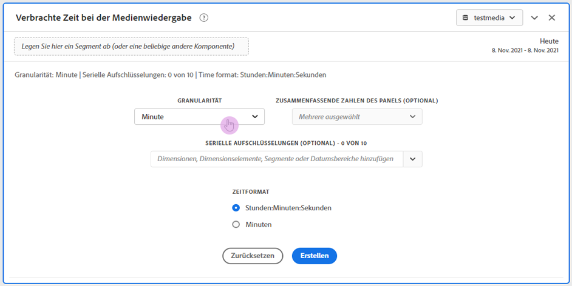
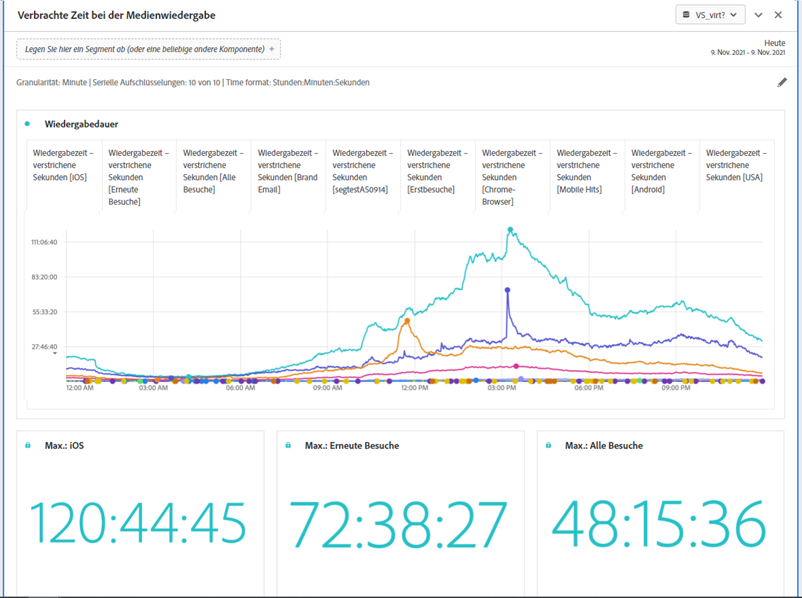

# Panel „Bei der Medienwiedergabe verbrachte Zeit“ {#media-playback-time-spent-panel}

<!-- markdownlint-disable MD034 -->

>[!CONTEXTUALHELP]
>id="workspace_mediaplaybacktimespent_button"
>title="Verbrachte Zeit bei der Medienwiedergabe"
>abstract="Erstellen Sie ein Bedienfeld, um den Videokonsum im Zeitverlauf mit verschiedenen Granularitätsebenen analysieren sowie Aufschlüsselungen und Vergleiche durchführen zu können."

<!-- markdownlint-enable MD034 -->

<!-- markdownlint-disable MD034 -->

>[!CONTEXTUALHELP]
>id="workspace_mediaplaybacktimespent_panel"
>title="Verbrachte Zeit bei der Medienwiedergabe"
>abstract="Analysieren Sie den Videokonsum im Zeitverlauf, wählen Sie verschiedene Granularitäten aus, schlüsseln Sie die Daten auf und vergleichen Sie sie.  **Granularität**: Wählen Sie aus, nach welchem Zeitraum gleichzeitige Betrachtende angezeigt werden sollen. **Zusammenfassende Zahlen der Bedienfelder (optional)**: Wählen Sie diese Option aus, um für jede Zeile zusammenfassende Zahlen mit Datums- oder Uhrzeitangaben anzuzeigen. „Maximum“ zeigt Details für die maximale Wiedergabedauer an. „Minimum“ zeigt Details für die minimale Wiedergabedauer an. „Summe“ zeigt Details zur Gesamtwiedergabedauer an. **Serienaufschlüsselung (optional)**: Schlüsseln Sie Visualisierungen nach Segmenten, Dimensionen, Dimensionselementen oder Datumsbereichen auf. Sie können jeweils bis zu 10 Zeilen anzeigen. Aufschlüsselungen sind auf eine einzelne Ebene beschränkt. **Zeitformat**: Wählen Sie diese Option aus, um das Zeitformat für Visualisierungen in Stunden oder Minuten anzuzeigen."

<!-- markdownlint-enable MD034 -->

>[!BEGINSHADEBOX]

_In diesem Artikel wird das Bedienfeld „Verbrachte Zeit bei der Medienwiedergabe“ in_  _&#x200B;**Adobe Analytics** beschrieben._ _Unter [Bedienfeld „Verbrachte Zeit bei der Medienwiedergabe“](https://experienceleague.adobe.com/de/docs/analytics/analyze/analysis-workspace/panels/media-playback-time-spent) finden Sie die Version dieses Artikels für_  _&#x200B;**Customer Journey Analytics**._

>[!ENDSHADEBOX]

>[!NOTE]
>
>Das Bedienfeld „Medien-Zielgruppendurchschnitt pro Minute“ ist nur für Kundinnen und Kunden verfügbar, die das Add-on zur Streaming-Mediensammlung für Adobe Analytics gekauft haben.
>&#x200B;>Wenden Sie sich an Ihren Adobe-Vertriebskontakt oder Ihr Adobe-Accountteam, um weitere Informationen zu erhalten.
>

Das Panel **[!UICONTROL Verbrachte Zeit bei der Medienwiedergabe]** ermöglicht die Analyse der Medienwiedergabe im Zeitverlauf und bietet Details zum maximalen gleichzeitigen Zugriff sowie die Möglichkeit von Aufschlüsselungen und Vergleichen.

In Analysis Workspace ist die Wiedergabedauer die Zeit, die zu einem bestimmten Zeitpunkt mit der Anzeige Ihrer Medien-Streams verbracht wurde. Dazu gehören Pausen, Puffer und die Zeit bis zum Start.

Kundinnen und Kunden, die das Add-on zur Streaming-Mediensammlung erworben haben, können die Wiedergabedauer analysieren, um wertvolle Einblicke in die Qualität von Inhalten und die Interaktion mit Betrachtenden zu erhalten. Sie können es außerdem als Hilfe bei der Fehlerbehebung oder Planung von Volumen oder Skalierung verwenden.

Die Wiedergabedauer kann Ihnen dabei helfen, Folgendes zu verstehen:

* Wo es einen maximalen gleichzeitigen Zugriff gab.

* Wo es zu Abbrüchen kam.

>[!BEGINSHADEBOX]

Unter  [Bedienfeld „Verbrachte Zeit bei der Medienwiedergabe“](https://video.tv.adobe.com/v/3446709?quality=12&learn=on&captions=ger){target="_blank"} finden Sie ein Demovideo.

>[!ENDSHADEBOX]

## Verwenden

So verwenden Sie das Panel **[!UICONTROL Verbrachte Zeit bei der Medienwiedergabe]**:

1. Erstellen Sie das Panel **[!UICONTROL Verbrachte Zeit bei der Medienwiedergabe]**. Informationen zum Erstellen eines Bedienfelds finden Sie unter [Erstellen eines Bedienfelds](panels.md#create-a-panel).

1. Stellen Sie sicher, dass Sie eine Datenansicht für das Panel auswählen, in der Komponenten aus der Streaming-Mediensammlung konfiguriert sind.

1. Legen Sie die [Eingabe](#panel-input) für das Bedienfeld fest.

1. Sehen Sie sich die [Ausgabe](#panel-output) für das Bedienfeld an.

### Panel-Eingabe

Sie können das Panel „Verbrachte Zeit bei der Medienwiedergabe“ mithilfe der folgenden Eingabeeinstellungen konfigurieren:

| Einstellung | Beschreibung |
|---|---|
| Datumsbereich der Bedienfelder | Der Datumsbereich des Panels ist standardmäßig „Heute“. Sie können ihn so verändern, dass Sie einen einzelnen Tag oder viele Monate auf einmal betrachten können. Diese Visualisierung ist auf 1440 Datenzeilen beschränkt (z. B. 24 Stunden bei einer Granularität auf Minutenebene). Wenn eine Kombination aus Datumsbereich und Granularität mehr als 1.440 Zeilen zur Folge hat, wird die Granularität automatisch aktualisiert, um den vollständigen Datumsbereich anzuzeigen. |
| Granularität | Die Standardeinstellung für die Granularität ist „Minute“. Diese Visualisierung ist auf 1440 Datenzeilen beschränkt (z. B. 24 Stunden bei einer Granularität auf Minutenebene). Wenn eine Kombination aus Datumsbereich und Granularität mehr als 1.440 Zeilen zur Folge hat, wird die Granularität automatisch aktualisiert, um den vollständigen Datumsbereich anzuzeigen. |
| Zusammenfassende Zahlen der Bedienfelder | Um Details zu Datum und Uhrzeit für die verbrachte Zeit bei der Medienwiedergabe anzuzeigen, steht eine zusammenfassende Zahl zur Verfügung. Das Maximum zeigt Details zu Spitzenzeiten von gleichzeitigen Aufrufen an. Das Minimum zeigt Details zum Tiefpunkt an. In der Summe wird die gesamte Wiedergabezeit für diese Auswahl dargestellt. Im Panel wird standardmäßig nur der maximale Wert angezeigt. Sie können dies jedoch ändern, sodass das Minimum, die Summe oder eine beliebige Kombination der drei Werte angegeben wird. Wenn Sie Aufschlüsselungen verwenden, wird jeweils eine Zusammenfassungsnummer angezeigt. |
| Serienaufschlüsselung | Optional können Sie Ihre Visualisierung nach Filtern, Dimensionen, Dimensionselementen oder Datumsbereichen aufschlüsseln.
– Sie können bis zu 10 Zeilen auf einmal ansehen. Aufschlüsselungen sind auf eine einzelne Ebene beschränkt.

– Beim Ziehen einer Dimension werden die oberen Dimensionselemente automatisch anhand des im Panel ausgewählten Datumsbereichs ausgewählt.
– Ziehen Sie zum Vergleichen von Datumsbereichen zwei oder mehr Datumsbereiche in den Filter für die Aufschlüsselung der Serie. |
| Zeitformat | Sie können die Wiedergabedauer entweder in `Hours:Minutes:Seconds` (Standard) oder in `Minutes` (in Ganzzahlen, ab 0,5 aufgerundet) anzeigen. |
| Anzeige der Datumsreihe | Wenn Sie mindestens zwei Datumsbereichsfilter als Serienaufschlüsselungen platziert haben, sehen Sie die Option zur Auswahl einer Überlagerung (Standard) oder einer Sequenz. Bei der Überlagerung werden die Linien mit einem gemeinsamen x-Achsen-Beginn gezeigt, sodass sie parallel laufen, während bei der Sequenz die Linien mit ihrem jeweiligen x-Achsen-Beginn dargestellt werden. Wenn die Daten aufeinanderfolgend sind (z. B. Filter 1 endet um 20:44 Uhr und Filter 2 startet um 20:45 Uhr), werden die Zeilen nacheinander dargestellt. |

### Panel-Ausgabe

Das Panel „Verbrachte Zeit bei der Medienwiedergabe“ gibt ein Liniendiagramm und zusammenfassende Zahlen zurück, die Details zur maximalen Wiedergabedauer, minimalen Wiedergabedauer und/oder der Summe der Wiedergabedauer enthalten. Oben im Panel wird eine Zusammenfassungszeile angezeigt, die Sie an die ausgewählten Panel-Einstellungen erinnert.

Sie können jederzeit  auswählen, um das Panel zu bearbeiten und neu zu erstellen.

Wenn Sie die Serienaufschlüsselung auswählen, wird für Folgendes jeweils eine Linie im Liniendiagramm und eine Zusammenfassungsnummer angezeigt:

### Datenquelle

Die einzige Metrik, die in diesem Panel verwendet werden kann, ist „Wiedergabedauer“.

| Metrik | Beschreibung |
|---|---|
| Wiedergabedauer | Summe der `hours:minutes:seconds` (oder `minutes`) des Inhalts, der während der ausgewählten Granularität betrachtet wurde, einschließlich Pausen, Pufferung und der Zeit bis zum Start. |

## Häufig gestellte Fragen (FAQ)

| Frage | Antwort |
|---|---|
| Wo ist die Freiformtabelle? Wie kann ich die Datenquelle anzeigen? | 

Die Freiformtabelle ist in dieser Ansicht nicht verfügbar. Um die Datenquelle herunterzuladen, wählen Sie aus dem Kontextmenü im Liniendiagramm die Option zum Herunterladen der CSV-Datei aus.
 |
| 
Warum hat sich meine Granularität verändert?
 | 
Diese Visualisierung ist auf 1440 Datenzeilen beschränkt (z. B. 24 Stunden bei einer Granularität auf Minutenebene). Wenn eine Kombination aus Datumsbereich und Granularität mehr als 1.440 Zeilen zur Folge hat, wird die Granularität automatisch aktualisiert, um den vollständigen Datumsbereich anzuzeigen.

Wenn Sie von einem größeren zu einem kleineren Datumsbereich wechseln, wird die Granularität auf das niedrigste zulässige Detail aktualisiert, sobald der Datumsbereich geändert wird. Um eine höhere Granularität zu sehen, bearbeiten Sie das Panel und erstellen Sie es erneut.
 |
| 

Wie vergleiche ich Videonamen, Filter, Inhaltstypen usw.?
 | 
Um diese in einer einzigen Visualisierung zu vergleichen, ziehen Sie Filter, Dimensionen oder bestimmte Dimensionselemente per Drag-and-Drop in den Filter für die Serienaufschlüsselung.

Die Ansicht ist auf 10 Aufschlüsselungen beschränkt. Um mehr als 10 ansehen zu können, müssen Sie mehrere Bedienfelder verwenden.
 |
| Wie vergleiche ich Datumsbereiche? | Um Datumsbereiche in einer einzigen Visualisierung zu vergleichen, verwenden Sie die Serienaufschlüsselungen, indem Sie zwei oder mehr Datumsbereiche in das Panel ziehen. Diese Datumsbereiche setzen den Datumsbereich des Panels außer Kraft. |
| Wie ändere ich den Visualisierungstyp? | 

Dieses Bedienfeld ermöglicht nur die Linienvisualisierung für die Zeitreihen.
 |
| Kann ich die Anomalieerkennung ausführen? | 

Nein. Die Anomalieerkennung ist für dieses Panel nicht verfügbar.
 |

>[!MORELIKETHIS]
>
>[Erstellen eines Bedienfelds](/help//analyze/analysis-workspace/c-panels/panels.md#create-a-panel)
>&#x200B;>[Panel „Medien-Zielgruppendurchschnitt pro Minute“](average-minute-audience-panel.md)
>&#x200B;>[Panel „Gleichzeitige Medienbetrachter“](media-concurrent-viewers.md)
>

<!--
# Media Playback Time Spent panel

In Analysis Workspace, Playback Time Spent is the amount of time spent viewing your media streams at a specific point in time. It includes pause, buffer, and time to start.

The Media Playback Time Spent panel enables analysis of playback over time, with details on peak concurrency and the ability to break down and compare. 

Customers who have purchased the Streaming Media Collection Add-on can analyze playback time spent to gain valuable insight into the quality of content and viewer engagement, and to help when troubleshooting or planning for volume or scale.

Playback Time Spent can help you understand:

* Where peak concurrency occurred

* Where drop-offs occurred 

Following is a video overview of this panel:

>[!VIDEO](https://video.tv.adobe.com/v/3446709?captions=ger)

## Use the Media Playback Time Spent panel

1. Go to a report suite with streaming media components enabled. 
1. Select the panel icon on the far-left, then drag the panel into your Analysis Workspace project.
1. Continue with the following sections to customize the Media Playback Time Spent panel

   * [Panel Inputs](#panel-inputs)
   * [Panel Output](#panel-output)

## Panel Inputs {#Input}

You can configure the Media Playback Time Spent panel using these input settings:

|Setting|Description|
|---|---|
|Panel date range|The panel date range default is Today. You may edit it to view a single day or many months at a time. This visualization is limited to 1440 rows of data (for example, 24-hours at minute-level granularity). If a date range and granularity combination results in more than 1440 rows, the granularity is automatically updated to accommodate the full date range.|
|Granularity|The granularity default is Minute. This visualization is limited to 1440 rows of data (for example, 24-hours at minute-level granularity). If a date range and granularity combination results in more than 1440 rows, the granularity is automatically updated to accommodate the full date range.|
|Panel summary numbers|To see date or time details for playback time spent, a summary number is available. The Maximum shows details for peak concurrency. The Minimum shows details for the trough. Sum adds up the total playback time spent for the selection. The panel default shows Maximum only, but you can change it to show Minimum, Sum, or any combination of the three. If you are using breakdowns, a summary number is displayed for each.|
|Series breakdown|Optionally, you can break down your visualization by segments, dimensions, dimension items, or date ranges.
- You may view up to 10 lines at a time. Breakdowns are limited to a single level.

- When dragging a dimension, the top dimension items will be automatically selected based on the selected panel date range.
- To compare date ranges, drag 2 or more date ranges into the series breakdown filter.|
|Time format|You can view the playback time spent in either `Hours:Minutes:Seconds` (default) or in `Minutes` (which is displayed in whole numbers, rounded up at .5). |
|Date sequence display|If you've placed at least two date range segments as series breakdowns you'll see the option to select either overlay (default) or sequential. Overlay will display the lines with a common x-axis start so that they run in parallel, while sequential will display the lines with their specific x-axis start. If the data lines up (for example, segment 1 ends at 8:44 pm and segment 2 starts at 8:45 pm), then the lines will show in sequence. |

## Default view

## Panel Output {#Output}

The Media Playback Time Spent panel returns a line chart and summary numbers to include details for the maximum, minimum, and/or sum of playback time spent. At the top of the panel, a summary line is provided to remind you of the panel settings you selected.

At any time, you can edit and rebuild the panel by clicking the edit pencil on the top right.

If you selected series breakdown, a line on the line chart and a summary number is displayed for each:

### Data Source

The only metric that can be used in this panel is Playback Time Spent.

|Metric|Description|
|---|---|
|Playback Time Spent|Total `hours:minutes:seconds` (or `minutes`) of content viewed during the selected granularity including pause, buffer, and time to start.|

## FAQs

|Question|Answer|
|---|---|
|Where is the Freeform table? How can I see the data source?|The Freeform table is not available in this view. You can download the data source by right-clicking on the line chart and downloading the CSV file.|
|Why did my granularity change?|This visualization is limited to 1440 rows of data (for example, 24-hours at minute-level granularity). If a date range and granularity combination results in more than 1440 rows, the granularity will be automatically updated to accommodate the full date range. 
When changing from a larger date range to a smaller one, the granularity will be updated to the lowest detail allowable once the date range is changed. To view a higher granularity, edit the panel and rebuild.
|
| How do I compare video names, segments, content types, etc?| To compare these in a single visualization, drag segments, dimensions, or specific dimension items in the series breakdown filter.The view is limited to 10 breakdowns. To view more than 10, you must use multiple panels.|
|How do I compare date ranges?|To compare date ranges in a single visualization, use the series breakdowns by dragging 2 or more date ranges. These date ranges will override the panel date range.|
|How do I change the visualization type?|This panel only allows for the line visualization for the time series.|
|Can I run anomaly detection?|No. Anomaly detection is not available for this panel.|

-->
