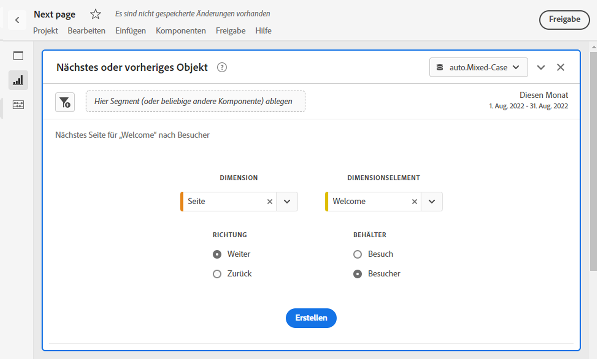
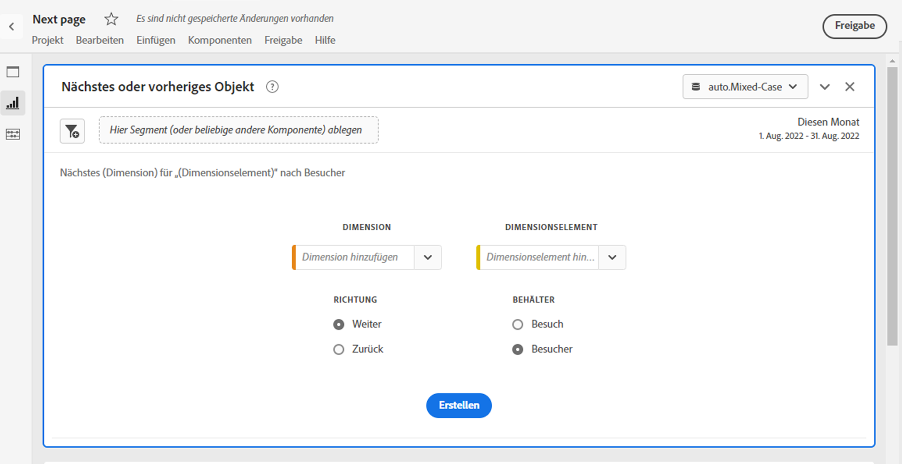
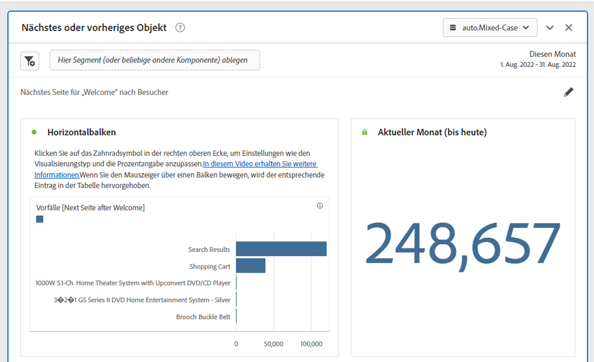
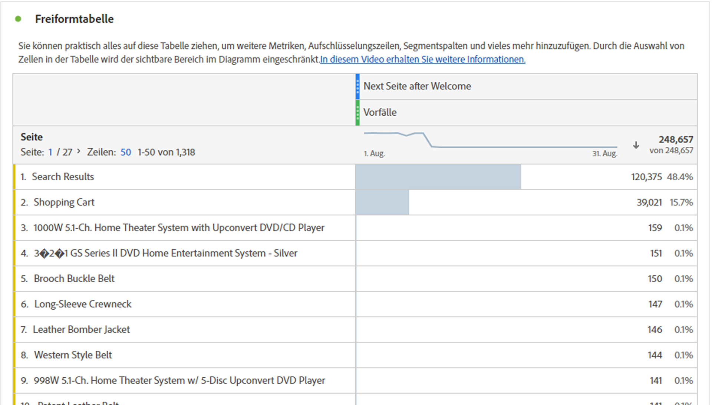

# Bedienfeld „Nächstes oder vorheriges Element“ {#next-or-previous-item-panel}

<!-- markdownlint-disable MD034 -->

>[!CONTEXTUALHELP]
>id="workspace_nextorpreviousitem_button"
>title="Nächstes oder vorheriges Objekt"
>abstract="Erstellen Sie ein Bedienfeld, um mehr über die vorherigen Dimensionen zu erfahren, aus denen Personen kommen, oder über die nächste Dimension, zu der sie gehen."

<!-- markdownlint-disable MD034 -->

<!-- markdownlint-disable MD034 -->

>[!CONTEXTUALHELP]
>id="workspace_nextorpreviousitem_panel"
>title="Nächstes oder vorheriges Objekt"
>abstract="Analysieren Sie, von wo Besuchende am häufigsten gekommen sind oder wohin sie als Nächstes gehen.  **Dimension**: Wählen Sie eine Dimension aus, z. B. **Seite**. **Dimensionselement**: Wählen Sie ein bestimmtes Dimensionselement aus, z. B. **Homepage**. **Richtung**: Wählen Sie **Weiter** aus, um die Dimensionselemente unmittelbar nach dem ausgewählten Dimensionselement anzuzeigen. Wählen Sie **Zurück** aus, um die Dimensionselemente anzuzeigen, die zu Ihrem ausgewählten Dimensionselement führen. **Container**: Wählen Sie **Sitzung** aus, um die nächsten/vorherigen Dimensionselemente innerhalb derselben Sitzung anzuzeigen, oder **Person**, um das nächste/vorherige Dimensionselement für dieselbe Person anzuzeigen."

<!-- markdownlint-enable MD034 -->

>[!BEGINSHADEBOX]

_In diesem Artikel wird das Bedienfeld Nächstes oder vorheriges Element in {_} _**Adobe Analytics**._ _Siehe [Bedienfeld „Nächstes oder vorheriges Element](https://experienceleague.adobe.com/en/docs/analytics/analyze/analysis-workspace/panels/next-previous)) für die_ _**Customer Journey Analytics**-Version dieses Artikels._

>[!ENDSHADEBOX]

Das Bedienfeld **[!UICONTROL Nächstes oder vorheriges Element]** enthält eine Reihe von Tabellen und Visualisierungen, um das nächste oder vorherige Dimensionselement für eine bestimmte Dimension zu identifizieren. Vielleicht möchten Sie herausfinden, welche Seiten Kundinnen und Kunden am häufigsten besucht haben, nachdem sie die Startseite besucht haben.

## Verwenden

So verwenden Sie ein Bedienfeld **[!UICONTROL Nächstes oder vorheriges Element]**:

1. Erstellen Sie ein Bedienfeld **[!UICONTROL Nächstes oder vorheriges Element]**. Informationen zum Erstellen eines Bedienfelds finden Sie unter [Erstellen eines Bedienfelds](panels.md#create-a-panel).

1. Legen Sie die [Eingabe](#panel-input) für das Bedienfeld fest.

1. Sehen Sie sich die [Ausgabe](#panel-output) für das Bedienfeld an.

### Bedienfeldeingabe

Sie können das Bedienfeld [!UICONTROL Nächstes oder vorheriges Element] mit den folgenden Eingabeeinstellungen konfigurieren:

| Eingabe | Beschreibung |
| --- | --- |
| **[!UICONTROL Dimension]** | Wählen Sie die Dimension aus, für die Sie die nächsten oder vorherigen Elemente untersuchen möchten. |
| **[!UICONTROL Dimensionselement]** | Wählen Sie das spezifische Dimensionselement in der Mitte Ihrer nächsten/vorherigen Anfrage aus. |
| **[!UICONTROL Richtung]** | Geben Sie an, ob Sie nach dem Dimensionselement [!UICONTROL Weiter] oder [!UICONTROL Zurück] suchen. |
| **[!UICONTROL Container]** | Wählen Sie den Container [!UICONTROL Sitzung] oder [!UICONTROL Person] (Standard) aus, um den Umfang Ihrer Anfrage zu bestimmen. |

{style="table-layout:auto"}

Wählen Sie **[!UICONTROL Erstellen]** aus, um das Bedienfeld zu erstellen.

### Bedienfeldausgabe

Das Bedienfeld [!UICONTROL Nächstes oder vorheriges Element] gibt einen umfangreichen Satz von Daten und Visualisierungen zurück, damit Sie besser verstehen können, welche Ereignisse bestimmten Dimensionselementen folgen oder vorausgehen.

| Visualisierung | Beschreibung |
| --- | --- |
| **[!UICONTROL Horizontalbalken]** | Listet die nächsten (oder vorherigen) Elemente basierend auf dem von Ihnen ausgewählten Dimensionselement auf. Wenn Sie den Mauszeiger über eine einzelne Leiste bewegen, wird das entsprechende Element in der Freiformtabelle hervorgehoben. |
| **[!UICONTROL Zusammenfassungszahl]** | Allgemeine Zusammenfassung der Anzahl aller nächsten oder vorherigen Dimensionselement-Vorkommen für den aktuellen Monat (bis jetzt). |
| **[!UICONTROL Freiformtabelle]** | Listet die nächsten (oder vorherigen) Elemente basierend auf dem von Ihnen ausgewählten Dimensionselement in einem Tabellenformat auf. Dies waren beispielsweise die beliebtesten Seiten (nach Vorkommen), zu denen Personen nach (oder vor) der Startseite oder Workspace-Seite gegangen sind. |

{style="table-layout:auto"}

>[!MORELIKETHIS]
>
>[Erstellen eines Bedienfelds](/help//analyze/analysis-workspace/c-panels/panels.md#create-a-panel)
>

<!--
# Next or previous item panel

This panel contains a number of tables and visualizations to easily identify the next or previous dimension item for a specific dimension. For example, you might want to explore which pages customers went to most often after they visited the Home page.

## Access the panel

You can access the panel from within [!UICONTROL Reports] or within [!UICONTROL Workspace].

| Access point | Description |
| --- | --- |
| [!UICONTROL Reports] | <ul><li>The panel is already dropped into a project.</li><li>The left rail is collapsed.</li><li>If you selected [!UICONTROL Next page], default settings have already been applied, such as [!UICONTROL Page] for [!UICONTROL Dimension], and the top page as the [!UICONTROL Dimension Item], [!UICONTROL Next] for [!UICONTROL Direction] and [!UICONTROL Visit] for [!UICONTROL Container]. You can modify all these settings.</li></ul>|
| Workspace | Create a new project and select the Panel icon in the left rail. Then drag the [!UICONTROL Next or previous item] panel above the Freeform table. Notice that the [!UICONTROL Dimension] and [!UICONTROL Dimension Item] fields are left blank. Select a dimension from the drop-down list. [!UICONTROL Dimension items] are populated based on the [!UICONTROL dimension] you chose. The top dimension item gets added, but you can select a different item. The defaults are Next and Visitor. Again, you can modify these as well.
 |

{style="table-layout:auto"}

## Panel Inputs {#Input}

You can configure the [!UICONTROL Next or previous item] panel panel using these input settings:

| Setting | Description |
| --- | --- |
| Segment (or other component) drop zone | You can drag and drop segments or other components to further filter your panel results. |
| Dimension | The dimension for which you want to explore next or previous items. |
| Dimension Item | The specific item at the center of your next/previous inquiry. |
| Direction | Specify whether you are looking for the [!UICONTROL Next] or the [!UICONTROL Previous] dimension item. |
| Container | [!UICONTROL Visit] or [!UICONTROL Visitor] (default) determine the scope of your inquiry. |

{style="table-layout:auto"}

Click **[!UICONTROL Build]** to build the panel.

## Panel output {#output}

The [!UICONTROL Next or previous item] panel returns a rich set of data and visualizations to help you better understand what occurrences follow or precede specific dimension items.

| Visualization | Description |
| --- | --- |
| Horizontal bar | Lists the next (or previous) items based on the dimension item you chose. Hovering over an individual bar highlights the corresponding item in the Freeform table. |
| Summary number | High-level summary number of all next or previous dimension item occurrences for the current month (so far.) |
| Freeform table | Lists the next (or previous) items based on the dimension item you chose, in a table format. For example, which were the most popular pages (by occurrences) that people went to after (or before) the home page or the workspace page. |

{style="table-layout:auto"}

-->