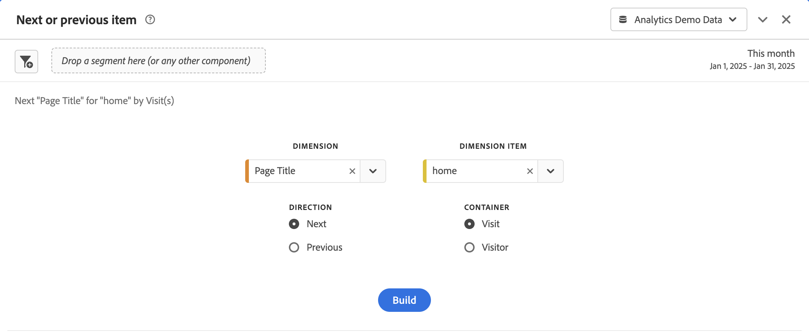
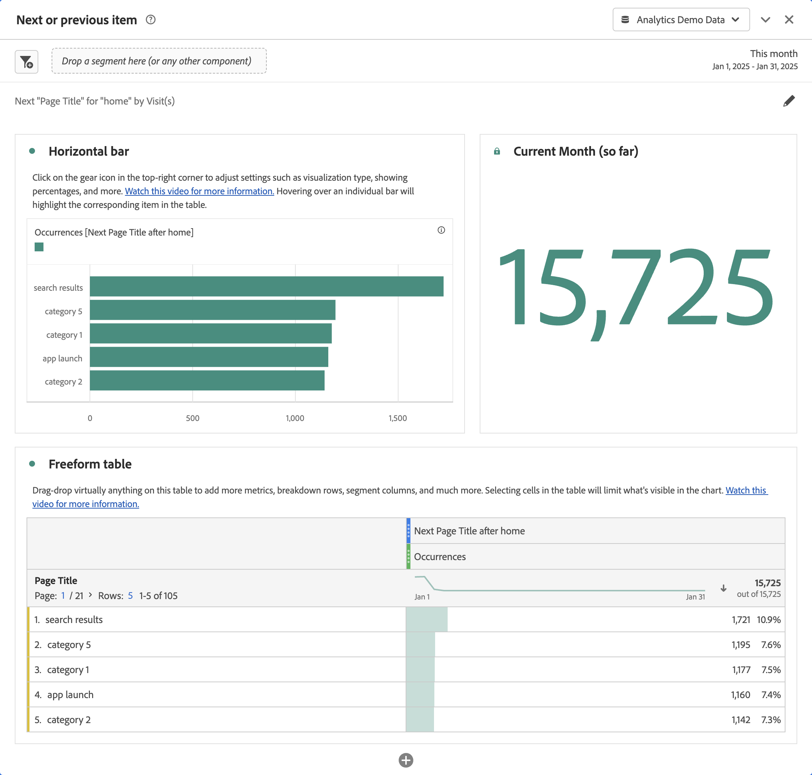
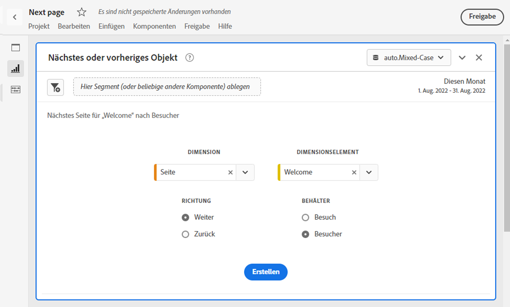
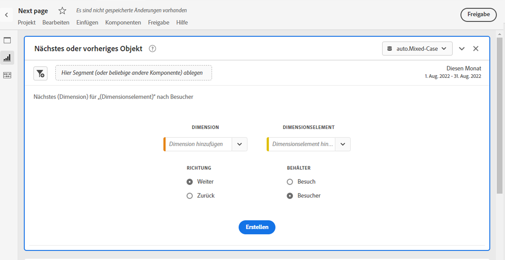
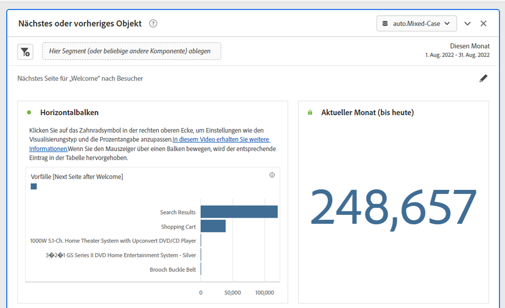
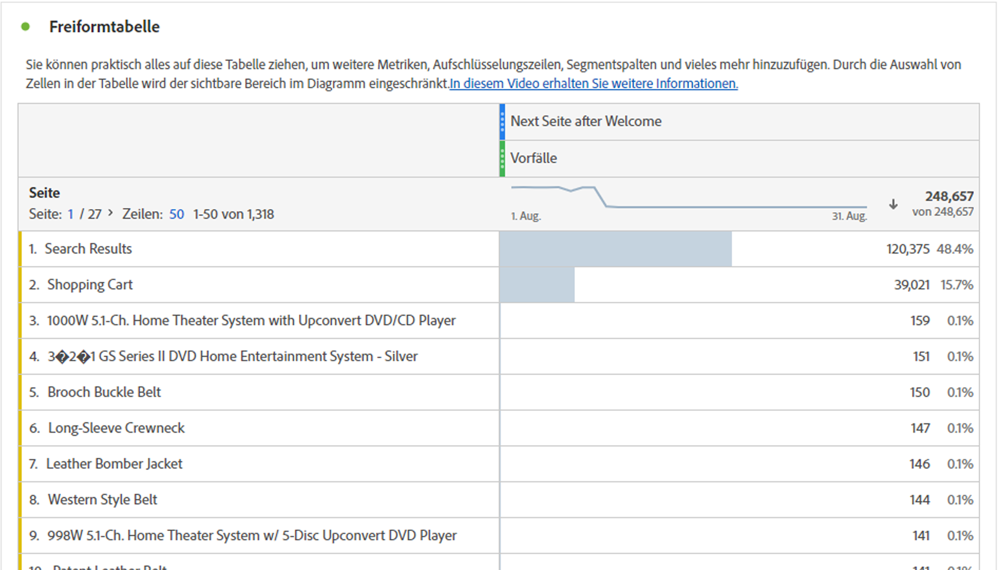

# Panel „Nächstes oder vorheriges Objekt“ {#next-or-previous-item-panel}

>[!CONTEXTUALHELP]
>id="workspace_nextorpreviousitem_button"
>title="Nächstes oder vorheriges Objekt"
>abstract="Erstellen Sie ein Bedienfeld, um mehr über die vorherigen Dimensionen zu erfahren, aus denen Personen kommen, oder über die nächste Dimension, zu der sie gehen."

>[!CONTEXTUALHELP]
>id="workspace_nextorpreviousitem_panel"
>title="Nächstes oder vorheriges Objekt"
>abstract="Analysieren Sie, von wo Besuchende am häufigsten gekommen sind oder wohin sie als Nächstes gehen.  **Dimension**: Wählen Sie eine Dimension aus. Zum Beispiel **Seite**. **Dimensionselement**: Wählen Sie ein bestimmtes Dimensionselement aus. Zum Beispiel **Homepage**. **Richtung**: Wählen Sie **Weiter** aus, um die Dimensionselemente anzuzeigen, die unmittelbar auf das von Ihnen ausgewählte Dimensionselement folgen. Wählen Sie **Vorherige** aus, um die Dimensionselemente anzuzeigen, die vor dem ausgewählten Dimensionselement liegen. **Container**: Wählen Sie **Sitzung** aus, um die nächsten/vorherigen Dimensionselemente innerhalb derselben Sitzung anzuzeigen, oder **Person**, um das nächste/vorherige Dimensionselement für dieselbe Person anzuzeigen."

>[!BEGINSHADEBOX]

_In diesem Artikel wird das Bedienfeld für das nächste oder vorherige Element in_ _&#x200B;**Adobe Analytics**._ _Siehe [Bedienfeld für das nächste oder vorherige Element](/help/analyze/analysis-workspace/c-panels/next-previous.md) für die_ _&#x200B;**Customer Journey Analytics** Version dieses Artikels._

>[!ENDSHADEBOX]

Das Panel **[!UICONTROL Nächstes oder vorheriges Objekt]** enthält eine Reihe von Tabellen und Visualisierungen, um das nächste oder vorherige Dimensionselement für eine bestimmte Dimension zu identifizieren. Nehmen wir an, Sie möchten erkunden, welche Seiten Kundinnen und Kunden nach dem Besuch der Startseite am häufigsten besucht haben.

## Verwenden

So verwenden Sie das Panel **[!UICONTROL Nächstes oder vorheriges Objekt]**:

1. Erstellen Sie das Panel **[!UICONTROL Nächstes oder vorheriges Objekt]**. Informationen zum Erstellen eines Bedienfelds finden Sie unter [Erstellen eines Bedienfelds](panels.md#create-a-panel).

1. Legen Sie die [Eingabe](#panel-input) für das Bedienfeld fest.

1. Sehen Sie sich die [Ausgabe](#panel-output) für das Bedienfeld an.

### Panel-Eingabe

Sie können das Panel [!UICONTROL Nächstes oder vorheriges Objekt] mithilfe der folgenden Eingabeeinstellungen konfigurieren:

| Eingabe | Beschreibung |
| --- | --- |
| **[!UICONTROL Dimension]** | Wählen Sie die Dimension aus, für die Sie die nächsten oder vorherigen Elemente untersuchen möchten. |
| **[!UICONTROL Dimensionselement]** | Wählen Sie das spezifische Dimensionselement in der Mitte Ihrer Anfrage für das nächste/vorherige Element aus. |
| **[!UICONTROL Richtung]** | Geben Sie an, ob Sie nach dem [!UICONTROL nächsten] oder [!UICONTROL vorherigen] Dimensionselement suchen. |
| **[!UICONTROL Container]** | Wählen Sie den Container **[!UICONTROL Besuch]** oder **[!UICONTROL Besucher]** (Standard) aus, um den Umfang Ihrer Anfrage zu bestimmen. |

{style="table-layout:auto"}

Wählen Sie **[!UICONTROL Erstellen]** aus, um das Panel zu erstellen.

### Panel-Ausgabe

Das Panel [!UICONTROL Nächstes oder vorheriges Objekt] gibt einen umfangreichen Satz von Daten und Visualisierungen zurück, damit Sie besser verstehen können, welche Ereignisse bestimmten Dimensionselementen folgen oder vorausgehen.

| Visualisierung | Beschreibung |
| --- | --- |
| **[!UICONTROL Horizontalbalken]** | Listet die nächsten (oder vorherigen) Elemente basierend auf dem von Ihnen ausgewählten Dimensionselement auf. Wenn Sie den Mauszeiger über einen Balken bewegen, wird der entsprechende Eintrag in der Freiformtabelle hervorgehoben. |
| **[!UICONTROL Zusammenfassungszahl]** | Allgemeine Zusammenfassungszahl aller Vorkommen von nächsten oder vorherigen Dimensionselementen für den aktuellen Monat (bis jetzt). |
| **[!UICONTROL Freiformtabelle]** | Listet die nächsten (oder vorherigen) Elemente basierend auf dem von Ihnen ausgewählten Dimensionselement in einem Tabellenformat auf. Was waren beispielsweise die beliebtesten Seiten (nach Vorkommen), zu denen Personen nach (oder vor) der Start- oder Arbeitsbereichsseite gegangen sind? |

{style="table-layout:auto"}

>[!MORELIKETHIS]
>
>[Erstellen eines Bedienfelds](/help//analyze/analysis-workspace/c-panels/panels.md#create-a-panel)
>

<!--
# Next or previous item panel

This panel contains a number of tables and visualizations to easily identify the next or previous dimension item for a specific dimension. For example, you might want to explore which pages customers went to most often after they visited the Home page.

## Access the panel

You can access the panel from within [!UICONTROL Reports] or within [!UICONTROL Workspace].

| Access point | Description |
| --- | --- |
| [!UICONTROL Reports] | <ul><li>The panel is already dropped into a project.</li><li>The left rail is collapsed.</li><li>If you selected [!UICONTROL Next page], default settings have already been applied, such as [!UICONTROL Page] for [!UICONTROL Dimension], and the top page as the [!UICONTROL Dimension Item], [!UICONTROL Next] for [!UICONTROL Direction] and [!UICONTROL Visit] for [!UICONTROL Container]. You can modify all these settings.</li></ul>|
| Workspace | Create a new project and select the Panel icon in the left rail. Then drag the [!UICONTROL Next or previous item] panel above the Freeform table. Notice that the [!UICONTROL Dimension] and [!UICONTROL Dimension Item] fields are left blank. Select a dimension from the drop-down list. [!UICONTROL Dimension items] are populated based on the [!UICONTROL dimension] you chose. The top dimension item gets added, but you can select a different item. The defaults are Next and Visitor. Again, you can modify these as well.
 |

{style="table-layout:auto"}

## Panel Inputs {#Input}

You can configure the [!UICONTROL Next or previous item] panel panel using these input settings:

| Setting | Description |
| --- | --- |
| Segment (or other component) drop zone | You can drag and drop segments or other components to further filter your panel results. |
| Dimension | The dimension for which you want to explore next or previous items. |
| Dimension Item | The specific item at the center of your next/previous inquiry. |
| Direction | Specify whether you are looking for the [!UICONTROL Next] or the [!UICONTROL Previous] dimension item. |
| Container | [!UICONTROL Visit] or [!UICONTROL Visitor] (default) determine the scope of your inquiry. |

{style="table-layout:auto"}

Click **[!UICONTROL Build]** to build the panel.

## Panel output {#output}

The [!UICONTROL Next or previous item] panel returns a rich set of data and visualizations to help you better understand what occurrences follow or precede specific dimension items.

| Visualization | Description |
| --- | --- |
| Horizontal bar | Lists the next (or previous) items based on the dimension item you chose. Hovering over an individual bar highlights the corresponding item in the Freeform table. |
| Summary number | High-level summary number of all next or previous dimension item occurrences for the current month (so far.) |
| Freeform table | Lists the next (or previous) items based on the dimension item you chose, in a table format. For example, which were the most popular pages (by occurrences) that people went to after (or before) the home page or the workspace page. |

{style="table-layout:auto"}

-->