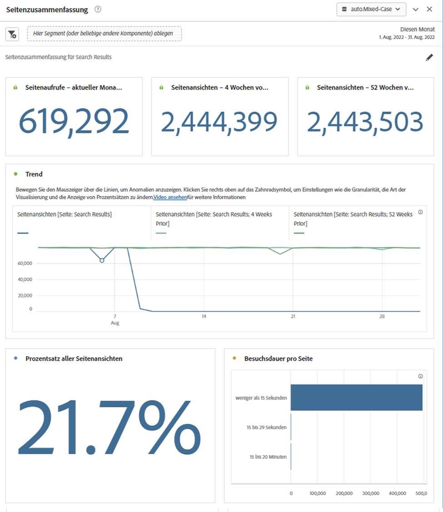
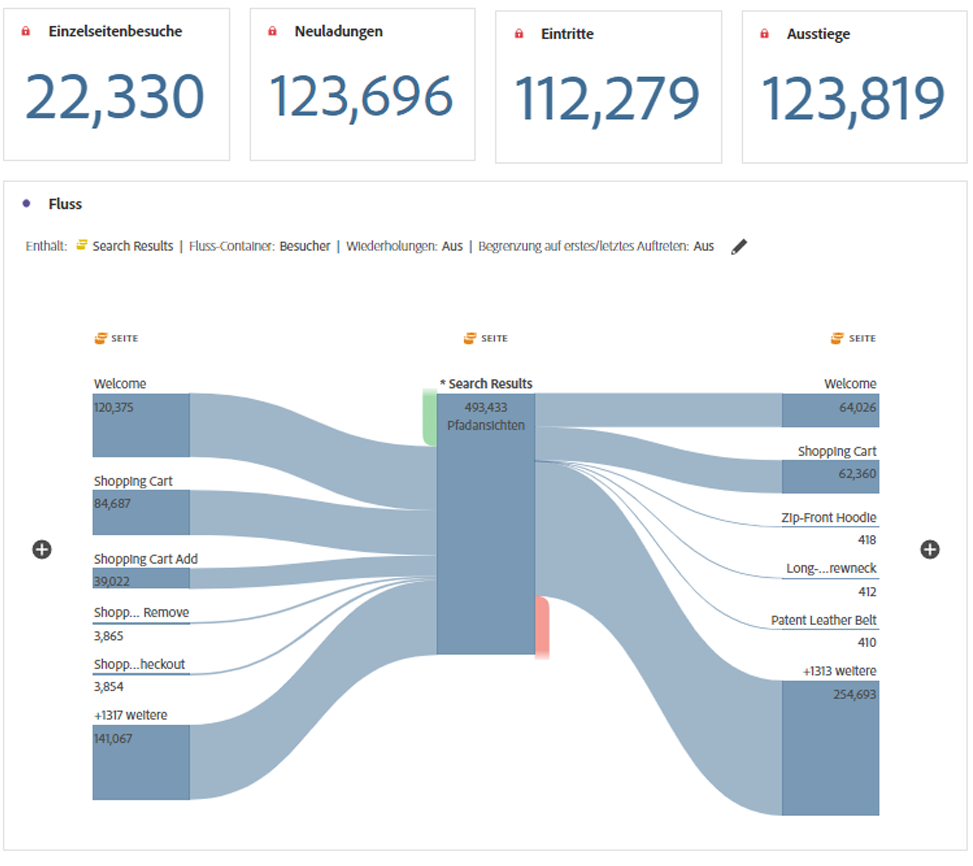

# Bedienfeld „Seitenzusammenfassung“ {#page-summary}

<!-- markdownlint-disable MD034 -->

>[!CONTEXTUALHELP]
>id="workspace_pagesummary_button"
>title="Seitenzusammenfassung"
>abstract="Überprüfen Sie schnell einige allgemeine Metriken sowie die Bewegungen zu und von einer bestimmten Seite."

<!-- markdownlint-enable MD034 -->

<!-- markdownlint-disable MD034 -->

>[!CONTEXTUALHELP]
>id="workspace_pagesummary_panel"
>title="Bedienfeld „Seitenzusammenfassung“"
>abstract="Überprüfen Sie schnell einige allgemeine Metriken sowie die Bewegungen zu und von einer bestimmten Seite.  **Parameter ** **Dimensionselement Seite hinzufügen**: Öffnen Sie die Komponentenleiste, suchen Sie die Dimension Seite und erweitern Sie sie, indem Sie auf die Karotte klicken, um die Dimensionselemente anzuzeigen. Ziehen Sie dann die spezifische Seite, über die Sie etwas erfahren möchten, per Drag-and-Drop in den Builder. Nachdem Sie das Dimensionselement per Drag-and-Drop verschoben haben, wird der Bericht automatisch mit wichtigen Informationen zur Seite gefüllt."

<!-- markdownlint-enable MD034 -->

In diesem Bedienfeld können Sie wichtige Statistiken zu bestimmten Seiten einfach untersuchen.

## Zugriff auf das Bedienfeld

Sie können auf das Bedienfeld in [!UICONTROL Berichte] oder in [!UICONTROL Workspace ].

| Zugangspunkt | Beschreibung |
| --- | --- |
| [!UICONTROL Berichte] | <ul><li>Das Bedienfeld ist bereits in einem Projekt abgelegt.</li><li>Die linke Leiste ist reduziert.</li><li>Es wird nur die Dimension Seite unterstützt.</li><li>Eine Standardeinstellung wurde bereits angewendet, in diesem Fall die am häufigsten besuchte Seite für die Dimension [!UICONTROL Seite]. Sie können diese Einstellung ändern.</li></ul> |
| Workspace | Erstellen Sie ein neues Projekt und wählen Sie das Bedienfeldsymbol in der linken Leiste aus. Ziehen Sie das Bedienfeld [!UICONTROL Seitenzusammenfassung] über die Freiformtabelle. Beachten Sie, dass das Feld Dimension [!UICONTROL Element] leer gelassen wird. Wählen Sie ein Dimensionselement aus der Dropdownliste aus. |

## Panel-Eingaben {#Input}

Sie können das Bedienfeld [!UICONTROL Seitenzusammenfassung] mit den folgenden Eingabeeinstellungen konfigurieren:

| Einstellung | Beschreibung |
| --- | --- |
| Ablegebereich für Segmente (oder andere Komponenten) | Sie können Segmente oder andere Komponenten per Drag-and-Drop verschieben, um Ihre Bedienfeldergebnisse weiter zu filtern. |
| Dimensionselement der Seite | Wählen Sie aus der Dropdown-Liste das Dimensionselement Seite aus, dessen Schlüsselstatistiken Sie untersuchen möchten. |

{style="table-layout:auto"}

Klicken Sie **[!UICONTROL Erstellen]**, um das Bedienfeld zu erstellen.

## Bedienfeldausgabe {#output}

Das Bedienfeld [!UICONTROL Seitenzusammenfassung] gibt eine Vielzahl von Metrikdaten und Visualisierungen zurück, die Ihnen helfen, Statistiken zu bestimmten Seiten besser zu verstehen.

| Metrik/Visualisierung | Beschreibung |
| --- | --- |
| [!UICONTROL Seitenansichten] - Aktueller Monat, bis jetzt | Anzahl der Seitenansichten für diese Seite im aktuellen Monat. |
| [!UICONTROL Seitenansichten] - 4 Wochen vorher | Anzahl der Seitenansichten für diese Seite im letzten Monat. |
| [!UICONTROL Seitenansichten] - 52 Wochen vorher | Anzahl der Seitenansichten für diese Seite im letzten Jahr. |
| [!UICONTROL Trend] | Ein Diagramm mit einer Trend-Seitenansicht für diesen Monat, vor 4 Wochen und vor 52 Wochen. |
| [!UICONTROL Prozentsatz aller Seitenansichten] | Eine Zusammenfassungszahl für den Prozentsatz aller Seitenansichten, die zu dieser Seite gewechselt sind. |
| [!UICONTROL Besuchszeit pro Seite] | Ein horizontales Balkendiagramm mit der auf dieser Seite verbrachten Zeit. |
| [!UICONTROL Einzelseitenbesuche] | Eine Zusammenfassungszahl, die die Anzahl der Seitenansichten auflistet, bei denen dies die einzige besuchte Seite war. |
| [!UICONTROL Neuladungen] | Die Metrik [!UICONTROL Neuladungen] gibt an, wie oft ein Dimensionselement während eines Neuladens vorhanden war. Ein Besucher, der seinen Browser aktualisiert, stellt die häufigste Methode dar, eine Neuladung auszulösen. |
| [!UICONTROL Einträge] | Die Metrik [!UICONTROL Einträge] gibt an, wie oft ein bestimmtes Dimensionselement als erster Wert bei einem Besuch erfasst wird. |
| [!UICONTROL Ausstiege] | Die [!UICONTROL Exits]-Metrik zeigt an, wie oft ein bestimmtes Dimensionselement als letzter Wert bei einem Besuch erfasst wird. |
| [!UICONTROL Fluss] | Ein Flussdiagramm mit der ausgewählten Seite als Fokus. Sie können die Daten wie in jedem [-Diagramm weiter ](/help/analyze/analysis-workspace/visualizations/c-flow/create-flow.md). |

{style="table-layout:auto"}

