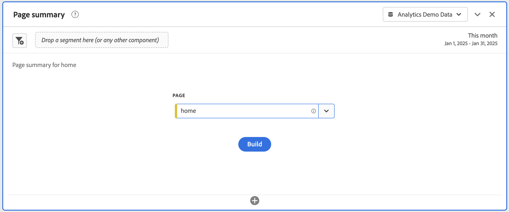

# Bedienfeld „Seitenzusammenfassung“ {#page-summary}

<!-- markdownlint-disable MD034 -->

>[!CONTEXTUALHELP]
>id="workspace_pagesummary_button"
>title="Seitenzusammenfassung"
>abstract="Prüfen Sie schnell einige allgemeine Metriken sowie die Bewegungen zu und von einer bestimmten Seite."

<!-- markdownlint-enable MD034 -->

<!-- markdownlint-disable MD034 -->

>[!CONTEXTUALHELP]
>id="workspace_pagesummary_panel"
>title="Bedienfeld „Seitenzusammenfassung“"
>abstract="Prüfen Sie schnell einige allgemeine Metriken sowie die Bewegungen zu und von einer bestimmten Seite.  **Parameter ** **Dimensionselement „Seite“ hinzufügen**: Öffnen Sie die Komponentenleiste, suchen Sie die Dimension „Seite“ und erweitern Sie sie durch Klicken auf die Karotte, um die Dimensionselemente anzuzeigen. Ziehen Sie dann die Seite, über die Sie etwas erfahren möchten, in den Builder. Danach werden automatisch die wichtigsten Informationen über die Seite in den Bericht übertragen."

<!-- markdownlint-enable MD034 -->

>[!BEGINSHADEBOX]

_In diesem Artikel wird das Bedienfeld Seitenzusammenfassung in {_} _**Adobe Analytics**._ _Es gibt kein entsprechendes Bedienfeld in_ _**Customer Journey Analytics**._

>[!ENDSHADEBOX]

Ein Bedienfeld **[!UICONTROL Seitenzusammenfassung]** ermöglicht die Untersuchung wichtiger Statistiken zu bestimmten Seiten.

## Verwenden

So verwenden Sie ein Bedienfeld **[!UICONTROL Seitenzusammenfassung]**:

1. Erstellen eines Bedienfelds **[!UICONTROL Seitenzusammenfassung]**. Informationen zum Erstellen eines Bedienfelds finden Sie unter [Erstellen eines Bedienfelds](panels.md#create-a-panel).

1. Legen Sie die [Eingabe](#panel-input) für das Bedienfeld fest.

1. Sehen Sie sich die [Ausgabe](#panel-output) für das Bedienfeld an.

Sie können auf das Bedienfeld in [!UICONTROL Berichte] oder in [!UICONTROL Workspace ].

| Zugangspunkt | Beschreibung |
| --- | --- |
| [!UICONTROL Berichte] | <ul><li>Das Bedienfeld ist bereits in einem Projekt abgelegt.</li><li>Die linke Leiste ist reduziert.</li><li>Es wird nur die Dimension Seite unterstützt.</li><li>Eine Standardeinstellung wurde bereits angewendet, in diesem Fall die am häufigsten besuchte Seite für die Dimension [!UICONTROL Seite]. Sie können diese Einstellung ändern.</li></ul> |
| Workspace | Erstellen Sie ein neues Projekt und wählen Sie das Bedienfeldsymbol in der linken Leiste aus. Ziehen Sie das Bedienfeld [!UICONTROL Seitenzusammenfassung] über die Freiformtabelle. Beachten Sie, dass das Feld Dimension [!UICONTROL Element] leer gelassen wird. Wählen Sie ein Dimensionselement aus der Dropdownliste aus. |

### Bedienfeldeingabe {#panel-input}

Sie können das Bedienfeld [!UICONTROL Seitenzusammenfassung] mit den folgenden Eingabeeinstellungen konfigurieren:

| Eingabe | Beschreibung |
| --- | --- |
| **[!UICONTROL Seite]** | Wählen Sie eine Seitendimension aus, für die Sie wichtige Statistiken untersuchen möchten. |

{style="table-layout:auto"}

Wählen Sie **[!UICONTROL Erstellen]** aus, um das Bedienfeld zu erstellen.

### Bedienfeldausgabe {#panel-output}

Das Bedienfeld [!UICONTROL Seitenzusammenfassung] gibt eine Vielzahl von Metrikdaten und Visualisierungen zurück, die Ihnen helfen, Statistiken zu bestimmten Seiten besser zu verstehen.

| Visualisierung | Beschreibung |
| --- | --- |
| **[!UICONTROL Seitenansichten] - Aktueller Monat (bis heute)** | Eine Visualisierung [Zusammenfassungszahl](/help/analyze/analysis-workspace/visualizations/summary-number-change.md), die die Anzahl der Seitenansichten für diese Seite für den aktuellen Monat anzeigt. |
| **[!UICONTROL Seitenansichten] - vor 4 Wochen** | Eine Visualisierung [Zusammenfassungszahl](/help/analyze/analysis-workspace/visualizations/summary-number-change.md), die die Anzahl der Seitenansichten für diese Seite im letzten Monat anzeigt. |
| **[!UICONTROL Seitenansichten] - 52 Wochen davor** | Eine [Zusammenfassungszahl](/help/analyze/analysis-workspace/visualizations/summary-number-change.md) Visualisierung, die die Anzahl der Seitenansichten für diese Seite im letzten Jahr anzeigt. |
| **[!UICONTROL Trend]** | Eine Trend[Linien](/help/analyze/analysis-workspace/visualizations/line.md)-Visualisierung für Seitenansichten für diesen Monat, 4 Wochen davor und 52 Wochen davor. |
| **[!UICONTROL Prozentsatz aller Seitenansichten]** | Eine Zusammenfassungszahl für den Prozentsatz aller Seitenansichten, die zu dieser Seite gewechselt sind. |
| **[!UICONTROL Besuchszeit pro Seite]** | Eine [Horizontalbalken](/help/analyze/analysis-workspace/visualizations/horizontal-bar.md) Visualisierung, die die auf dieser Seite verbrachte Zeit anzeigt. |
| **[!UICONTROL Einzelseitenbesuche]** | Eine [Zusammenfassungszahl](/help/analyze/analysis-workspace/visualizations/summary-number-change.md), die die Anzahl der Seitenansichten anzeigt, in denen diese Seite die einzige besuchte Seite war. |
| **[!UICONTROL Neuladungen]** | Eine [Zusammenfassungszahl](/help/analyze/analysis-workspace/visualizations/summary-number-change.md) die angibt, wie oft ein Dimensionselement während eines Neuladens vorhanden war. Ein Besucher, der seinen Browser aktualisiert, stellt die häufigste Methode dar, eine Neuladung auszulösen. |
| **[!UICONTROL Einträge]** | Eine [Zusammenfassungszahl](/help/analyze/analysis-workspace/visualizations/summary-number-change.md) die angibt, wie oft ein bestimmtes Dimensionselement als erster Wert bei einem Besuch erfasst wird. |
| **[!UICONTROL Ausstiege]** | Eine [Zusammenfassungszahl](/help/analyze/analysis-workspace/visualizations/summary-number-change.md) die angibt, wie oft ein bestimmtes Dimensionselement als letzter Wert bei einem Besuch erfasst wird. |
| **[!UICONTROL Fluss]** | Eine [Fluss](/help/analyze/analysis-workspace/visualizations/c-flow/flow.md)-Visualisierung mit der ausgewählten Seite als Fokus. Wie bei jeder anderen Flussvisualisierung können Sie [ Daten weiter ](/help/analyze/analysis-workspace/visualizations/c-flow/create-flow.md). |

{style="table-layout:auto"}

Verwenden Sie , um das Bedienfeld neu zu konfigurieren und neu zu erstellen.
