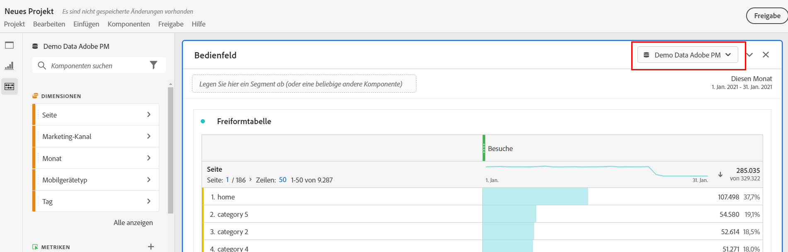
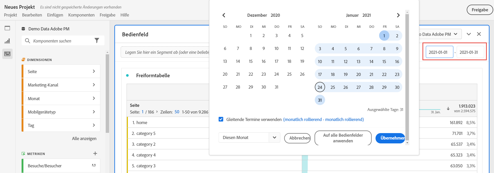
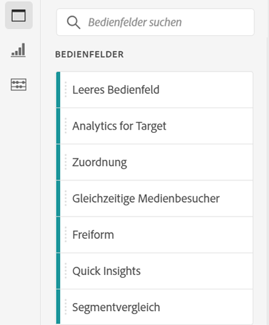
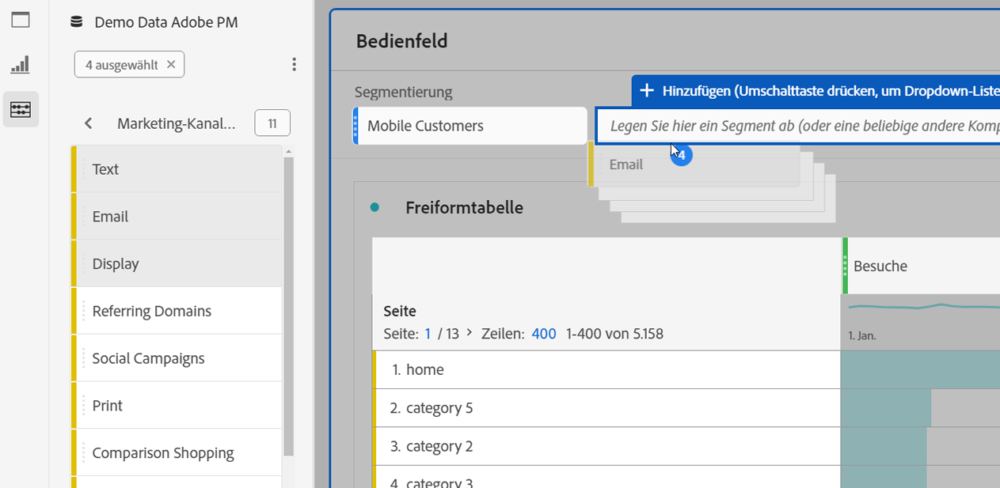

# Überblick über Panels

Ein [!UICONTROL Panel] ist eine Sammlung von Tabellen und Visualisierungen. Sie können über das Symbol oben links in Arbeitsbereich oder über ein [leeres Bedienfeld](/help/analyze/analysis-workspace/c-panels/blank-panel.md) auf Bedienfelder zugreifen. Panels sind hilfreich, wenn Sie Ihre Projekte nach Zeiträumen, Report Suites oder Analysen ordnen möchten. 

## Bedienfeldtypen

Die folgenden Bedienfeldtypen sind in Analysis Workspace für [!UICONTROL Adobe Analytics] verfügbar:

| Name des Bedienfelds | Beschreibung |
| --- | --- |
| [Leeres Bedienfeld](/help/analyze/analysis-workspace/c-panels/blank-panel.md) | Wählen Sie zum Beginnen Ihrer Analyse aus den verfügbaren Bedienfeldern und Visualisierungen. |
| [Attribution](attribution.md) | Vergleichen und visualisieren Sie im Handumdrehen eine beliebige Anzahl von Attributionsmodellen unter Verwendung verschiedener Dimensionen und Konversionsmetriken. |
| [Analytics for Target](a4t-panel.md) | Analysieren Sie Target-Aktivitäten und Erlebnisse in Analysis Workspace. |
| [Freiform](freeform-panel.md) | Führen Sie unbegrenzt Vergleiche und Aufschlüsselungen durch und fügen Sie dann Visualisierungen hinzu, um eine ausführliche Story mit den Daten zu erzählen. |
| [Medien-Zielgruppendurchschnitt pro Minute](average-minute-audience-panel.md) | Analysieren Sie den Zielgruppendurchschnitt pro Minute für einen bestimmten Inhalt oder für einen benutzerdefinierten Zeitraum. |
| [Gleichzeitige Medienbetrachtende](media-concurrent-viewers.md) | Analysieren Sie gleichzeitige Betrachtende über einen längeren Zeitraum. Sie erhalten Details zum maximalen gleichzeitigen Zugriff und die Möglichkeit, aufzuschlüsseln und zu vergleichen. |
| [Verbrachte Zeit bei der Medienwiedergabe](/help/analyze/analysis-workspace/c-panels/media-playback-time-spent.md) | Analysieren Sie die Wiedergabedauer, um nachzuvollziehen, wo Spitzenzeiten bei gleichzeitigen Ansichten auftreten oder wo es zu Abbrüchen kommt. |
| [Nächstes oder vorheriges Objekt](next-previous.md) | Zeigen Sie die nächsten oder vorherigen Seiten an, zu denen Personen navigieren. |
| [Quick Insights](quickinsight.md) | Erstellen Sie im Nu eine Freiformtabelle und eine entsprechende Visualisierung, um Erkenntnisse schneller zu analysieren und bereitzustellen. |
| [Seitenzusammenfassung](page-summary.md) | Erkunden Sie wichtige Statistiken zu bestimmten Seiten. |
| [Segmentvergleich](/help/analyze/analysis-workspace/c-panels/c-segment-comparison/segment-comparison.md) | Vergleichen Sie schnell zwei Segmente über alle Datenpunkte hinweg, um automatisch relevante Unterschiede zu ermitteln. |

Die Bedienfelder [!UICONTROL Quick Insights], [!UICONTROL Leer] und [!UICONTROL Freiform] eignen sich hervorragend als Ausgangspunkt für Ihre Analyse. [!UICONTROL Attribution] bietet sich hingegen für erweiterte Analysen an. Unten auf der Arbeitsfläche ist das Symbol  verfügbar, durch das Sie jederzeit leere Bedienfelder hinzufügen können.

Das standardmäßige Startbedienfeld ist das Bedienfeld [!UICONTROL Freiform]. Sie können jedoch auch das Bedienfeld [Leer](/help/analyze/analysis-workspace/c-panels/blank-panel.md) oder [Quick Insights](/help/analyze/analysis-workspace/c-panels/quickinsight.md) als Standard festlegen. Siehe [Voreinstellungen für Projekte und Analysen](/help/analyze/analysis-workspace/user-preferences.md#projects--analyses-preferences).

## Erstellen eines Bedienfelds

So erstellen Sie ein Bedienfeld:

* Ziehen Sie ein Bedienfeld aus dem linken Bedienfeld **[!UICONTROL Bedienfelder]** auf Ihre Arbeitsfläche.
* Wählen Sie ein Bedienfeld aus dem Bedienfeld [Leer](blank-panel.md) aus.
* Verwenden Sie das Menü **[!UICONTROL Einfügen]** in Workspace und wählen Sie Ihr Bedienfeld aus. Alternativ können Sie Bedienfelder mit einem der [Tastaturbefehle](../build-workspace-project/fa-shortcut-keys.md) einfügen.

  

Sie haben folgende Möglichkeiten:

* Wählen Sie das Symbol  **in** einem beliebigen Bedienfeld aus, um eine weitere Visualisierung hinzuzufügen. Es wird ein Popup angezeigt, in dem Sie eine Visualisierung auswählen können.

  

  | Auswahl | Erstelltes Element |
  |---|---|
  |  | [Freiformtabelle](/help/analyze/analysis-workspace/visualizations/freeform-table/freeform-table.md) |
  |  | [Linie](/help/analyze/analysis-workspace/visualizations/line.md) |
  |  | [Balken](/help//analyze/analysis-workspace/visualizations/bar.md) |
  |  | [Zusammenfassungszahl](/help/analyze/analysis-workspace/visualizations/summary-number-change.md) |
  |  | [Text](/help/analyze/analysis-workspace/visualizations/text.md) |
  |  | [Fallout](/help/analyze/analysis-workspace/visualizations/fallout/fallout-flow.md) |
  |  | [Fluss](/help/analyze/analysis-workspace/visualizations/c-flow/flow.md) |
  |  | [Bereiche gestapelt](/help/analyze/analysis-workspace/visualizations/area.md) |
  |  | [Kohortentabelle](/help/analyze/analysis-workspace/visualizations/cohort-table/t-cohort.md) |
  |  | [Bullet](/help/analyze/analysis-workspace/visualizations/bullet-graph.md) |
  |  | [Ringdiagramm](/help/analyze/analysis-workspace/visualizations/donut.md) |
  |  | [Zusammenfassungsänderung](/help/analyze/analysis-workspace/visualizations/summary-number-change.md) |
  |  | [Histogramm](/help/analyze/analysis-workspace/visualizations/histogram.md) |
  |  | [Streuung](/help/analyze/analysis-workspace/visualizations/scatterplot.md) |
  |  | [Venn](/help/analyze/analysis-workspace/visualizations/venn.md) |
  |  | [Treemap](/help/analyze/analysis-workspace/visualizations/treemap.md) |

* Wählen Sie  **außerhalb** des letzten Panels in Ihrem Arbeitsbereich aus, um ein weiteres [leeres Panel](blank-panel.md) hinzuzufügen.

## Verwalten eines Panels

Sie können ein Panel wie folgt verwalten:

* Um ein Panel zu reduzieren, wählen Sie  aus.
* Um ein reduziertes Panel anzuzeigen, wählen Sie  aus.
* Um ein Panel zu löschen, wählen Sie  aus. Um eine Aktion rückgängig zu machen, wählen Sie **[!UICONTROL Bearbeiten]** > **[!UICONTROL Rückgängig]** aus (**[!UICONTROL *Befehl+Z *]**|**[!UICONTROL * Strg+Z *]**).
* Um ein Panel zu verschieben, ziehen Sie es per Drag-and-Drop, sobald  sichtbar ist (in der Regel, wenn Sie den Mauszeiger über die Kopfzeile bewegen).

## Report Suite

Jedes Panel ist mit einer [Report Suite](/help/admin/tools/manage-rs/report-suites-admin.md) verknüpft, die durch den -**[!UICONTROL *Namen der Report Suite *]**im Dropdown-Menü oben rechts im Panel identifiziert wird.

Wenn Sie ein neues Bedienfeld erstellen, basiert die Standard-Report Suite auf dem Bedienfeld, an dem Sie zuletzt im Analysis Workspace-Projekt gearbeitet haben.

In einem Projekt können Sie je nach Anwendungsfällen Ihrer Analyse eine oder [viele Report Suites](/help/analyze/analysis-workspace/build-workspace-project/multiple-report-suites.md) verwenden. 

Die Liste der Report Suites ist nach Relevanz sortiert, die Adobe danach definiert, wie kürzlich und häufig die Suite von der aktuellen Person verwendet wurde und wie häufig die Suite innerhalb der Organisation eingesetzt wird.

>[!IMPORTANT]
>
>Die ausgewählte Report Suite legt fest, welche Dimensionen, Metriken und Segmente zum Erstellen von Visualisierungen in einem Bedienfeld verfügbar sind.
>
>
>Wenn Sie eine Report Suite für ein Bedienfeld wechseln, sind einige Komponenten in dieser neuen Report Suite möglicherweise nicht verfügbar. Diese Änderung kann dazu führen, dass Ihre Visualisierung nicht ordnungsgemäß gerendert wird. Möglicherweise werden Warnungen wie diese angezeigt:
>
>* Dieses Bedienfeld enthält Komponenten, die in der ausgewählten Report Suite nicht aktiviert sind. Ändern Sie die Report Suite oder aktivieren Sie die erforderlichen Komponenten in der Report Suite.
>* Visualisierung kann nicht gerendert werden: Überprüfen Sie Ihre Spalten und Zeilen, um sicherzustellen, dass sie gültige Komponenten enthalten.
>

## Kalender

Der Panel-Kalender steuert den Reporting-Datumsbereich für Tabellen und Visualisierungen innerhalb eines Panels.

>[!NOTE]
>
>Wenn eine Komponente des -Datumsbereichs in einer Visualisierung oder einem Bedienfeld verwendet wird (z. B. als Segment), überschreibt die Datumsbereichskomponente den Bedienfeldkalender.
>

1. Wählen Sie einen Datumsbereich aus, indem Sie zuerst das Startdatum und dann das Enddatum auswählen.
Alternativ können Sie eine **[!UICONTROL Voreinstellung]** aus dem Dropdown-Menü [!UICONTROL *Voreinstellung auswählen*] auswählen.

1. Wählen Sie optional **[!UICONTROL Erweiterte Einstellungen einblenden]** für Folgendes aus:

   * Geben Sie eine andere **[!UICONTROL Startzeit]** und **[!UICONTROL Endzeit]** als die Standardwerte `12:00 AM` (`0:00`) und `11:59 PM` (`23:59`) an. Endzeiten umfassen immer 59 Sekunden. Für einen Datumsbereich, der viele Tage umfasst, gilt die Startzeit für den ersten Tag des Datumsbereichs und die Endzeit gilt für den letzten Tag in Ihrem Datumsbereich. Verwenden Sie **[!UICONTROL (Zeitwerte zurücksetzen)]**, um die Start- und Endzeit auf ihre Standardwerte zurückzusetzen.
   * **[!UICONTROL Erstellen von Datumsbereichskomponenten relativ zum Panel-Kalender]**. Wenn diese Option deaktiviert ist, beziehen sich die im Bedienfeld verwendeten Datumsbereichskomponenten auf die aktuelle Zeit. Wenn diese Option aktiviert ist, beziehen sich die im Bedienfeld verwendeten Datumsbereichskomponenten auf den Kalender des Bedienfelds.
   * **[!UICONTROL Rollierende Termine verwenden]**. Wenn diese Option aktiviert ist, werden voreingestellte Datumsbereiche wie **[!UICONTROL Letzte 7 volle Tage]** dynamisch als aktueller Datums- und Uhrzeitfortschritt aktualisiert. Wenn diese Option deaktiviert ist, werden diese Vorgaben nach der Anwendung nicht aktualisiert.

     

     Sie können den Text in eckigen Klammern auswählen (z. B. **[!UICONTROL Festgelegter Start – täglich rollierend]**), um das Bedienfeld zu erweitern und Details für **[!UICONTROL Start]** und **[!UICONTROL Ende]** anzugeben.

      1. Wählen Sie **[!UICONTROL Anfang von]**, **[!UICONTROL Ende von]** oder **[!UICONTROL Festgelegter Tag]** aus.
      1. Wenn Sie **[!UICONTROL Anfang von]** oder **[!UICONTROL Ende von]** ausgewählt haben, können Sie einen vollständigen Ausdruck erstellen. Beispiel: **[!UICONTROL Ende von]** **[!UICONTROL Aktuelles Jahr]** **[!UICONTROL plus]** `1` **[!UICONTROL Tag]**. Wählen Sie den entsprechenden Wert für jeden einzelnen Teil des Ausdrucks aus.
         * Wählen Sie einen Wert für den aktuellen Zeitraum aus, z. B. **[!UICONTROL Aktuelles Jahr]**.
         * Wählen Sie einen Wert für die zusätzliche Berechnung aus, z. B. **[!UICONTROL plus]**.
         * Wenn Sie eine zusätzliche Berechnung angegeben haben, geben Sie einen Wert an. Zum Beispiel `1`.
         * Wenn Sie eine zusätzliche Berechnung angegeben haben, wählen Sie den Zeitraum aus, der für die Berechnung verwendet werden soll, z. B. **[!UICONTROL Tag]**.

     Wählen Sie **[!UICONTROL Details ausblenden]** aus, um die Details für die Berechnung rollierender Termine auszublenden.

1. Wählen Sie **[!UICONTROL Übernehmen]** aus, um den Datumsbereich auf das Bedienfeld anzuwenden, über das der Kalender aufgerufen wurde.
Wählen Sie **[!UICONTROL Auf alle Panels anwenden]** aus, um den Datumsbereich auf alle Panels im Workspace-Projekt anzuwenden.

## Ablegebereich {#dropzone}

Mithilfe des Ablegebereichs eines Bedienfelds können Sie Segment- und Dropdown-Segmente auf alle Tabellen und Visualisierungen innerhalb eines Bedienfelds anwenden. Sie können ein oder mehrere Segmente auf ein Bedienfeld anwenden.

### Segmente

Ziehen Sie beliebige Segmente per Drag-and-Drop aus dem linken Bedienfeld in den Ablagebereich des Bedienfelds, um das Bedienfeld zu segmentieren.  Wiederholen Sie diesen Vorgang, um dem Bedienfeld weitere Segmente hinzuzufügen. Segmente werden oben im Bedienfeld nebeneinander angezeigt.

#### Schnellsegmente

Komponenten, die keine Segmente sind, können auch direkt in den Ablagebereich gezogen werden, um Schnellsegmente zu erstellen, wodurch Sie sich das mühsame Aufrufen des [Segment Builders](/help/components/segmentation/segmentation-workflow/seg-build.md) ersparen können. Die auf diese Weise erstellten Segmente werden automatisch als Segmente auf Ereignisebene definiert. Diese Definition kann schnell geändert werden, indem Sie neben dem Segmentnamen die Option  auswählen.

<!-- For more information, see [Quick segments](/help/components/segmentation/). -->

### Dropdown-Segmente

>[!BEGINSHADEBOX]

Ein Demovideo finden Sie unter  [Dropdown-Segmente](https://video.tv.adobe.com/v/23877?quality=12&learn=on){target="_blank"}.

>[!ENDSHADEBOX]

#### Statische Dropdown-Segmente

Statische Dropdown-Segmente ermöglichen Ihnen eine kontrollierte Interaktion mit den Daten. Sie können beispielsweise ein Dropdown-Segment für Gerätetypen hinzufügen, damit Sie das Bedienfeld nach Tablet, Handy oder Desktop segmentieren können.

Statische Dropdown-Segmente können auch verwendet werden, um mehrere Projekte in einem Projekt zu bündeln. Wenn Sie beispielsweise mehrere Versionen desselben Projekts mit unterschiedlichen Ländersegmenten verwenden, können Sie alle Versionen in einem Projekt zusammenfassen und ein Dropdown-Segment „Land“ hinzufügen.

##### Erstellen von statischen Dropdown-Segmenten

* Wählen Sie für Dropdown-Segmente mit Dimensionselementen eine einzelne Dimension aus dem linken Bedienfeld aus und legen Sie sie im Ablagebereich des Bedienfelds ab, während Sie ⇧ (*Umschalt*) gedrückt halten. Dadurch wird ein Dropdown-Segment mit allen Dimensionselementen erstellt, die mit dieser Dimension verknüpft sind.

  Wenn das Dropdown-Segment nur bestimmte Dimensionselemente enthalten soll, die mit einer Dimension verknüpft sind, wählen Sie im linken Bedienfeld neben der gewünschten Dimension das Symbol mit dem Pfeil nach rechts aus. Durch diese Aktion werden alle verfügbaren Dimensionselemente offengelegt. Wählen Sie mithilfe von ⇧+ (*Umschalt* + *Auswählen*) oder ^+ (*Steuerung* + *Auswählen*) mehrere Dimensionselemente aus dieser Liste aus und legen Sie sie dann bei im Ablegebereich des Panels ab, **während Sie ⇧ gedrückt halten**.

* Wählen Sie für Dropdown-Segmente, die einen einzelnen Komponententyp verwenden (z. B. nur Dimensionen, nur Segmente oder nur Metriken), im linken Bedienfeld mehrere Elemente desselben Typs mithilfe von ⇧+ oder ^+ aus. Legen Sie die Elemente dann im Ablegebereich des Panels ab, **während Sie ⇧ gedrückt halten**.

  Mit den von Ihnen ausgewählten Komponenten wird ein einzelnes Dropdown-Segment erstellt.

* Wählen Sie für Dropdown-Segmente, die gemischte Komponententypen (etwa 2 Metriken und 3 Filter) verwenden, mithilfe von ⇧+ oder ^+ mehrere Komponenten aus. Legen Sie die Auswahl im Ablegebereich des Bedienfelds ab, **während Sie ⇧ gedrückt halten**. In diesem Kontext werden alle Komponententypen als separate Dropdown-Segmente behandelt. Wenn Sie beispielsweise sowohl Metriken als auch Dimensionselemente in Ihre Auswahl aufnehmen, werden zwei separate Dropdown-Segmente erstellt: Das eine enthält Dimensionselemente und das andere Metriken.

Ein Dropdown-Segment bietet die folgenden Kontextmenüoptionen:

* **[!UICONTROL Dropdown löschen]**: Entfernt das Dropdown-Segment aus dem Bedienfeld.
* **[!UICONTROL Label löschen]**: Entfernt den Text, der über einem Dropdown-Segment angezeigt wird.  Um das Label zu ändern, bewegen Sie den Mauszeiger über das Label und wählen Sie  aus.
* **[!UICONTROL Label hinzufügen]**: Wenn Sie einem Projekt ein Dropdown-Segment hinzufügen, wird als Label automatisch der Komponentenname festgelegt. Wenn Sie das Label löschen, können Sie es mit dieser Option erneut hinzufügen.
* **[!UICONTROL Auswahl erforderlich]**: Erfordert, dass im Bedienfeld ein Segment festgelegt ist.

##### Verwenden statischer Dropdown-Segmente

Benutzende können das Dropdown-Segmentmenü auf eine der folgenden Arten verwenden, um das Bedienfeld zu segmentieren:

* Anwenden eines einzelnen Segments auf das Bedienfeld, indem es über das Dropdown-Segment ausgewählt wird.

* Anwenden mehrerer Segmente auf das Bedienfeld, indem mehr als ein Segment über das Dropdown-Segment ausgewählt wird. Das Bedienfeld wird segmentiert, um alle ausgewählten Segmente einzuschließen.

#### Dynamische Dropdown-Segmente

Dynamische Dropdown-Segmente ermöglichen es Ihnen, verfügbare Werte basierend auf Daten innerhalb des Berichtsbereichs des Bedienfelds und Werten in anderen Dropdown-Segmenten zu bestimmen. Sie können beispielsweise zwei dynamische Dropdown-Filter mit einer Dimension „Länder“ und einer Dimension „Städte“ erstellen. Wenn Sie ein Land aus der Dropdown-Liste **[!UICONTROL Länder]** auswählen, wird die Dropdown-Liste **[!UICONTROL Städte]** dynamisch angepasst, sodass nur Städte in diesem Land angezeigt werden.

Dieses Konzept gilt für alle Dimensionen. Es sind nur Dimensionselemente, die innerhalb des Datumsbereichs des Bedienfelds angezeigt werden, sowie ausgewählte Segmente sichtbar.  Die in statischen Dropdown-Segmenten ausgewählten Dimensionen wirken sich auf die verfügbaren Werte in dynamischen Dropdown-Segmenten aus. Das Gegenteil ist jedoch nicht der Fall: In dynamischen Dropdown-Segmenten ausgewählte Dimensionselemente wirken sich nicht auf die verfügbaren Werte in statischen Dropdown-Segmenten aus.

Eine manuelle Auswahl von Dimensionselementen ist verfügbar, wenn Sie erwarten, dass ein bestimmtes Dimensionselement in Zukunft erfasst wird. Sie können auch ein dynamisches Dropdown-Segment löschen, sodass dieses keinen Wert enthält, wodurch andere dynamische Dropdown-Segmente mehr Werte enthalten können. Wählen Sie **[!UICONTROL Alle zurücksetzen]** aus, um die Auswahl aus allen Dropdown-Segmenten für dieses Bedienfeld zu löschen.

So erstellen Sie ein dynamisches Dropdown-Segment:

* Ziehen Sie eine einzelne Dimension per Drag-and-Drop in den Ablegebereich des Bedienfelds, **während Sie ⇧ gedrückt halten**.

Beachten Sie, dass dynamische Dropdown-Segmente nicht für Metriken, Segmente oder Datumsbereiche verfügbar sind.

Ein dynamisches Dropdown-Segment bietet dieselben Kontextmenüoptionen wie statische Dropdown-Segmente.

## Kontextmenü

Weitere Funktionen für ein Panel sind über ein Kontextmenü (Rechtsklick) auf der Panel-Überschrift verfügbar.

Die folgenden Optionen sind verfügbar:

| Option | Beschreibung |
| --- | --- |
| **[!UICONTROL Kopiertes Panel einfügen]** | Ermöglicht es Ihnen, ein kopiertes Panel an einer anderen Stelle innerhalb des Projekts oder in ein ganz anderes Projekt einzufügen. |
| **[!UICONTROL Kopierte Visualisierung einfügen]** | Fügen Sie eine kopierte Visualisierung an einer anderen Stelle innerhalb des Panels oder des Projekts oder in ein ganz anderes Projekt ein. |
| **[!UICONTROL Report Suite auf alle Bedienfelder anwenden]** | Wenden Sie die Report Suite für dieses Bedienfeld auf alle anderen Bedienfelder im Projekt an. |
| **[!UICONTROL Panel kopieren]** | Kopieren Sie ein Panel, sodass Sie es an einer anderen Stelle innerhalb des Projekts oder in ein anderes Projekt einfügen können. |
| **[!UICONTROL Panel duplizieren]** | Fertigt ein exaktes Duplikat des aktuellen Panels an, das Sie dann bearbeiten können. |
| **[!UICONTROL Alle Bedienfelder reduzieren]** | Ermöglicht es Ihnen, alle Projektbedienfelder zu reduzieren. |
| **[!UICONTROL Alle Bedienfelder erweitern]** | Ermöglicht es Ihnen, alle Projektbedienfelder zu erweitern. |
| **[!UICONTROL Alle Visualisierungen im Bedienfeld reduzieren]** | Ermöglicht es Ihnen, alle Visualisierungen im aktuellen Bedienfeld zu reduzieren. |
| **[!UICONTROL Alle Visualisierungen im Bedienfeld erweitern]** | Ermöglicht es Ihnen, alle Visualisierungen im aktuellen Bedienfeld zu erweitern. |
| **[!UICONTROL Beschreibung bearbeiten]** | Hiermit können Sie einen Text zur Beschreibung des Bedienfelds hinzufügen (oder bearbeiten). |
| **[!UICONTROL Bereichslink abrufen]** | Ermöglicht es Ihnen, Personen zu einem bestimmten Bedienfeld innerhalb eines Projekts zu leiten. Wenn der Link ausgewählt wird, muss sich die empfangende Person anmelden, bevor sie genau zu dem Bedienfeld weitergeleitet wird, zu dem eine Verknüpfung besteht. |

## Konfiguration

Einige Panels (z. B. [!UICONTROL Attribution], [!UICONTROL Experimentieren] und [!UICONTROL Medien-Zielgruppendurchschnitt pro Minute]) verfügen über ein Konfigurationsdialogfeld, das Sie beim Erstellen der Visualisierung unterstützt. Verwenden Sie  oben im Panel, um auf die Konfiguration zuzugreifen und diese zu ändern.

<!--
## Panel types

The following panel types are available in Analysis Workspace:

| Panel name | Description |
| --- | --- |
| [Blank panel](blank-panel.md) | Choose from available panels and visualizations to start your analysis. |
| [Quick Insights panel](quickinsight.md) | Quickly build a freeform table and an accompanying visualization in order to analyze and uncover insights faster. |
| [Analytics for Target panel](a4t-panel.md) | Analyze Target activities and experiences in Analysis Workspace. |
| [Attribution panel](attribution.md) | Quickly compare and visualize any number of attribution models using any dimension and conversion metric. |
| [Freeform panel](freeform-panel.md) | Perform unlimited comparisons and breakdowns, then add visualizations to tell a rich data story. |
| [Media Average Minute Audience panel](average-minute-audience-panel.md) | Analyze average minute audience over time, with details on peak views and the ability to break down and compare. |
| [Media Concurrent Viewers panel](media-concurrent-viewers.md) | Analyze concurrent viewers over time, with details on peak concurrency and the ability to break down and compare. |
| [Media Playback Timespent panel](/help/analyze/analysis-workspace/c-panels/media-playback-time-spent.md) | Analyze concurrent viewers over time, with details on peak concurrency and the ability to break down and compare. |
| [Segment Comparison panel](c-segment-comparison/segment-comparison.md) | Quickly compare two segments across all data points to automatically find relevant differences. |

[!UICONTROL Quick Insights], [!UICONTROL Blank] and [!UICONTROL Freeform] panels are great places to start your analysis, while [!UICONTROL Analytics for Target], [!UICONTROL Attribution], [!UICONTROL Media Concurrent Viewers] and [!UICONTROL Segment Comparison] lend themselves to more advanced analyses. A `"+"` button is available in projects so you can add blank panels at any time.

The default starting panel is the [!UICONTROL Freeform] panel, but you can make the [blank panel](/help/analyze/analysis-workspace/c-panels/blank-panel.md) your default as well.

## Report suite {#report-suite}

Tables and visualizations within a panel derive data from the [!UICONTROL report suite] selected in the top right of the panel. The report suite also determines what components are available in the left rail. Within a project, you can use one or [many report suites](/help/analyze/analysis-workspace/build-workspace-project/multiple-report-suites.md) depending on your analysis use cases. To apply a single report suite to all panels in a project, **right-click panel header > Apply report suite to all panels**.

The list of report suites is sorted on relevancy, which Adobe defines based on how recently and frequently the suite has been used by the current user, and how frequently the suite is used within the organization.

## Calendar {#calendar}

The panel calendar controls the reporting range for tables and visualizations within a panel.

>[!NOTE]
>If a (purple) date range component is used within a table, visualization or panel drop zone, it overrides the panel calendar.

You can apply a minute-level date range under the advanced settings of your panel calendar. If you are reporting on a date range that spans many days, start time applies to the first day and end time applies to the last day in your range.

## Drop zone {#dropzone}

The panel drop zone enables you to apply segment and drop-down filters to all tables and visualizations within a panel. You can apply one or many filters to a panel. 

### Segment filters

Drag and drop any segments from the left rail into the panel drop zone to begin filtering your panel. Repeat this process to add additional filters to the panel. Filters appear side by side at the top of the panel.

### Ad hoc segment filters

Non-segment components can also be dragged directly into the drop zone to create ad hoc segments, saving you the time and effort of going to the Segment Builder. Segments created in this way are automatically defined as hit-level segments. This definition can be modified by clicking the information icon (i) next to the segment, then the pencil-shaped edit icon and editing it in the Segment Builder.

Ad hoc segments are a type of quick segment, and are local to the project. They do not show up in the left rail unless you make them public.

For more information, see [Quick segments](/help/analyze/analysis-workspace/components/segments/quick-segments.md).

### Static drop-down segments

Static drop-down segments enable you to interact with the data in a controlled way. For example, you can add a drop-down segment for Mobile Device Types so that you can segment the panel by Tablet, Mobile Phone, or Desktop.

Static drop-down segments can also be used to consolidate many projects into one. For example, if you have many versions of the same project with different Country segments applied, you can consolidate all versions into a single project and add a Country drop-down segment.

#### Create static drop-down segments

* For drop-down segments using dimension items, select a single dimension from the left rail and drop it into the panel dropzone **while holding `[Shift]`**. This creates a drop-down segment with all the dimension items that are associated with that dimension. 

  Or, if you want the drop-down segment to include only specific dimension items that are associated with a dimension, click the right arrow icon next to the desired dimension in the left rail. This action exposes all available dimension items. Select multiple dimension items from this list using `[Shift + Click]` or `[Ctrl + Click]`, then drop them into the panel dropzone **while holding** `[Shift]`.

* For drop-down segments using a single component type (for example, only dimensions, or only segments, or only metrics), select multiple items of the same type in the left rail using `[Shift + Click]` or `[Ctrl + Click]`, then drop them into the panel dropzone **while holding `[Shift]`**.

  A single drop-down segment is created with components that you selected.

* For drop-down segments using a mix of component types (such as 2 metrics and 3 filters), select multiple components using `[Shift + Click]` or `[Ctrl + Click]`. Drop the selection into the panel dropzone **while holding `[Shift]`**. In this context, all component types are treated as separate drop-down segments. For example, if you include both metrics and dimension items in your selection, two separate drop-down segments are created: one drop-down segments includes dimension items, and the other includes metrics.

  

Right-clicking a drop-down segment provides the following options:

* **[!UICONTROL Delete drop-down]**: Removes the drop-down segment from the panel. 
* **[!UICONTROL Delete label]**: Remove the text above a drop-down segment. To modify the label, select the pencil icon.
* **[!UICONTROL Add label]**: When you add a drop-down segment to a project, a label is automatically set to the component name. If you delete the label, you can add it again with this option.
* **[!UICONTROL Require selection]**: Requires that a segment is set on the panel. 

[Watch the video](https://experienceleague.adobe.com/docs/analytics-learn/tutorials/analysis-workspace/using-panels/using-panels-to-organize-your-analysis-workspace-projects.html?lang=de) to learn more about how to add drop-down filters to your project.

#### Use static drop-down segments

Use the drop-down segments menu in any of the following ways in order to filter the panel:
     
* Apply a single segment to the panel by selecting the segment from the drop-down menu.

* Apply multiple segments to the panel by selecting more than one segment from the drop-down menu. The panel is filtered to include any of the selected segments. 

  To remove a segment from the list, select it again in the drop-down menu.

  

### Dynamic drop-down segments

Dynamic drop-down segments allow you to determine available values based on data within the panel's reporting range and values in other drop-down segments. For example, you can create two dynamic drop-downs using the [Countries](/help/components/dimensions/countries.md) dimension and [Cities](/help/components/dimensions/cities.md) dimension. When you select a country from the [!UICONTROL Countries] drop-down list, the [!UICONTROL Cities] drop-down list dynamically adjusts to only show cities within that country.

This same concept applies to all dimensions; only dimension items that appear within the panel's date range and selected segments are visible. Dimension items selected in static drop-down segments affect available values in dynamic drop-down segments. However, the inverse is not true; Dimension items selected in dynamic drop-down segments do not affect available values in static drop-down segments.

Manual selection of dimension items is available if you anticipate a certain dimension item to be collected in the future. You can also clear a dynamic drop-down segment so that it does not contain a value, allowing other dynamic drop-down segments to contain more values. Select **[!UICONTROL Reset all]** to clear the selection from all drop-down segments for that panel.

To create a dynamic drop-down segment:

* Drag and drop a single dimension into the panel dropzone **while holding `[Shift]`**.
* Dynamic drop-down segments are not available for metrics, segments, or date ranges.
* Right-click a drop-down segment and select **[!UICONTROL Delete dropdown]** to delete it.

Right-clicking a dynamic drop-down filter provides the same options as static drop-down filters.

## Right-click menu {#right-click}

Additional functionality for a panel is available by right-clicking on the panel header.

The following settings are available:

| Setting | Description |
| --- | --- |
| Insert Copied Panel/Visualization|Lets you paste ("insert") a copied panel or visualization to another place within the project, or into a different project.|
| Copy Panel | Lets you right-click and copy a panel, so that you can insert it to another place within the project, or into a different project.|
| Apply Report Suite to all panels | Lets you apply the active panel report suite to all panels in the project.|
| Duplicate Panel | Makes an exact duplicate of the current panel, which you can then modify. |
| Collapse/Expand all Panels | Collapses and expands all project panels. |
| Collapse/Expand all Visualizations in Panel | Collapses and expands all visualizations in the current panel. |
| Edit Description | Add (or edit) a text description for the panel. |
| Get Panel Link | Lets you direct someone to a specific panel within a project. When the link is clicked, the recipient will be required to login before being directed to the exact panel linked to. |

-->
