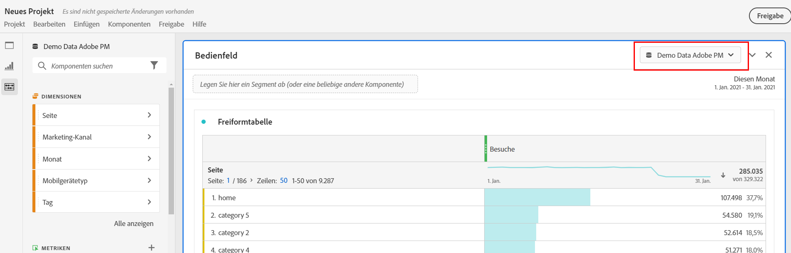
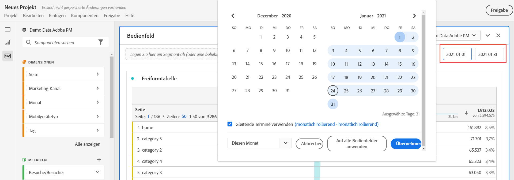
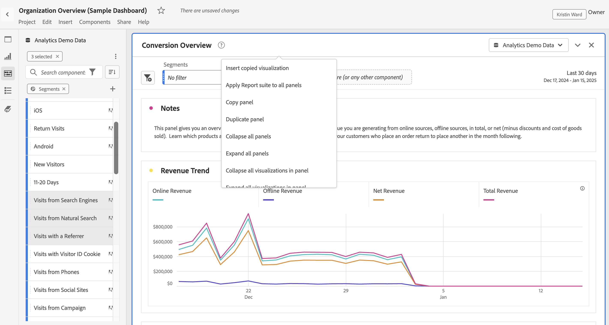

# Überblick über Panels

Ein [!UICONTROL Panel] ist eine Sammlung von Tabellen und Visualisierungen. Sie können über das Symbol oben links in Arbeitsbereich oder über ein [leeres Bedienfeld](/help/analyze/analysis-workspace/c-panels/blank-panel.md) auf Bedienfelder zugreifen. Panels sind hilfreich, wenn Sie Ihre Projekte nach Zeiträumen, Report Suites oder Analysen ordnen möchten. 

## Bedienfeldtypen

Die folgenden Bedienfeldtypen sind in Analysis Workspace für [!UICONTROL Adobe Analytics] verfügbar:

| Name des Bedienfelds | Beschreibung |
| --- | --- |
| [Leeres Bedienfeld](/help/analyze/analysis-workspace/c-panels/blank-panel.md) | Wählen Sie zum Beginnen Ihrer Analyse aus den verfügbaren Bedienfeldern und Visualisierungen. |
| [Attribution](attribution.md) | Vergleichen und visualisieren Sie im Handumdrehen eine beliebige Anzahl von Attributionsmodellen unter Verwendung verschiedener Dimensionen und Konversionsmetriken. |
| [Analytics for Target](a4t-panel.md) | Analysieren Sie Target-Aktivitäten und Erlebnisse in Analysis Workspace. |
| [Freiform](freeform-panel.md) | Führen Sie unbegrenzt Vergleiche und Aufschlüsselungen durch und fügen Sie dann Visualisierungen hinzu, um eine ausführliche Story mit den Daten zu erzählen. |
| [Medien-Zielgruppendurchschnitt pro Minute](average-minute-audience-panel.md) | Analysieren Sie den Zielgruppendurchschnitt pro Minute für einen bestimmten Inhalt oder für einen benutzerdefinierten Zeitraum. |
| [Gleichzeitige Medienbetrachtende](media-concurrent-viewers.md) | Analysieren Sie gleichzeitige Betrachtende über einen längeren Zeitraum. Sie erhalten Details zum maximalen gleichzeitigen Zugriff und die Möglichkeit, aufzuschlüsseln und zu vergleichen. |
| [Verbrachte Zeit bei der Medienwiedergabe](/help/analyze/analysis-workspace/c-panels/media-playback-time-spent.md) | Analysieren Sie die Wiedergabedauer, um nachzuvollziehen, wo Spitzenzeiten bei gleichzeitigen Ansichten auftreten oder wo es zu Abbrüchen kommt. |
| [Nächstes oder vorheriges Objekt](next-previous.md) | Zeigen Sie die nächsten oder vorherigen Seiten an, zu denen Personen navigieren. |
| [Quick Insights](quickinsight.md) | Erstellen Sie im Nu eine Freiformtabelle und eine entsprechende Visualisierung, um Erkenntnisse schneller zu analysieren und bereitzustellen. |
| [Seitenzusammenfassung](page-summary.md) | Erkunden Sie wichtige Statistiken zu bestimmten Seiten. |
| [Segmentvergleich](/help/analyze/analysis-workspace/c-panels/c-segment-comparison/segment-comparison.md) | Vergleichen Sie schnell zwei Segmente über alle Datenpunkte hinweg, um automatisch relevante Unterschiede zu ermitteln. |

Die Bedienfelder [!UICONTROL Quick Insights], [!UICONTROL Leer] und [!UICONTROL Freiform] eignen sich hervorragend als Ausgangspunkt für Ihre Analyse. [!UICONTROL Attribution] bietet sich hingegen für erweiterte Analysen an. Unten auf der Arbeitsfläche ist das Symbol  verfügbar, durch das Sie jederzeit leere Bedienfelder hinzufügen können.

Das standardmäßige Startbedienfeld ist das Bedienfeld [!UICONTROL Freiform]. Sie können jedoch auch das Bedienfeld [Leer](/help/analyze/analysis-workspace/c-panels/blank-panel.md) oder [Quick Insights](/help/analyze/analysis-workspace/c-panels/quickinsight.md) als Standard festlegen. Siehe [Voreinstellungen für Projekte und Analysen](/help/analyze/analysis-workspace/user-preferences.md#projects--analyses-preferences).

## Erstellen eines Bedienfelds

So erstellen Sie ein Bedienfeld:

* Ziehen Sie ein Bedienfeld aus dem linken Bedienfeld **[!UICONTROL Bedienfelder]** auf Ihre Arbeitsfläche.
* Wählen Sie ein Bedienfeld aus dem Bedienfeld [Leer](blank-panel.md) aus.
* Verwenden Sie das Menü **[!UICONTROL Einfügen]** in Workspace und wählen Sie Ihr Bedienfeld aus. Alternativ können Sie Bedienfelder mit einem der [Tastaturbefehle](../build-workspace-project/fa-shortcut-keys.md) einfügen.

  

Sie haben folgende Möglichkeiten:

* Wählen Sie das Symbol  **in** einem beliebigen Bedienfeld aus, um eine weitere Visualisierung hinzuzufügen. Es wird ein Popup angezeigt, in dem Sie eine Visualisierung auswählen können.

  

  | Auswählen… | Erstelltes Element |
  |---|---|
  |  | [Freiformtabelle](/help/analyze/analysis-workspace/visualizations/freeform-table/freeform-table.md) |
  |  | [Linie](/help/analyze/analysis-workspace/visualizations/line.md) |
  |  | [Balken](/help/analyze/analysis-workspace/visualizations/bar.md) |
  |  | [Zusammenfassungszahl](/help/analyze/analysis-workspace/visualizations/summary-number-change.md) |
  |  | [Text](/help/analyze/analysis-workspace/visualizations/text.md) |
  |  | [Fallout](/help/analyze/analysis-workspace/visualizations/fallout/fallout-flow.md) |
  |  | [Fluss](/help/analyze/analysis-workspace/visualizations/c-flow/flow.md) |
  |  | [Bereiche gestapelt](/help/analyze/analysis-workspace/visualizations/area.md) |
  |  | [Kohortentabelle](/help/analyze/analysis-workspace/visualizations/cohort-table/t-cohort.md) |
  |  | [Bullet](/help/analyze/analysis-workspace/visualizations/bullet-graph.md) |
  |  | [Ringdiagramm](/help/analyze/analysis-workspace/visualizations/donut.md) |
  |  | [Zusammenfassungsänderung](/help/analyze/analysis-workspace/visualizations/summary-number-change.md) |
  |  | [Histogramm](/help/analyze/analysis-workspace/visualizations/histogram.md) |
  |  | [Streuung](/help/analyze/analysis-workspace/visualizations/scatterplot.md) |
  |  | [Venn](/help/analyze/analysis-workspace/visualizations/venn.md) |
  |  | [Treemap](/help/analyze/analysis-workspace/visualizations/treemap.md) |

* Wählen Sie  **außerhalb** des letzten Panels in Ihrem Arbeitsbereich aus, um ein weiteres [leeres Panel](blank-panel.md) hinzuzufügen.

## Verwalten eines Panels

Sie können ein Panel wie folgt verwalten:

* Um ein Panel zu reduzieren, wählen Sie  aus.
* Um ein reduziertes Panel anzuzeigen, wählen Sie  aus.
* Um ein Bedienfeld zu löschen, wählen Sie  aus. Wählen Sie zum Rückgängigmachen **[!UICONTROL Bearbeiten]** > **[!UICONTROL Rückgängig]** (**[!UICONTROL *cmd *+*z *]**|**[!UICONTROL * Strg *+* z *]**).
* Um einen Bereich zu verschieben, ziehen Sie den Bereich per Drag-and sichtbar ist (in der Regel, wenn Sie den Mauszeiger über die Kopfzeile bewegen).

## Report Suite

Jedes Panel ist mit einer [Report Suite](/help/admin/tools/manage-rs/report-suites-admin.md) verknüpft, die durch den -**[!UICONTROL *Namen der Report Suite *]**&#x200B;im Dropdown-Menü oben rechts im Panel identifiziert wird.

Wenn Sie ein neues Bedienfeld erstellen, basiert die Standard-Report Suite auf dem Bedienfeld, an dem Sie zuletzt im Analysis Workspace-Projekt gearbeitet haben.

In einem Projekt können Sie je nach Anwendungsfällen Ihrer Analyse eine oder [viele Report Suites](/help/analyze/analysis-workspace/build-workspace-project/multiple-report-suites.md) verwenden. 

Die Liste der Report Suites ist nach Relevanz sortiert, die Adobe anhand der Aktualität und Häufigkeit der Verwendung der Suite durch den aktuellen Benutzer definiert. Und wie oft die Suite innerhalb des Unternehmens verwendet wird.

>[!IMPORTANT]
>
>Die ausgewählte Report Suite legt fest, welche Dimensionen, Metriken und Segmente zum Erstellen von Visualisierungen in einem Bedienfeld verfügbar sind.
>
>
>Wenn Sie eine Report Suite für ein Bedienfeld wechseln, sind einige Komponenten in dieser neuen Report Suite möglicherweise nicht verfügbar. Diese Änderung kann dazu führen, dass Ihre Visualisierung nicht ordnungsgemäß gerendert wird. Möglicherweise werden Warnungen wie diese angezeigt:
>
>* Dieses Bedienfeld enthält Komponenten, die in der ausgewählten Report Suite nicht aktiviert sind. Ändern Sie die Report Suite oder aktivieren Sie die erforderlichen Komponenten in der Report Suite.
>* Visualisierung kann nicht gerendert werden: Überprüfen Sie Ihre Spalten und Zeilen, um sicherzustellen, dass sie gültige Komponenten enthalten.
>

## Kalender

Der Panel-Kalender steuert den Reporting-Datumsbereich für Tabellen und Visualisierungen innerhalb eines Panels.

>[!NOTE]
>
>Wenn eine Komponente des -Datumsbereichs in einer Visualisierung oder einem Bedienfeld verwendet wird (z. B. als Segment), überschreibt die Datumsbereichskomponente den Bedienfeldkalender.
>

1. Wählen Sie einen Datumsbereich aus, indem Sie zuerst das Startdatum und dann das Enddatum auswählen.
Alternativ können Sie eine **[!UICONTROL Voreinstellung]** aus dem Dropdown-Menü [!UICONTROL *Voreinstellung auswählen*] auswählen.

1. Wählen Sie optional **[!UICONTROL Erweiterte Einstellungen einblenden]** für Folgendes aus:

   * Geben Sie eine andere **[!UICONTROL Startzeit]** und **[!UICONTROL Endzeit]** als die Standardwerte `12:00 AM` (`0:00`) und `11:59 PM` (`23:59`) an. Endzeiten umfassen immer 59 Sekunden. Für einen Datumsbereich, der viele Tage umfasst, gilt die Startzeit für den ersten Tag des Datumsbereichs und die Endzeit gilt für den letzten Tag in Ihrem Datumsbereich. Verwenden Sie **[!UICONTROL (Zeitwerte zurücksetzen)]**, um die Start- und Endzeit auf ihre Standardwerte zurückzusetzen.
   * **[!UICONTROL Erstellen von Datumsbereichskomponenten relativ zum Panel-Kalender]**. Wenn diese Option deaktiviert ist, sind die im Bedienfeld verwendeten Datumsbereichskomponenten relativ zur aktuellen Zeit. Wenn diese Option aktiviert ist, sind die im Bedienfeld verwendeten Datumsbereichskomponenten relativ zum Bedienfeldkalender.
   * **[!UICONTROL Rollierende Termine verwenden]**. Wenn diese Option aktiviert ist, werden voreingestellte Datumsbereiche wie **[!UICONTROL Letzte 7 volle Tage]** dynamisch als aktuelles Datum und aktueller Zeitfortschritt aktualisiert. Wenn diese Option deaktiviert ist, werden diese Vorgaben nach der Anwendung nicht aktualisiert.

     

     Sie können den Text in Klammern auswählen (z. B. **[!UICONTROL Fester Start - täglich rollierend]**), um das Bedienfeld zu erweitern und Details für **[!UICONTROL Start]** und **[!UICONTROL Ende]** anzugeben.

      1. Wählen Sie **[!UICONTROL Anfang von]**, **[!UICONTROL Ende von]** oder **[!UICONTROL Festgelegter Tag]** aus.
      1. Wenn Sie **[!UICONTROL Anfang von]** oder **[!UICONTROL Ende von]** ausgewählt haben, können Sie einen vollständigen Ausdruck erstellen. Beispiel: **[!UICONTROL Ende von]** **[!UICONTROL Aktuelles Jahr]** **[!UICONTROL plus]** `1` **[!UICONTROL Tag]**. Wählen Sie den entsprechenden Wert für jeden einzelnen Teil des Ausdrucks aus.
         * Wählen Sie einen Wert für den aktuellen Zeitraum aus, Beispiel: **[!UICONTROL aktuelles Jahr]**.
         * Wählen Sie einen Wert für die zusätzliche Berechnung aus, z. B. **[!UICONTROL plus]**.
         * Wenn Sie eine zusätzliche Berechnung angegeben haben, geben Sie einen Wert an. Zum Beispiel `1`.
         * Wenn Sie eine zusätzliche Berechnung angegeben haben, wählen Sie den Zeitraum aus, der für die Berechnung verwendet werden soll, z. B. **[!UICONTROL Tag]**.

     Wählen Sie **[!UICONTROL Details ausblenden]** aus, um die Details für die Berechnung rollierender Termine auszublenden.

1. Wählen Sie **[!UICONTROL Übernehmen]** aus, um den Datumsbereich auf das Bedienfeld anzuwenden, über das der Kalender aufgerufen wurde.
Wählen Sie **[!UICONTROL Auf alle Panels anwenden]** aus, um den Datumsbereich auf alle Panels im Workspace-Projekt anzuwenden.

## Ablegebereich {#dropzone}

Der Ablagebereich des Bedienfelds mit **[!UICONTROL _Komponente ablegen, um die Daten zu filtern oder aufzuschlüsseln_]** ermöglicht es Ihnen, die Daten für das Bedienfeld zu filtern oder aufzuschlüsseln. Die Segmente oder Aufschlüsselungen, die Sie zum Filtern oder Aufschlüsseln der Daten verwenden, gelten für alle Freiformtabellen und Visualisierungen im Bedienfeld.

Segmente und Aufschlüsselungen ermöglichen eine kontrollierte Interaktion mit den Daten. Sie können beispielsweise ein Dropdown-Menü für Segmente für Typen von Mobilgeräten hinzufügen, damit Sie das Bedienfeld filtern können, indem Sie Tablet, Smartphone oder Desktop auswählen.

Segmente können auch verwendet werden, um viele Projekte zu einem zusammenzufassen. Wenn Sie beispielsweise verschiedene Versionen desselben Projekts mit jeweils einem anderen Ländersegment angewendet haben, können Sie alle Versionen in einem Projekt zusammenfassen und ein Dropdown-Menü für Ländersegmente hinzufügen.

Die folgende Abbildung zeigt die verschiedenen Varianten von (Schnell-)Segmenten oder Aufschlüsselungen, die sich beim Hinzufügen von Komponenten zur Ablagefläche ergeben.

### Hinzufügen oder ersetzen

So fügen Sie (Schnellsegmente) oder Aufschlüsselungen hinzu oder ersetzen sie:

1. Wählen Sie eine oder mehrere Komponenten in der Leiste Komponenten aus. Verwenden Sie ⇧+ oder ^+, um mehr als eine Komponente auszuwählen.
1. Ziehen Sie die Auswahl in den Ablagebereich mit der Beschriftung **[!UICONTROL _Komponente ablegen, um die Daten zu filtern oder aufzuschlüsseln_]** ❶ oder über eine vorhandene Komponente, die bereits in der Nähe des Ablagebereichs platziert wurde.
1. Es stehen zwei Optionen zur Verfügung, wenn  **[!UICONTROL Hinzufügen (zum Erstellen eines Dropdown-Menüs die Umschalttaste drücken)]** oder  **[!UICONTROL Ersetzen (zum Hinzufügen zum Dropdown die Umschalttaste drücken)]**:

   

   * Ziehen Sie die Auswahl in den Arbeitsbereich, um die folgenden Komponenten zu erstellen:
      * [Segment](#segment) für alle Segmentkomponenten, die Sie ❷.
      * [Schnellsegment](#quick-segment) für alle Nicht-Segmentkomponenten (Datumsbereiche, Metriken, Dimensionen, Dimensionselemente), die Sie ❸.
   * Ziehen Sie die Auswahl **während Sie halten** ⇧ (Umschalt), um die folgenden Komponenten zu erstellen:
      * Statisches Segment [Dropdown-Menü](#drop-down-menu) mit Elementen, nach denen nach den ausgewählten Segmenten gefiltert werden soll, die Sie ❹.
      * Statisches Segment [Dropdown-Menü](#drop-down-menu) mit Elementen, nach denen nach den ausgewählten Datumsbereichen gefiltert werden soll, die Sie ❺.
      * Statisches Segment [Dropdown-Menü](#drop-down-menu) mit Elementen, nach denen nach den ausgewählten Metriken gefiltert werden soll, die Sie ❻.
      * Statisches Segment [Dropdown-Menü](#drop-down-menu) oder Aufschlüsselung [Dropdown-Menü](#drop-down-menu) *mit Elementen, nach denen für die ausgewählte Dimension (Elemente* gefiltert werden soll, die Sie ❼.
      * Dynamisches Segment [Dropdown-Menü](#drop-down-menu) oder Aufschlüsselung [Dropdown-](#drop-down-menu)) mit Elementen, nach denen für die ausgewählten Dimensionen, die Sie ❽ ablegen, gefiltert oder aufgeschlüsselt werden soll.

### Segment

Jede Segmentkomponente, die Sie ablegen, wird zum Segmentieren des Bedienfelds verwendet. Verwenden Sie Segmente, um segmentierte Einblicke in die Daten und Visualisierungen Ihres Bedienfelds zu erhalten.

### Schnellsegment

Jede Nicht-Segment-Komponente (Dimension, Dimensionselement, Metrik, Datumsbereich), die abgelegt wird, definiert ein [Schnellsegment](#quick-segment) zum Segmentieren des Bedienfelds. Verwenden Sie eine beliebige Nicht-Segment-Komponente, um ein Schnellsegment ohne Verwendung von [Segment Builder) &#x200B;](/help/components/segmentation/segmentation-workflow/seg-quick.md) erstellen. Ein auf diese Weise erstelltes Segment wird automatisch als Segment auf Ereignisebene definiert und standardmäßig mit **[!UICONTROL Schnellsegment]** gekennzeichnet.

Alternativ können Sie  verwenden, um ein Schnellsegment zu erstellen.

Informationen [&#x200B; Erstellen und Verwalten &#x200B;](/help/components/segmentation/segmentation-workflow/seg-quick.md) Schnellsegmenten finden Sie unter „Schnellsegmente“.

### Dropdown-Menü

Ein Dropdown-Menü, das erstellt wird, während Sie ⇧ gedrückt halten, kann:

* enthalten eine [statische](#static) oder [dynamische](#dynamic) Liste von Elementen.
* Verhalten Sie sich [einen Bereich filtern](#filter) oder [einen Bereich aufschlüsseln](#breakdown).

#### Statisch

Für ausgewählte Dimensionen (Elemente), Metriken *Segmente und* werden statische Dropdown-Menüs erstellt. Die Elemente in einem statischen Dropdown-Menü basieren auf den ausgewählten Komponenten, die Sie ablegen, und die Elemente ändern sich nicht, wenn Sie Komponenten hinzufügen oder ersetzen.

#### Dynamisch

Dynamische Dropdown-Menüs werden nur erstellt, wenn Sie Dimensionskomponenten ablegen. Dynamische Dropdown-Menüs werden mit  als Teil der Bezeichnung angezeigt.

Die verfügbaren Elemente in einem dynamischen Dropdown-Menü basieren auf:

* die Daten, die aus ausgewählten Elementen in anderen Dropdown-Menüs, Segmenten und Schnellsegmenten in der Dropzone des Bedienfelds resultieren, und
* Die im Berichtsbereich des Bedienfelds verfügbaren Daten.

Sie können beispielsweise zwei dynamische Dropdown-Menüs mit der Dimension Land und der Dimension Stadt hinzufügen. Wenn Sie ein Land aus dem Dropdownmenü **[!UICONTROL Länder]** auswählen, wird das **[!UICONTROL Städte]**-Dropdown-Menü dynamisch angepasst, sodass nur Städte innerhalb des ausgewählten Landes angezeigt werden. Wenn Sie zusätzliche statische Dropdown-Menüs haben, wirken sich die in diesen Dropdown-Menüs ausgewählten Elemente auch auf die verfügbaren Elemente in den dynamischen Dropdown-Menüs aus. Elemente, die in dynamischen Dropdown-Menüs ausgewählt werden, wirken sich nicht auf verfügbare Elemente in statischen Dropdown-Menüs aus.

#### Filtern eines Bedienfelds

Für jede Metrik, jedes Segment oder jede Datumsbereichskomponente, die Sie ablegen **während Sie** halten⇧ wird ein Dropdown-Menü für Segmente erstellt. Dieses Dropdown-Menü ermöglicht es Ihnen, das Bedienfeld nach Elementen zu filtern, die für die abgelegte Komponente verfügbar sind.

Für jede *Dimension*-Komponente, die Sie ablegen **während Sie** halten⇧ wird ein Dropdown-Menü für Segmente erstellt. Dieses Dropdown-Menü ermöglicht es Ihnen, das Bedienfeld basierend auf den Elementen zu filtern, die für die abgelegten Dimensionselemente ([statisches](#static) Dropdown-Menü für Segmente) oder die Dimensionskomponente ([dynamisches](#dynamic) Dropdown-Menü für Segmente) verfügbar sind. So konfigurieren Sie das Dropdown-Menü explizit für das Filtern mithilfe von Segmenten:

* Wählen Sie  und wählen Sie  aus dem Kontextmenü für die ❾ aus.

#### Aufschlüsseln eines Bedienfelds

Für jede *Dimension*-Komponente, die Sie ablegen **während Sie** halten⇧ wird ein Dropdown-Menü für Segmente erstellt. Sie können das Dropdown-Menü so konfigurieren, dass stattdessen eine Aufschlüsselung erfolgt. So konfigurieren Sie das Dropdown-Menü explizit für Aufschlüsselungen:

* Wählen Sie  und wählen Sie  aus dem Kontextmenü für die ❾ aus.

>[!IMPORTANT]
>
>Aufschlüsselungen sind nur für Dimensionen und Dimensionselemente verfügbar, nicht für Segmente, Datumsbereiche oder Metriken.
>

#### Segmente versus Aufschlüsselungen

Erwägen Sie in den folgenden Szenarien, einen Bereich aufzuschlüsseln, anstatt ihn zu filtern (mithilfe von Segmenten):

* Wenn Sie Attribution-aktivierte Metriken in Ihrem Bedienfeld verwenden, löschen Segmente häufig Ihre Attribution-aktivierten Metriken. Aufschlüsselungen werden an einer anderen Stelle innerhalb der Abfrage angewendet, die ausgeführt wird, um die Daten für Ihr Bedienfeld abzurufen. Daher werden diese Attribut-aktivierten Metriken bei Aufschlüsselungen nicht gelöscht.

  Sehen Sie als Beispiel den Unterschied zwischen der auf dem Attribut **[!UICONTROL Online-Umsatz]** basierenden Metrik bei Verwendung eines Segments **[!UICONTROL Luma:]** **[!UICONTROL Women]** und eines **[!UICONTROL Luma: Produktkategorie]**  Aufschlüsselung **[!UICONTROL Women]**.

  

* Wenn Sie eine Dimension auf Unterereignis-Ebene in einem Aufschlüsselungs-Dropdown-Menü verwenden, werden die Aufschlüsselungen auf dieser Unterereignis-Ebene ausgeführt. Stattdessen werden Segmente innerhalb eines Dropdown-Menüs Segmente auf Ereignisebene ausgeführt.

  Sehen Sie sich als Beispiel den Unterschied zwischen der Metrik **[!UICONTROL Online-Umsatz]** an, wenn Sie ein Segment **[!UICONTROL Luma:]**- **[!UICONTROL Tops]** im Vergleich zu einem Segment **[!UICONTROL Luma: Produktunterkategorie]** Aufschlüsselung **[!UICONTROL Tops]** verwenden. Die Aufschlüsselung führt die Abfrage explizit auf der Ebene der Unterereignisse aus, während das Segment die Abfrage auf der Ereignisebene ausführt.

  

### Verwalten

Sie können die Komponenten im Ablagebereich wie folgt verwalten:

| Was zu tun ist in der Ablagefläche des Bedienfelds… | Vorgehensweise… |
|---|---|
| So entfernen Sie ein Segment oder Schnellsegment. | Wählen  innerhalb der Komponente aus. |
| So entfernen Sie ein ausgewähltes Element aus einem Dropdown-Menü. | Wählen Sie  innerhalb des Elements aus. |
| So entfernen Sie alle ausgewählten Elemente aus einem Dropdown-Menü. | Wählen  im Dropdown-Menü aus. |
| So bearbeiten Sie die Beschriftung einer beliebigen Komponente. | Bewegen Sie den Mauszeiger über die Beschriftung für die Komponente und wählen Sie . |
| So löschen Sie die Beschriftung einer Komponente. | Bewegen Sie den Mauszeiger über die Beschriftung für die Komponente und **[!UICONTROL Sie]** Kontextmenü für die Komponente auf „Beschriftung löschen“. |
| So löschen Sie die Komponente aus dem Ablagebereich. | Wählen **[!UICONTROL Dropdown löschen]** aus dem Kontextmenü für die Komponente aus. |
| Um Informationen zu einem Segment oder Schnellsegment zu erhalten. | Bewegen Sie den Mauszeiger über die Komponente und wählen  aus, um das Datenwörterbuch mit Informationen zur Komponente zu öffnen. |
| Um Informationen über die Komponente zu erhalten, die ein Dropdown-Menü definiert. | Bewegen Sie den Mauszeiger über das Dropdown-Menü und wählen Sie  aus, um das Datenwörterbuch mit Informationen zur Komponente zu öffnen. |
| So bearbeiten Sie ein Schnellsegment: | Bewegen Sie den Mauszeiger über das Schnellsegment und wählen Sie  aus. Weitere Informationen finden [&#x200B; unter &#x200B;](/help/components/segmentation/segmentation-workflow/seg-quick.md)Schnellsegmente“. |
| So fordern Sie eine Auswahl für ein Dropdown-Menü an. | Wählen **[!UICONTROL Auswahl erforderlich]** aus dem Kontextmenü für die Komponente aus. |
| , um für ein Dropdown-Menü keinen Filter zuzulassen. | Wählen **[!UICONTROL Keine Filter zulassen]** aus dem Kontextmenü für die Komponente aus. |
| So setzen Sie alle Komponenten zurück und löschen alle Auswahlen für Dropdown-Menüs. | Wählen Sie **[!UICONTROL Alle zurücksetzen]** aus. |

>[!BEGINSHADEBOX]

Siehe  [Verwenden von Filtern in Analysis Workspace](https://experienceleague.adobe.com/de/docs/analytics-learn/tutorials/analysis-workspace/using-panels/using-drop-down-filters){target="_blank"} für ein Demovideo.

>[!ENDSHADEBOX]

>[!BEGINSHADEBOX]

Siehe  [Dynamische Dropdown-](https://experienceleague.adobe.com/de/docs/customer-journey-analytics-learn/tutorials/analysis-workspace/tips-and-tricks/dynamic-drop-downs){target="_blank"}) für ein Demovideo.

{{videocja}}

>[!ENDSHADEBOX]

## Kontextmenü

Weitere Funktionen für ein Panel sind über ein Kontextmenü (Rechtsklick) auf der Panel-Überschrift verfügbar.

Die folgenden Optionen sind verfügbar:

| Option | Beschreibung |
| --- | --- |
| **[!UICONTROL Kopiertes Panel einfügen]** | Ermöglicht es Ihnen, ein kopiertes Panel an einer anderen Stelle innerhalb des Projekts oder in ein ganz anderes Projekt einzufügen. |
| **[!UICONTROL Kopierte Visualisierung einfügen]** | Fügen Sie eine kopierte Visualisierung an einer anderen Stelle innerhalb des Panels oder des Projekts oder in ein ganz anderes Projekt ein. |
| **[!UICONTROL Report Suite auf alle Bedienfelder anwenden]** | Die Report Suite für dieses Bedienfeld auf alle anderen Bedienfelder im Projekt anwenden. |
| **[!UICONTROL Panel kopieren]** | Kopieren Sie ein Panel, sodass Sie es an einer anderen Stelle innerhalb des Projekts oder in ein anderes Projekt einfügen können. |
| **[!UICONTROL Panel duplizieren]** | Fertigt ein exaktes Duplikat des aktuellen Panels an, das Sie dann bearbeiten können. |
| **[!UICONTROL Alle Bedienfelder reduzieren]** | Ermöglicht es Ihnen, alle Projektbedienfelder zu reduzieren. |
| **[!UICONTROL Alle Bedienfelder erweitern]** | Ermöglicht es Ihnen, alle Projektbedienfelder zu erweitern. |
| **[!UICONTROL Alle Visualisierungen im Bedienfeld reduzieren]** | Ermöglicht es Ihnen, alle Visualisierungen im aktuellen Bedienfeld zu reduzieren. |
| **[!UICONTROL Alle Visualisierungen im Bedienfeld erweitern]** | Ermöglicht es Ihnen, alle Visualisierungen im aktuellen Bedienfeld zu erweitern. |
| **[!UICONTROL Beschreibung bearbeiten]** | Hiermit können Sie einen Text zur Beschreibung des Bedienfelds hinzufügen (oder bearbeiten). |
| **[!UICONTROL Bereichslink abrufen]** | Ermöglicht es Ihnen, Personen zu einem bestimmten Bedienfeld innerhalb eines Projekts zu leiten. Wenn der Link ausgewählt wird, muss sich die empfangende Person anmelden, bevor sie genau zu dem Bedienfeld weitergeleitet wird, zu dem eine Verknüpfung besteht. |

## Konfiguration

Einige Panels (z. B. [!UICONTROL Attribution], [!UICONTROL Experimentieren] und [!UICONTROL Medien-Zielgruppendurchschnitt pro Minute]) verfügen über ein Konfigurationsdialogfeld, das Sie beim Erstellen der Visualisierung unterstützt. Verwenden Sie  oben im Panel, um auf die Konfiguration zuzugreifen und diese zu ändern.

