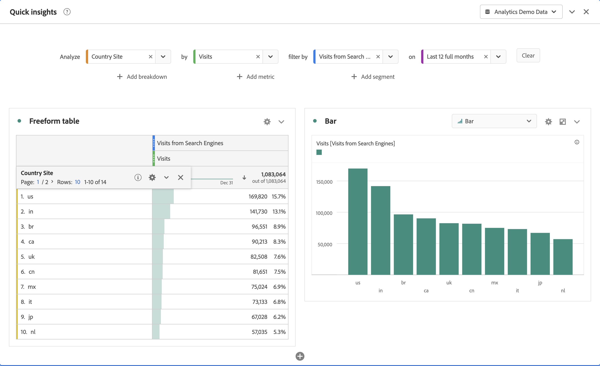

# Bedienfeld „Quick Insights“ {#quick-insights-panel}

<!-- markdownlint-disable MD034 -->

>[!CONTEXTUALHELP]
>id="workspace_quickinsights_button"
>title="Quick Insights"
>abstract="Erstellen Sie ein Bedienfeld, um im Handumdrehen eine Freiformtabelle und eine entsprechende Visualisierung zu erstellen, um Erkenntnisse schneller zu analysieren und bereitzustellen."

<!-- markdownlint-enable MD034 -->

>[!BEGINSHADEBOX]

_In diesem Artikel wird das Bedienfeld „Quick Insights“ in_  _&#x200B;**Adobe Analytics** beschrieben._ _Unter [Bedienfeld „Quick Insights“](https://experienceleague.adobe.com/de/docs/analytics/analyze/analysis-workspace/panels/quickinsight) finden Sie die Version dieses Artikels für_  _&#x200B;**Customer Journey Analytics**._

>[!ENDSHADEBOX]

[!UICONTROL Quick Insights] bietet Nicht-Analytikern und neuen Benutzern von [!UICONTROL Analysis Workspace] die Möglichkeit, betriebliche Fragen schnell und einfach zu beantworten. Es ist auch ein großartiges Tool für fortgeschrittene Benutzer, die eine einfache Frage schnell beantworten möchten, ohne selbst eine Tabelle erstellen zu müssen.

Wenn Sie [!UICONTROL Analysis Workspace] zum ersten Mal verwenden, stellen Sie sich vielleicht folgende Fragen:

* Welche Visualisierungen sind am nützlichsten?
* Welche Dimensionen und Metriken können Erkenntnisse erleichtern?
* Wo werden Elemente per Drag-and-Drop eingefügt?
* Wo werden Filter erstellt?
* und vieles mehr.

Um bei der Beantwortung dieser Fragen zu helfen, nutzt [!UICONTROL Quick Insights] einen Algorithmus, der Ihnen die beliebtesten Dimensionen, Metriken, Segmente und Datumsbereiche präsentiert, die Ihr Unternehmen verwendet. Dieser Algorithmus basiert auf der Verwendung von Datenkomponenten durch Ihr eigenes Unternehmen in [!UICONTROL Analysis Workspace]. In der Dropdown-Liste werden Dimensionen, Metriken und Segmente angezeigt, die als [!UICONTROL BELIEBT] gekennzeichnet sind, wie im Folgenden gezeigt:

[!UICONTROL Quick Insights] hilft Ihnen bei Folgendem:

* Ordnungsgemäßes Erstellen einer Datentabelle und einer zugehörigen Visualisierung in [!UICONTROL Analysis Workspace].
* Vertrautmachen mit der Terminologie und dem Vokabular für grundlegende Komponenten und Bestandteile von [!UICONTROL Analysis Workspace].
* Ausführen einfacher Aufschlüsselungen von Dimensionen, Hinzufügen mehrerer Metriken oder Vergleichen von Segmenten in einer [!UICONTROL Freiformtabelle].
* Ändern oder Ausprobieren verschiedener Visualisierungstypen, um das Suchwerkzeug für Ihre Analyse schnell und intuitiv zu finden.

## Grundlegende Terminologie

Im Folgenden finden Sie einige grundlegende Begriffe, mit denen Sie vertraut sein müssen. Jede Datentabelle besteht aus zwei oder mehr Bausteinen (Komponenten), die Sie für Ihre Daten verwenden.

| Baustein (Komponente) | Definition |
|---|---|
| **[!UICONTROL Dimension]** | Dimensionen sind Beschreibungen oder Eigenschaften metrischer Daten, die in einem Projekt angezeigt, aufgeschlüsselt und verglichen werden können. Es handelt sich um nicht-numerische Werte und Daten, die in Dimensionselemente aufgeschlüsselt werden. Zum Beispiel ist *Browser* oder *Seite* eine Dimension. |
| **[!UICONTROL Dimensionselement]** | Dimensionselemente sind individuelle Werte für eine Dimension. Dimensionselemente für die Dimension „Browser“ wären zum Beispiel *Chrome*, *Firefox*, *Edge* oder andere. |
| **[!UICONTROL Metrik]** | Metriken sind quantitative Informationen über Aktivitäten von Personen wie Ansichten, Clickthroughs, Neuladungen, durchschnittliche Besuchszeit, Einheiten, Bestellungen, Umsatz usw. |
| **[!UICONTROL Visualisierung]** | Workspace bietet [eine Reihe von Visualisierungen](/help/analyze/analysis-workspace/visualizations/freeform-analysis-visualizations.md), um visuelle Darstellungen Ihrer Daten zu erstellen. Zum Beispiel Balkendiagramme, Ringdiagramme, Histogramme, Liniendiagramme, Karten, Streudiagramme und andere. |
| **[!UICONTROL Dimensionsaufschlüsselung]** | Mit einer Dimensionsaufschlüsselung können Sie eine Dimension nach anderen Dimensionen aufschlüsseln. Sie können beispielsweise die US-Bundesstaaten nach Mobilgeräten aufschlüsseln, um die Besuche durch Mobilgeräte pro Bundesstaat zu erhalten. Oder Sie können Mobilgeräte nach Mobilgerätetypen, Regionen, internen Kampagnen und mehr aufschlüsseln. |
| **[!UICONTROL Segmente]** | Mit Segmenten können Personenuntergruppen anhand von Merkmalen oder Website-Interaktionen identifiziert werden. Zum Beispiel können Sie [!UICONTROL Besucher]-Segmente basierend auf folgenden Merkmalen erstellen: <li>Attribute: Browser-Typ, Gerät, Anzahl der Besuche, Land, Geschlecht; oder</li><li>Interaktionen: Kampagnen, Keyword-Suche, Suchmaschine; oder</li><li>Ausstiege und Einstiege: Besuchende aus Facebook, einer definierten Landingpage, einer Referrer Domain; oder</li><li> Benutzerdefinierte Variablen: Formularfeld, definierte Kategorien, Kunden-ID. |

## Verwenden

So verwenden Sie ein Bedienfeld **[!UICONTROL Quick Insights]**:

1. Erstellen Sie ein Bedienfeld **[!UICONTROL Quick Insights]**. Informationen zum Erstellen eines Bedienfelds finden Sie unter [Erstellen eines Bedienfelds](panels.md#create-a-panel).

1. Wenn Sie zum ersten Mal ein Bedienfeld **[!UICONTROL Quick Insights]** verwenden, sollten Sie sich das kurze [!UICONTROL Einführungs-Tutorial] ansehen, das Ihnen einige Grundlagen vermittelt. Wählen Sie  neben dem Titel des Bedienfelds „Quick Insights“ und dann im Popup-Fenster die Option **[!UICONTROL Einführungs-Tutorial]** aus.

1. Legen Sie die [Eingabe](#panel-input) für das Bedienfeld fest.

1. Sehen Sie sich die [Ausgabe](#panel-output) für das Bedienfeld an.

### Bedienfeldeingabe

Wählen Sie die gewünschten Bausteine aus:

* **[!UICONTROL Analysieren]**: Zum Festlegen einer Dimension (orange)
* **[!UICONTROL Nach]**: Zum Festlegen einer Metrik (grün)
* **[!UICONTROL Filtern nach]**: Zum Festlegen eines Segments (blau)
* **[!UICONTROL Am]**: Zum Festlegen eines Datumsbereichs (violett).

Sie müssen mindestens eine Dimension und eine Metrik auswählen, damit die Visualisierung ordnungsgemäß funktioniert.

Sie haben drei Möglichkeiten, um die Bausteine festzulegen:

* Ziehen Sie Komponenten aus dem linken Bedienfeld und legen Sie sie ab.
* Beginnen Sie mit der Eingabe in eines der Bausteinfelder. Wenn eine Eingabe gefunden wird, wird das Bausteinfeld automatisch mit möglichen Werten aufgefüllt.
* Geben Sie ein Dropdown für Bausteine an (z. B. `Country` in **[!UICONTROL Analysieren]**) und suchen Sie in der Liste der möglichen Werte (mit ) nach dem zu verwendenden Wert (z. B. **[!UICONTROL Länder-Code]**).

Wählen Sie **[!UICONTROL Löschen]** aus, um alle Eingabefelder zu löschen.

### Bedienfeldausgabe

1. Wenn Sie mindestens eine Dimension und eine Metrik hinzugefügt haben, können Sie die Ergebnisse sehen.

   

   * Eine Freiformtabelle mit der Dimension ([!UICONTROL Länder-Site]) und Metrik ([!UICONTROL Besuche]), segmentiert nach [!UICONTROL Besuchen] von [!UICONTROL Suchmaschinen] für die [!UICONTROL letzten 12 Monate].

   * Eine begleitende Visualisierung, in diesem Fall ein [Balkendiagramm](/help/analyze/analysis-workspace/visualizations/bar.md). Die erstellte Visualisierung basiert auf dem Datentyp, den Sie der Tabelle hinzugefügt haben. Zeitbasierte Daten (z. B. [!UICONTROL Besuche] pro Tag/Monat) verwenden standardmäßig ein [!UICONTROL Liniendiagramm]. Alle nicht zeitbasierten Daten (z. B. [!UICONTROL Besuche] pro [!UICONTROL Gerät]) verwenden standardmäßig ein [!UICONTROL Balkendiagramm]. Sie können den Visualisierungstyp ändern, indem Sie auf den Dropdown-Pfeil neben dem Visualisierungstyp klicken.

1. Versuchen Sie, weitere Verfeinerungen hinzuzufügen, wie nachfolgend unter [Weitere Tipps](#more-tips) beschrieben.

1. Speichern Sie Ihr Projekt, indem Sie **[!UICONTROL Projekt > Speichern]** auswählen.

## Weitere Tipps

Weitere nützliche Hinweise werden im [!UICONTROL Quick Insights Builder] angezeigt. Einige davon hängen von Ihrer letzten Aktion ab.

* Zunächst sollten Sie das Tutorial **[!UICONTROL Mehr Tipps]** abschließen. Dieses Tutorial wird 24 Stunden nach dem Erstellen eines Projekts mit mindestens einer Dimension und einer Metrik angezeigt. Wählen Sie  neben dem Titel des Bedienfelds „Quick Insights“ und dann im Popup-Fenster die Option **[!UICONTROL Mehr Tipps]** aus.

  

* Sie können mehrere Dimensionen und Metriken analysieren, Segmente kombinieren oder vergleichen und einen Datumsbereich angeben:

  

   * Unter **[!UICONTROL Analysieren]** > **[!UICONTROL Aufschlüsselung nach]**: Sie können bis zu drei Aufschlüsselungsebenen für Dimensionen verwenden, um einen Drilldown zu den Daten durchzuführen, die Sie benötigen. Siehe ➊, ➋ und ➌.

   * Weitere Metriken **[!UICONTROL nach]** hinzufügen: Sie können bis zu zwei weitere Metriken hinzufügen. Siehe ➍ und ➎.

   * **[!UICONTROL Filtern nach]**: Sie können bis zu zwei weitere Segmente hinzufügen. Sie können beispielsweise „Buchungen“ als Segment hinzufügen und dieses Segment mit den von Ihnen verglichenen Segmenten für Personen, die häufig fliegen, und Personen, die zum ersten Mal fliegen, kombinieren. Siehe ➏, ➐ und ➑.

   * Am: Sie können den Datumsbereich festlegen. Siehe ➒.

## Bekannte Einschränkungen

Wenn Sie versuchen, die Datei direkt in der Tabelle zu bearbeiten, wird das Bedienfeld [!UICONTROL Quick Insights] möglicherweise nicht mehr synchronisiert. Wählen Sie oben rechts im Bedienfeld die Option **[!UICONTROL Builder neu synchronisieren]** aus, um die vorherigen Einstellungen für [!UICONTROL Quick Insights] wiederherzustellen.

Sie erhalten eine Warnung, bevor Sie etwas direkt zur Tabelle hinzufügen:

Andernfalls verhält sich die Tabelle beim direkten Erstellen wie eine herkömmliche Freiformtabelle, ohne die hilfreichen Funktionen für neue Benutzende.

>[!MORELIKETHIS]
>
>[Erstellen eines Bedienfelds](/help/analyze/analysis-workspace/c-panels/panels.md#create-a-panel)
>
<!--
# Quick Insights panel

[!UICONTROL Quick Insights] provides guidance for non-analysts and new users of [!UICONTROL Analysis Workspace] to learn how to answer business questions quickly and easily. It is also a great tool for advanced users who want to answer a simple question quickly without having to build a table themselves.

When you first start using this [!UICONTROL Analysis Workspace], you might wonder what visualizations would be most useful, which dimensions and metrics might facilitate insights, where to drag and drop items, where to create a segment, etc. 

To help with this, and based on your own company's usage of data components in [!UICONTROL Analysis Workspace], [!UICONTROL Quick Insights] leverages an algorithm that will present you with the most popular dimensions, metrics, segments, and date ranges your company uses. In fact, you will see dimensions, metrics, and segments tagged as [!UICONTROL Popular] in the drop-down list, as shown here:

[!UICONTROL Quick Insights] helps you

* Properly build a data table and an accompanying visualization in [!UICONTROL Analysis Workspace].
* Learn the terminology and vocabulary for basic components and pieces of [!UICONTROL Analysis Workspace].
* Do simple breakdowns of dimensions, add multiple metrics, or compare segments easily within a [!UICONTROL Freeform table].
* Change or try out various visualization types to find the find tool for your analysis quickly and intuitively.

Here is a video overview of the [!UICONTROL Quick Insights] panel:

>[!VIDEO](https://video.tv.adobe.com/v/326698/?quality=12&captions=ger)

## Basic key terminology

Following are some of the basic terms you need to be familiar with. Each data table consists of 2 or more building blocks (components) that you utilize to tell your data story.

|Building block (Component)|Definition|
|---|---|
|[!UICONTROL Dimension]|Dimensions are descriptions or characteristics of metric data that can be viewed, broken down, and compared in a project. They are non-numeric values and dates that break down into dimension items. For example, "browser", or "page" are dimensions.|
|[!UICONTROL Dimension item]|Dimension items are individual values for a dimension. For example, dimension items for the browser dimension would be "Chrome", "Firefox", "Edge", etc.|
|[!UICONTROL Metric]|Metrics are quantitative information about visitor activity, such as views, click-throughs, reloads, average time spent, units, orders, revenue, and so on.|
|[!UICONTROL Visualization]|Workspace offers [a number of visualizations](/help/analyze/analysis-workspace/visualizations/freeform-analysis-visualizations.md) to build visual representations of your data, such as bar charts, donut charts, histograms, line charts, maps, scatterplots, and others.|
|[!UICONTROL Dimension Breakdown]|A dimension breakdown is a way to literally break down a dimension by other dimensions. In our example, you could break down US States by Mobile Devices to get the mobile device visits per state, or you could break Mobile Devices down by Mobile Device types, by Regions, by Internal Campaigns, etc..|
|[!UICONTROL Segment]|Segments let you identify subsets of visitors based on characteristics or website interactions. For example, you can build [!UICONTROL Visitor] segments based on attributes: browser type, device, number of visits, country, gender, or based on interactions: campaigns, keyword search, search engine, or based on exits and entries: visitors from Facebook, a defined landing page, referring domain, or based on custom variables: form field, defined categories, customer ID.  |

## Get started with Quick Insights

1. Log in to Adobe Analytics using the credentials you have been provided with.
1. Go to [!UICONTROL Workspace] and click **[!UICONTROL Create New Project]** and then click **[!UICONTROL Quick Insights]**. (You can also access this panel from the **[!UICONTROL Panel]** menu in the left rail.)

    

    

1. When you first start out, go through the short tutorial that teaches you some of the [!UICONTROL Quick Insights panel] basics. Or, click to **[!UICONTROL Skip Tutorial]**.
1. Select your building blocks (also known as components): dimensions (orange), metrics (green), segments (blue), or date ranges (purple) You have to select at least one dimension and one metric for a table to be built automatically. 

    

    You have three ways of selecting the building blocks:
    * Drag and drop them from the left rail.
    * If you know what you are looking for: Start typing and [!UICONTROL Quick Insights] will fill in the blanks for you.
    * Click on the drop-down and search the list.

1. When you have added at least one dimension and one metric, the following will be created for you:

    * A Freeform table with the dimension (here, US States) vertically and the metric (here, Visits) horizontally at the top. Check out this table: 

    

    * An accompanying visualization, in this case a [bar chart](/help/analyze/analysis-workspace/visualizations/bar.md). The visualization that is generated is based on the type of data you added to the table. Any time-based data (such as [!UICONTROL Visits] per Day/Month) defaults to a [!UICONTROL Line] chart. Any non-time-based data (such as [!UICONTROL Visits] per [!UICONTROL Device]) defaults to a [!UICONTROL Bar] chart. You can change the type of visualization by clicking on the drop-down arrow next to the visualization type.

1. (Optional) Drill down on dimensions and see dimension items by clicking the > right-arrow next to the dimension.

1. Try adding some more refinements as described below under "More tips."

1. Save your project by clicking **[!UICONTROL Project > Save]**.

## More tips

Other useful hints will pop up in the [!UICONTROL Quick Insights Builder], some of them depending on your last action.

* First, complete the **[!UICONTROL More tips]** tutorial: Access it via the Help (?) icon next to the [!UICONTROL Quick Insights] title. This tutorial shows up 24 hours after you have created a project with at least one dimension and one metric.

    

* **Breakdown by**: You can use up to 3 levels of breakdowns on dimensions to drill down to the data you really need.

    

* **Add more metrics**: You can add up to 2 more metrics by using the AND operator to add them the table.

    

* **Add more segments**: You can add up to 2 more segments by using the AND or OR operators to add them the table. Look at what happens to the table when you add Mobile Users OR Loyal Visitors. They are next to each other, above the metrics. If you added Mobile Users AND Loyal Visitors, you would see results from both segments together, and they would be stacked on top of each other in the table.

    

## Known limitations

If you try to edit directly within the table, it will cause the [!UICONTROL Quick Insights] panel to become out of sync. You can restore it to the previous [!UICONTROL Quick Insights] settings by clicking **[!UICONTROL Resync Builder]** at the top right of the panel.

 

You will get a warning before adding anything directly to the table:

 

Otherwise, building directly will cause the table to now behave as a traditional Freeform table, without the helpful features for new users.

-->