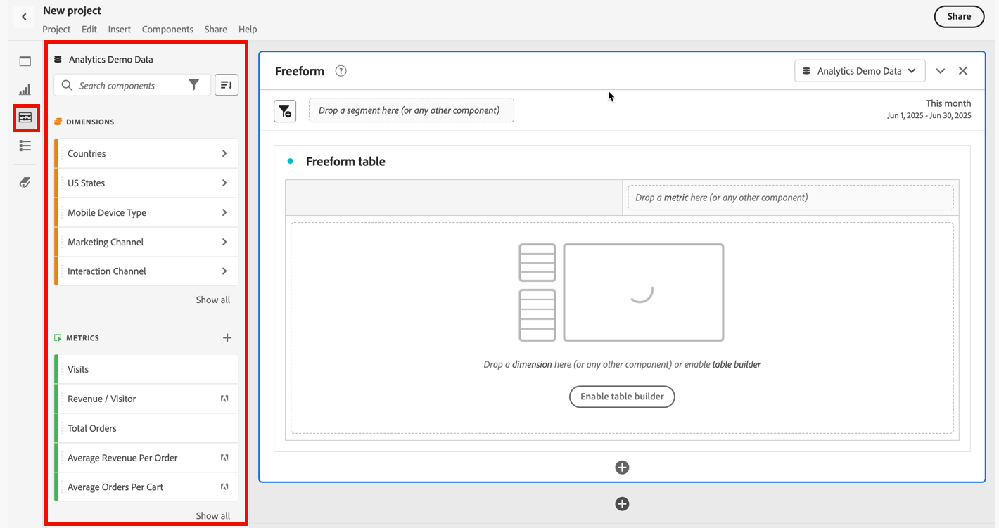

# Komponentenübersicht

Komponenten sind Funktionen in Adobe Analytics, die in Visualisierungen (wie Freiformtabellen) verwendet werden können oder Reporting-Funktionen ergänzen.

So verwalten Sie Komponenten über die Haupt-Benutzeroberfläche von Adobe Analytics:

1. Wählen Sie in der oberen Leiste **[!UICONTROL Komponenten]** aus.
1. Wählen Sie **[!UICONTROL Komponenten]** aus, um einen Überblick über die Komponenten zu erhalten, die Sie verwalten können, oder wählen Sie die zu verwaltende Komponente direkt über das Menü aus.

Sie können die folgenden Komponenten verwalten:

* [Segmente](/help/components/segmentation/seg-home.md): Erstellen, verwalten, teilen und verwenden Sie leistungsstarke, zielgerichtete Segmente für Ihre Berichte. Mit Segmenten können Sie Teilmengen von Personen anhand von Merkmalen oder Interaktionen identifizieren.
* [Berechnete Metriken:](/help/components/c-calcmetrics/cm-overview.md) Verwenden Sie Metriken und Formeln als neue Komponenten für die Berichterstellung.
* [Datumsbereiche](calendar-date-ranges/custom-date-ranges.md): Passen Sie die von Analysis Workspace vorgeschlagenen Datumsbereiche an und präzisieren Sie diese.
* [Geplante Projekte](../curate-share/t-schedule-report.md): Verwalten Sie Ihre geplanten Projekte.
* [Standorte](../../../components/locations/locations-manager.md): Verwalten Sie die Standorte, an die Ihre Projekte exportiert werden sollen.
* [Warnhinweise](/help/components/c-alerts/intellligent-alerts.md): Ermöglichen es Ihnen, sich über geänderte Prozentsätze oder bestimmte Datenpunkte benachrichtigen zu lassen. 
* [Anmerkungen](annotations/overview.md): Informieren Sie andere Benutzerinnen und Benutzer in Ihrem Unternehmen über die kontextbezogene Bedeutung von Daten und Erkenntnissen.
* [Voreinstellungen](/help/analyze/analysis-workspace/user-preferences.md): Verwalten Sie die Voreinstellungen für Analysis Workspace.

## Analysis Workspace-Komponenten

Komponenten in Analysis Workspace bestehen aus Metriken, Dimensionen, Segmenten und Datumsbereichen, die Sie per Drag-and-Drop auf Panels und Visualisierungen in Ihrem Workspace-Projekt anwenden können. Wenn Sie benutzerdefinierte Komponenten erstellen, z. B. eine benutzerdefinierte Metrik oder einen benutzerdefinierten Datumsbereich, werden sie zu diesen Bedienfeldern hinzugefügt.

Um auf das Bedienfeld „Komponenten“ zuzugreifen, wählen Sie im Schaltflächenbedienfeld die Option  **[!UICONTROL Komponenten]** aus.

Informationen über die Verwendung von Komponenten in einem Projekt finden Sie unter [Erstellen eines Projekts](/help/analyze/analysis-workspace/home.md).

## Verwalten von Komponenten {#actions}

Mithilfe des Menüs **[!UICONTROL Komponenten]** in Analysis Workspace können Sie schnell eine neue Komponente erstellen. Weitere Informationen finden Sie im [Menü „Analysis Workspace“](/help/analyze/analysis-workspace/home.md#menu).

Sie können Komponenten verwalten, entweder einzeln oder durch Auswahl mehrerer Komponenten.

1. Wählen Sie eine oder mehrere Komponenten aus.

1. Wählen Sie im Kontextmenü oder über die Schaltfläche  „Aktionen für Komponenten“ (oben in Komponenten) eine der folgenden Aktionen aus.

   >[!TIP]
   >
   >Sie können mehrere Komponenten auswählen, indem Sie die **[!UICONTROL Umschalttaste]** gedrückt halten oder indem Sie die **[!UICONTROL Befehlstaste]** (macOS) bzw. die **[!UICONTROL Strg-Taste]** (Windows) gedrückt halten.

   

   | Komponentenaktion | Beschreibung |
   |--- |--- |
   |  [!UICONTROL **Tag**] | Organisieren oder verwalten Sie Komponenten, indem Sie Tags darauf anwenden. Sie können dann im linken Bedienfeld nach Tags suchen, indem Sie den  Filter auswählen oder `#` eingeben. Tags fungieren auch als Filter in den Komponenten-Managern. |
   |  [!UICONTROL **Zu Favoriten hinzufügen**] | Fügen Sie die Komponente zu Ihrer Favoritenliste hinzu. Genauso wie nach Tags können Sie im linken Bedienfeld auch nach Favoriten suchen und diese in den Komponenten-Managern als Filter verwenden. |
   |  **[!UICONTROL Aus Favoriten entfernen]** | Entfernen Sie die Komponente aus Ihrer Favoritenliste.  |
   |  [!UICONTROL **Genehmigen**] | Markieren Sie Komponenten als „Genehmigt“, um Ihren Benutzerinnen und Benutzern zu signalisieren, dass die Komponente vom Unternehmen genehmigt ist. Wie Tags können Sie im linken Bedienfeld anhand des Status „Genehmigt“ suchen und filtern. Mit einem  werden genehmigte Komponenten gekennzeichnet. |
   |  [!UICONTROL **Freigeben**] | Freigeben von Komponenten für Benutzer in Ihrer Organisation. Diese Option steht nur für benutzerdefinierte Komponenten zur Verfügung, beispielsweise für Segmente oder berechnete Metriken. |
   |  [!UICONTROL **Löschen**] | Löschen Sie Komponenten, die Sie nicht mehr benötigen. Diese Option steht nur für benutzerdefinierte Komponenten zur Verfügung, beispielsweise für Segmente oder berechnete Metriken. |

Benutzerdefinierte Komponenten können auch über ihre jeweiligen Komponenten-Manager verwaltet werden. Weitere Informationen finden Sie unter [Verwalten von Segmenten](/help/components/segmentation/segmentation-workflow/seg-manage.md).

## Verwalten der Komponentenliste

Sie können die Komponentenliste im linken Bedienfeld von Analysis Workspace durchsuchen, filtern und sortieren, um eine bestimmte Komponente zu finden.

### Durchsuchen

1. Wählen Sie im linken Bedienfeld **Komponenten**  aus.

2. Geben Sie im Suchfeld den Namen der Komponente ein, die Sie in Ihrem Projekt verwenden möchten.

   Der jeweilige Komponententyp ist farblich und mit einem Symbol gekennzeichnet. **Dimensionen**  sind orange, **Segmente**  sind blau, **Datumsbereiche**  sind violett und **Metriken**  sind grün.  Das Adobe-Symbol  steht entweder für eine Vorlage für berechnete Metriken oder eine Segmentvorlage. Das Taschenrechnersymbol  gibt an, dass es sich um eine berechnete Metrik handelt, die administratorseitig in Ihrer Organisation erstellt wurde.

3. Wählen Sie aus dem Dropdown-Menü die gewünschte Komponente aus.

### Filter

1. Wählen Sie im linken Bedienfeld **Komponenten**  aus.

2. Wählen Sie **Filter**  aus oder geben Sie `#` in das Suchfeld ein.

3. Wählen Sie eine der folgenden Filteroptionen aus, um die Liste der Komponenten zu filtern:

   | Symbol | Filteroption | Beschreibung |
   |---------|---|----------|
   |  | **[!UICONTROL Genehmigt]** | Nur Komponenten anzeigen, die von Admins als genehmigt markiert wurden. |
   |  | **[!UICONTROL Favoriten]** | Nur Komponenten anzeigen, die sich in Ihrer Favoritenliste befinden.  Weitere Informationen zum Hinzufügen von Komponenten zu Ihrer Favoritenliste finden Sie unter [Verwalten von Komponenten](#manage-components). |
   |  | **[!UICONTROL Dimensionen]** | Nur Komponenten anzeigen, die Dimensionen sind. |
   |  | **[!UICONTROL Metriken]** | Nur Komponenten anzeigen, die Metriken sind. |
   |  | **[!UICONTROL Segmente]** | Nur Komponenten anzeigen, die Segmente sind.  |
   |  | **[!UICONTROL Datumsbereiche]** | Nur Komponenten anzeigen, die Datumsbereiche sind.  |
   |  | **[!UICONTROL *Tag-Name *]** | Nur Komponenten mit den jeweilig ausgewählten Tags anzeigen. Für Adobe-Vorlagen, bei denen es sich um die [standardmäßig berechneten Metriken](/help/components/c-calcmetrics/cm-reference/default-calcmetrics.md) von Adobe handelt, ist ein dediziertes Tag verfügbar. |

   Wählen Sie  in einem Filter aus, um den Filter zu entfernen.

4. Sie können optional die Komponentenliste sortieren, wie unter [Sortieren der Komponentenliste](#sort-the-component-list) beschrieben.

### Sortieren

<!-- {{release-limited-testing-section}}-->

1. (Optional) Wenden Sie alle Filter auf die Komponentenliste an, wie unter [Filtern der Komponentenliste](#filter-the-component-list) beschrieben.

2. Wählen Sie im linken Bedienfeld **Komponenten**  aus.

3. Wählen Sie **Sortieren**  und dann eine der folgenden Filteroptionen aus, um die Liste der Komponenten zu sortieren.

Die folgenden Sortieroptionen sind verfügbar:

{{components-sort-options}}

## Zugriffsberechtigungen

In Analysis Workspace können Admins [kuratieren](/help/analyze/analysis-workspace/curate-share/curate.md), welche Komponenten Benutzenden beim Reporting zur Verfügung stehen.

<!--
# Components overview

Components in Analysis Workspace consist of dimensions, metrics, segments, and date ranges that you can drag-and-drop onto a project. 

To access the Components menu, click the **[!UICONTROL Components]** icon in the left rail. You can switch among [panels](https://experienceleague.adobe.com/docs/analytics/analyze/analysis-workspace/panels/panels.html?lang=de), [visualizations](https://experienceleague.adobe.com/docs/analytics/analyze/analysis-workspace/visualizations/freeform-analysis-visualizations.html?lang=de), and components from the left rail icons or by using [hotkeys](/help/analyze/analysis-workspace/build-workspace-project/fa-shortcut-keys.md).

You can also adjust the [View density settings](https://experienceleague.adobe.com/docs/analytics/analyze/analysis-workspace/build-workspace-project/view-density.html?lang=de) for the project to see more values in the left rail at once by going to **[!UICONTROL Project > Project Info & Settings > View Density]**.

## Dimensions {#dimensions}

[**Dimensions**](https://experienceleague.adobe.com/docs/analytics/components/dimensions/overview.html?lang=de) are text attributes that describe your visitor behavior and can be viewed, broken down, and compared in your analysis. They can be found in the left Component rail (orange section) and are typically applied as rows of a table. 

Examples of dimensions include [!UICONTROL Page Name], [!UICONTROL Marketing Channels], [!UICONTROL Device Type], and [!UICONTROL Products]. Dimensions are provided by Adobe and are captured through your custom implementation (eVar, Props, classifications, etc).

Each dimension also contains **dimension items** within it. Dimension items can be found in the left Component rail by clicking the right-arrow next to any dimension name (items are yellow).

Examples of dimension items include [!UICONTROL Homepage] (within the [!UICONTROL Page] dimension), [!UICONTROL Paid Search] (within the [!UICONTROL Marketing Channel] dimension), [!UICONTROL Tablet] (within the [!UICONTROL Mobile Device Type] dimension), and so on.

## Metrics {#metrics}

[**Metrics**](https://experienceleague.adobe.com/docs/analytics/components/metrics/overview.html?lang=de) are quantitative measures about visitor behavior. They can be found in the left Component rail (green section) and are typically applied as columns of a table.

Examples of metrics include [!UICONTROL Page views], [!UICONTROL Visits], [!UICONTROL Orders], [!UICONTROL Average Time spent], and [!UICONTROL Revenue/Order]. Metrics are provided by Adobe, or captured through your custom implementation ([!UICONTROL Success events]), or created using the [Calculated metric builder](https://experienceleague.adobe.com/docs/analytics/components/calculated-metrics/calcmetric-workflow/cm-build-metrics.html?lang=de).

## Segments {#segments}

[**Segments**](https://experienceleague.adobe.com/docs/analytics/analyze/analysis-workspace/components/segments/t-freeform-project-segment.html?lang=de) are audience filters that are applied to your analysis. They can be found in the left Component rail (blue section) and are typically applied at the top of a panel or above metric columns in a table. 

Examples of segments include [!UICONTROL Mobile Device Visitors], [!UICONTROL Visits from Email], and [!UICONTROL Authenticated Hits]. Segments are provided by Adobe, or created in the [panel dropzone](https://experienceleague.adobe.com/docs/analytics/analyze/analysis-workspace/panels/panels.html?lang=de), or created using the [Segment builder](https://experienceleague.adobe.com/docs/analytics/components/segmentation/segmentation-workflow/seg-build.html?lang=de).

## Date Ranges {#date-ranges}

[**Date Ranges**](https://experienceleague.adobe.com/docs/analytics/analyze/analysis-workspace/components/calendar-date-ranges/calendar.html?lang=de) are the range of dates you conduct your analysis across. They can be found in the left Component rail (purple section) and are typically applied in the calendar of each panel.

You can make the date range components relative to the panel calendar. For additional information, see [About relative panel date ranges](/help/analyze/analysis-workspace/components/calendar-date-ranges/calendar.md#relative-panel-dates).

Examples of date ranges include July 2019, [!UICONTROL Last 4 weeks], and [!UICONTROL This month]. Date ranges are provided by Adobe, applied in the [panel calendar](https://experienceleague.adobe.com/docs/analytics/analyze/analysis-workspace/panels/panels.html?lang=de), or created using the [Date range builder](https://experienceleague.adobe.com/docs/analytics/analyze/analysis-workspace/components/calendar-date-ranges/custom-date-ranges.html?lang=de).

## Manage components {#actions}

You can manage components directly in the left rail. 

1. Right-click a component.

   Or
   
   Select a component, then select the **Action** (3-dot) icon at the top of the component list.

   >[!TIP]
   >
   >   You can select multiple components by holding Shift, or by holding Command (on Mac) or Ctrl (on Windows).

   

   | Component action | Description |
   |--- |--- |
   | [!UICONTROL **Tag**] | Organize or manage components by applying tags to them. You can then search by tag in the left rail by clicking the filter or typing #. Tags also act as filters in the component managers. |
   | [!UICONTROL **Favorite**] | Add the component to your list of favorites. Like tags, you can search by Favorites in the left rail and filter by them in the component managers. |
   | [!UICONTROL **Approve**] | Mark components as Approved to signal to your users that the component is organization-approved. Like tags, you can search by Approved in the left rail and filter by them in the component managers. |
   | [!UICONTROL **Share**] | Share components to users in your organization. This option is available for custom components only, such as segments or calculated metrics. |
   | [!UICONTROL **Delete**] | Delete components that you no longer need. This option is available for custom components only, such as segments or calculated metrics. |

Custom components can also be managed through their respective Component managers. For example, the [Segment Manager](/help/components/segmentation/segmentation-workflow/seg-manage.md).

## Search, filter, and sort the component list

You can search, filter, and sort the component list in the left rail of Analysis Workspace to quickly locate a particular component. 

### Search the component list

1. Select the **Components** icon  in the left rail.

2. In the search field, begin typing the name of the component you want to use in your project.

   The type of component can be identified by both color and icon. **Dimensions**  are orange, **Segments**  are blue, **Date ranges**  are purple, and **Metrics**  are green. The Adobe icon indicates either a calculated metric template or a segment template, and the calculator icon  indicated a calculated metric that was created by an Analytics administrator in your organization. 

3. Select the component when it appears in the drop-down list.

### Filter the component list

1. Select the **Components** icon  in the left rail.

2. Select the **Filter** icon .

   Or

   Type the pound sign (#) in the search field.

3. Select any of the following filter options to filter the list of components:

   |Option | Function |
   |---------|----------|
   | [!UICONTROL **Approved**] | Show only components that are marked as Approved by an administrator. |
   | [!UICONTROL **Favorites**] | Show only components that are in your list of Favorites. For information about adding components to your list of favorites, see [Components overview](/help/analyze/analysis-workspace/components/analysis-workspace-components.md). |
   | [!UICONTROL **Dimensions**] | Show only components that are Dimensions. |
   | [!UICONTROL **Metrics**] | Show only components that are Metrics. |
   | [!UICONTROL **Segments**] | Show only components that are Segments.  |
   | [!UICONTROL **Date ranges**] | Show only components that are Date Ranges. |
   | [!UICONTROL **Show all**] | Show all components. This option is available only for administrators. |
   | [!UICONTROL **Unapproved**] | Show only components that are not yet marked as Approved by an administrator. As an administrator, this is helpful when identifying components that require your review and approval. This option is available only for administrators. |

4. (Optional) To further hone the list, you can sort the component list, as described in [Sort the component list](#sort-the-component-list).

### Sort the component list

1. (Optional) Apply any filters to the component list, as described in [Filter the component list](#filter-the-component-list).

2. Select the **Components** icon  in the left rail.

3. Select the **Sort** icon , then select any of the following filter options to sort the list of components:

   {{components-sort-options}}

-->