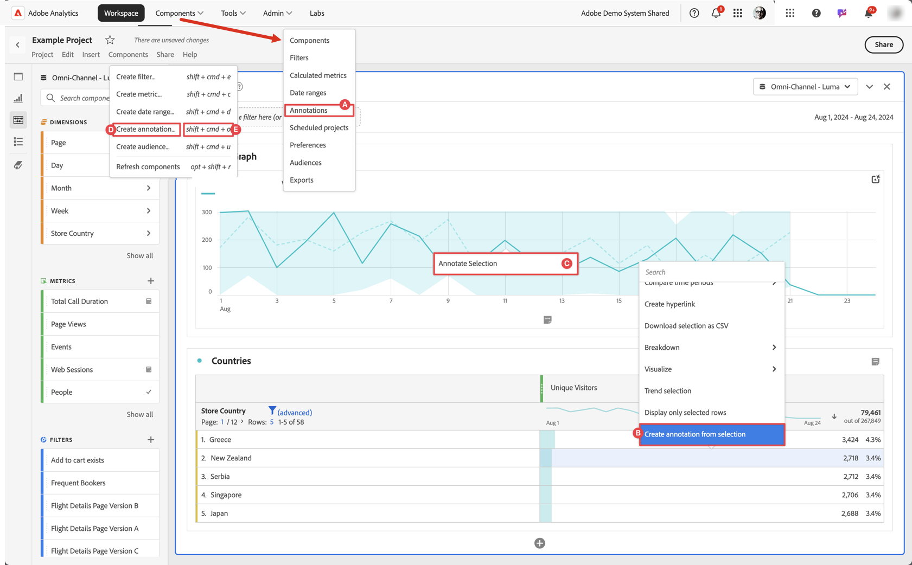

# Erstellen von Anmerkungen

Standardmäßig können nur Admins Anmerkungen erstellen. Benutzer haben die Berechtigung, Anmerkungen anzuzeigen, ähnlich wie Benutzer andere Komponenten anzeigen (z. B. Segmente, berechnete Metriken usw.).

Admins können jedoch über die [Adobe Admin Console](/help/admin/admin-console/permissions/analytics-tools.md) Benutzenden die Berechtigung zur [!UICONTROL Erstellung von Anmerkungen] (Analytics-Tools) erteilen.

Sie können Anmerkungen wie folgt erstellen:

* **A**. Wählen Sie in der Hauptbenutzeroberfläche die Option **[!UICONTROL Komponenten]** und dann **[!UICONTROL Anmerkungen]** aus. Wählen Sie  [!UICONTROL **[!UICONTROL Hinzufügen]**] im [[!UICONTROL Anmerkungs]-Manager](/help/analyze/analysis-workspace/components/annotations/manage-annotations.md) aus.
* **B**. Wählen Sie in einem Workspace-Projekt aus dem Kontextmenü einer Visualisierung die Option **[!UICONTROL Anmerkung aus Auswahl erstellen]** aus.
* **C**. Wählen Sie in einem Workspace-Projekt aus dem Kontextmenü eines Liniendiagramms die Option **[!UICONTROL Auswahl mit Anmerkungen versehen]** aus.
* **D**. Wählen Sie in einem Workspace-Projekt aus dem Menü die Option **[!UICONTROL Komponenten]** und dann **[!UICONTROL Anmerkung erstellen]** aus.
* **E**.  Verwenden Sie in einem Workspace-Projekt den Tastaturbefehl **[!UICONTROL Strg+Umschalt+O]** (Windows) bzw. **[!UICONTROL Umschalt+Befehlstaste+O]** (macOS).

Um die Anmerkung zu definieren, verwenden Sie den [[!UICONTROL Anmerkungsgenerator]](#annotation-builder).

## Anmerkungserstellung {#annotation-builder}

>[!CONTEXTUALHELP]
>id="components_annotations_details"
>title="Anmerkungsdetails"
>abstract="Mit Anmerkungen können Sie Ihrer Organisation kontextbezogene Datennuancen und Einblicke effektiv übermitteln. Durch sie können Sie Kalenderereignisse an bestimmte Dimensionen/Metriken binden. "

>[!CONTEXTUALHELP]
>id="components_annotations_scope"
>title="Anwendungsbereich"
>abstract="Mit der Option „Umfang“ können Sie anpassen, welche Daten mit einer Anmerkung versehen werden. Berechnete Metriken und Segmente übernehmen nicht automatisch Anmerkungen, die auf die in ihren Definitionen verwendeten Komponenten angewendet werden. Sie können zu einer vorhandenen Anmerkung im Abschnitt „Umfang“ neue berechnete Metriken hinzufügen. Neue Segmente erfordern eine neue Anmerkung."

Das Dialogfeld **[!UICONTROL Anmerkungserstellung]** wird zum Erstellen neuer oder Bearbeiten vorhandener Anmerkungen verwendet. Das Dialogfeld hat den Titel **[!UICONTROL Neue Anmerkung]** oder **[!UICONTROL Anmerkung bearbeiten]** für Anmerkungen, die Sie über den [[!UICONTROL Anmerkungs]-Manager erstellen oder verwalten.](/help/analyze/analysis-workspace/components/annotations/manage-annotations.md)

>[!BEGINTABS]

>[!TAB Anmerkungserstellung]

>[!TAB Erstellen/Bearbeiten einer Anmerkung]

>[!ENDTABS]

1. Geben Sie die folgenden Details an ( bedeutet erforderlich):

   | Element | Beschreibung |
   | --- | --- |
   | **[!UICONTROL Report Suite]** | Sie können die Report Suite für die Anmerkung auswählen. Die von Ihnen definierte Anmerkung ist als Anmerkung in den Workspace-Projekten verfügbar, die auf der ausgewählten Report Suite basieren. Diese Auswahl wird überschrieben, wenn Sie [!UICONTROL Auf alle Report Suites anwenden] aktiviert haben. |
   | **[!UICONTROL Projektspezifische Anmerkungen]** | Ein Informationsfeld, mit dem erklärt wird, dass die von Ihnen erstellte Anmerkung nur im Workspace-Projekt sichtbar ist, an dem Sie arbeiten. Aktivieren Sie **[!UICONTROL Anmerkung für alle Projekte verfügbar machen]**, um die Anmerkung für alle Projekte sichtbar zu machen. Dieses Informationsfeld ist nur sichtbar, wenn Sie eine Anmerkung in einem Workspace-Projekt erstellen. |
   | **[!UICONTROL Titel]**  | Benennen Sie die Regel, beispielsweise mit `Needs further investigation`. |
   | **[!UICONTROL Beschreibung]** | Geben Sie eine Beschreibung für die Anmerkung ein, z. B. `We never expected such a fluctuation in numbers.`. |
   | **[!UICONTROL Tags]** | Organisieren Sie die Anmerkung, indem Sie ein oder mehrere Tags erstellen oder anwenden. Beginnen Sie mit der Eingabe, um nach vorhandenen Tags zu suchen, die Sie auswählen können. Oder drücken Sie die **[!UICONTROL Eingabetaste]**, um ein neues Tag hinzuzufügen. Wählen Sie  aus, um ein Tag zu entfernen. |
   | **[!UICONTROL Anwendungsdatum]**  | Wählen Sie das Datum oder den Datumsbereich aus, das bzw. der vorhanden sein muss, damit die Anmerkung sichtbar ist. Wenn Sie eine Anmerkung mithilfe des Tastaturbefehls erstellen, gibt die Anmerkung standardmäßig einen Datumsbereich für nur diesen Tag vor. Wenn Sie eine Anmerkung mithilfe einer Auswahl in einer Visualisierung erstellen, gibt die Anmerkung standardmäßig einen Datumsbereich basierend auf dem Bedienfeld vor, zu dem die Visualisierung gehört. |
   | **[!UICONTROL Farbe]** | Wenden Sie eine Farbe auf die Anmerkung an. Die Anmerkung wird im Projekt mit der ausgewählten Farbe angezeigt. Mit Farben können Sie Anmerkungen kategorisieren, z. B. Feiertage, externe Ereignisse, Tracking-Probleme usw. |
   | **[!UICONTROL Anwendungsbereich]** | Ziehen Sie die Metriken, die die Anmerkung auslösen, per Drag-and-Drop aus dem Panel mit den Komponenten in das entsprechende Feld. Zum Beispiel Personen, Sitzungen und Ereignisse. Ziehen Sie dann alle Dimensionen oder Segmente, die als Segmente dienen, per Drag-and-Drop aus dem Komponentenbereich, um zu bestimmen, ob die Anmerkung angezeigt werden soll oder nicht. Wenn Sie keinen Bereich angeben, gilt die Anmerkung für alle Ihre Daten.  Es gibt zwei Optionen:<ul><li>**[!UICONTROL Zumindest eine dieser Metriken ist vorhanden]**: Ziehen Sie per Drag-and-Drop bis zu 10 Metriken in das Feld, die jeweils auslösen sollen, dass die Anmerkung angezeigt wird. Beispielsweise hat die Umsatzmetrik die Erfassung von Daten für einen bestimmten Datumsbereich gestoppt. Ziehen Sie die Umsatzmetrik in dieses Feld.</li><li>**[!UICONTROL Mit allen diesen Segmenten]**: Ziehen Sie bis zu 10 Dimensionen oder Segmente per Drag-and-Drop in dieses Segment, unabhängig davon, ob die Anmerkung angezeigt wird.</li></ul>

**Hinweis:** Anmerkungen, die auf eine Komponente angewendet werden, die anschließend als Teil einer berechneten Metrik oder Segmentdefinition verwendet wird, übernehmen die Anmerkung NICHT automatisch. Die gewünschte berechnete Kennzahl muss auch dem Abschnitt „Umfang“ hinzugefügt werden, damit die Anmerkung angezeigt wird. Es sollte jedoch eine neue Anmerkung für jedes Segment erstellt werden, das mit denselben Informationen versehen werden soll. Beispiel: Sie wenden eine Anmerkung auf [!UICONTROL Bestellungen] an einem bestimmten Tag an. Anschließend verwenden Sie [!UICONTROL Bestellungen] in einer berechneten Metrik für denselben Datumsbereich. Die neue berechnete Metrik zeigt die Anmerkung für Bestellungen nicht automatisch an. Fügen Sie die berechnete Metrik außerdem zum Abschnitt „Umfang“ hinzu, damit die Anmerkung angezeigt wird. |
   | **[!UICONTROL Auf alle Datenansichten anwenden]** | Standardmäßig gilt die Anmerkung für die ursprüngliche Report Suite. Wenn Sie dieses Kontrollkästchen aktivieren, können Sie die Anmerkung für alle Report Suites im Unternehmen gelten lassen. |

   {style="table-layout:auto"}

1. Auswählen
   * **[!UICONTROL Speichern]**: Speichert die Anmerkung.
   * **[!UICONTROL Speichern unter]**: Speichert eine Kopie der Anmerkung.
   * **[!UICONTROL Löschen]**: Löscht eine Anmerkung.
   * **[!UICONTROL Abbrechen]**: Bricht alle Änderungen ab, die Sie an einer Anmerkung vorgenommen haben, oder bricht die Erstellung einer neuen Anmerkung ab.
