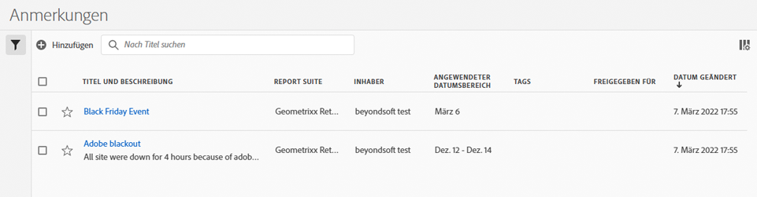

# Verwalten von Anmerkungen

Sie können Anmerkungen in einer zentralen Verwaltungsoberfläche für [!UICONTROL Anmerkungen] freigeben, filtern, mit Tags versehen, genehmigen, kopieren, löschen und als Favoriten markieren. So verwalten Sie Anmerkungen:

* Wählen Sie in der Hauptbenutzeroberfläche die Option **[!UICONTROL Komponenten]** und dann **[!UICONTROL Anmerkungen]** aus.

>[!NOTE]
>
>Die Anmerkungen, die Sie in einem bestimmten Workspace-Projekt erstellen, werden nicht im [!UICONTROL Anmerkungs-Manager] angezeigt, es sei denn, Sie haben die Anmerkung für all Ihre Projekte verfügbar gemacht.
>

## Anmerkungs-Manager

Der Anmerkungs-Manager verfügt über die folgenden Benutzeroberflächenelemente:

### Anmerkungsliste

Die ➊ der Anmerkungsliste zeigt alle Anmerkungen an, die Ihnen gehören, die Anmerkungen, die für alle Ihre Projekte gelten, und die Anmerkungen, die für Sie freigegeben wurden. Die Liste umfasst die folgenden Spalten:

| Spalte | Beschreibung |
| --- | --- | 
|  | Wählen Sie diese Option aus, um eine Anmerkung als Favoriten zu markieren  oder aus den Favoriten zu entfernen . |
| **[!UICONTROL Titel und Beschreibung]** | Werden durch den Anmerkungsgenerator bereitgestellt. Um den Titel und die Beschreibung zu bearbeiten, wählen Sie den Titel-Link aus. Dadurch wird das Dialogfeld [Anmerkungserstellung](/help/analyze/analysis-workspace/components/annotations/create-annotations.md#annotation-builder) geöffnet. Eine freigegebene Anmerkung wird mit dem Symbol  gekennzeichnet. |
| **[!UICONTROL Report Suite]** | Die Report Suites, für die diese Anmerkung gilt. |
| **[!UICONTROL Inhabende]** | Die Inhaberin oder der Inhaber der Anmerkung. Benutzende können nur die Anmerkungen sehen, die ihnen gehören oder die für sie freigegeben wurden. |
| **[!UICONTROL Angewendeter Datumsbereich]** | Das Datum oder der Datumsbereich, für das bzw. den diese Anmerkung gilt. |
| **[!UICONTROL Tags]** | Die Tags für diese Anmerkung. |
| **[!UICONTROL Freigegeben für]** | Die Einzelpersonen oder Gruppen, für die Sie die Anmerkung freigegeben haben. Wählen Sie diese Option aus, um das Dialogfeld **[!UICONTROL Komponente freigeben]** zu öffnen. |
| **[!UICONTROL Änderungsdatum]** | Wählen Sie diese Option aus, um das Datum und die Uhrzeit der letzten Änderung der Anmerkung anzuzeigen. |

{style="table-layout:auto"}

Verwenden Sie , um die anzuzeigenden Spalten anzugeben.

### Aktionsleiste

Sie können Aktionen für Anmerkungen mithilfe der Aktionsleiste ➋. Die Aktionsleiste ermöglicht die folgenden Aktionen:

| Symbol | Aktion | Beschreibung |
|:--:|---|---|
|  | **[!UICONTROL Hinzufügen]** | Verwenden Sie das Dialogfeld [Anmerkungserstellung](create-annotations.md#annotation-builder), um eine weitere Anmerkung hinzuzufügen. |
|  | [!UICONTROL *Nach Titel suchen*] | Wenn in der Liste keine Anmerkung ausgewählt ist, suchen Sie mithilfe dieses Suchfelds nach Anmerkungen. |
|  | **[!UICONTROL Tag]** | Versehen Sie die ausgewählten Anmerkungen mit Tags. Wählen Sie im Dialogfeld **[!UICONTROL Tag-Komponente]** die Tags für die ausgewählten Anmerkungen aus oder ab. Wählen Sie **[!UICONTROL Speichern]** aus, um die Tags für die ausgewählten Anmerkungen zu speichern. |
|  | **[!UICONTROL Freigeben]** | Geben Sie die ausgewählten Anmerkungen frei. Im Dialogfeld **[!UICONTROL Komponente freigeben]** können Sie *Einzelpersonen oder Gruppen suchen*  oder die Option **[!UICONTROL Organisation]** oder **[!UICONTROL Gruppen]** auswählen. Wählen Sie **[!UICONTROL Speichern]** aus, um Freigabedetails für die ausgewählten Anmerkungen zu speichern. Weitere Informationen finden Sie unter [Freigeben von Anmerkungen](#share-annotations). |
|  | **[!UICONTROL Löschen]** | Löschen Sie die ausgewählten Anmerkungen. Sie werden zur Bestätigung aufgefordert. |
|  | **[!UICONTROL Umbenennen]** | Benennen Sie eine einzelne ausgewählte Anmerkung um. Wenn diese Option aktiviert ist, ist eine Inline-Umbenennung der Anmerkung möglich. |
|  | **[!UICONTROL Kopieren]** | Kopieren Sie die ausgewählten Anmerkungen. Neue Anmerkungen werden mit demselben Namen und Suffix erstellt (Kopie). |
|  | **[!UICONTROL In CSV exportieren]** | Exportieren Sie die Anmerkungen in eine Datei namens `Annotations List.csv`. |

### Aktive Filterleiste

Die Filterleiste zeigt ➌ die aktiven Filter an (falls vorhanden). Mit  können Sie schnell einen Filter entfernen. Wenn mehr als ein Filter angegeben ist, können Sie alle Filter mit **[!UICONTROL Alle entfernen]** entfernen.

### Panel „Filter“

Sie können Anmerkungen mithilfe der ➍ im linken Bedienfeld **[!UICONTROL Filter]** filtern. Im Bedienfeld „Filter“ werden der Filtertyp und die Anzahl der Anmerkungen angezeigt, auf die gefiltert wurde. Wählen Sie  aus, um die Anzeige des Bedienfelds „Filter“ umzuschalten.

So filtern Sie die Filterliste:

1. Wählen Sie  aus, um das Bedienfeld „Filter“ zu öffnen. Wenn Sie mehr Platz für die Filterliste benötigen, können Sie  erneut auswählen, um das Bedienfeld zu schließen.
1. Sie können die Anmerkungen mit einem der verfügbaren [Filterabschnitte](#filter-sections) filtern.

   >[!INFO]
   >
   >*Elemente* beziehen sich auf die Anmerkungselemente, die in der [Anmerkungsliste](manage-annotations.md#annotations-list) angezeigt werden.
   > 

#### Filterabschnitte

{{tagfiltersection}}
{{reportsuitefiltersection}}
{{ownerfiltersection}}
{{daterangefiltersection}}
{{otherfiltersfiltersection}}

Die [Anmerkungsliste](manage-annotations.md#annotations-list) wird basierend auf Ihrer Filterkonfiguration automatisch aktualisiert. Die konfigurierten Filter werden in der [aktiven Filterleiste](manage-annotations.md#active-filter-bar) angezeigt.

## Bearbeiten von Anmerkungen

Anmerkungen können auf zwei Arten bearbeitet werden:

* Verwenden Sie in einem Workspace-Projekt das Symbol [Komponenteninformationen](/help/analyze/analysis-workspace/components/use-components-in-workspace.md#component-info) aus.

* Klicken Sie in der [[!UICONTROL Anmerkungsliste]](#annotations-list) auf den Titel der Anmerkung.

Um die Anmerkung zu bearbeiten, verwenden Sie das Dialogfeld [Anmerkungserstellung](/help/analyze/analysis-workspace/components/annotations/create-annotations.md#annotation-builder).

## Freigeben von Anmerkungen

Folgendes gilt beim Freigeben von Anmerkungen oder Arbeiten mit Anmerkungen, die für Sie freigegeben wurden:

* Reine projektbezogene Anmerkungen in einem Projekt, die Sie für andere Benutzende freigeben, werden nur für diese Benutzenden angezeigt. Die Benutzenden können diese Anmerkungen, die nur für das Projekt gelten, nicht bearbeiten oder löschen.
* Wenn Sie eine Anmerkung speichern und sie direkt für eine Person freigeben, kann diese Person die Anmerkung nur bearbeiten und löschen, wenn sie über Administratorrechte verfügt.

* Wenn ein Projekt für Sie freigegeben wird, werden die in diesem Projekt erstellten Anmerkungen nur in diesem Projekt angezeigt. Wenn eine Anmerkung direkt für Sie freigegeben wird, wird sie in allen Projekten angezeigt, in denen diese Anmerkung angezeigt werden kann.

## Anmerkungen und Zeitzonen

Alle Anmerkungen werden mit einem Zeitstempel erstellt, jedoch ohne Stunden- oder Zeitzoneninformationen. Zum Zeitpunkt der Berichterstellung wird die Zeitzone der für das Bedienfeld konfigurierten Report Suite verwendet.

<!--
# Manage annotations

The [!UICONTROL Annotations manager] shows you all of the annotations that you own or that have been shared with you. Project-specific annotations do not appear here. You can use this interface to share, filter, tag, copy, delete, and favorite your annotations. Administrators can manage and approve annotations.

**[!UICONTROL Components]** > **[!UICONTROL Annotations]**

## Annotations Manager user interface

| UI Element | Description |
| --- | --- | 
| [!UICONTROL Title and Description] | Provided in the Annotations Builder. To edit the title and description, click the title link - this takes you back to the Annotations Builder.  |
| [!UICONTROL Report Suite] | The report suites that this annotation applies to.  | 
| [!UICONTROL Owner] | Indicates who owns the annotation. As a non-Admin, you can see only annotations that you own or those that were shared with you. |
| [!UICONTROL Applied Date Range] | The date or date range that this annotation applies to. |
| [!UICONTROL Shared with] | Lists how many individuals or groups that you shared the annotation with. Click for more detail. |
| [!UICONTROL Date Modified] | Shows the date and time that the annotation was last modified. |

{style="table-layout:auto"}

## Edit annotations

Editing an annotation means that you can adjust date ranges, colors, scope, or whether it applies to all report suites or projects. You can edit annotations in two ways:

* In a line chart, hover over the annotation and click the pencil icon within the popover.
* In the [!UICONTROL Annotations Manager], click the title of the annotation.

Both of these options land you back in the [!UICONTROL Annotations Builder]. There, you can make the necessary adjustments and save the new version.

## Share annotations

When sharing annotations or working with annotations that were shared with you, keep this in mind:

* If you create a project with project-only annotations, then share the project with another user, annotations cannot be edited or deleted by anyone that you share the project with.
* If you save an annotation and share it directly with a user, they can edit/delete the annotation only if they have admin rights.
* If a project is shared with you with a project-only annotation, it shows up only in that project. If the annotation is shared directly with you, it shows up in all projects where that annotation can be displayed. 

## Annotations and time zones

All annotations are created with a timestamp, but no hours or timezone information. At report time, the timezone of the panel's report suite is always applied. For example, an annotation created for Christmas Day happens on December 25 no matter what report suite timezone you are in. 

## Other annotation tasks

The Annotations manager lets Administrators edit, add, tag, delete, rename, approve, copy, export, and filter annotations. It is not visible to non-Admin users. 

Additional options are available when you select at least one annotation:

| Task | Description |
| --- | --- |
| [!UICONTROL Add] | Takes you to the Annotations builder where you can create annotations. |
| [!UICONTROL Tag] | All users can create tags for annotations and apply one or more tags to an annotation. However, you can see tags only for annotations that you own. |
| [!UICONTROL Delete] | Deleting an annotation removes it from any project in your organization. |
| [!UICONTROL Rename] | Renaming an annotation renames it in all projects that it was applied to. |
| [!UICONTROL Copy] | Creates a distinct copy with its own annotation ID, but with the same name and definition.|
| [!UICONTROL Export to CSV] | Export the annotation definition to a .csv file.|
| [!UICONTROL Filter] (left rail) | Filter by tags, report suite, owners, and other filters (Mine, Approved, Favorites, Shared with me, and Show All).|

{style="table-layout:auto"}

-->