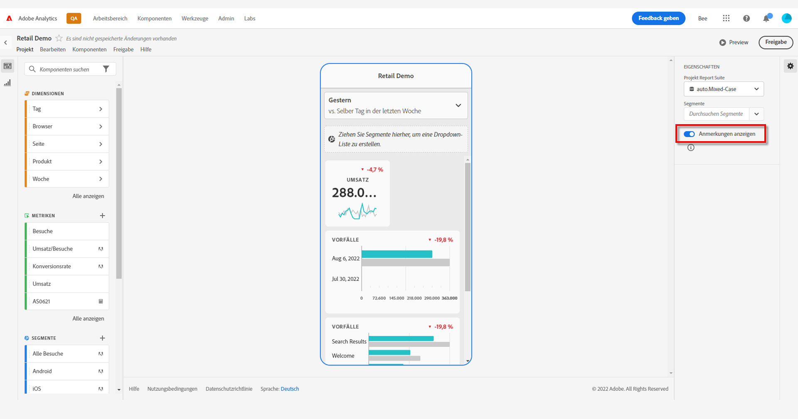
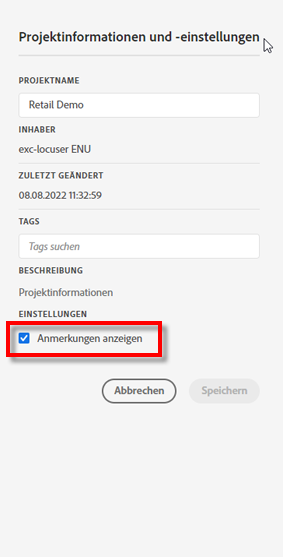
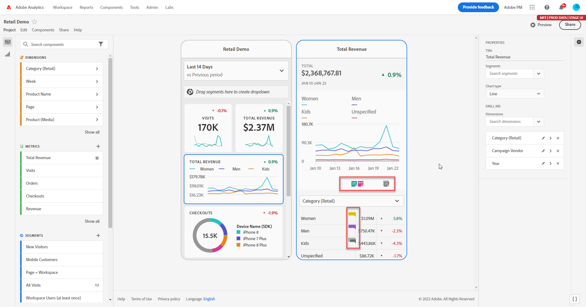
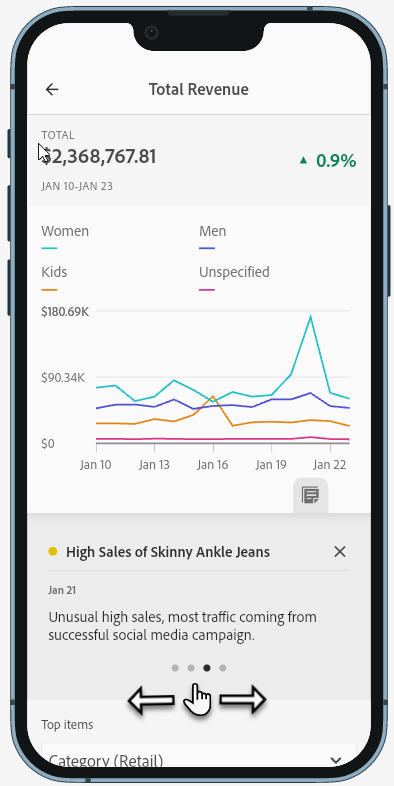

# Anmerkungen zu mobilen Scorecards

Sie können Anmerkungen, die in Analysis Workspace erstellt wurden, in mobilen Scorecards anzeigen. Anmerkungen in mobilen Scorecards ermöglichen es, kontextbezogene Datennuancen und Erkenntnisse zu Ihrer Organisation und Ihren Kampagnen mit anderen zu teilen.

## Einblenden von Anmerkungen in mobilen Scorecards

Um Anmerkungen in mobilen Scorecards einzublenden, erstellen Sie die Anmerkung zuerst in Workspace-Projekten oder über das Menü „Komponenten“.

Informationen zum Erstellen von Anmerkungen finden Sie unter [Erstellen von Anmerkungen](create-annotations.md). Anmerkungen sind standardmäßig in mobilen Scorecards deaktiviert und müssen für jede Scorecard aktiviert sein, für die Sie sie in mobilen Scorecards verwenden möchten.

1. Aktivieren Sie Anmerkungen. Informationen zum Aktivieren von Anmerkungen finden Sie unter [Aktivieren oder Deaktivieren von Anmerkungen](overview.md#turn-annotations-on-or-off).

1. Erstellen Sie eine Anmerkung und stellen Sie sicher, dass sie für alle Ihre Projekte freigegeben ist. Weitere Informationen finden Sie unter [Erstellen von Anmerkungen](create-annotations.md).

1. Wählen Sie **[!UICONTROL Anmerkungen anzeigen]**, um die Anmerkung in mobilen Scorecards anzuzeigen.

   

   Sie können optional bestätigen, dass unter **[!UICONTROL Projekt]** > **[!UICONTROL Projektinformationen und -einstellungen]** die Option **[!UICONTROL Anmerkungen anzeigen]** ausgewählt ist.

## Anzeigen von Anmerkungen in mobilen Scorecards

Wenn Anmerkungen aktiviert sind, werden im Scorecard Builder Anmerkungssymbole angezeigt. Anmerkungen werden nur in Diagrammen und Tabellen in der Detailansicht angezeigt. in der Ansicht der Hauptkachel der Scorecard sind Anmerkungen nicht sichtbar.

Wenn Anmerkungssymbole sichtbar sind, können Sie Anmerkungen in der Arbeitsfläche des Builders nicht vollständig anzeigen oder damit interagieren. Verwenden Sie  **[!UICONTROL Vorschau]**, um Anmerkungen so anzuzeigen und zu bearbeiten, wie sie in der App angezeigt werden. 

Es werden Anmerkungsfarben ausgewählt, wenn die Anmerkung in Workspace erstellt wird. Graue Anmerkungen weisen darauf hin, dass mehr als eine Anmerkung vorhanden ist.

## Anzeigen von Anmerkungen in einer Vorschau

Sie können Anmerkungen mit  in einer Vorschau anzeigen. Wählen Sie eine Anmerkung aus, um Details zu der Anmerkung zu öffnen.

Wenn weitere Anmerkungen verfügbar sind, werden am unteren Rand der Anmerkung mehrere Punkte (●) angezeigt. Wischen Sie nach links oder rechts, um zwischen Anmerkungen zu wechseln.

<!--
# Share Annotations in Mobile Scorecards

You can display annotations that are created in Workspace in Mobile Scorecards. This allows you to share contextual data nuances and insights about your organization and campaigns directly within Mobile Scorecard projects, viewable in the Analytics dashboards mobile app.

## Surface Annotations in Mobile Scorecards

To surface annotations in mobile scorecards, create the annotation first from Workspace projects or from the components menu.

For information on creating annotations, see [Create Annotations](create-annotations.md). Annotations are turned off in mobile scorecards by default and must be enabled for each scorecard that you want to surface in mobile scorecards.

1. Turn on annotations. To turn annotations on, see [Turn annotations on or off](overview.md#annotations-on-off).

1. Create an annotation and make sure it is shared to all your projects. To create an annotation in Workspace,  see [Create Annotations](create-annotations.md).

1. Select **Show annotations** to display the annotation in Mobile Scorecards.

   

1. Confirm that show annotations is selected, go to **Project** > **Project info and settings**.

   

## View annotations in Mobile Scorecards

When annotations are enabled, annotation icons are visible in the Scorecard Builder. Annotations appear only on charts and tables in the detailed view. Annotations are not visible from the main tile view of the scorecard.

 

When annotation icons are visible, you can't fully view or interact with annotations in the builder canvas. Use the Preview mode to view and interact with annotations as they appear in the app  **Preview**.

Annotation colors are selected when the annotation is created in workspace. Gray annotations indicated the presence of more than one annotation.

## View chart annotations

| Date | Appearance |
| --- | --- |
| **Single day** |     |
| **Date range** |  |
| **Overlapping annotations** |   To view annotation details in the Analytics dashboards app, tap an annotation icon.   When viewing an annotation in a chart, you can swipe left and right to navigate all annotations present in the chart. When viewing an annotation in the table, swipe left and right to navigate all annotations associated with that row item in the table.      In charts that do not have a time-based *x axis*, such as the donut or horizontal bar charts, annotations that apply to the chart can be viewed by tapping the icon located in the lower right-hand corner.   |
-->