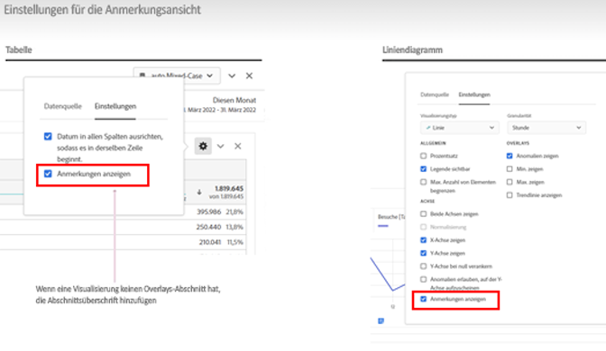
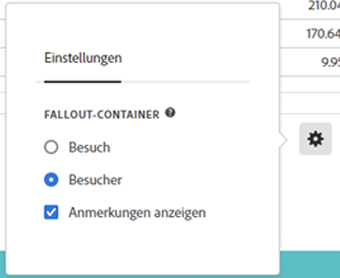

# Anmerkungen – Übersicht

Mit Anmerkungen können Sie kontextbezogene Datennuancen und Erkenntnisse auf effektive Weise an andere Stakeholderinnen und Stakeholder in Ihrer Organisation übermitteln. Durch Anmerkungen können Sie Kalenderereignisse an bestimmte Dimensionen und Metriken binden. Sie können etwa zu einem Datum oder Datumsbereich Anmerkungen zu bekannten Datenproblemen, öffentlichen Feiertagen, Kampagnenstarts usw. machen, Sie können dann Ereignisse grafisch darstellen und sehen, ob sich Kampagnen oder andere Ereignisse auf den Sitetraffic, die Nutzung der Mobile App, den Umsatz oder andere Metriken ausgewirkt haben.

Angenommen, Sie geben Projekte für Ihre Organisation frei. Wenn es einen merklichen Rückgang bei den Unique Visitors gegeben hat, können Sie die Anmerkung **Abnehmende Besucherzahlen** erstellen und diese auf Ihre gesamte Report Suite anwenden. Wenn Ihre Benutzenden eine Report Suite betrachten, die dieses Datum enthält, sehen sie die Anmerkung in ihren Projekten gemeinsam mit ihren Daten.

Anmerkungen können für Folgendes gelten:

* ein einzelnes Datum oder einen Datumsbereich.

* Ihren gesamten Datensatz oder bestimmte Metriken, Dimensionen oder Segmente.

* das Projekt, in dem Anmerkungen erstellt werden (Standard), oder alle Projekte.

* die Datenansicht, in der Anmerkungen erstellt werden (Standard), oder alle Datenansichten.

Unter [Erstellen von Anmerkungen](create-annotations.md) finden Sie die verschiedenen Optionen zum Erstellen von Anmerkungen. Anschließend erstellen, ändern und speichern Sie Anmerkungen im Rahmen der [Anmerkungserstellung](create-annotations.md#annotation-builder).

Sie verwenden den [Anmerkungs-Manager](manage-annotations.md) zum Verwalten von Anmerkungen.

## Aktivieren oder Deaktivieren von Anmerkungen

Anmerkungen können auf verschiedenen Ebenen aktiviert oder deaktiviert werden:

| Ebene | Schritte |
|---|---|
| **Visualisierung** | Aktivieren oder deaktivieren Sie  > **[!UICONTROL Einstellungen]** > **[!UICONTROL Anmerkungen anzeigen]**.  |
| **Projekt** | Wählen Sie in einem Workspace-Projektmenü **[!UICONTROL Projekt]** > **[!UICONTROL Projektinformationen und -einstellungen]** aus und aktivieren oder deaktivieren Sie **[!UICONTROL Anmerkungen anzeigen]**.  |
| **Benutzende** | Wählen Sie auf der Registerkarte **[!UICONTROL Komponenten]** die Option **[!UICONTROL Voreinstellungen]** oder im Workspace-Projektmenü die Option **[!UICONTROL Projekt]** > **[!UICONTROL Benutzervoreinstellungen]** aus.  Wählen Sie unter **[!UICONTROL Voreinstellungen]** die Option **[!UICONTROL Projekte und Analysen]** aus. Wählen Sie in der linken Registerkartenleiste die Option **[!UICONTROL Daten]** aus. Aktivieren oder deaktivieren Sie unten unter der Überschrift **[!UICONTROL Freiformtabelle]** die Option **[!UICONTROL Anmerkungen anzeigen]** aus.  |

<!--
# Annotations overview

Annotations in Workspace enable you to effectively communicate contextual data nuances and insights to your organization. They let you tie calendar events to specific dimensions/metrics. You can annotate a date or date range with known data issues, public holidays, campaign launches, etc. You can then graphically display events and see whether campaigns or other events have affected your site traffic, revenue, or any other metric.

For example, let's say you are sharing projects with your organization. If you had a major spike in traffic due to a marketing campaign, you could create a "Campaign launch date" annotation and scope it for your whole report suite. When your users view any data sets that included that date, they see the annotation within their projects, alongside their data.

Keep this in mind:

* Annotations can be tied to a single date or to a date range.

* They can apply to your entire data set or to specified metrics, dimensions, or segments.

* They can apply to the project in which they were created (default) or to all projects.

* They can apply to the report suite in which they were created (default) or to all report suites.

## Permissions {#permissions}

By default, only Admins can create annotations. Users have rights to view annotations like they do with other other Analytics components (such as segments, calculated metrics, etc.).

However, Admins can give the [!UICONTROL Annotation Creation] permission (Analytics Tools) to users via the [Adobe Admin Console](https://experienceleague.adobe.com/docs/analytics/admin/admin-console/permissions/analytics-tools.html?lang=de).

## Turn annotations on or off {#annotations-on-off}

Annotations can be turned on or off at several levels:

* At the Visualization level: [!UICONTROL Visualization] settings > [!UICONTROL Show annotations]

* At the Project level: [!UICONTROL Project info & settings] > [!UICONTROL Show annotations]

* At the User level: [!UICONTROL Components] > [!UICONTROL User preferences] > [!UICONTROL Data] > [!UICONTROL Show annotations]

-->