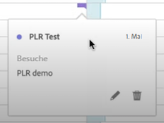
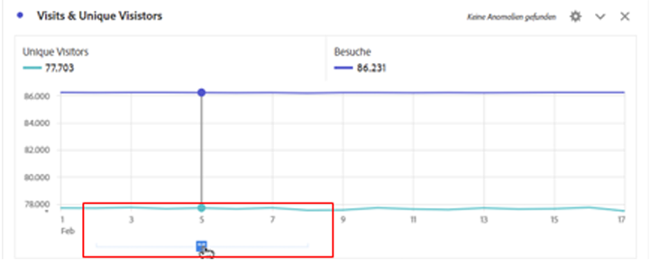
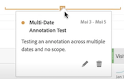
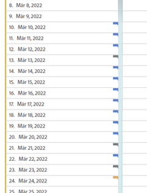
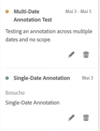
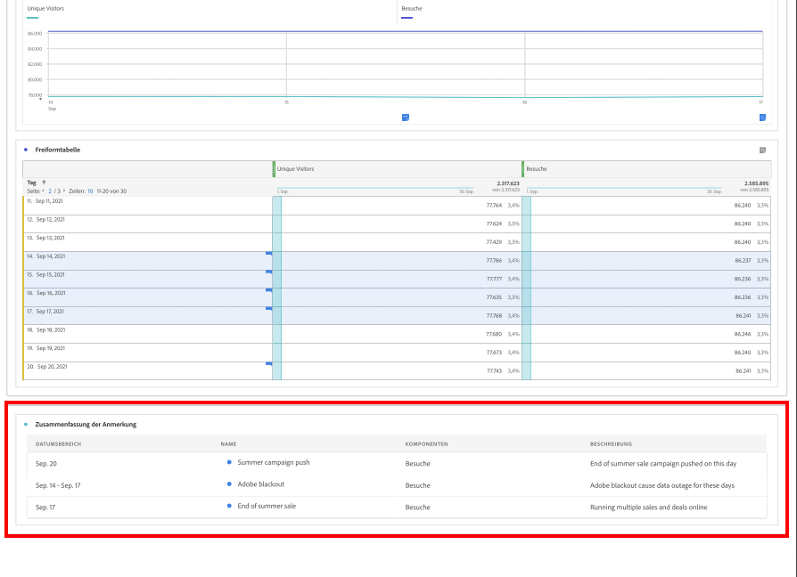

# Anzeigen von Anmerkungen

Anmerkungen werden je nachdem, wo sie angezeigt werden und ob sie sich über einen einzelnen Tag oder einen Datumsbereich erstrecken, etwas unterschiedlich angezeigt.

## Anzeigen von Anmerkungen in Workspace

| Visualisierungs- typ | Beschreibung |
| --- | --- |
| **Linie &#x200B;** **Einzeltag** | Wenn Sie in einer Linienvisualisierung  auswählen, wird ein Popup mit den Anmerkungsdetails angezeigt.  Wählen Sie zum Bearbeiten der Anmerkung unter [Anmerkungserstellung](create-annotations.md#annotation-builder) die Option  aus. Um die Anmerkung zu entfernen, wählen Sie  aus. |
| **Linie &#x200B;** **Datumsbereich** | Wenn Sie  auswählen, werden ein Popup mit den Anmerkungsdetails und unten eine Linie angezeigt, die den Datumsbereich angibt. Wählen Sie zum Bearbeiten der Anmerkung unter [Anmerkungserstellung](create-annotations.md#annotation-builder) die Option  aus. Um die Anmerkung zu entfernen, wählen Sie  aus. |
| **Freiformtabelle** | In einer Freiformtabelle können Sie über die Schaltfläche „Anmerkungen“ oben rechts in der Visualisierung auf alle Anmerkungen zugreifen. Wählen Sie  aus, um eine Bildlaufliste aller Anmerkungen anzuzeigen.  Sie können für jede Anmerkung die Option  auswählen, um die Anmerkung unter [Anmerkungserstellung](create-annotations.md#annotation-builder) zu bearbeiten, und mit  die Anmerkung entfernen. |

{style="table-layout:auto"}

## Anzeigen von Anmerkungen in einer PDF-Datei

Wenn Sie Ihr Projekt als PDF-Datei herunterladen oder versenden, werden Anmerkungen im Abschnitt „Zusammenfassung der Anmerkung“ als PDF zusammengefasst.

<!--
# View annotations

Annotations manifest slightly differently, depending on whether they span a single day or a date range.

## View annotations in Line charts or Tables

| Date | Appearance |
| --- | --- |
| **Single day** |   
When you hover over the annotation, you can see its details, you can edit it by selecting the pen icon, or you can delete it:
  |
| **Date range** |  The icon changes and when you hover over it, the date range appears.

When you select it in the line chart, the annotation metadata appear, and you can edit or delete it:
In a table, an icon appears on every date in the date range.
|
| **Overlapping annotations** | On days that have more than one annotation tied to them, the icon appears in a grey color.

When you hover over the grey icon, all overlapping annotations appear:
 |

{style="table-layout:auto"}

## View annotations in a .pdf file

Since you cannot hover over icons in a .pdf file, this file (after export) provides notes of explanations at the bottom of a panel. Here is an example:

## View annotations with non-trended data

Sometimes annotation are shown with non-trended data, but tied to a specific dimension. In that case, they appear only in a summary annotation in the bottom right corner. Here is an example:

The summary chart appears in all visualization types in the corner, not just in non-trended freeform tables and summary numbers. It also appears in visualizations like [!UICONTROL Donut], [!UICONTROL Flow],[!UICONTROL Fallout],[!UICONTROL Cohort], and so on.

-->