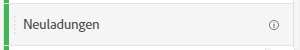
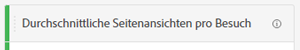
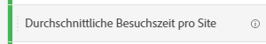
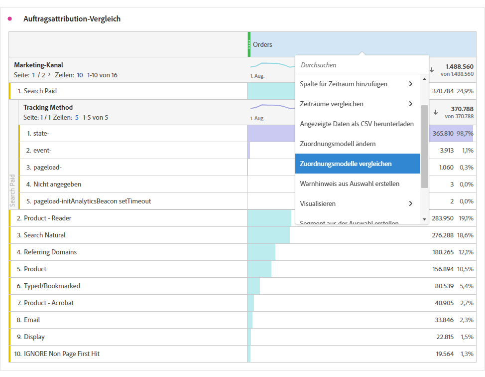

# Metriken

Mit Metriken können Sie Datenpunkte in Analysis Workspace quantifizieren. Sie werden meist als Spalten in einer Visualisierung verwendet und sind an Dimensionen gebunden.

## Arten von Metriken

Adobe bietet verschiedene Arten von Metriken zur Verwendung in Analysis Workspace:

* **Standardmetriken**: Die meisten Metriken, die Sie in Projekten verwenden, sind Standardmetriken. Beispiele sind [Seitenansichten](/help/components/metrics/page-views.md), [Umsatz](/help/components/metrics/revenue.md) oder [Benutzerspezifische Ereignisse](/help/components/metrics/custom-events.md). Weitere Informationen finden Sie in der [Übersicht zu Metriken](/help/components/metrics/overview.md) im Komponenten-Benutzerhandbuch.

  

* **Berechnete Metriken**: Benutzerdefinierte Metriken, die auf Standardmetriken, statischen Zahlen oder algorithmischen Funktionen basieren. Bei benutzerdefinierten berechneten Metriken wird in der Liste der verfügbaren Komponenten ein Taschenrechnersymbol angezeigt. Weitere Informationen finden Sie in der [Übersicht zu berechneten Metriken](/help/components/c-calcmetrics/cm-overview.md) im Komponenten-Benutzerhandbuch.

  

* **Vorlagen für berechnete Metriken**: Von Adobe definierte Metriken, die sich ähnlich wie berechnete Metriken verhalten. Sie können sie unverändert in Workspace-Projekten verwenden oder eine Kopie speichern, um ihre Logik anzupassen. Bei Vorlagen für berechnete Metriken wird in der Liste der verfügbaren Komponenten ein Adobe-Symbol angezeigt.

  

## Verwenden von Metriken in Analysis Workspace

Metriken können in Analysis Workspace auf verschiedene Arten verwendet werden. Informationen zum Hinzufügen von Metriken und anderen Komponententypen zu Analysis Workspace finden Sie unter [Verwenden von Komponenten in Analysis Workspace](/help/analyze/analysis-workspace/components/use-components-in-workspace.md).

>[!BEGINSHADEBOX]

Siehe  [Verwenden von ](https://video.tv.adobe.com/v/328565?quality=12&learn=on&captions=ger){target="_blank"}) für ein Demovideo.

>[!ENDSHADEBOX]

## Erstellen von berechneten Metriken

Berechnete Metriken ermöglichen es Ihnen, mithilfe einfacher Operatoren oder statistischer Funktionen leicht zu erkennen, wie sich Metriken zueinander verhalten.

Es gibt mehrere Möglichkeiten, berechnete Metriken zu erstellen. Die gewählte Methode bestimmt, ob die berechnete Metrik in der Komponentenliste für alle Projekte verfügbar ist oder nur in dem Projekt, in dem sie erstellt wurde.

### Berechnete Metriken für alle Projekte erstellen

Sie können den Generator für berechnete Metriken verwenden, um berechnete Metriken zu erstellen. Wenn sie auf diese Weise erstellt werden, sind berechnete Metriken in der Komponentenliste verfügbar und können dann in Projekten in Ihrer gesamten Organisation verwendet werden.

Informationen zum Zugriff auf den Generator für berechnete Metriken finden Sie unter [Metriken erstellen](/help/components/c-calcmetrics/c-workflow/cm-workflow/c-build-metrics/cm-build-metrics.md).

### Erstellen von berechneten Metriken für ein einzelnes Projekt

Sie können schnell eine berechnete Metrik erstellen, die nur für das Projekt verfügbar ist, in dem sie erstellt wurde.

Erstellen einer berechneten Metrik für ein einzelnes Projekt:

1. Öffnen Sie in Analysis Workspace das Projekt, in dem Sie die berechnete Metrik erstellen möchten.

1. Klicken Sie in einer Freiformtabelle mit der rechten Maustaste auf die Spaltenüberschrift einer einzelnen Spalte.

   Oder

   Wählen Sie zwei Spalten aus, während Sie die Umschalttaste gedrückt halten, und klicken Sie dann mit der rechten Maustaste auf eine der ausgewählten Spalten.

1. Wählen Sie **[!UICONTROL Metrik aus Auswahl erstellen]**

   

1. Um nur für dieses Projekt eine berechnete Metrik zu erstellen, wählen Sie eine der verfügbaren Optionen aus.

   Wenn eine einzelne Spalte ausgewählt ist, stehen die folgenden Optionen zur Verfügung:

   * [!UICONTROL **Mittel**]: Erstellt eine neue Spalte, die den Mittelwert im Satz der Dimensionselemente für die Spalte anzeigt. Dabei wird die Funktion [Mittelwert](/help/components/c-calcmetrics/cm-reference/cm-functions.md#mean) verwendet.

   * [!UICONTROL **Median**]: Erstellt eine neue Spalte, die den Medianwert im Satz der Dimensionselemente für die Spalte anzeigt. Dabei wird die [Median](/help/components/c-calcmetrics/cm-reference/cm-functions.md#median)-Funktion verwendet.

   * [!UICONTROL **Spalte max**]: Erstellt eine neue Spalte, die den größten Wert im Satz von Dimensionselementen für die Spalte anzeigt. Dabei wird die [Spaltenmaximum](/help/components/c-calcmetrics/cm-reference/cm-functions.md#column-maximum)-Funktion verwendet.

   * [!UICONTROL **Spalte min**]: Erstellt eine neue Spalte, die den kleinsten Wert im Satz der Dimensionselemente für die Spalte anzeigt. Dabei wird die Funktion [Spalten-Minimum](/help/components/c-calcmetrics/cm-reference/cm-functions.md#column-minimum) verwendet.

   * [!UICONTROL **Spaltensumme**]: Erstellt eine neue Spalte, die alle numerischen Werte für eine Metrik innerhalb einer Spalte (über die Elemente einer Dimension hinweg) hinzufügt. Dabei wird die Funktion [Spaltensumme](/help/components/c-calcmetrics/cm-reference/cm-functions.md#column-sum) verwendet.

   Wenn zwei Spalten ausgewählt sind, sind die folgenden Optionen verfügbar:

   * [!UICONTROL **Trennen**]: Erstellt eine neue Spalte, die die Werte der beiden ausgewählten Spalten teilt.

   * [!UICONTROL **Abziehen**]: Erstellt eine neue Spalte, die die Werte der beiden ausgewählten Spalten abzieht.

   * [!UICONTROL **Hinzufügen**]: Erstellt eine neue Spalte, die die Werte der beiden ausgewählten Spalten hinzufügt.

   * [!UICONTROL **Multiplizieren**]: Erstellt eine neue Spalte, die die Werte der beiden ausgewählten Spalten multipliziert.

   * [!UICONTROL **prozentuale Änderung**]: Erstellt eine neue Spalte, die die prozentuale Änderung zwischen den beiden ausgewählten Spalten anzeigt.

[Berechnete Metriken: implementierungslose Metriken](https://experienceleague.adobe.com/docs/analytics-learn/tutorials/components/calculated-metrics/calculated-metrics-implementationless-metrics.html?lang=de) (3:42)

## Vergleichen von Metriken mit verschiedenen Attributionsmodellen

Um Attributionsmodelle schnell zu vergleichen, klicken Sie mit der rechten Maustaste auf eine Metrik und wählen Sie **[!UICONTROL Attributionsmodelle vergleichen]**:

Mithilfe dieser Tastenkombination können Sie ein Attributionsmodell mit einem anderen vergleichen, ohne eine Metrik per Drag-and-Drop verschieben und zweimal konfigurieren zu müssen.

## Verwenden der Funktion [!UICONTROL Kumulativer Durchschnitt] zum Anwenden der Metrikausgleichung

Im Folgenden finden Sie ein Video zum Thema:

>[!BEGINSHADEBOX]

Siehe  [Kumulativer Durchschnitt](https://video.tv.adobe.com/v/35006?quality=12&learn=on&captions=ger){target="_blank"} für ein Demovideo.

>[!ENDSHADEBOX]

