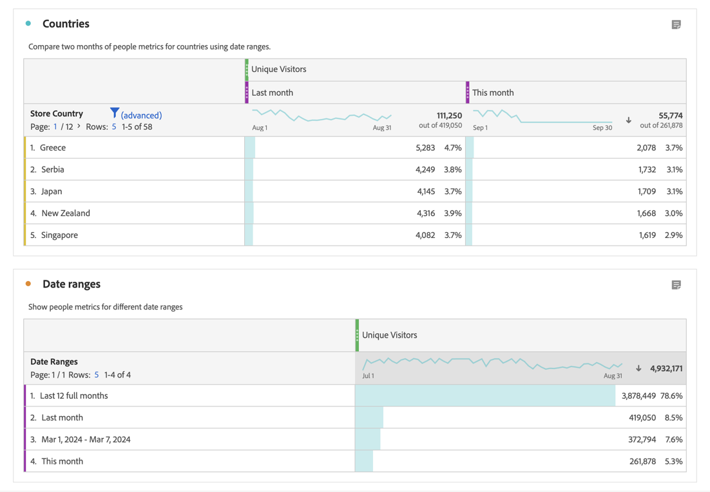

# Übersicht über Datumsbereiche

In einem Workspace-Projekt verwenden Sie normalerweise den [Kalender in einem Panel](/help/analyze/analysis-workspace/c-panels/panels.md#calendar), um den Datumsbereich für die Visualisierungen in diesem Panel anzugeben.

Mit Datumsbereichskomponenten können Sie die Kalendereinstellungen für das Panel definieren und überschreiben.

## Verwenden von Datumsbereichen

Sie können eine Datumsbereichskomponente verwenden, um den Kalender für das Panel neu zu definieren.

Sie können auch einen Datumsbereich in einer Freiformtabelle als Metrik oder Dimension verwenden.

- **Metrik**. Sie können beispielsweise eine Dimension für zwei verschiedene Monate einer Metrik vergleichen.
- **Dimension**. So vergleichen Sie eine Metrik zu verschiedenen Dimensionselementen für die Dimension Datumsbereich.

>[!NOTE]
>
>Wenn Sie Datumsbereiche in einer Freiformtabelle verwenden, überschreiben die Datumsbereiche den Kalender, der für das Panel angegeben ist, zu dem die Freiformtabelle gehört.
>

Sie verwenden einen Datumsbereich so wie Sie [eine beliebige Komponente verwenden würden](/help/analyze/analysis-workspace/components/analysis-workspace-components.md#analysis-workspace-components). Sie ziehen den Datumsbereich aus dem Komponenten-Panel  **[!UICONTROL Datumsbereiche]** und legen Sie die Komponente hier ab:

- **[!UICONTROL Kalender]**: Sie  **[!UICONTROL Ersetzen]** die aktuelle Kalenderkonfiguration durch den Datumsbereich.
- **Spaltenkopf Metrik**: Sie  **[!UICONTROL ersetzen]** die Metrik, **[!UICONTROL fügen ]**den Datumsbereich als Metrik hinzu oder **[!UICONTROL  filtern ]**die Metrik mit der Komponente Datumsbereich.
- **Spaltenkopf Dimension**: Sie  **[!UICONTROL ersetzen]** die aktuellen Dimensionen. Die neue Dimension lautet jetzt **[!UICONTROL Datumsbereiche]**. Sobald die Dimension Datumsbereiche lautet, können Sie zusätzliche Datumsbereiche als Dimensionselemente **[!UICONTROL hinzufügen ]**.
- **Dimensionselement**: Sie  **[!UICONTROL schlüsseln]** das spezifische Dimensionselement nach Datumsbereich auf.

Sie können eine Spalte für Datumsbereich auch direkt in einer Visualisierung „Freiformtabelle“ hinzufügen:

1. Wählen Sie in einer Spalte für Metrik aus dem Kontextmenü:

   - **[!UICONTROL Spalte für Zeitraum hinzufügen]**. Sie können zwischen vorgeschlagenen Optionen wählen, die auf dem aktuellen Kalender basieren, oder einen [benutzerdefinierten Datumsbereich](#custom-date-ranges) erstellen.
   - **[!UICONTROL Zeiträume vergleichen]**. Sie können zwischen einer vorgeschlagenen Option wählen, die auf dem aktuellen Kalender basiert, oder einen [benutzerdefinierten Datumsbereich](#custom-date-ranges) erstellen.

1. Entsprechend Ihrer Auswahl werden der Freiformtabelle zusätzliche Spalten für Datumsbereich hinzugefügt.

## Fehlgeschlagene Datumsbereiche

Analysis Workspace bietet eine Reihe von standardmäßigen Datumsbereichen.

| Tag | Woche | Monat | Quartal | Jahr |
|---|---|---|---|---|
| Am aktuellen Tag | Diese Woche | Diesen Monat | Dieses Quartal | Dieses Jahr |
| Am Vortag | Diese Woche (ohne heute) | Dieser Monat (ohne heute) | Dieses Quartal (ohne heute) | Dieses Jahr (ohne heute) |
| Vor 2 Tagen | Vor 2 Wochen | Vor 2 Monaten |   |  |
| Vor 3 Tagen | Vor 3 Wochen | Vor 3 Monaten |  | |
| Letzte 7 Tage | Letzte Woche | Letzter Monat | Letztes Quartal | Letztes Jahr |
| Letzte 14 Tage | Letzte 2 volle Wochen | Letzte 2 volle Monate | Letzte 4 volle Quartale | |
| Letzte 30 Tage | Letzte 3 volle Wochen | Letzte 3 volle Monate | | |
| Letzte 60 Tage | Letzte 4 volle Wochen | Letzte 6 volle Monate | | |
| Letzte 90 Tage | Letzte 12 volle Wochen | Letzte 12 volle Monate | | |
| Letzte 7 volle Tage | Letzte 52 volle Wochen | Letzte 13 volle Monate | | |
| Letzte 14 volle Tage | | | | |
| Letzte 30 volle Tage | | | | |
| Letzte 90 volle Tage | | | | |

<table style="table-layout:fixed">

## Benutzerdefinierte Datumsbereiche

Sie können eigene, benutzerdefinierte Datumsbereiche erstellen. Unter [Datumsbereich erstellen](create.md) finden Sie die verschiedenen Optionen zum Erstellen von Datumsbereichen. Anschließend erstellen, ändern und speichern Sie Datumsbereiche im [Datumsbereichsgenerator](create.md#date-range-builder).

Sie verwenden die [Datumsbereichsverwaltung](manage.md), um Datumsbereiche zu verwalten.

<!--
# Calendar and date ranges overview {#date-range}

>[!CONTEXTUALHELP]
>id="components_dateranges_endtime"
>title="End time"
>abstract="End times always include 59 seconds."

In the calendar, you can specify dates and date ranges, or select a preset.

>[!BEGINSHADEBOX]

See  [Calendar and date ranges overview](https://video.tv.adobe.com/v/23973?quality=12&learn=on){target="_blank"} for a demo video.

>[!ENDSHADEBOX]

Calendar selections apply at the panel level, but you have the option to apply them to all panels. When you click a date range in Workspace, the interface displays the current calendar month and the previous calendar month. You can adjust these two calendars by clicking the right and left arrows in each respective upper corner.

{width="60%"} 

## Select and apply date ranges {#select-apply}

The first click on a calendar starts a date range selection. The second click completes a date range selection, which becomes highlighted. If the `Shift` key is held down (or right-click is used), it appends to the currently selected range.

You can also drag dates (and time dimensions) into a Workspace project. You can select specific days, weeks, months, years, or a rolling date.

[Using Date Ranges and Calendar in Analysis Workspace](https://experienceleague.adobe.com/docs/analytics-learn/tutorials/analysis-workspace/calendar-and-date-ranges/using-dates-in-analysis-workspace.html) (4:07)

| Setting | Description |
|--- |--- |
|Selected Days|Selected days/weeks/months/years.|
|Make date range components relative to panel calendar| If disabled, any date range components used within a table, visualization, or panel drop zone override the panel calendar. 
If enabled, any date range components used within a table, visualization, or panel drop zone are in relation to the panel date range. For example, if the panel date range is set to November 1 through November 30, and a Last Week date range component is used in a freeform table, the information in the freeform table refers to the last week in October. |
|Use rolling dates| Rolling dates allow you to generate a dynamic report that looks forward or backward for a set period of time based on when you ran the report. For example, if you want to report on all Orders placed "Last Month" (based on the Created Date field) and ran that report in December, you'd see orders placed in November. If you ran that same report in January, you'd see orders placed in December.<ul><li>**[!UICONTROL Date Preview]**: Indicates what time period the rolling calendar encompasses.</li><li>**[!UICONTROL Start]**: You can choose among current day, current week, current month, current quarter, current year.</li><li>**[!UICONTROL End]**: You can choose among current day, current week, current month, current quarter, current year.</li></ul>To view an example, see [Custom date ranges](/help/analyze/analysis-workspace/components/calendar-date-ranges/custom-date-ranges.md).  Selected by default.|
|Date Range|Lets you pick a preset date range. Last 30 days is the default. **[!UICONTROL This week/month/quarter/year (excluding today)]** lets you choose from date ranges that do not include partial-day data from today.|
|Apply to All Panels|Lets you not only change the selected date range for the current panel, but also for all other panels within the project.|
|Apply|Applies the date range to this panel only.|

## About relative panel date ranges {#relative-panel-dates}

If you're working in Workspace, you can make the date range components relative to the panel calendar. 
Three common use cases where you'll see relative panel dates take effect are Combo charts, Key metrics summary, and Freeform table date ranges.

To use relative panel date ranges

1. Select the **Workspace** tab.
1. Select **Blank project**.
1. Add dimensions, metrics, and segments from the left rail. 
1. Click the panel date range field to toggle the relative panel date range setting.
1. Select **Make date range components relative to panel calendar**.
    * Select the option to make the date range components relative to the panel calendar.
        If relative dates are selected, then rolling dates will be based on the start date of the panel calendar and not today's date.
    * If this option isn't selected, then rolling dates will be based on today's date.

    {width="60%"} 

1. Click **Apply**.
    The relative dates are shown in the upper-right.

    

## Guidelines for relative panel date ranges {#guidelines}

Keep in mind the following guidelines when using relative panel date ranges.

### Formulas and relative date ranges {#formula-relative-dates}

If you have relative dates selected, all date formulas will use the panel's start date as the starting point.

### Custom calendars and relative date ranges {#custom-calendar-formulas}

When you use a week-based custom calendar and you add months or years, the formula calculates the offset of the day in the given period. The actual date may be different because of the offset. The formula chooses the day landing in the same place in the custom calendar. For example, the third Friday of the third week in a custom calendar.

### About segments that use rolling dates and relative panel date ranges {#segments-relative-dates}

If you build a segment or use a segment with a rolling date, for example, the Last 7 Days or the Last 2 Weeks, and you click on the segment preview, it will start the rolling date from *Today* instead of the panel start date. As a result the preview for the segment will not match when you actually use the segment in the table. The preview is impacted, not the segment itself. 

## Guidelines for panel date ranges and previews {#guidelines-panel-dates}

* Starting with the February release, component and data previews will be based on the panel date range and not the last 90 days. 
* All components listed in the left rail will be available based on the panel date range. 
* All date previews in the segment and calculated metric builders will be based on the panel date range (unless accessed from the component managers, which do not have an associated panel, they will still be based on the last 90 days). 
* Any data previews will display data or components based on the panel date range.

-->