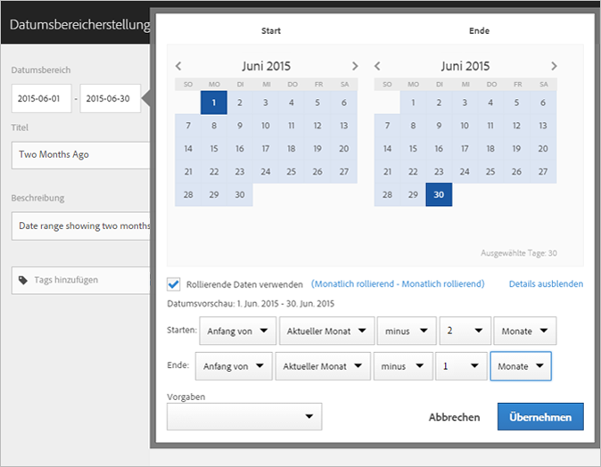
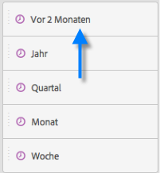
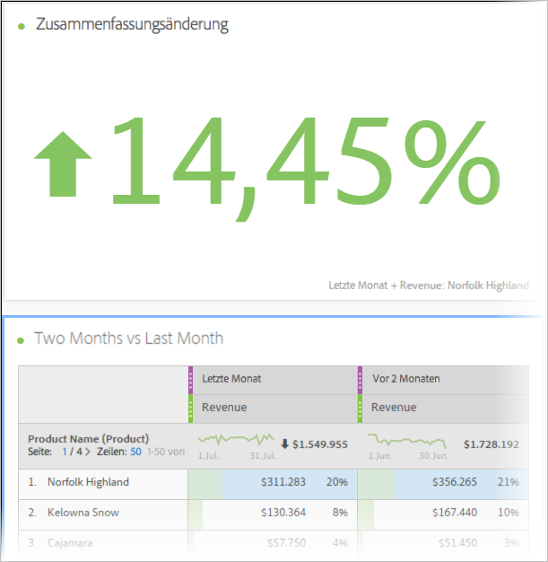

# Erstellen von benutzerdefinierten Datumsbereichen

Sie können benutzerdefinierte Datumsbereiche in Analysis Workspace erstellen und als Zeitkomponenten speichern.

Informationen zum Hinzufügen vorhandener Datumsbereiche zu einem Projekt finden Sie unter [Übersicht über Kalender und Datumsbereiche](/help/analyze/analysis-workspace/components/calendar-date-ranges/calendar.md).

So erstellen Sie einen benutzerdefinierten Datumsbereich:

1. Wählen Sie in Adobe Analytics **[!UICONTROL Komponenten]** > **[!UICONTROL Datumsbereiche]**.

   

1. Auswählen [!UICONTROL **Neuen Datumsbereich erstellen**].

1. Geben Sie im Generator für Datumsbereiche die folgenden Informationen an:

   | Option | Beschreibung |
   |---------|----------|
   | [!UICONTROL **Titel**] | Der Titel des Datumsbereichs, der angezeigt wird, wenn Benutzer ihn in Analysis Workspace auswählen. |
   | [!UICONTROL **Beschreibung**] | Eine Beschreibung für den Datumsbereich. |
   | [!UICONTROL **Tags**] | Alle Tags, die Sie auf den Datumsbereich anwenden möchten. |
   | [!UICONTROL **Datumsbereich**] | Hier können Sie einen benutzerdefinierten Datumsbereich auswählen. Standardmäßig sind die letzten 30 Tage ausgewählt. |
   | [!UICONTROL **Voreinstellung**] | Wählen Sie aus einer Liste vordefinierter Datumsbereiche aus, z. B. [!UICONTROL **Gestern**], [!UICONTROL **Letzte 7 Tage**], [!UICONTROL **Letzte 30 Tage**] usw. |
   | [!UICONTROL **Startzeit**] | Die Tageszeit, zu der der Datumsbereich beginnt. |
   | [!UICONTROL **Endzeit**] | Die Tageszeit, zu der der Datumsbereich endet. |
   | [!UICONTROL **Rollierende Datumswerte verwenden**] | Mithilfe rollierender Daten können Sie einen dynamischen Bericht generieren, der zum Zeitpunkt seiner Ausführung einen bestimmten Zeitraum voraus oder zurück umfasst. Wenn Sie zum Beispiel einen Bericht zu allen Bestellungen haben möchten, die im letzten Monat aufgegeben wurden (wobei sich „Letzter Monat“ auf das Feld „Erstellungsdatum“ bezieht), und diesen Bericht dann im Dezember ausführen, würden Ihnen alle Bestellungen angezeigt, die im November aufgegeben wurden. Führen Sie den gleichen Bericht im Januar aus, werden Ihnen die Bestellungen aus dem Dezember angezeigt.<ul><li>**[!UICONTROL Datumsvorschau]**: Gibt an, welchen Zeitraum der rollierende Kalender umfasst.</li><li>**[!UICONTROL Start]**: Sie können zwischen den folgenden Optionen wählen: „Aktueller Tag“, „Aktuelle Woche“, „Aktueller Monat“, „Aktuelles Quartal“ und „Aktuelles Jahr“.</li><li>**[!UICONTROL Ende]**: Sie können zwischen den folgenden Optionen wählen: „Aktueller Tag“, „Aktuelle Woche“, „Aktueller Monat“, „Aktuelles Quartal“ und „Aktuelles Jahr“.</li></ul> Standardmäßig ausgewählt. |

1. Wählen Sie [!UICONTROL **Speichern**] aus.

## Beispiel: Datumsbereich für &quot;Vor zwei Monaten&quot; {#section_C4109C57CB444BB2A79CC8082BD67294}

Der folgende benutzerdefinierte Datumsbereich zeigt den Bereich vor zwei Monaten mit einer Visualisierung der Zusammenfassungsänderung, die eine Trend-Entwicklung anzeigt.

Der benutzerdefinierte Datumsbereich wird in Ihrem Projekt oben auf dem Komponentenbereich für den [!UICONTROL Datumsbereich] angezeigt:

Sie können diesen benutzerdefinierten Datumsbereich auf eine Spalte neben einem benutzerdefinierten, monatlichen rollierenden Datumsbereich ziehen und die Voreinstellung für den letzten Monat für den Vergleich nutzen. Fügen Sie eine Visualisierung der Sammeländerung hinzu und wählen Sie die Gesamtsummen der einzelnen Spalten aus, um eine Trendentwicklung zu zeigen:

## Beispiel: Verwenden eines 7-Tage-Datumsbereichs {#section_7EF63B2E9FF54D2E9144C4F76956A8DD}

Sie können einen Datumsbereich erstellen, der ein rollierendes 7-Tage-Fenster angibt, das vor einer Woche endet:

Verwenden Sie *`rolling daily`*.

* Die Starteinstellung lautet *`current day minus 6 days`*.

* Die Endeinstellung lautet *`current day minus 7 days`*.

Dieser Datumsbereich kann eine Komponente sein, die Sie auf eine beliebige Freiformtabelle ziehen können.
