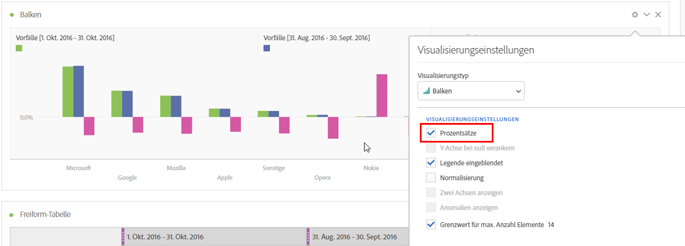
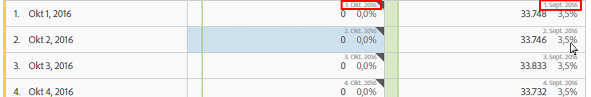

# Datumsvergleich

Mit dem Datumsvergleich in Analysis Workspace können Sie mit einer Spalte, die einen Datumsbereich enthält, einen allgemeinen Datumsvergleich erstellen, z. B. Jahres-, Quartals-, Monatsvergleich usw.

## Zeiträume vergleichen

Für Analysen wird Kontext benötigt, der oft durch einen vorherigen Zeitraum geliefert wird. Beispielsweise ist *Wie viel besser/schlechter geht es uns im Vergleich zu diesem Zeitpunkt letztes Jahr?* eine zentrale Frage, um Ihr Geschäft zu verstehen. Der Datumsvergleich enthält automatisch eine Spalte *Differenz*, die die prozentuale Veränderung im Vergleich zu einem bestimmten Zeitraum angibt.

1. Erstellen Sie eine [Freiformtabelle](/help/analyze/analysis-workspace/visualizations/freeform-table/freeform-table.md) mit beliebigen Dimensionen und Metriken, die Sie mit einem bestimmten Zeitraum vergleichen möchten.
1. Legen Sie den Zeitraum im Panel oder in der Spalte fest, um den Vergleichszeitrahmen zu bestimmen und um anzugeben, ob es sich um einen rollierenden oder einen festen Zeitvergleich handelt.

   Zum Erstellen eines rollierenden Zeitvergleichs legen Sie für den Datumsbereich des Bedienfelds oder der Spalte einen rollierenden Datumsbereich fest (z. B. **[!UICONTROL Letzte 7 Tage]**, **[!UICONTROL Letzte 30 Tage]** usw.).

   Zum Erstellen eines festen Zeitvergleichs legen Sie für den Datumsbereich des Panels oder der Spalte einen benutzerdefinierten Datumsbereich fest.
1. Öffnen Sie das Kontextmenü für eine Tabellenzeile und wählen Sie **[!UICONTROL Zeiträume vergleichen]** aus.

   

   >[!NOTE]
   >
   >Diese Kontextmenüoption ist für Metrikzeilen, Datumsbereichzeilen und Zeitdimensionszeilen deaktiviert.

1. Abhängig davon, wie Sie den Datumsbereich der Tabelle festgelegt haben, stehen Ihnen die folgenden Vergleichsoptionen zur Verfügung:

   | Option | Beschreibung |
   |---|---|
   | **[!UICONTROL Vorherige *x* Wochen/Monate/Quartale/Jahre bis zu diesem Datumsbereich]** | Vergleich mit dem ausgewählten Datumsbereich unmittelbar vor diesem Datumsbereich. |
   | **[!UICONTROL Diese x Wochen/Monate/Quartale/Jahre im letzten Jahr vor diesem Datumsbereich]** | Vergleich mit demselben Datumsbereich vor einem Jahr. |
   | **[!UICONTROL Benutzerdefinierter Datumsbereich vor diesem Datumsbereich]** | Ermöglicht die Definition eines benutzerdefinierten Datumsbereichs. |

   >[!NOTE]
   >
   >Wenn Sie eine benutzerdefinierte Anzahl an Tagen auswählen, z. B. 7.–20. Oktober (ein Zeitraum von 14 Tagen), stehen nur zwei Optionen zur Verfügung: **[!UICONTROL Vorhergehende 14 Tage vor diesem Datumsbereich]** und **[!UICONTROL Benutzerdefinierter Datumsbereich vor diesem Datumsbereich]**.

1. Der resultierende Vergleich sieht wie folgt aus:

   

   Zeilen in der Spalte „Prozentuale Veränderung“ sind rot bei negativen Werten und grün bei positiven Werten.

## Hinzufügen einer Zeitraumspalte zum Vergleich

Sie können jetzt allen Spalten in einer Tabelle Zeiträume hinzufügen. So können Sie einen Zeitraum hinzufügen, der von dem abweicht, auf den Ihr Kalender eingestellt ist. 

1. Klicken Sie mit der rechten Maustaste auf eine Spalte in der Tabelle und wählen Sie **[!UICONTROL Spalte für Zeitraum hinzufügen]** aus

   

1. Abhängig davon, wie Sie den Datumsbereich der Tabelle festgelegt haben, stehen Ihnen die folgenden Vergleichsoptionen zur Verfügung:

   | Option | Beschreibung |
   |---|---|
   | **[!UICONTROL Vorherige *x* Wochen/Monate/Quartale/Jahre bis zu diesem Datumsbereich]** | Ermöglicht das Hinzufügen einer Spalte mit der Woche/dem Monat usw. unmittelbar vor diesem Datumsbereich. |
   | **[!UICONTROL Diese *x* Wochen/Monate/Quartale/Jahre im letzten Jahr vor diesem Datumsbereich]** | Fügt denselben Datumsbereich des Vorjahres hinzu. |
   | **[!UICONTROL Benutzerdefinierter Datumsbereich vor diesem Datumsbereich]** | Ermöglicht die Erstellung eines benutzerdefinierten Datumsbereichs. |

   >[!NOTE]
   >
   >Wenn Sie eine benutzerdefinierte Anzahl an Tagen auswählen, z. B. 7.–20. Oktober (ein Zeitraum von 14 Tagen), stehen nur zwei Optionen zur Verfügung: **[!UICONTROL Vorhergehende 14 Tage vor diesem Datumsbereich]** und **[!UICONTROL Benutzerdefinierter Datumsbereich vor diesem Datumsbereich]**.

1. Der Zeitraum wird am Anfang der ausgewählten Spalte eingefügt:

   

1. Sie können so viele Zeitspalten hinzufügen, wie Sie möchten, sowie verschiedene Datumsbereiche kombinieren:

1. Sie können außerdem nach jeder Spalte sortieren. Dadurch wird die Reihenfolge der Tage abhängig von der jeweiligen Spalte geändert.

## Beginn der Spaltendaten an derselben Zeile ausrichten

Sie können die Daten in den einzelnen Spalten so ausrichten, dass sie alle in derselben Zeile beginnen.

Sie führen beispielsweise einen Tagesvergleich für die letzte Woche (bis zum 5. Oktober 2024) und die vorherige Woche durch. Standardmäßig beginnt die linke Spalte am 22. September und die rechte Spalte am 29. September.

Sie können unter [Einstellungen](/help/analyze/analysis-workspace/visualizations/freeform-table/freeform-table.md#settings-1) für die Freiformtabellen-Visualisierung die Option **[!UICONTROL Datum in allen Spalten ausrichten, sodass es in derselben Zeile beginnt]** aktivieren, um Spaltendaten so anzuordnen, dass sie in derselben Zeile beginnen.

Beachten Sie beim Verwenden dieser Option Folgendes:

* Diese Einstellung ist standardmäßig für alle neuen Projekte aktiviert.

* Diese Einstellung gilt für die gesamte Tabelle. Wenn Sie diese Einstellung beispielsweise für eine Aufschlüsselung innerhalb der Tabelle ändern, wird die Einstellung auf die gesamte Tabelle angewendet.

<!--
# Date comparison

Date comparison in Analysis Workspace lets you take any column containing a date range and create a common date comparison, such as: year-over-year, quarter-over-quarter, month-over-month, etc.

>[!BEGINSHADEBOX]

See  [Date comparison](https://video.tv.adobe.com/v/30753?quality=12&learn=on){target="_blank"} for a demo video.

>[!ENDSHADEBOX]

## Compare time periods {#section_C4E36BFE0F5C4378A74E705747C9DEE4}

>[!NOTE]
>[!UICONTROL Compare Time Periods] leverages advanced Calculated Metrics. As a result, it is available only to customers with Analytics Select, Prime, and Ultimate SKUs. 

Analysis requires context, and often that context is provided by a previous time period. For example, the question "How much better or worse are we doing than at this time last year?" is fundamental to understanding your business. Date Comparison automatically include a "difference" column, which shows the percentage change compared to a specified time period.

1. Create a Freeform table, with any dimensions and metrics you want to compare over a time period.
1. Right-click a table row and select **[!UICONTROL Compare time periods]**.

   

   >[!NOTE]
   >
   >This right-click option is disabled for metric rows, date range rows, and time dimension rows.

1. Depending on how you have set the table's date range, you have these options for comparison: 

   |  Option  | Description  |
   |---|---|
   | **[!UICONTROL Prior week/month/quarter/year to this date range]** | Compares to the week/month/etc. immediately before this date range.  |
   | **[!UICONTROL This week/month/quarter/year last year to this date range]** | Compares to the same date range a year ago.  |
   | **[!UICONTROL Custom date range to this date range]** | Lets you select a custom date range.  |

   >[!NOTE]
   >
   >When you select a custom number of days, for example October 7 - October 20 (a 14-day range), you will get only 2 options: **[!UICONTROL Prior 14 days before this date range]**, and **[!UICONTROL Custom date range to this date range]**.

1. The resulting comparison looks like this:

   

   Rows in the Percent Change column appear red for negative values and green for positive values.

1. (Optional) As in any other Workspace projects, you can create visualizations based on these time comparisons. For example, here is a Bar graph:

   

   Note that in order to show the percentage change in the bar chart, you have to have the [!UICONTROL Percentages] setting checked in the [!UICONTROL Visualization Settings].

## Add a time period column for comparison {#section_93CC2B4F48504125BEC104046A32EB93}

You can now add a time period to each column in a table, enabling you to add a time period that is different from the one your calendar is set to. This is another way you can compare dates.

1. Right-click a column in the table and select **[!UICONTROL Add time period column]**. 

   

1. Depending on how you have set the table's date range, you have these options for comparison: 

   |  Option  | Description  |
   |---|---|
   | **[!UICONTROL Prior week/month/quarter/year to this date range]** | Adds a column with the week/month/etc. immediately before this date range.  |
   | **[!UICONTROL This week/month/quarter/year last year to this date range]** | Adds the same date range a year ago.  |
   | **[!UICONTROL Custom date range to this date range]** | Lets you select a custom date range.  |

   >[!NOTE]
   >
   >When you select a custom number of days, for example October 7 - October 20 (a 14-day range), you will get only 2 options: **[!UICONTROL Prior 14 days before this date range]**, and **[!UICONTROL Custom date range to this date range]**.

1. The time period will be inserted on top of the column you selected:

   

1. You can add as many time columns as you want, as well as mix and match different date ranges:

   

1. In addition, you can sort on each column, which will change the order of days depending on the column you are sorting on.

## Align column dates to start on the same row {#section_5085E200082048CB899C3F355062A733}

You can align the dates from each column to all start on the same row. 

For example, when you choose to align the dates, if you do a month-over-month comparison between October and September 2016, the left column will start with October 1 and the right column will start with September 1:

>[!NOTE]
>
>Consider the following when using this option:
>
>* This setting is enabled by default for all new projects.
>
>* This setting applies to the entire table. For example, if you change this setting for a breakdown within the table, it will change the setting for the entire table.
>

To enable this setting, if it is not already enabled:

1. In the table where you want to align column dates, select the **Settings** icon in the table header.

1. On the [!UICONTROL **Settings**] tab, select **[!UICONTROL Align Dates from each column to all start on the same row (applies to entire table)]**.

-->