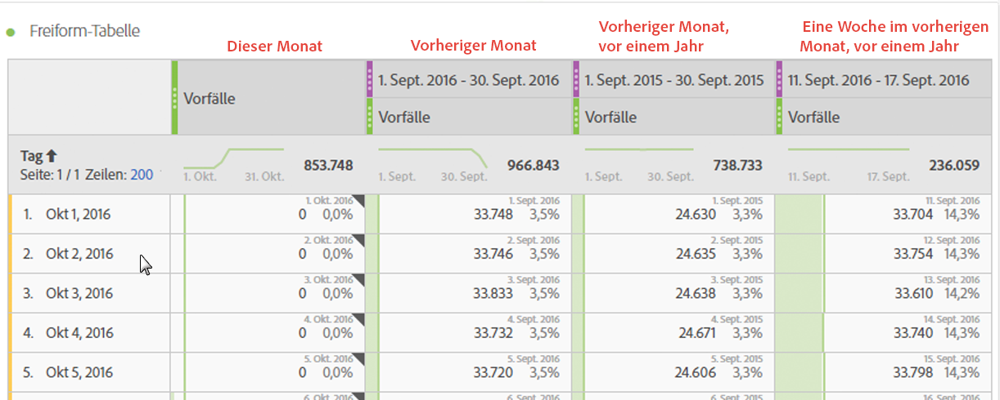

# Datumsvergleich

Mit dem Datumsvergleich in Analysis Workspace können Sie mit einer Spalte, die einen Datumsbereich enthält, einen standardmäßigen Datumsvergleich erstellen, z. B. Jahres-, Quartals-, Monatsvergleich usw.

>[!BEGINSHADEBOX]

Unter  [Datumsvergleich](https://video.tv.adobe.com/v/30753?quality=12&learn=on){target="_blank"} finden Sie ein Demovideo.

>[!ENDSHADEBOX]

## Zeiträume vergleichen {#section_C4E36BFE0F5C4378A74E705747C9DEE4}

>[!NOTE]
>Die Option [!UICONTROL Zeiträume vergleichen] nutzt erweiterte berechnete Metriken. Daher ist dies nur für Kunden mit Analytics Select-, Prime- und Ultimate-SKUs verfügbar.

Für Analysen wird Kontext benötigt, der oft durch einen vorherigen Zeitraum geliefert wird. Beispielsweise ist „Wie viel besser/schlechter geht es uns im Vergleich zu diesem Zeitpunkt letztes Jahr?“ ist eine Kernfrage, um Ihr Geschäft zu verstehen. Der Datumsvergleich enthält automatisch eine Spalte „Differenz“, die die prozentuale Veränderung im Vergleich zu einem bestimmten Zeitraum angibt.

1. Erstellen Sie eine Freiformtabelle mit beliebigen Dimensionen und Metriken, die Sie mit einem bestimmten Zeitraum vergleichen möchten.
1. Klicken Sie mit der rechten Maustaste auf eine Tabellenzeile und wählen Sie **[!UICONTROL Zeiträume vergleichen]** aus.

   

   >[!NOTE]
   >
   >Diese Rechtsklickoption ist für Metrikzeilen, Datumsbereichzeilen und Zeitdimensionszeilen deaktiviert.

1. Je nachdem, wie Sie den Datumsbereich der Tabelle festgelegt haben, stehen die folgenden Optionen zum Vergleich zur Verfügung:

   | Option | Beschreibung |
   |---|---|
   | **[!UICONTROL Vorhergehende/r/s Woche/Monat/Quartal/Jahr vor diesem Datumsbereich]** | Vergleich mit der Woche/dem Monat usw. unmittelbar vor diesem Datumsbereich. |
   | **[!UICONTROL Diese/r/s Woche/Monat/Quartal/Jahr im letzten Jahr vor diesem Datumsbereich]** | Vergleich mit demselben Datumsbereich vor einem Jahr. |
   | **[!UICONTROL Benutzerdefinierter Datumsbereich vor diesem Datumsbereich]** | Auswahl eines benutzerdefinierten Datumsbereichs. |

   >[!NOTE]
   >
   >Wenn Sie eine benutzerdefinierte Anzahl an Tagen auswählen, z. B. 7.–20. Oktober (ein Zeitraum von 14 Tagen), stehen nur zwei Optionen zur Verfügung: **[!UICONTROL Vorhergehende 14 Tage vor diesem Datumsbereich]** und **[!UICONTROL Benutzerdefinierter Datumsbereich vor diesem Datumsbereich]**.

1. Der resultierende Vergleich sieht wie folgt aus:

   

   Zeilen in der Spalte „Prozentwertänderung“ sind rot bei negativen Werten und grün bei positiven Werten.

1. (Optional) Wie bei allen anderen Workspace-Projekten können Sie basierend auf diesen Zeitvergleichen Visualisierungen erstellen. Hier ist z. B. ein Balkendiagramm:

   

   Beachten Sie, dass Sie die Einstellung [!UICONTROL Prozentsätze] in den [!UICONTROL Visualisierungseinstellungen] aktivieren müssen, damit die prozentuale Änderung im Balkendiagramm angezeigt wird.

## Eine Zeitraumspalte zum Vergleich hinzufügen {#section_93CC2B4F48504125BEC104046A32EB93}

Sie können jetzt Zeiträume zu allen Spalten in einer Tabelle hinzufügen. So können Sie einen Zeitraum hinzufügen, der von dem abweicht, auf den Ihr Kalender eingestellt ist. Dies ist eine weitere Möglichkeit, um Daten zu vergleichen.

1. Klicken Sie mit der rechten Maustaste auf eine Spalte in der Tabelle und wählen Sie **[!UICONTROL Spalte für Zeitraum hinzufügen]** aus

   

1. Je nachdem, wie Sie den Datumsbereich der Tabelle festgelegt haben, stehen die folgenden Optionen zum Vergleich zur Verfügung:

   | Option | Beschreibung |
   |---|---|
   | **[!UICONTROL Vorhergehende/r/s Woche/Monat/Quartal/Jahr vor diesem Datumsbereich]** | Fügt eine Spalte mit der Woche/dem Monat usw. unmittelbar vor diesem Datumsbereich hinzu. |
   | **[!UICONTROL Diese/r/s Woche/Monat/Quartal/Jahr im letzten Jahr vor diesem Datumsbereich]** | Fügt denselben Datumsbereich des Vorjahres hinzu. |
   | **[!UICONTROL Benutzerdefinierter Datumsbereich vor diesem Datumsbereich]** | Auswahl eines benutzerdefinierten Datumsbereichs. |

   >[!NOTE]
   >
   >Wenn Sie eine benutzerdefinierte Anzahl an Tagen auswählen, z. B. 7.–20. Oktober (ein Zeitraum von 14 Tagen), stehen nur zwei Optionen zur Verfügung: **[!UICONTROL Vorhergehende 14 Tage vor diesem Datumsbereich]** und **[!UICONTROL Benutzerdefinierter Datumsbereich vor diesem Datumsbereich]**.

1. Der Zeitraum wird am Anfang der ausgewählten Spalte eingefügt:

   

1. Sie können so viele Zeitspalten hinzufügen, wie Sie möchten, sowie verschiedene Datumsbereiche kombinieren:

   

1. Sie können außerdem nach jeder Spalte sortieren. Dadurch wird die Reihenfolge der Tage abhängig von der jeweiligen Spalte geändert.

## Beginn der Spaltendaten an derselben Zeile ausrichten {#section_5085E200082048CB899C3F355062A733}

Sie können die Daten in den einzelnen Spalten so ausrichten, dass sie alle in derselben Zeile beginnen.

Wenn Sie z. B. die Daten in einem Monatsvergleich zwischen Oktober und September 2016 ausrichten, beginnt die linke Spalte mit dem 1. Oktober und die rechte Spalte mit dem 1. September:

>[!NOTE]
>
>Beachten Sie beim Verwenden dieser Option Folgendes:
>
>* Diese Einstellung ist standardmäßig für alle neuen Projekte aktiviert.
>
>* Diese Einstellung gilt für die gesamte Tabelle. Wenn Sie diese Einstellung beispielsweise für eine Aufschlüsselung innerhalb der Tabelle ändern, wird auch die Einstellung für die gesamte Tabelle geändert.
>

So aktivieren Sie diese Einstellung, falls diese nicht bereits aktiviert ist:

1. Wählen Sie in der Tabelle, in der Spaltendaten ausgerichtet werden sollen, das Symbol **Einstellungen** in der Tabellenüberschrift aus.

1. Wählen Sie auf der Registerkarte [!UICONTROL **Einstellungen**] die Option **[!UICONTROL Datum in allen Spalten ausrichten, sodass es in derselben Zeile beginnt]** aus (gilt für die gesamte Tabelle).

