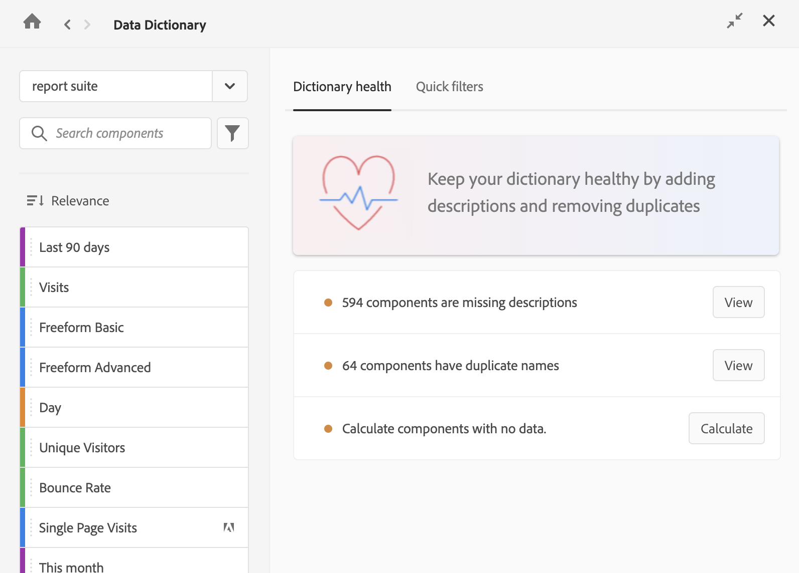

# Überwachen des Zustands des Datenwörterbuchs {#monitor-data-dictionary}

<!-- markdownlint-disable MD034 -->

>[!CONTEXTUALHELP]
>id="aa_datadictionary_share_primary"
>title="Primäre Komponente freigeben"
>abstract="Wenn diese Option ausgewählt ist, wird die primäre Komponente für alle Benutzer freigegeben, die Zugriff auf die doppelten Komponenten haben (sowohl für die Eigentümer als auch für alle anderen Benutzer, für die die Komponenten freigegeben sind). Diese Benutzer können dann die primäre Komponente für zukünftige Projekte aus der Komponentenliste auswählen. Sie können die Komponente jedoch nicht bearbeiten, selbst wenn sie Besitzer einer doppelten, konsolidierten Komponente waren.  Diese Option ist nur verfügbar, wenn die primäre Komponente ein Segment, eine berechnete Metrik oder ein Datumsbereich ist. Metriken und Dimensionen sind immer für alle Benutzenden verfügbar."
>
>When this option is deselected, the primary component still replaces duplicates in existing projects and segments, but users who didn't previously have access to it can't access it from the component list for future projects. "

<!-- markdownlint-disable MD034 -->

<!-- markdownlint-enable MD034 -->

>[!CONTEXTUALHELP]
>id="aa_datadictionary_delete_duplicates"
>title="Ersetzte Duplikate löschen"
>abstract="Wenn diese Option ausgewählt ist, stehen konsolidierte Duplikate nicht mehr zur Verwendung zur Verfügung. Deaktivieren Sie diese Option, wenn weiterhin Duplikate verfügbar sein sollen."

<!-- markdownlint-enable MD034 -->

Analytics-Administrierende sind für einen guten Zustand des Datenwörterbuchs verantwortlich.

## Eigenschaften eines Datenwörterbuchs in gutem Zustand

Ein Datenwörterbuch in gutem Zustand ist eines, in dem alle Komponenten:

* Verwendet werden und Daten erfassen

* Hilfreiche Beschreibungen enthalten, damit Benutzende wissen, wie sie am besten verwendet werden können

* Frei von unnötigen Duplikaten sind

* Vom Administrierenden genehmigt wurden

## Prüfen des Zustands des Datenwörterbuchs

So identifizieren Sie Probleme mit Ihrem Datenwörterbuch:

1. Öffnen Sie ein Projekt in Analysis Workspace.

1. Wählen Sie auf der linken Seite von Analysis Workspace das Symbol „Datenwörterbuch“ aus. (Alternative Möglichkeiten für den Zugriff auf das Datenwörterbuch sind unter „Zugriff auf das Datenwörterbuch“ in [Datenwörterbuch – Überblick](/help/analyze/analysis-workspace/components/data-dictionary/data-dictionary-overview.md) beschrieben.)

   Das Fenster „Datenwörterbuch“ wird angezeigt.

   

1. Stellen Sie sicher, dass im Dropdown-Menü die richtige Report Suite ausgewählt ist.

1. Wählen Sie auf der Registerkarte [!UICONTROL **Zustand des Wörterbuchs**] die Option [!UICONTROL **Ansicht**] neben einer der folgenden Optionen:

   * [!UICONTROL **Beschreibungen zu Komponenten fehlen**]

   * [!UICONTROL **Komponenten haben Duplikate**]

   * [!UICONTROL **Komponenten sind nicht mit Daten verbunden**]

   Abhängig von Ihrer Auswahl wird der entsprechende Filter auf das Datenwörterbuch angewendet, sodass nur die relevanten Komponenten angezeigt werden.

1. Bearbeiten Sie eine beliebige Komponente, um den Zustand des Datenwörterbuchs zu verbessern. Informationen zum Bearbeiten einer Komponente im Datenwörterbuch finden Sie unter [Bearbeiten von Komponenteneinträgen im Datenwörterbuch](/help/analyze/analysis-workspace/components/data-dictionary/edit-entries-data-dictionary.md).
