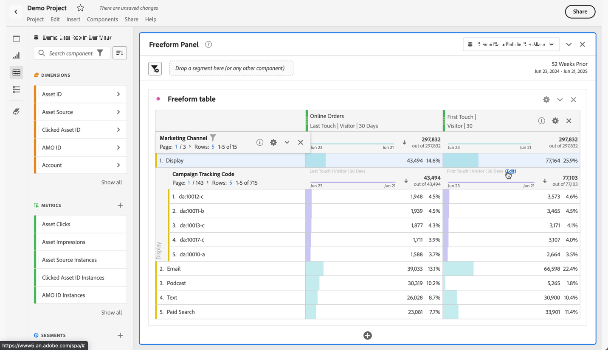

# Dimensionen aufschlüsseln

Sie können Ihre Daten in Analysis Workspace für Ihre spezifischen Anforderungen unbegrenzt aufschlüsseln. Erstellen Sie Abfragen mithilfe relevanter Metriken, Dimensionen, Segmente, Zeitachsen und anderer Aufschlüsselungswerte für die Analyse.

1. Wählen [ in einer ](/help/analyze/analysis-workspace/visualizations/freeform-table/freeform-table.md) aus dem Kontextmenü einer oder mehrerer ausgewählter Zeilen **[!UICONTROL Aufschlüsselung]** .

   

1. Wählen Sie aus dem Untermenü **[!UICONTROL Dimensionen]**, **[!UICONTROL Metriken]**, **[!UICONTROL Segmente]** oder **[!UICONTROL Datumsbereiche]** und wählen Sie dann ein Element aus. Oder suchen Sie einfach nach einer Komponente im Feld **[!UICONTROL *Suche *]**.

Sie können Metriken nach Dimensionselementen oder Zielgruppensegmenten über ausgewählte Zeiträume aufschlüsseln. Sie können auch noch granularer aufschlüsseln.

>[!NOTE]
>
>Die Anzahl der in der Tabelle angezeigten Aufschlüsselungen ist auf 200 beschränkt. Dieses Limit erhöht sich beim Exportieren von Aufschlüsselungen.

## Aufschlüsselung nach Position

Standardmäßig sind Aufschlüsselungen an statische Zeilenelemente gebunden. Angenommen, Sie schlüsseln die drei oberen Elemente der Dimension „Seite“ (Startseite, Suchergebnisse, Checkout) nach Marketing-Kanälen auf. Dann verlassen Sie das Projekt und kehren zwei Wochen später zurück. Beim erneuten Öffnen des Projekts haben sich die drei oberen Seiten geändert, und jetzt sind Startseite, Suchergebnisse und Checkout stattdessen die oberen Seiten vier bis sechs. Standardmäßig werden Ihre Aufschlüsselungen des Marketing-Kanals weiterhin unter Startseite, Suchergebnisse und Checkout angezeigt, auch wenn sie sich jetzt in den Zeilen 4-6 befinden.

Im Gegensatz dazu werden **Aufschlüsselung nach Position** immer die drei obersten Elemente aufgeschlüsselt, unabhängig davon, was diese Elemente sind. Wenn Sie auf das Beispiel zurückgreifen, werden die Aufschlüsselungen des Marketing-Kanals beim erneuten Öffnen des Projekts an die drei obersten Seiten der Tabelle gebunden. Und nicht zu Homepage, Suchergebnissen und Checkout, die sich jetzt in den Zeilen 4-6 befinden. Siehe [Zeileneinstellungen](/help/analyze/analysis-workspace/visualizations/freeform-table/column-row-settings/table-settings.md) wie Sie diese Einstellung konfigurieren.

## Attributionsmodelle auf Aufschlüsselungen anwenden

Auf jede Aufschlüsselung innerhalb einer Tabelle kann auch ein beliebiges Attributionsmodell angewandt werden. Dieses Attributionsmodell kann mit der übergeordneten Spalte identisch sein oder sich von ihr unterscheiden. Sie können beispielsweise lineare Bestellungen in Ihrer Dimension „Marketing-Kanäle“ analysieren, jedoch U-förmige Bestellungen auf spezifische Trackingcodes in einem Kanal anwenden. Um das auf eine Aufschlüsselung angewendete Attributionsmodell zu bearbeiten, bewegen Sie die Maus über das Aufschlüsselungsmodell und wählen Sie **[!UICONTROL Bearbeiten]** aus.

Dies ist das erwartete Verhalten, wenn Attributionsmodelle auf Aufschlüsselungen angewendet oder bearbeitet werden:

* Wenn Sie eine Attribution anwenden und keine anderen Attributionen vorhanden sind, gilt die Attribution für die gesamte Spaltenstruktur.

* Wenn Sie eine Aufschlüsselung hinzufügen, nachdem eine Attribution angewendet wurde, wird für die hinzugefügte Aufschlüsselung der Standardwert verwendet (wenn diese Dimension einen Standardwert hat). Andernfalls wird die Aufschlüsselung aus der übergeordneten Spalte verwendet. Einige Dimensionen haben eine Standardzuordnung. Beispielsweise verwenden Zeitdimensionen und Referrer „Same Touch“. Die Dimension „Produkt“ verwendet „Last Touch“. Andere Dimensionen haben keinen Standardwert und verwenden die Zuordnung der übergeordneten Spalte.

* Wenn im Spaltenbaum bereits Zuordnungen vorhanden sind, wirkt sich eine Änderung der Zuordnung nur auf diejenige aus, die Sie gerade bearbeiten.

>[!BEGINSHADEBOX]

Unter  [Dimension in Analysis Workspace](https://video.tv.adobe.com/v/41371?quality=12&learn=on&captions=ger){target="_blank"} finden Sie ein Demovideo.

>[!ENDSHADEBOX]

>[!BEGINSHADEBOX]

Siehe  [Aufschlüsselungen nach Dimension](https://video.tv.adobe.com/v/327336?quality=12&learn=on&captions=ger){target="_blank"} für ein Demovideo.

>[!ENDSHADEBOX]

>[!BEGINSHADEBOX]

Siehe  [Hinzufügen von Dimensionen und ](https://video.tv.adobe.com/v/33633?quality=12&learn=on&captions=ger){target="_blank"}) für ein Demovideo.

>[!ENDSHADEBOX]

>[!BEGINSHADEBOX]

Siehe  [Arbeiten mit Dimensionen in einer Freiformtabelle](https://video.tv.adobe.com/v/328530?quality=12&learn=on&captions=ger){target="_blank"} für ein Demovideo.

>[!ENDSHADEBOX]

>[!BEGINSHADEBOX]

Siehe  [Aufschlüsselung der Dimension nach Position](https://video.tv.adobe.com/v/327411?captions=ger){target="_blank"} für ein Demovideo.

>[!ENDSHADEBOX]

<!--
# Break down dimensions

Break down dimensions and dimension items in Analysis Workspace.

Break down your data in unlimited ways for your specific needs; build queries using relevant metrics, dimensions, segments, time lines, and other analysis breakdown values.

1. [Create a project](/help/analyze/analysis-workspace/home.md) with a data table.
1. In the data table, right-click a line item and select **[!UICONTROL Breakdown]** > *`<item>`*.

   

   You can break down metrics by dimension items or audience segments across selected time periods. You can also drill down further to a more granular level.

   >[!NOTE]
   >
   >The number of breakdowns to show in the table is limited to 200. This limit will increase for exporting breakdowns.

## Apply attribution models to breakdowns

Any breakdown within a table can also have any attribution model applied to it. This attribution model can be the same or different from the parent column. For example, you can analyze linear Orders on your Marketing Channels dimension but apply U-Shaped Orders to the specific tracking codes within a Channel. To edit the attribution model applied to a breakdown, hover over the breakdown model and click **[!UICONTROL Edit]**:

This is the expected behavior when applying attribution models to breakdowns or editing them:

* If you apply an attribution when no other attributions exist, then the attribution applies to the entire column tree.

* If you add a breakdown after an attribution has been applied, it will use the default for the given breakdown that was added, if that dimension has a default. Otherwise it will use the breakdown from the parent column. Some dimensions have a default allocation.  For example, [!UICONTROL Time] dimensions and [!UICONTROL Referrer] use [!UICONTROL Same Touch]. The [!UICONTROL Product] dimension uses [!UICONTROL Last Touch]. Other dimensions don't have a default, and will use the parent column allocation.

* If there are already attributions in the column tree, changing the attribution only impacts the one you are editing.

## Videos

>[!BEGINSHADEBOX]

See  [Adding dimensions and metrics to your project in Analysis Workspace](https://video.tv.adobe.com/v/33633?quality=12&learn=on&captions=ger){target="_blank"} for a demo video.

>[!ENDSHADEBOX]

>[!BEGINSHADEBOX]

See  [Working with dimensions in a Freeform Table](https://video.tv.adobe.com/v/328530?quality=12&learn=on&captions=ger){target="_blank"} for a demo video.

>[!ENDSHADEBOX]

>[!BEGINSHADEBOX]

See  [dimension breakdowns by position](https://video.tv.adobe.com/v/327411?quality=12&learn=on&captions=ger){target="_blank"} for a demo video.

>[!ENDSHADEBOX]

-->