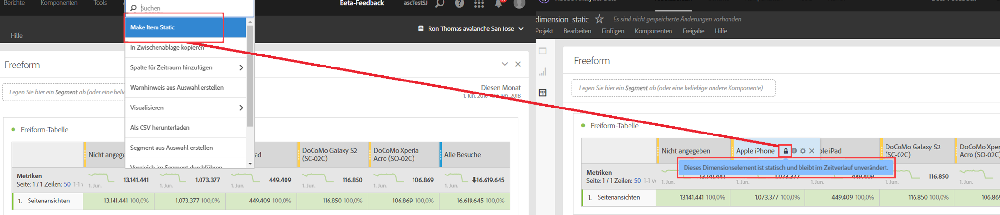
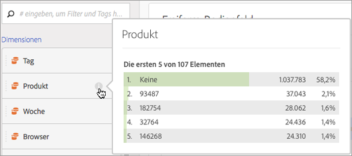

# Dimensionsvorschau

Sie können die [Komponenteninformationen](/help/analyze/analysis-workspace/components/use-components-in-workspace.md#component-info) für eine Komponente verwenden, um die obersten Elemente für eine Dimension anzuzeigen.

<!--
Now, by default, we show dynamic values instead of static ones, with the option to turn them into static values. Other things to note:

* As your data updates, the dynamic dimension columns will update to show the current 5/15 dimension items.
* A dynamic dimension column that is copied or moved will become static.
* When hovering a static dimension column you will see a lock icon, indicating that the dimension is static.

-->

## Anzeige von Dimensionselementen

Wenn Sie  Dimension im Bedienfeld „Komponenten“ auswählen, wird eine Liste mit den Dimensionselementen angezeigt. Die Liste der Dimensionselemente zeigt normalerweise die wichtigsten Elemente der letzten 30 Tage an. Wenn weitere Elemente verfügbar sind, wählen Sie außerhalb des für das Bedienfeld ausgewählten Datumsbereichs den Link aus, um weitere Elemente anzuzeigen. Beispiel: **[!UICONTROL Elemente aus dem letzten Monat anzeigen]**.

<!--
# Preview dimensions

Hover over the information (i) icon next to a dimension. This shows the top 5 values for non-time dimensions (and 15 for time dimensions). We used to keep those values static (i.e., the 5 values picked never changed).

Now, by default, we show dynamic values instead of static ones, with the option to turn them into static values. Other things to note:

* As your data updates, the dynamic dimension columns will update to show the current 5/15 dimension items.
* A dynamic dimension column that is copied or moved will become static.
* When hovering a static dimension column you will see a lock icon, indicating that the dimension is static.

## Show dimension items

When you hover over a dimension and click the grey right-arrow next to it, a list of its dimension items appears. Any list of dimension items usually shows the top items for the last 30 days.

If you scroll down to the bottom of the list, you see **[!UICONTROL Show Top Items From Last 18 Months]**. Click this option to see top dimension items from the last 547 days.

-->
